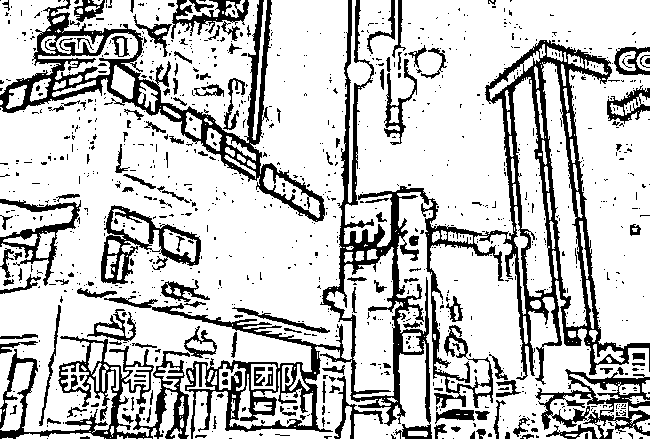
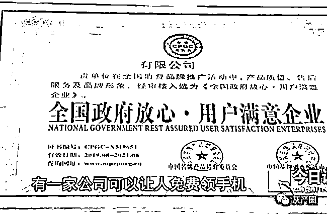

# 警方卧底揭秘：“零元购”背后隐秘的传销新套路

> 原文：[`mp.weixin.qq.com/s?__biz=MzIyMDYwMTk0Mw==&mid=2247509609&idx=3&sn=ade265940bed0aac0704d8f761937008&chksm=97cb6d51a0bce447c632241e526b3ce49d3c9eed1b98da3e34fb51172e104896ca610774c763&scene=27#wechat_redirect`](http://mp.weixin.qq.com/s?__biz=MzIyMDYwMTk0Mw==&mid=2247509609&idx=3&sn=ade265940bed0aac0704d8f761937008&chksm=97cb6d51a0bce447c632241e526b3ce49d3c9eed1b98da3e34fb51172e104896ca610774c763&scene=27#wechat_redirect)

新公司入驻，大广告爆棚，

免费拿手机一夜点燃全泸州

2019 年 9 月，某公司强势入驻泸州。一夜之间，泸州市主城区的户外电子广告屏上、公交车上、电梯里、微信朋友圈、QQ、陌陌上，铺天盖地全都是某公司的“免费拿手机，刷新闻、赚收益，成就你的财富梦想”的巨幅广告。

“有这么好的事？”泸州人民坐不住了，纷纷打听这家公司的地址，争先恐后地了解公司的相关情况和广告内容的真实性。一些有电商经验的“宝妈”和一些有“战略目光”的大学生、社会精英率先响应，成为某公司的会员，他们不但从某公司拿到了免费手机，而且还真赚到了钱。最早加入该公司的会员中，还真有人只是坐在家里刷刷新闻，在朋友圈发发消息就赚了 20 多万！

身边有人真赚了钱！这种事实胜于雄辩的口口相传的消息比任何广告都更具诱惑力。一时间，怀揣着梦想的泸州人民在某公司门前排起了长长的队伍，他们要成为该公司的会员，要领取免费手机，要抓住这次千载难逢的发财机会！热情的泸州人民只用了短短几个月时间，便成就了该公司“西部战略计划”第一步，该公司在泸州发展了 5000 多会员。

为了巩固成果，扩大发展，人口只有 150 多万的泸州已经满足不了某公司的战略计划，于是，该公司将眼光放到了潜力更大的成都。

赚钱太容易，公司遭质疑，

警方侦查露端倪

张先生在泸州开了一家手机店，某公司的“免费送手机”业务无疑会对本土的手机店生意造成冲击。张先生是学金融出生的，他知道玩金融的一些基本原则，违背金融基本原则的金融业务是不可能赚钱的，某公司在泸州的“免费送手机”业务表面上看起来合理合法，但从深层次的金融层面去分析，某公司的利润点在哪里？没有利润，谁会去做这种赔本赚吆喝的买卖？某公司为什么要做这种赔本赚吆喝的买卖？

带着这些疑问，张先生对某公司的业务进行了一些了解。不了解不知道，一了解之后吓一跳：市场上卖 3100 元的手机，在某公司“免费拿”的价格为 6688 元，而且短短的几个月时间，泸州市有 5000 多人“免费拿”了这种手机。

张先生将自己的质疑发布在网络上，没想到张先生的这一做法使某公司暴跳如雷。很快某公司高层就给张先生打来电话，质问张先生为什么要发质疑视频，并要求张先生将视频删除。随后，某公司给张先生送去了律师函，声称张先生损害了某公司的荣誉，要求张先生删除视频。但某公司的要求被张先生毅然拒绝了。

张先生对某公司的质疑引起了警方的重视，警方对某公司的“免费拿手机”行为进行了秘密调查。

卧龙潭探虚实，摸清来龙去脉，

闯虎穴搜证据，揪住狐狸尾巴

2019 年 9 月的一天，一个衣着时尚的年轻小伙走进了某公司业务部，说自己曾经做过电商，有着丰富的电商经验和比较广博的人脉关系，想深入了解一下某公司的“免费拿手机”业务，如果有可能，小伙子将与某公司合作。

听小伙子说有相当不错的人脉关系，某公司专事接待的工作人员迅速将这个“潜力客户”的情况汇报给了公司高层，高层即刻决策：将小伙子列为重点“培养”对象。于是，一帮业务精英开始对小伙子进行轮番理论轰炸，从公司前景到业务拓展，从晋级办法到奖励机制，讲的头头是道，说的句句在理，由不得小伙子有半点的迟疑，于是，小伙子支付了 6688 元，注册成为了该公司的会员。

这个时候小伙子才知道，所谓的免费拿手机，是需要先交购机款，领取指定品牌的手机，注册成为该公司会员，下载专用 APP，然后通过 APP 刷新闻，每天可以赚取 20 到 80 元不等的费用，每天所赚取的费用可以赚回购机费用，这便是“免费拿手机”的真谛。如果客户不想从自己口袋里掏一分钱，也可以拿手机，不过需要客户从第三方网贷公司贷出购机费用，然后每天刷新闻产生的收益直接抵扣购机款，直至扣完，这样，手机也等于是“免费拿”了。

这对一般宅在家的“宝妈”来说，确认有一定的吸引力，但对那些有思想有抱负的年轻大学生来说，引力显然还不够，所以，重点来了：成为公司会员之后，每介绍一个人成功加入会员，“免费拿手机”之后，其直接介绍人可以获得购机款 5%的回扣，间接介绍人可以拿购机款 3%的回扣。如果会员能够组团入会，且团购量足够大时，还可以获得公司额外的奖励。公司展台上摆着的奖品凯迪拉克对年轻人来说，诱惑力非同一般。

从理论上来看，某公司以“免费拿手机”为噱头，吸引会员购机；以第三方借贷为支撑，实现“免费”拿手机的承诺，刺激会员借贷购机；以刷新闻赚钱为手段，帮会员偿还购机款并赚取利润；以高于市场价格为利润来源，使公司实现盈利。这一切都顺理成章，如果会员通过该公司 APP 刷新闻真能赚钱，那么某公司这个“免费拿手机”真的是一件功德无量的大好事。问题就在于这个刷新闻赚收益的事，经不起推敲：

**一、**“新闻”是消息的一种，看消息是人类感知这个世界的一种方式，从某种意义上讲，看新闻实际是种消费，读者就是新闻的消费者，消费新闻是需要付费的。所以，以前想看新闻就得付费订阅报纸。向来都是写新闻的赚钱，读新闻的付费，从来都没有读新闻赚钱的；

**二、**互联网时代，虽然读新闻会耗费流量，但耗费的也是读新闻者自己的流量，谁会为读新闻耗费的流量买单？即便有，也是读者在读新闻点开了广告，才会由广告公司支付流量费，但那种费用不可能达到每天 20 到 80 元的程度，如果那样，所有的广告公司都会秒垮。

因此，刷新闻每天可以赚取 20 到 80 元不等的利润，就只有一种可能，那就是某公司在为他们的会员付费。如果真是这样，那么，某公司自己本身没有创造利润的实体经济，他如何去支付这么大的一笔费用？

假设某公司会员为 10 人，每人购机款为 6688 元，实际成本为 3188，也就是说某公司从每个会员身上赚回 3500 元，10 个会员共计赚回 35000 元。按照该公司的承诺，每个会员每天刷新闻赚 20 到 80 元，我们取中间值 50 元，那么每个会员每个月刷新闻赚 1500 元，只需两个半月，该公司赚的钱就入不敷出了。会员的基数如果是 5000 人，那么 3 个月以后，该公司就得倒闭。该公司玩的就是用后面会员的钱来填补前面会员的高额返利，拆东墙补西墙，造成暴利的假象，以吸引更多的人来加入会员。

天上永远不会掉馅饼，如果有一天你被天上掉下的馅饼砸中了，那一定是陷阱

庞氏骗局的特征：

一、低风险、高回报的反投资规律特征。众所周知，风险与回报成正比乃投资铁律，“庞氏骗局”往往反其道而行之。骗子们往往以较高的回报率吸引不明真相的投资者，而从不强调投资的风险因素。

二、拆东墙、补西墙的资金腾挪回补特征。由于根本无法实现承诺的投资回报，因此对于老客户的投资回报，只能依靠新客户的加入或其他融资安排来实现。

三、投资诀窍的不可知和不可复制性。骗子们竭力渲染投资的神秘性，将投资诀窍秘而不宣，努力塑造自己的“天才”或“专家”形象。

四、投资的反周期性特征。“庞氏骗局”的投资项目似乎永远不受投资周期的影响，无论是与生产相关的实业投资，还是与市场行情相关的金融投资，投资项目似乎总是稳赚不赔。

五、投资者结构的金字塔特征。为了支付先加入投资者的高额回报，“庞氏骗局”必须不断地发展下线，通过利诱、劝说、亲情、人脉等方式吸引越来越多的投资者参与，从而形成“金字塔”式的投资者结构。

入驻泸州的某公司的“免费拿手机”、“刷新闻赚收益”的运作模式，完全符合庞氏骗局的基本特征，虽然该公司通过互联网操作，挂着新电商的“羊头”，具有很强的隐蔽性，但在警方的火眼金睛之下，最终还是露出了狐狸尾巴。

狐狸再狡猾，也躲不过好猎人的猎枪。2019 年 10 月 12 日，警方在充分掌握证据并锁定远在广州的服务器后台数据后，兵分三路，一路控制某公司总部，一路控制该公司内训会会场，一路堵截去往内训会场的车辆。三路兵马同时收网，将以袁某为首的传销组织一网打尽。

← 向右滑动与灰产圈互动交流 →

