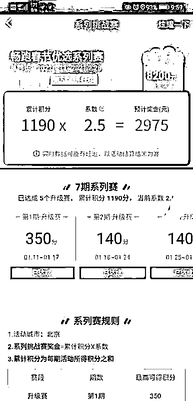

# 饿了么骑手质疑过年奖励开“空头支票”

> 原文：[`mp.weixin.qq.com/s?__biz=MzIyMDYwMTk0Mw==&mid=2247509609&idx=4&sn=6a2525a7c3e2826be42d1ff7c2e68183&chksm=97cb6d51a0bce447d9fbb922a6d60792430458eebb5c6d171fe80bc6e8dfb1f94e932a7a31c2&scene=27#wechat_redirect`](http://mp.weixin.qq.com/s?__biz=MzIyMDYwMTk0Mw==&mid=2247509609&idx=4&sn=6a2525a7c3e2826be42d1ff7c2e68183&chksm=97cb6d51a0bce447d9fbb922a6d60792430458eebb5c6d171fe80bc6e8dfb1f94e932a7a31c2&scene=27#wechat_redirect)

## 

2 月 18 日，多名外卖骑手质疑饿了么平台开“空头支票”，平台通过提高任务门槛令很多骑手难以拿到任务奖金。一名饿了么骑手告诉记者，饿了么春节挑战赛设置了最高 8200 元的奖励，很多骑手为了这个奖励放弃回家过年，但平台方却提高第 6 期任务量，导致很多骑手难以完成，有骑手为达标一天工作 15 个小时。 

## 

19 日，饿了么平台回复记者，第 6 期活动后半段是工作日，单量会显著回升，因此平台订单量要求也随着回升。饿了么表示，针对客观确实订单恢复慢的区域，会给骑士补偿性活动激励；针对第六期订单达标率低的区域，平台会合理调整第七期的达标门槛，降低约 50 单左右。

**外卖骑手为拿奖金放弃回家过年 **

**平台提高任务量导致奖金泡汤？**

2 月 18 日，一名北京的饿了么外卖骑手发布一段题为“外卖小哥为了 8 千多奖励不回家过年努力跑单，平台一个套路就秒没了”的视频，质疑饿了么春节奖励活动。据这位博主介绍，为鼓励骑手春节期间留守，饿了么推出了“畅跑春节优选系列挑战赛”，活动共分为 7 期，每期持续 7 天，从 1 月 11 日至 2 月 28 日结束。活动期间，每期活动会设置一个任务量，骑手们累计完成大于 3 期，可获得奖励，而如果 7 期活动都完成，则能够拿到最高 8200 元的奖励。

据这位博主介绍，为了平台推出的 8200 元奖励，很多骑手过年都没有回家，想趁着假期多挣点钱。然而，在大家辛辛苦苦完成前面五期任务后，**平台方突然将第六期的任务量提高到每期 380 单，**正值春节假期，很多商家没有开始营业，务工人员也尚未完全返回，订单量较以往下降不少，导致很多骑手难以完成任务。

骑手：早知道单量这么高就回家过年了

同样的情形也出现在其他地区，据浙江媒体报道，杭州骑手余先生过年没有回老家，为的就是饿了么推出的 8200 元奖励活动。余先生表示，活动开始时，一名骑手队长曾在骑手群中表示，这个活动只要参加基本都能拿到 8200 元奖励。然而，当余先生和其他骑手辛苦工作 5 周后，饿了么平台突然将第六周送单量提升至 360 单，这几乎是一个不可能完成的任务。

小刘是江西人，在杭州跑饿了么外卖。他告诉记者，当初他的领导曾告诉大家正常跑单肯定能完成任务拿到奖励，他才选择留下来继续工作。小刘介绍，春节期间订单量很少，第五周平台设置的任务量是 60 单，但第六周突然增长到 360 单，一下子提高了 6 倍，**“从早上 6 点开始跑到晚上 12 点都不一定能够完成这个任务。”**

小刘说，他以前也参加过饿了么类似活动，那时不是春节期间，每天的送单量也正常，设置的单数最高也才 340 单。现在春节期间订单量本来就少，平台却提高了任务量。“要是早知道第六周要完成 360 单，我肯定不会留下来过年了，现在又没回家过年也没赚到钱。”

**饿了么：将调整达标门槛 **

**预计今年拿到全额奖励骑手占比高于往年**

2 月 19 日，饿了么平台回复记者，本次活动是在每单春节补贴之外的额外年终激励，一共分为 7 期，每期持续 7 天。骑手累计完成大于 3 期，则可获得奖励，完成周期越多奖励越多，7 个周期全部完成的才能拿到最高奖励。**也就是说，活动是为了奖励跑单优异的骑手，并非所有骑手都是统一的奖励标准。**

饿了么方面介绍，目前出现争议的是第 6 期活动，由于活动开始时仍为休息日，故起始单量较低，但随着假期结束，平台单量回升明显，后面几天的骑手单量也会随之提升。根据测算，今年留下过年的骑手中，能拿到全额奖励的骑手占比会高于往年。

为什么第五期门槛比第六期要低？这是由于上期包含除夕和正月初一、初二、初三，是单量最少的时段，我们降低了单量要求，但是第六期活动后半段是工作日，单量会显著回升，所以本周开始新周期的订单量要求也随着回升。

此外，饿了么方面表示，骑士反馈的活动奖励是积分制，中间断任何一期并不会影响到之前已获得的积分及之后（第七期）获得的积分。针对客观确实订单恢复慢的区域，会给到骑士补偿性活动激励，周期内该活动的总激励金额不低于 2000 元；**针对第六期订单达标率低的区域，平台会合理调整第七期的达标门槛，降低约 50 单左右，**但实际随着节后订单快速回升，第七期订单需求会比第六期更多，骑士达标难度会大幅下降。

来源：北京青年报

← 向右滑动与灰产圈互动交流 →

