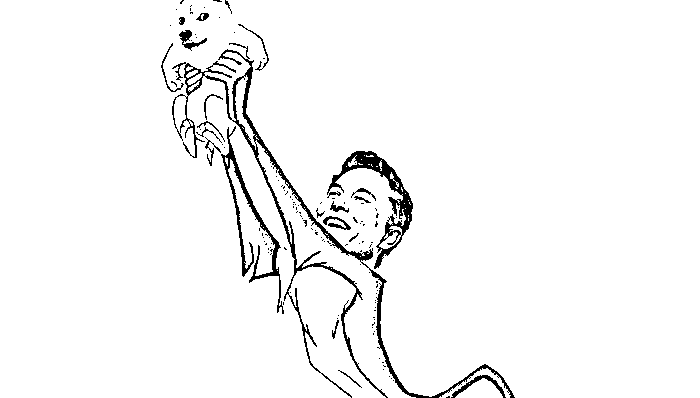
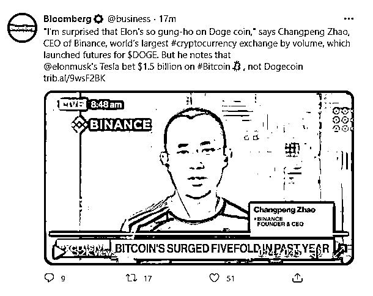
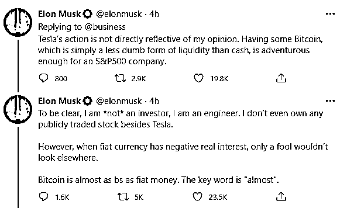
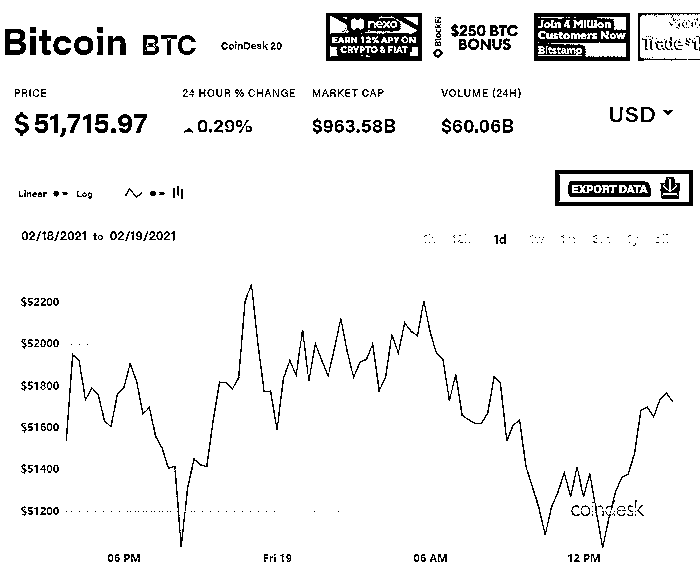
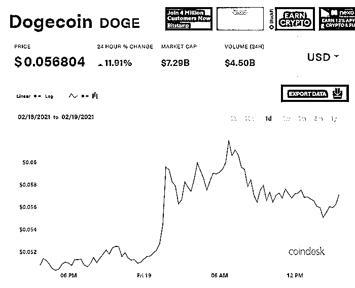

# 马斯克就比特币再发声：总比持有现金要好一点

> 原文：[`mp.weixin.qq.com/s?__biz=MzIyMDYwMTk0Mw==&mid=2247509609&idx=5&sn=cec3420211596cafd6f3ef146e4db78c&chksm=97cb6d51a0bce447ee585e846b8950f9d96bcfa5f66e95ae0225090c286c951d2424a4560328&scene=27#wechat_redirect`](http://mp.weixin.qq.com/s?__biz=MzIyMDYwMTk0Mw==&mid=2247509609&idx=5&sn=cec3420211596cafd6f3ef146e4db78c&chksm=97cb6d51a0bce447ee585e846b8950f9d96bcfa5f66e95ae0225090c286c951d2424a4560328&scene=27#wechat_redirect)

图源：马斯克推特

特斯拉（Tesla Inc.）首席执行官埃隆•马斯克（Elon Musk）周四（2 月 18 日）表示，公司对比特币 15 亿美元的押注是一笔“足够冒险”的投资。当前，比特币几乎和法定货币一样毫无意义，但持有比特币比持有现金稍微好一些，两者细微的差别使其成为一种更好的资产。

全球加密货币交易平台币安（Binance Holdings Ltd）创始人兼首席执行官赵长鹏日前在接受媒体采访时表示：“伊隆对狗狗币如此狂热，让我感到十分惊讶。”赵长鹏指出，马斯克的电动汽车公司特斯拉投资了 15 亿美元的比特币，而非狗狗币。他的不解之处在于，如果马斯克对狗狗币如此“狂热”，为什么特斯拉选择购买比特币。

赵长鹏的言论促使马斯克对特斯拉的举动作出了解释。热衷于社交平台的马斯克在推特上回应称：“特斯拉的投资行为并不直接代表他自己的观点。比特币只是一种相较于现金，没那么愚蠢的流动性（资产）类别。持有比特币，对一家标普 500 公司来说足够冒险。”

他在另一条推文中表示：“需要澄清的是，我并非投资者，而是工程师。除了特斯拉，我甚至没有持有任何公开交易的股票。然而，当法定货币的实际利率为负时，只有傻瓜才不会看向别处。比特币几乎和法定货币一样是毫无意义的。”

本月早些时候，特斯宣布将 15 亿美元现金投入比特币，令企业界和加密货币圈为之震动。这刺激比特币价格进一步飙升，并引发了有关将加密货币添加到企业资产负债表中之利弊的讨论。目前，比特币价格略低于其创纪录高点。包括机构入局在内的的一系列因素已帮助比特币过去一年飙升逾 400%。

作为特斯拉创始人，也是世界首富，马斯克还在推特上多次提及狗狗币。狗狗币最初只是一个玩笑性质的加密币，起源于 2013 年社交网络中一张柴犬图片的流行梗。马斯克对狗狗币的频繁推广也推高了这种加密货币的价格，狗狗币今年的表现超过了比特币。相较年初的 0.004 美元，狗狗币今年来的涨幅已经接近 14 倍。

不过，马斯克频繁公开发表关于数字货币的言论也为其带来了一些麻烦。被称为“末日博士”的知名经济学家鲁比尼（Nouriel Roubini）近日表示，马斯克在特斯拉投资比特币之前发布的有关比特币的推文是一种市场操纵行为，美国证券交易委员会（SEC）应该对此进行调查。

来源：财联社，界面新闻

← 向右滑动与灰产圈互动交流 →

