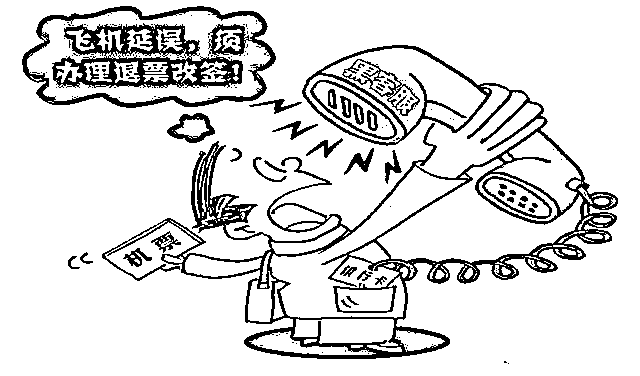
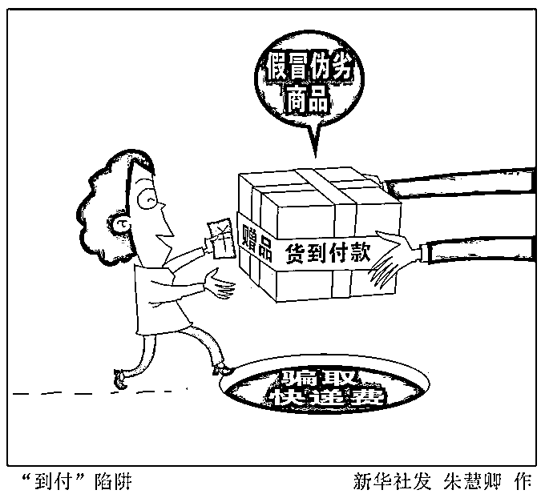

# 骗子已经满血复活了，你还在昏昏欲睡？

> 原文：[`mp.weixin.qq.com/s?__biz=MzIyMDYwMTk0Mw==&mid=2247509609&idx=6&sn=8de1c4759667ca219da4c6856061f482&chksm=97cb6d51a0bce447d48c1d31b075277600739aed96c6cbb24e8fa08aebae42d84fb411014b43&scene=27#wechat_redirect`](http://mp.weixin.qq.com/s?__biz=MzIyMDYwMTk0Mw==&mid=2247509609&idx=6&sn=8de1c4759667ca219da4c6856061f482&chksm=97cb6d51a0bce447d48c1d31b075277600739aed96c6cbb24e8fa08aebae42d84fb411014b43&scene=27#wechat_redirect)

都已经是节后第二天上班了

不少小伙伴还是一副

无精打采、昏昏欲睡的样子

大家纷纷表示自己

患上了严重的“节后综合症”

**又名“不想上班症”“昏昏欲睡症”**

骗子也会得“节后综合症”？

怎么可能！

他们早已满血复活去“奋斗”了

你还不赶紧行动起来

**春节后骗子常用的诈骗套路：**01 机票退改签诈骗

节后，随着机票价格上涨，有些市民就想在网上淘一些特价票、低票价的机票，很容易造成个人购票信息的泄露。当骗子掌握市民的购票信息后， 会假冒航空公司客服，向订票市民发送诈骗短信，以飞机出现故障或航班延误等理由，要求领取补贴或更改航班信息进行诈骗。

**反诈侠提醒:**当您收到航班延误、取消短信时，请不要直接联系短信里提供的电话号码，应当直接与各航空公司官方客服电话或机场问询联系；退票时，请切记退票退款不需要输入密码和验证码，更不需要先行汇款。
02 招工诈骗

每年春节之后的３月是求职热潮期，针对各求职者的招聘诈骗也进入了活跃期。骗子在网上发布招聘职工的信息，声称通过面试后即签订了聘用合同，期间诱导受害者缴纳“押金”“伙食费”、“住宿费”等费用。等受害者发现未被安排工作，并要求公司退款时，公司以各种理由不予退款，并进行语言甚至暴力威胁。 

**反诈侠提醒:**招工诈骗的惯用伎俩就是**收取所谓的押金、保证金、服装费、体检费、服装费等各种名目的费用**，应聘时一定要注意甄别，尤其是遇到贷款需特别谨慎！查询招聘信息时最好到正规网站，不要轻信免费发布信息的网站平台信息或者中介兼职信息，以防上当受骗。
03 无抵押贷款诈骗

春节买年货、孝敬父母、派发压岁钱。春节后就要还账了。压力山大啊！这也就造成了网贷诈骗案件节后爆发，究其受骗原因，无外乎急需用钱，但从银行贷款手续复杂、时间较长，怕麻烦、图省事，就想从网站或微信寻找贷款机会；或个人征信有问题，无法从正规渠道贷款，只能从贷款公司借钱。但网上写着“大额度、低利息、对征信没有要求”的贷款大多数含有陷阱。

**反诈侠提醒：**正规贷款公司决不会在贷款发放前以各种名义要求先支付所谓的“保证金”或“利息”，做银行卡流水来证明还款能力。对网贷公司要认真核实，不要轻信“无需抵押”等诱人的贷款信息。同时要注意保护好个人信息，**不要给陌生账户转账汇款及告知短信验证码等重要信息。**04 假冒快递诈骗

由于春节期间快递放假、大量快递积压等待派送，而信息迟迟不更新。问我为什么说的如此肯定，小编亲身经历而已，骗子瞅准这个时机，假冒快递公司，电话通知事主称快递丢失、公司可以双倍甚至数倍赔偿。随后要求添加事主微信，诱导事主扫二维码，并承诺通过支付宝退款。在扫描二维码并经过支付宝账号和密码登入支付界面后，便跳出了退款页面。当依次输入了姓名、持卡人、卡号、网络密码信息后手机却不断显现超时状态，事主会反复尝试，最终的结果就是支付宝被掏空。

**反诈侠提醒：**

快递如今成为骗子青睐的诱饵，接到此类电话，首先不要轻易泄露个人信息，不能扫二维码更不能转账，以免上当受骗。遇到快递不发货或者丢失的情况可以向快递公司官方客服咨询。

05 冒充熟人诈骗

“我是××，给你拜年了！我换号码了，你记一下……”春节期间，收到这样一个陌生号码的短信，你可能并不会在意，立刻将号码存为你熟悉的朋友。过几天，新号码又会发来短信：有事请你帮忙。一看是朋友或亲戚的名字，警惕性自然松懈。接下来，各种老套骗术上场，稍有不慎就会上当受骗。

**反诈侠提醒：**

收到这类信息后不要立刻保存新手机号码作为联系人，特别是非常熟悉的亲人或好友需要第一时间通过原号码、微信或其他共同联系人等方式确认是否换号。与熟人之间涉及直接的资金来往要特别小心，不要未经多种方式确认对方身份就轻易转账。对一切通过电话、短信要求进行的资金操作，务必保持警惕。

06 兑换积分诈骗

收到 10086 短信称可以积分换礼，短信具体内容为：“尊敬的用户：您的积分没有兑换即将清零，请用手机登录网站并根据提示安装下载，激活客户端兑换现金礼包”。当你点开链接按照对方指示操作后发现银行卡被盗刷了。

**反诈侠提醒：**

此类案件短信显示为 10086 发送，迷惑性非常高，很多群众上当受骗。遇到这类情况，不要轻信短信内容、更不要轻易点击陌生链接，骗子往往采用虚拟电话来电，让你误以为是正规通信公司的电话。一定要仔细核对是否是官方网站地址、电话，要记住任何企业和部门都不会要求公民提供银行卡密码和验证码，引你一步步最终转账的是骗子。

你看骗子时刻都在惦记你兜里的钱

所以别再感叹感觉假期还没开始

怎么就突然上班了

防骗才是硬道理

**牢记 6 个“一律”**

**熟悉 8 个“凡是”**

**远离骗子套路**

**“六个一律”**

接到陌生电话，只要谈到银行卡，一律挂掉；谈到中奖，一律挂掉；谈到“电话转接公安局、法院”，一律挂掉；所有短信，但凡让点击链接的，一律删掉；微信里不认识的人发来链接，一律不点；一提到“安全账户”的，一律是诈骗。 

**“8 个凡是”**

（1）凡是自称公检法要求汇款的都是诈骗；（2）凡是叫你汇款到安全账户的都是诈骗；（3）凡是通知中奖，领奖要你先交钱的，都是诈骗；（4）凡是通知家属出事，要先汇款的都是诈骗；（5）凡是在电话中索要银行卡信息及验证码的都是诈骗；（6）凡是让你开通网银接受检查的都是诈骗；（7）凡是自称领导要求汇款的都是诈骗；（8）凡是陌生网站要登记银行卡信息的，都是诈骗。

来源：昆明反电信网络诈骗中心

← 向右滑动与灰产圈互动交流 →

