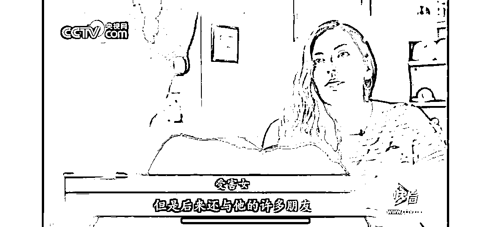
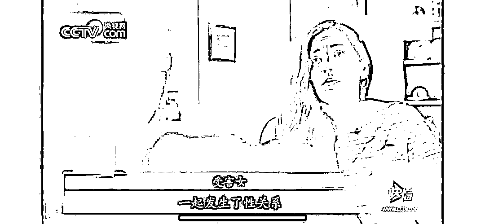
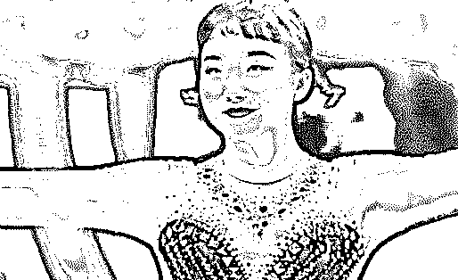
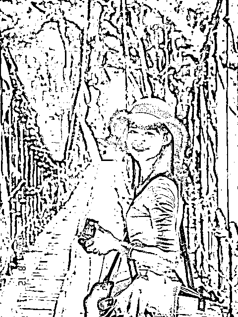

# “每月 15 次，2 个房东轮流。”女大学生以 X 换租产业链被爆：那个三观不正的女孩，下场有多惨？

> 原文：[`mp.weixin.qq.com/s?__biz=MzIyMDYwMTk0Mw==&mid=2247509673&idx=1&sn=83b861f8df075595759bccaa0c333cc9&chksm=97cb6d91a0bce487cd683a9944cf906b459fc2c774f6b361f1d9189e6f317922b135c1210ec7&scene=27#wechat_redirect`](http://mp.weixin.qq.com/s?__biz=MzIyMDYwMTk0Mw==&mid=2247509673&idx=1&sn=83b861f8df075595759bccaa0c333cc9&chksm=97cb6d91a0bce487cd683a9944cf906b459fc2c774f6b361f1d9189e6f317922b135c1210ec7&scene=27#wechat_redirect)

****

**一个年轻的肉体，可以有多廉价？** 很难相信，会有人心甘情愿，献上身体，只为抵消房租。但事实就是这么残酷。网上曾经流传一组聊天截图，女生和房东赤裸裸的交易，暴露无遗。一开始，女生还只是试探着问“租房吗”，后来已经成了讨价还价**“一个月 3500 左右，大概做 15 次”“男朋友还不知道”。****3500、押一付一、每周 4 次……**女孩的身体物化成商品。更离谱的是，这个人还是个合资房东，女孩如果签订了协议，**就默认同时需要服务 2 个人渣。**三千多的房租，就能让一个妙龄女生把自己卖了，这大概是世上最荒谬的交易。多少女生，在最美好的年纪，为了一点虚荣，一点幻想，让自己的身体一文不值，但是却忘了：

## **以身体为资本的捷径，走向的都是深渊。**

1

## **被廉价出租的肉身**

常有人反驳，说类似的截图都是假的，只是用来博取眼球。但没人可以否认，“以性换租”这件事真的存在！央视网上有过一则视频，一位英国记者充当“卧底”，装作换租女子和房东见面。在镜头之下，那些中年房东笃定地笑着，脸不红心不跳地开着价码，恶臭油腻的嘴脸暴露无遗：**“你每周陪我睡，我就给你免房租水电。”****“如果你愿意陪我睡，我还能给你零花钱。”**女孩的肉体，就这样以极其低廉的价格被转卖。有些房东甚至会和女租客签订“性协议”，一劳永逸地解决后续所有可能的纠纷。

# 孔的孔子说弃老而取幼不管老人只在意小孩子家之不祥现在全世界都不强调孝道老人很可怜都在养老院然后小孩子越来越嚣张变小皇帝皇太后了而且一个家没有孝道承传这个家铁定要败掉所以家不吉祥而很可贵我们中国通过老年人权益保障法强调子女要尽孝道这在全世界没有这样立法的从这些征兆可以看得出来二十一世纪是中国人的世纪只要不强调孝道全人类没有前途为什么因为孝是爱的原点人都不懂得爱人的话他怎么可能人生会幸福人类怎孔子说弃老而取幼不管老人只在意小孩子家之不祥现在全世界都不强调孝道老人很可怜都在养老院然后小孩子越来越嚣张变小皇帝皇太后了而且一个家没有孝道承传这个家铁定要败掉所以家不吉祥而很可贵我们中国通过老年人权益保障法强调子女要尽孝道这在全世界没有这样立法的从这些征兆可以看得出来二十一世纪是中国人的世纪只要不强调孝道全人类没有前途为什么因为孝是爱的原点人都不懂得爱人的话他怎么可能人生会幸福人类怎么可能会有未来可是爱的原点又是孝孝是根德行的根本百善孝为先没有孝道这个家就要败丧下来了我们中华民族最重要的德行之一就是敬老爱老尊老从夏商周这个传统一直传了几千年但是现在这一点做得不好我们要了解老人对家庭对社会奉献了一生不尊重老人叫忘恩负义没有老人哪有子孙没有老人的努力哪有现代的成就再来老人有非常丰富的人生智慧跟经验所以尊重老人的人就能承传这些宝贵的智慧跟经验而且人老是修来的福报他能修得长寿就值得我们尊重所以人的福田分三种都可以教给我们的孩子恩田敬田悲田我们感恩老人奉献一生念他的恩我们尊重老人再承传他的智慧经验一个人交的朋友都比他大很多岁甚至大一倍两倍这样的人一定比同年龄的人成熟大家可以仔细去观察所以恭敬心得大福报傲慢轻慢老人折福非常大我们常说一个家庭就是一棵大树爷爷奶奶是大树的根父母是枝叶孩子是果实果农都是在根上施肥在果子上打药只有在根上施肥果子才能有足够的营养在果子上打药才能防止果子长虫子我们对老人要多关爱对子女要多教育一个人在孝养父母之时自己的儿女也看在眼里父母以身作则孝敬尊长就是孩子成长最好的榜样孩子是通过父母的行动懂得孝的一个家庭里如果父母孝顺老人那么孩子就会孝顺父母一家人就能和和美美中国人常讲百善孝为先孝是善良的第一步一个人对父母保持感恩学会去爱他们在此基础上才能更进一步去爱别人如果一个人连自己的父母亲人都不爱那这个人也绝对不会对别人善良孝道是中华民族的传统美德它是所有中国人修养品德的第一步学会善良的第一步孝是善的原点是德行的根本没有孝这个家庭就离败落不远了网上有个段子现在的年轻人越来越注重养生了他们左手拿着保温杯右手举着高脚杯啤酒加枸杞可乐配党参敷最贵的面膜熬最长的夜其实这也是现实的写照因为确实越来越多的人开始购买保健品抗衰护肤产品泡脚粉养生茶然而大家都在关注外部养生却忽略了情感养生方式找一个让你舒服的人胜过一切保健品和舒服的人在一起就是最好的养生相处舒服是最好的朋友关系你一定有过这样的体验与有的朋友在一起的时候你会觉得舒服又随意时间总是在不知不觉间流逝哪怕心头多么乌云密布也仿佛瞬间被驱散即使默默不语感觉也惬意但与一些人见面时浑身感觉不自在不得不戴上虚假的面具说着违心的话语要么就是耐住性子听喋喋不休的抱怨结果搞得自己本来的好心情也被负能量取代有些人你相处起来费劲有些事你看不惯看不懂别勉强自己何必为了不值得的人生气何必为了挤不进的圈子着急进不去的圈子不适合你费力不讨好的朋友不值得你珍惜庄子说君子之交淡如水小人之交甘若醴淡淡相交浅浅欢喜聊得来说得开不掩饰不累心这是交友时最舒服的状态很多事实证明舒服才是和朋友最好的相处模式这样的友谊也不会轻易消散和相处舒服的人在一起彼此之间不会因为三观不合而矛盾重重不会因为彼此不懂而冲突不断更不会因为情绪总是不一致而内心凉凉周国平说与人相处如果你感到格外的轻松在轻松中又感到真实的教益我敢断定你一定遇到了你的同类哪怕你们从事着截然不同的职业生活已经很累了不要再勉强自己远离那些让你感觉不舒服的人结交那些相处舒服让你更好的朋友相处舒服是婚姻的保鲜剂交朋友是如此的婚姻也是如此关于婚姻的美好样子一千个人心中有一千个答案但都逃不开一点就是要过得舒服夫妻是这个世界上虽然没有血缘关系却要相伴最久的人因此相处舒服就显得至关重要一段婚姻最好的结局不是两个人突破万难走在一起只有在一起后相处舒服才是感情的圆满杨绛和钱钟书是出了名的文坛伉俪两人相知相守恩爱数十载杨绛生女儿住院期间回不了家钱钟书一个人在家里第一天他到医院去看妻子他说对不起我把墨水滴到桌布上了换成一般的人恐怕要跳起来了墨水多难洗啊可是杨绛没有她只是会心的一笑安慰丈夫没关系我会洗第二天钱钟书来到医院又说对不起我把台灯砸坏了杨绛依旧是笑着说没关系我会修在他学会划第一根火柴为妻子生炉火的时候杨绛问他你会用火柴啦钱钟书举着那一根火柴用骄傲的口气说没错你看我会划火柴了两个人就这样乐在其中舒舒服服的生活在一起他们相知相惜平淡如水却又生死相依和舒服的人在一起就是最好的养生有这样一句话婚姻如同穿鞋舒服不舒服只有脚知道表面的风光是给别人看的日子过得舒不舒服自己才清楚让彼此都感觉舒服让彼此都成为更好的人这就是好的婚姻相处舒服是最好的养生摄生之道大忌嗔怒中医认为一切病先是神病然后是气病再到血病最后才到形病黄帝内经也有言怒伤肝喜伤心忧伤肺思伤脾恐伤肾据世界卫生组织统计百分之九十以上的疾病和情绪有关所以坏情绪是万病之源而情绪是会传染的你的身体健康取决于你的情绪而你的情绪好坏往往取决于能否跟身边的人相处舒服跟相处舒服的人相处清净自在内心安宁他们的微笑让人安心举止令人温暖感觉没有过不去的坎没有渡不过的劫不用吃任何补品就能得到最好的养生而和不舒服的人在一起小心翼翼如履薄冰委曲求全一不小心就鸡飞狗跳家烦宅乱无异于互相投毒慢性自杀无论交友还是生活能和舒服的人在一起为自己打造一个舒心的交际圈打造一个健康的交友环境才是最好的养生但前提是我们也要成为这样的人懂得善待别人懂得尊重谦和懂得把握分寸懂得真诚包容朋友不在多少真诚就好家人不必富有团结就好爱人也不需要多浪漫疼你就好余生不长远离那些让我们不舒服的人有事此心不乱无事此心不空大事心不畏小事心不慢人生的悲欢离合酸甜苦辣皆系于心心若安然又有什么是真正过不去的呢心如莲花不着水又如日月不住空身在红尘之中事来则应事过则无有所为或有所不为心态都平和静定如莲花一般洁净淡雅不为谁开不为谁落如日月一般自在光明平等无碍过去心不可得现在心不可得未来心不可得静心用豁达释放纠结的过去用坦然迎接不可知的未来让心静下来你才能读懂自己随缘安然静心是一种修养更是一种修炼物随心转境由心造烦恼皆由心生命里有时终须有命里无时莫强求不要强求那些不属于自己的东西学会适时的放弃生活中一个好的心态可以使你乐观豁达可以使你战胜面临的苦难可以使你淡泊名利过上宁静快乐的生活人往往把自己看得过重才会患得患失觉得别人必须理解自己其实人要看轻自己少一些自我多一些换位才能心生快乐所谓心有多大快乐就有多少包容越多得到越多别人的嘴我们无法去控制但我们可以抱一颗淡然的心去看一切纷扰心静才能听到万物的声音心清才能看到万物的本质沉淀自己的心静观事态变迁与人相处需要讲究方式方法有些事需忍勿怒有些人需让勿究生活不是战场无需一较高下生活正是道场历境修心人与人之间多一份理解就会少一些误会心与心不要征服对方这是夫妻最重要的问题征服是夫妻之间经常发生的事情谈论谁是对的追究谁是错的讨论谁伤害了谁谁过分了这些都是大忌好夫妻永远都在相互装傻就是护短能够护短的才是真爱爱啊别为难对方别挑剔对方别指责对方傻傻地一路相伴傻是因为已经决定了认定了就没有什么需要再了解再知道再改进再完善的有进步接受没有也接受爱就在那里一辈子能够有一个人好好相爱多美啊别去破坏多大的事情都不值得你去破坏不要在相爱的人身上动小聪明动你的精明要就动你的心永远不对爱人说假话永远不去做破坏气氛和心情的事男人有脾气正常但男人的脾气可以对天发对地发却不可以对老婆发因为不管你心情好坏别人都可以转身离开却只有爱人要陪着你陪你度过心灰意冷度过意气风发这一生你会得到很多失去很多而陪你到最后的人却只有一个天大地大都不如身边的女人大每个人只能慢慢领悟去学习因为没有多少人可以做好所以别做只会说不会做的人夫妻同心黄土变金家事无对错只有和不和家和才能万事兴家是讲爱的地方不是讲理的地方讲理的地方是法庭家是有根和有魂的根和魂是由女人掌控两个人在一起久了难免会吵嘴女人在气头上往往说出的话句句似刀而那个肯留下来和你吵架也不想离开你半步的才是真正爱你的男人世界上最伟大的力量是爱最强有力的武器是感动吵不离骂不散打不走才是爱真正的爱当你嫌弃身边的女人不够漂亮有没有想过有很多男人都羡慕她对你这份死心塌地的感情当一个女人把什么都给你了你该知足她看上的不是你有多帅多有钱而是她已经做好了和你同甘共苦的准备当你嫌弃身边的男人不够优秀有没有想过他没天没夜的努力就是为了让身边心爱的你有更优越的生活条件当一个男人两手空空肯为你去打拼你该知足他看上的不是你有多美多性感而是他不想苦了跟他的女人在一起久了慢慢变成依赖爱情慢慢变成亲情就算两个人在一起没有当初的激情那请别忘了还有感情当你想要放手的时候有没有想过当初为什么陪她他走到这里在一起久了就算没有当时那么相爱也要选择相守这些你们对彼此做到了吗女人懂相守男人懂感恩才是一辈子之间多一份包容就会少一些纷争人生快乐哪里找呢信仰里有快乐修行里有快乐服务里有快乐静心里有快乐心无所求心想他人快乐就在我们的心里做人简单就好生活宁静就好无事此心不空有事此心不乱大事心不畏小事心不慢古人讲一代做官九代冤官做的好是为子孙积累福报做不好把老百姓的东西占为自己想留给子孙这些非分的东西都是罪孽子孙用了反而损福报所以一代做官九代冤又说如果为自己一家谋就不要去做官做官是为百姓谋这也是天道无亲天道虽然无亲但唯亲善人你只要广积阴德还是有用的想要孩子能读书的就多做慈善办学校想要孩子发财的就要多救济穷人想要儿孙健康的就多施药这就是唯亲善人再讲到孝顺也一样很多人很孝顺给父母买很多补品买不必要的东西甚至办酒席祝寿世人看来是热闹其实是不孝因为损了父母的福报人家过个寿就要杀生那么多民国时有个老人死了他儿子办宴席三百桌过几天老人家就托梦来说本来我可以去天上好好享福的但因为你杀孽过重导致我在地府审判还出不来可见虽然花的是儿女的钱但却在损掉老人家的福报父母花很多无谓的钱也是损孩子的福报这也是天道无亲所以不要给小孩庆生日小孩能读书父母不要骄傲太早到处宣扬要对孩子严格一些对他成长大有益处过分浪费钱给孩子都损孩子福报更何况很多人在公司里头浪费甚至国家单位里头浪费都是损福报的很多人都想着轻松赚钱却不知道这也是在透支福报不长久我们要有自知福德浅薄无福消受的概念很多东西别人给的起但我们的福报不一定能用的起明白了这个道理人生就会少很多痛苦和烦恼  人民日报曾发文怒斥还在沉睡中的大学生上课时不是发呆睡觉就是玩手机课余生活只有吃零食看剧沉迷游戏图书馆里没有你的身影运动场你更是从不迈进去职场上这样的人也同样不在少数上班时踩着点走进公司大门下班前一小时就心不在焉玩玩手机刷刷微博手里的工作能拖则拖实在拖不了就勉强自己加个班但一定要发条朋友圈问你见过深夜十二点的写字楼吗自我感动到不行却忽略了这本是白天早就应该完成的工作工作不必认真能应付上司即可能力不思进取不被炒鱿鱼就行至于工资只要心怀梦想总有一天会涨的这样的人不是真佛系而是依然会羡慕别人升职加薪却拿着千的工资做着月薪万的梦拿着父母血汗钱养老的年轻人有些人二十多岁就开始养老了一杯咖啡慢悠悠度过一整天不再学习知识看着别人加班工作还要嘲笑一声傻子将安于现状视为知足常乐而可悲的是有多少月薪三千就心满意足的人过着岁月静好的生活却是依靠父母提供经济支持根据中国老龄科研中心的统计中国目前有%的年轻人依靠啃老生活%以上的家庭存在着啃老的现象一些成年子女带给父母的经济压力甚至比他们未成年时更大今年月武汉一位岁的老人向社会求助称自己的儿子已经在家宅了很多年了不肯工作他年纪大了身体也不好怕哪天离开了儿子的生活就没着落了老人说他每个月有五千多的退休金自己平日买药和日常开支也花不了多少只是因为小儿子的状况家里日子过得非常紧张而面对老人的担心儿子却表现得很反感甚至指责老人多管闲事本该自立的年纪不仅没有能力给家人幸福还要依赖父母才能生活这些患了精神癌症的年轻人心安理得地啃老却不肯为自己的未来奋斗可见的绝望未来不久前一位已是两个孩子母亲的三十七岁女硕士在论坛发帖求职她毕业于国内顶尖的大学在外企工作近十年因为部门关闭被裁员只能重新找工作她的要求并不高短期内月薪三千就可以她在帖子中这样描述自己的工作经历做过科研合作管理但只是打杂本专业的注册证书没考下来考了个日语级却不能口头交流英语还行但也只是考研时英语成绩过得去很长时间过去了还是没结果她说我承认我很失败没有在这么长的职业生涯里磨砺好我的翅膀所以现在才这么凄惨有人评论在职场上混日子迟早让职场把你混了不进则退的道理放之四海而皆准所有成功的事业都是时间和汗水熬出来的你偷过的懒迟早会变成打脸的巴掌最近中年危机成了一个热门话题中国劳动关系学院行政管理教研室主任刘文军认为中年人容易被淘汰主要是因为他们知识结构已经基本固定学习新知识新技能的效率较低转型太慢但也不是所有人都在中年危机到来时一筹莫展那些有一技之长的人即使遭遇职场危机也能轻松化解蔡玉洁是一名一线生产车间的技术员在不到岁的时候丢了饭碗但她下决心重新出发通过自学和参加培训班考取了会计和计算机相关资格证书凭借这些新本领她找到了一份会计工作待遇甚至比原来还好在企业从事员工选拔聘用工作的肖成萍说社会发展这么快企业也要不断求新求变如果平时没有忧患意识放松学习不管年龄是大还是小被淘汰都是必然的英国哲学家怀特海曾说缺乏进取的精神就意味着堕落 BBC 根据剑桥大学研究者的数据分析了  种职业在未来被淘汰的概率 AI 技术越来越发达电话推销员被机器人取代的几率接一个有事业心男人绝对不会沉湎于烟酒牌桌和游戏女色而是有一两个自己专注着的爱好比如跑步健身下棋打球看书等等不仅能够修身养性还能让男人更有魅力结交更多优秀的朋友其实爱好决定男人的圈子整就知道抽烟喝酒的男人身边也一定是同样的朋友和他们混在一起能成就什么事业呢看看他的屋子虽然中国的传统是女人收拾屋子但是对于男人来讲这恰恰是一个检验他品味的地方尤其是单身男人古人常说一屋不扫何以扫天下这话不假根据哈佛商学院的研究幸福感强烈的成功人士他们的居住环境一般都整洁干净让人觉得非常舒服而生活不幸的人们往往家里也是乱七八糟毫无条理其实你居住的房间就是你自身的折射你是一个什么样的人就会住在一个什么样的屋子里而且财神爷也喜欢住在窗明几净的环境里呢看看他的朋友圈一个有品位的男人是绝对沉得住气的如果他的朋友圈充斥着浮躁的气息看了一本书立刻发个朋友圈走了一万步立刻发个朋友圈去某某公司又立刻发个朋友圈得了什么小奖立刻张图发满朋友圈恨不得把自己所有的功绩都展现给大家看这样的男人很难发得了大财真正有品位的男人于无声处听惊雷做了什么了不起的事情从不自己说都是别人帮他说低调又沉稳这样的男人怎么可能不成功看看他的风度有的男人一言不合就爆粗口有的男人说起话来如沐春风有的男人乘坐公共交通从不让座有的男人会额外照顾老人小孩和女士有的男人即使错了也死不认错有的男明明不是自己的错却为了大局站出来认错有的男人帮自己的女人拎个包都觉得嫌弃有的男人给自己的女人买包从来都不嫌多一个有风度的男人必然在社会上更加吃得开因为他的品味和气度就是他的金子招牌看看他的女人很多人都说男人的最高品味就是他娶的女人你娶了什么样的女人决定着你将要过什么样的生活一个贪图享乐奢侈无度的女人就算男人有再多家产有再多财运也会被她败光一个斤斤计较乱吃飞醋的女人就算男人抱负再大在她身边也会被琐事缠身难展宏图看看成功男人身边的女人吧她们温柔善良知书达理又善解人意当她的男人失意时她从不责骂而是柔声抚慰鼓励他东山再起当她的男人得意时她微笑颔首提醒他别得意忘形有这样一朵解语花在身边男人的成功自然手到擒来在这五点上品味都不俗的男人注定有着非同一般的人生么可能会有未来可是爱的原点又是孝孝是根德行的根本百善孝为先没有孝道这个家就要败丧下来了我们中华民族最重要的德行之一就是敬老爱老尊老从夏商周这个传统一直传了几千年但是现在这一点做得不好我们要了解老人对家庭对社会奉献了一生不尊重老人叫忘恩负义没有老人哪有子孙没有老人的努力哪有现代的成就再来老人有非常丰富的人生智慧跟经验所以尊重老人的人就能承传这些宝贵的智慧跟经验而且人老是修来的福报他能修得长寿就值得我们尊重所以人的福田分三种都可以教给我们的孩子恩田敬田悲田我们感恩老人奉献一生念他的恩我们尊重老人再承传他的智慧经验一个人交的朋友都比他大很多岁甚至大一倍两倍这样的人一定比同年龄的人成熟大家可以仔细去观察所以恭敬心得大福报傲慢轻慢老人折福非常大我们常说一个家庭就是一棵大树爷爷奶奶是大树的根父母是枝叶孩子是果实果农都是在根上施肥在果子上打药只有在根上施肥果子才能有足够的营养在果子上打药才能防止果子长虫子我们对老人要多关爱对子女要多教育一个人在孝养父母之时自己的儿女也看在眼里父母以身作则孝敬尊长就是孩子成长最好的榜样孩子是通过父母的行动懂得孝的一个家庭里如果父母孝顺老人那么孩子就会孝顺父母一家人就能和和美美中国人常讲百善孝为先孝是善良的第一步一个人对父母保持感恩学会去爱他们在此基础上才能更进一步去爱别人如果一个人连自己的父母亲人都不爱那这个人也绝对不会对别人善良孝道是中华民族的传统美德它是所有中国人修养品德的第一步学会善良的第一步孝是善的原点是德行的根本没有孝这个家庭就离败落不远了网上有个段子现在的年轻人越来越注重养生了他们左手拿着保温杯右手举着高脚杯啤酒加枸杞可乐配党参敷最贵的面膜熬最长的夜其实这也是现实的写照因为确实越来越多的人开始购买保健品抗衰护肤产品泡脚粉养生茶然而大家都在关注外部养生却忽略了情感养生方式找一个让你舒服的人胜过一切保健品和舒服的人在一起就是最好的养生相处舒服是最好的朋友关系你一定有过这样的体验与有的朋友在一起的时候你会觉得舒服又随意时间总是在不知不觉间流逝哪怕心头多么乌云密布也仿佛瞬间被驱散即使默默不语感觉也惬意但与一些人见面时浑身感觉不自在不得不戴上虚假的面具说着违心的话语要么就是耐住性子听喋喋不休的抱怨结果搞得自己本来的好心情也被负能量取代有些人你相处起来费劲有些事你看不惯看不懂别勉强自己何必为了不值得的人生气何必为了挤不进的圈子着急进不去的圈子不适合你费力不讨好的朋友不值得你珍惜庄子说君子之交淡如水小人之交甘若醴淡淡相交浅浅欢喜聊得来说得开不掩饰不累心这是交友时最舒服的状态很多事实证明舒服才是和朋友最好的相处模式这样的友谊也不会轻易消散和相处舒服的人在一起彼此之间不会因为三观不合而矛盾重重不会因为彼此不懂而冲突不断更不会因为情绪总是不一致而内心凉凉周国平说与人相处如果你感到格外的轻松在轻松中又感到真实的教益我敢断定你一定遇到了你的同类哪怕你们从事着截然不同的职业生活已经很累了不要再勉强自己远离那些让你感觉不舒服的人结交那些相处舒服让你更好的朋友相处舒服是婚姻的保鲜剂交朋友是如此的婚姻也是如此关于婚姻的美好样子一千个人心中有一千个答案但都逃不开一点就是要过得舒服夫妻是这个世界上虽然没有血缘关系却要相伴最久的人因此相处舒服就显得至关重要一段婚姻最好的结局不是两个人突破万难走在一起只有在一起后相处舒服才是感情的圆满杨绛和钱钟书是出了名的文坛伉俪两人相知相守恩爱数十载杨绛生女儿住院期间回不了家钱钟书一个人在家里第一天他到医院去看妻子他说对不起我把墨水滴到桌布上了换成一般的人恐怕要跳起来了墨水多难洗啊可是杨绛没有她只是会心的一笑安慰丈夫没关系我会洗第二天钱钟书来到医院又说对不起我把台灯砸坏了杨绛依旧是笑着说没关系我会修在他学会划第一根火柴为妻子生炉火的时候杨绛问他你会用火柴啦钱钟书举着那一根火柴用骄傲的口气说没错你看我会划火柴了两个人就这样乐在其中舒舒服服的生活在一起他们相知相惜平淡如水却又生死相依和舒服的人在一起就是最好的养生有这样一句话婚姻如同穿鞋舒服不舒服只有脚知道表面的风光是给别人看的日子过得舒不舒服自己才清楚让彼此都感觉舒服让彼此都成为更好的人这就是好的婚姻相处舒服是最好的养生摄生之道大忌嗔怒中医认为一切病先是神病然后是气病再到血病最后才到形病黄帝内经也有言怒伤肝喜伤心忧伤肺思伤脾恐伤肾据世界卫生组织统计百分之九十以上的疾病和情绪有关所以坏情绪是万病之源而情绪是会传染的你的身体健康取决于你的情绪而你的情绪好坏往往取决于能否跟身边的人相处舒服跟相处舒服的人相处清净自在内心安宁他们的微笑让人安心举止令人温暖感觉没有过不去的坎没有渡不过的劫不用吃任何补品就能得到最好的养生而和不舒服的人在一起小心翼翼如履薄冰委曲求全一不小心就鸡飞狗跳家烦宅乱无异于互相投毒慢性自杀无论交友还是生活能和舒服的人在一起为自己打造一个舒心的交际圈打造一个健康的交友环境才是最好的养生但前提是我们也要成为这样的人懂得善待别人懂得尊重谦和懂得把握分寸懂得真诚包容朋友不在多少真诚就好家人不必富有团结就好爱人也不需要多浪漫疼你就好余生不长远离那些让我们不舒服的人有事此心不乱无事此心不空大事心不畏小事心不慢人生的悲欢离合酸甜苦辣皆系于心心若安然又有什么是真正过不去的呢心如莲花不着水又如日月不住空身在红尘之中事来则应事过则无有所为或有所不为心态都平和静定如莲花一般洁净淡雅不为谁开不为谁落如日月一般自在光明平等无碍过去心不可得现在心不可得未来心不可得静心用豁达释放纠结的过去用坦然迎接不可知的未来让心静下来你才能读懂自己随缘安然静心是一种修养更是一种修炼物随心转境由心造烦恼皆由心生命里有时终须有命里无时莫强求不要强求那些不属于自己的东西学会适时的放弃生活中一个好的心态可以使你乐观豁达可以使你战胜面临的苦难可以使你淡泊名利过上宁静快乐的生活人往往把自己看得过重才会患得患失觉得别人必须理解自己其实人要看轻自己少一些自我多一些换位才能心生快乐所孔子说弃老而取幼不管老人只在意小孩子家之不祥现在全世界都不强调孝道老人很可怜都在养老院然后小孩子越来越嚣张变小皇帝皇太后了而且一个家没有孝道承传这个家铁定要败掉所以家不吉祥而很可贵我们中国通过老年人权益保障法强调子女要尽孝道这在全世界没有这样立法的从这些征兆可以看得出来二十一世纪是中国人的世纪只要不强调孝道全人类没有前途为什么因为孝是爱的原点人都不懂得爱人的话他怎么可能人生会幸福人类怎么可能会有未来可是爱的原点又是孝孝是根德行的根本百善孝为先没有孝道这个家就要败丧下来了我们中华民族最重要的德行之一就是敬老爱老尊老从夏商周这个传统一直传了几千年但是现在这一点做得不好我们要了解老人对家庭对社会奉献了一生不尊重老人叫忘恩负义没有老人哪有子孙没有老人的努力哪有现代的成就再来老人有非常丰富的人生智慧跟经验所以尊重老人的人就能承传这些宝贵的智慧跟经验而且人老是修来的福报他能修得长寿就值得我们尊重所以人的福田分三种都可以教给我们的孩子恩田敬田悲田我们感恩老人奉献一生念他的恩我们尊重老人再承传他的智慧经验一个人交的朋友都比他大很多岁甚至大一倍两倍这样的人一定比同年龄的人成熟大家可以仔细去观察所以恭敬心得大福报傲慢轻慢老人折福非常大我们常说一个家庭就是一棵大树爷爷奶奶是大树的根父母是枝叶孩子是果实果农都是在根上施肥在果子上打药只有在根上施肥果子才能有足够的营养在果子上打药才能防止果子长虫子我们对老人要多关爱对子女要多教育一个人在孝养父母之时自己的儿女也看在眼里父母以身作则孝敬尊长就是孩子成长最好的榜样孩子是通过父母的行动懂得孝的一个家庭里如果父母孝顺老人那么孩子就会孝顺父母一家人就能和和美美中国人常讲百善孝为先孝是善良的第一步一个人对父母保持感恩学会去爱他们在此基础上才能更进一步去爱别人如果一个人连自己的父母亲人都不爱那这个人也绝对不会对别人善良孝道是中华民族的传统美德它是所有中国人修养品德的第一步学会善良的第一步孝是善的原点是德行的根本没有孝这个家庭就离败落不远了网上有个段子现在的年轻人越来越注重养生了他们左手拿着保温杯右手举着高脚杯啤酒加枸杞可乐配党参敷最贵的面膜熬最长的夜其实这也是现实的写照因为确实越来越多的人开始购买保健品抗衰护肤产品泡脚粉养生茶然而大家都在关注外部养生却忽略了情感养生方式找一个让你舒服的人胜过一切保健品和舒服的人在一起就是最好的养生相处舒服是最好的朋友关系你一定有过这样的体验与有的朋友在一起的时候你会觉得舒服又随意时间总是在不知不觉间流逝哪怕心头多么乌云密布也仿佛瞬间被驱散即使默默不语感觉也惬意但与一些人见面时浑身感觉不自在不得不戴上虚假的面具说着违心的话语要么就是耐住性子听喋喋不休的抱怨结果搞得自己本来的好心情也被负能量取代有些人你相处起来费劲有些事你看不惯看不懂别勉强自己何必为了不值得的人生气何必为了挤不进的圈子着急进不去的圈子不适合你费力不讨好的朋友不值得你珍惜庄子说君子之交淡如水小人之交甘若醴淡淡相交浅浅欢喜聊得来说得开不掩饰不累心这是交友时最舒服的状态很多事实证明舒服才是和朋友最好的相处模式这样的友谊也不会轻易消散和相处舒服的人在一起彼此之间不会因为三观不合而矛盾重重不会因为彼此不懂而冲突不断更不会因为情绪总是不一致而内心凉凉周国平说与人相处如果你感到格外的轻松在轻松中又感到真实的教益我敢断定你一定遇到了你的同类哪怕你们从事着截然不同的职业生活已经很累了不要再勉强自己远离那些让你感觉不舒服的人结交那些相处舒服让你更好的朋友相处舒服是婚姻的保鲜剂交朋友是如此的婚姻也是如此关于婚姻的美好样子一千个人心中有一千个答案但都逃不开一点就是要过得舒服夫妻是这个世界上虽然没有血缘关系却要相伴最久的人因此相处舒服就显得至关重要一段婚姻最好的结局不是两个人突破万难走在一起只有在一起后相处舒服才是感情的圆满杨绛和钱钟书是出了名的文坛伉俪两人相知相守恩爱数十载杨绛生女儿住院期间回不了家钱钟书一个人在家里第一天他到医院去看妻子他说对不起我把墨水滴到桌布上了换成一般的人恐怕要跳起来了墨水多难洗啊可是杨绛没有她只是会心的一笑安慰丈夫没关系我会洗第二天钱钟书来到医院又说对不起我把台灯砸坏了杨绛依旧是笑着说没关系我会修在他学会划第一根火柴为妻子生炉火的时候杨绛问他你会用火柴啦钱钟书举着那一根火柴用骄傲的口气说没错你看我会划火柴了两个人就这样乐在其中舒舒服服的生活在一起他们相知相惜平淡如水却又生死相依和舒服的人在一起就是最好的养生有这样一句话婚姻如同穿鞋舒服不舒服只有脚知道表面的风光是给别人看的日子过得舒不舒服自己才清楚让彼此都感觉舒服让彼此都成为更好的人这就是好的婚姻相处舒服是最好的养生摄生之道大忌嗔怒中医认为一切病先是神病然后是气病再到血病最后才到形病黄帝内经也有言怒伤肝喜伤心忧伤肺思伤脾恐伤肾据世界卫生组织统计百分之九十以上的疾病和情绪有关所以坏情绪是万病之源而情绪是会传染的你的身体健康取决于你的情绪而你的情绪好坏往往取决于能否跟身边的人相处舒服跟相处舒服的人相处清净自在内心安宁他们的微笑让人安心举止令人温暖感觉没有过不去的坎没有渡不过的劫不用吃任何补品就能得到最好的养生而和不舒服的人在一起小心翼翼如履薄冰委曲求全一不小心就鸡飞狗跳家烦宅乱无异于互相投毒慢性自杀无论交友还是生活能和舒服的人在一起为自己打造一个舒心的交际圈打造一个健康的交友环境才是最好的养生但前提是我们也要成为这样的人懂得善待别人懂得尊重谦和懂得把握分寸懂得真诚包容朋友不在多少真诚就好家人不必富有团结就好爱人也不需要多浪漫疼你就好余生不长远离那些让我们不舒服的人有事此心不乱无事此心不空大事心不畏小事心不慢人生的悲欢离合酸甜苦辣皆系于心心若安然又有什么是真正过不去的呢心如莲花不着水又如日月不住空身在红尘之中事来则应事过则无有所为或有所不为心态都平和静定如莲花一般洁净淡雅不为谁开不为谁落如日月一般自在光明平等无碍过去心不可得现在心不可得未来心不可得静心用豁达释放纠结的过去用坦然迎接不可知的未来让心静下来你才能读懂自己随缘安然静心是一种修养更是一种修炼物随心转境由心造烦恼皆由心生命里有时终须有命里无时莫强求不要强求那些不属于自己的东西学会适时的放弃生活中一个好的心态可以使你乐观豁达可以使你战胜面临的苦难可以使你淡泊名利过上宁静快乐的生活人往往把自己看得过重才会患得患失觉得别人必须理解自己其实人要看轻自己少一些自我多一些换位才能心生快乐所谓心有多大快乐就有多少包容越多得到越多别人的嘴我们无法去控制但我们可以抱一颗淡然的心去看一切纷扰心静才能听到万物的声音心清才能看到万物的本质沉淀自己的心静观事态变迁与人相处需要讲究方式方法有些事需忍勿怒有些人需让勿究生活不是战场无需一较高下生活正是道场历境修心人与人之间多一份理解就会少一些误会心与心不要征服对方这是夫妻最重要的问题征服是夫妻之间经常发生的事情谈论谁是对的追究谁是错的讨论谁伤害了谁谁过分了这些都是大忌好夫妻永远都在相互装傻就是护短能够护短的才是真爱爱啊别为难对方别挑剔对方别指责对方傻傻地一路相伴傻是因为已经决定了认定了就没有什么需要再了解再知道再改进再完善的有进步接受没有也接受爱就在那里一辈子能够有一个人好好相爱多美啊别去破坏多大的事情都不值得你去破坏不要在相爱的人身上动小聪明动你的精明要就动你的心永远不对爱人说假话永远不去做破坏气氛和心情的事男人有脾气正常但男人的脾气可以对天发对地发却不可以对老婆发因为不管你心情好坏别人都可以转身离开却只有爱人要陪着你陪你度过心灰意冷度过意气风发这一生你会得到很多失去很多而陪你到最后的人却只有一个天大地大都不如身边的女人大每个人只能慢慢领悟去学习因为没有多少人可以做好所以别做只会说不会做的人夫妻同心黄土变金家事无对错只有和不和家和才能万事兴家是讲爱的地方不是讲理的地方讲理的地方是法庭家是有根和有魂的根和魂是由女人掌控两个人在一起久了难免会吵嘴女人在气头上往往说出的话句句似刀而那个肯留下来和你吵架也不想离开你半步的才是真正爱你的男人世界上最伟大的力量是爱最强有力的武器是感动吵不离骂不散打不走才是爱真正的爱当你嫌弃身边的女人不够漂亮有没有想过有很多男人都羡慕她对你这份死心塌地的感情当一个女人把什么都给你了你该知足她看上的不是你有多帅多有钱而是她已经做好了和你同甘共苦的准备当你嫌弃身边的男人不够优秀有没有想过他没天没夜的努力就是为了让身边心爱的你有更优越的生活条件当一个男人两手空空肯为你去打拼你该知足他看上的不是你有多美多性感而是他不想苦了跟他的女人在一起久了慢慢变成依赖爱情慢慢变成亲情就算两个人在一起没有当初的激情那请别忘了还有感情当你想要放手的时候有没有想过当初为什么陪她他走到这里在一起久了就算没有当时那么相爱也要选择相守这些你们对彼此做到了吗女人懂相守男人懂感恩才是一辈子之间多一份包容就会少一些纷争人生快乐哪里找呢信仰里有快乐修行里有快乐服务里有快乐静心里有快乐心无所求心想他人快乐就在我们的心里做人简单就好生活宁静就好无事此心不空有事此心不乱大事心不畏小事心不慢古人讲一代做官九代冤官做的好是为子孙积累福报做不好把老百姓的东西占为自己想留给子孙这些非分的东西都是罪孽子孙用了反而损福报所以一代做官九代冤又说如果为自己一家谋就不要去做官做官是为百姓谋这也是天道无亲天道虽然无亲但唯亲善人你只要广积阴德还是有用的想要孩子能读书的就多做慈善办学校想要孩子发财的就要多救济穷人想要儿孙健康的就多施药这就是唯亲善人再讲到孝顺也一样很多人很孝顺给父母买很多补品买不必要的东西甚至办酒席祝寿世人看来是热闹其实是不孝因为损了父母的福报人家过个寿就要杀生那么多民国时有个老人死了他儿子办宴席三百桌过几天老人家就托梦来说本来我可以去天上好好享福的但因为你杀孽过重导致我在地府审判还出不来可见虽然花的是儿女的钱但却在损掉老人家的福报父母花很多无谓的钱也是损孩子的福报这也是天道无亲所以不要给小孩庆生日小孩能读书父母不要骄傲太早到处宣扬要对孩子严格一些对他成长大有益处过分浪费钱给孩子都损孩子福报更何况很多人在公司里头浪费甚至国家单位里头浪费都是损福报的很多人都想着轻松赚钱却不知道这也是在透支福报不长久我们要有自知福德浅薄无福消受的概念很多东西别人给的起但我们的福报不一定能用的起明白了这个道理人生就会少很多痛苦和烦恼  人民日报曾发文怒斥还在沉睡中的大学生上课时不是发呆睡觉就是玩手机课余生活只有吃零食看剧沉迷游戏图书馆里没有你的身影运动场你更是从不迈进去职场上这样的人也同样不在少数上班时踩着点走进公司大门下班前一小时就心不在焉玩玩手机刷刷微博手里的工作能拖则拖实在拖不了就勉强自己加个班但一定要发条朋友圈问你见过深夜十二点的写字楼吗自我感动到不行却忽略了这本是白天早就应该完成的工作工作不必认真能应付上司即可能力不思进取不被炒鱿鱼就行至于工资只要心怀梦想总有一天会涨的这样的人不是真佛系而是依然会羡慕别人升职加薪却拿着千的工资做着月薪万的梦拿着父母血汗钱养老的年轻人有些人二十多岁就开始养老了一杯咖啡慢悠悠度过一整天不再学习知识看着别人加班工作还要嘲笑一声傻子将安于现状视为知足常乐而可悲的是有多少月薪三千就心满意足的人过着岁月静好的生活却是依靠父母提供经济支持根据中国老龄科研中心的统计中国目前有%的年轻人依靠啃老生活%以上的家庭存在着啃老的现象一些成年子女带给父母的经济压力甚至比他们未成年时更大今年月武汉一位岁的老人向社会求助称自己的儿子已经在家宅了很多年了不肯工作他年纪大了身体也不好怕哪天离开了儿子的生活就没着落了老人说他每个月有五千多的退休金自己平日买药和日常开支也花不了多少只是因为小儿子的状况家里日子过得非常紧张而面对老人的担心儿子却表现得很反感甚至指责老人多管闲事本该自立的年纪不仅没有能力给家人幸福还要依赖父母才能生活这些患了精神癌症的年轻人心安理得地啃老却不肯为自己的未来奋斗可见的绝望未来不久前一位已是两个孩子母亲的三十七岁女硕士在论坛发帖求职她毕业于国内顶尖的大学在外企工作近十年因为部门关闭被裁员只能重新找工作她的要求并不高短期内月薪三千就可以她在帖子中这样描述自己的工作经历做过科研合作管理但只是打杂本专业的注册证书没考下来考了个日语级却不能口头交流英语还行但也只是考研时英语成绩过得去很长时间过去了还是没结果她说我承认我很失败没有在这么长的职业生涯里磨砺好我的翅膀所以现在才这么凄惨有人评论在职场上混日子迟早让职场把你混了不进则退的道理放之四海而皆准所有成功的事业都是时间和汗水熬出来的你偷过的懒迟早会变成打脸的巴掌最近中年危机成了一个热门话题中国劳动关系学院行政管理教研室主任刘文军认为中年人容易被淘汰主要是因为他们知识结构已经基本固定学习新知识新技能的效率较低转型太慢但也不是所有人都在中年危机到来时一筹莫展那些有一技之长的人即使遭遇职场危机也能轻松化解蔡玉洁是一名一线生产车间的技术员在不到岁的时候丢了饭碗但她下决心重新出发通过自学和参加培训班考取了会计和计算机相关资格证书凭借这些新本领她找到了一份会计工作待遇甚至比原来还好在企业从事员工选拔聘用工作的肖成萍说社会发展这么快企业也要不断求新求变如果平时没有忧患意识放松学习不管年龄是大还是小被淘汰都是必然的英国哲学家怀特海曾说缺乏进取的精神就意味着堕落 BBC 根据剑桥大学研究者的数据分析了  种职业在未来被淘汰的概率 AI 技术越来越发达电话推销员被机器人取代的几率接一个有事业心男人绝对不会沉湎于烟酒牌桌和游戏女色而是有一两个自己专注着的爱好比如跑步健身下棋打球看书等等不仅能够修身养性还能让男人更有魅力结交更多优秀的朋友其实爱好决定男人的圈子整就知道抽烟喝酒的男人身边也一定是同样的朋友和他们混在一起能成就什么事业呢看看他的屋子虽然中国的传统是女人收拾屋子但是对于男人来讲这恰恰是一个检验他品味的地方尤其是单身男人古人常说一屋不扫何以扫天下这话不假根据哈佛商学院的研究幸福感强烈的成功人士他们的居住环境一般都整洁干净让人觉得非常舒服而生活不幸的人们往往家里也是乱七八糟毫无条理其实你居住的房间就是你自身的折射你是一个什么样的人就会住在一个什么样的屋子里而且财神爷也喜欢住在窗明几净的环境里呢看看他的朋友圈一个有品位的男人是绝对沉得住气的如果他的朋友圈充斥着浮躁的气息看了一本书立刻发个朋友圈走了一万步立刻发个朋友圈去某某公司又立刻发个朋友圈得了什么小奖立刻张图发满朋友圈恨不得把自己所有的功绩都展现给大家看这样的男人很难发得了大财真正有品位的男人于无声处听惊雷做了什么了不起的事情从不自己说都是别人帮他说低调又沉稳这样的男人怎么可能不成功看看他的风度有的男人一言不合就爆粗口有的男人说起话来如沐春风有的男人乘坐公共交通从不让座有的男人会额外照顾老人小孩和女士有的男人即使错了也死不认错有的男明明不是自己的错却为了大局站出来认错有的男人帮自己的女人拎个包都觉得嫌弃有的男人给自己的女人买包从来都不嫌多一个有风度的男人必然在社会上更加吃得开因为他的品味和气度就是他的金子招牌看看他的女人很多人都说男人的最高品味就是他娶的女人你娶了什么样的女人决定着你将要过什么样的生活一个贪图享乐奢侈无度的女人就算男人有再多家产有再多财运也会被她败光一个斤斤计较乱吃飞醋的女人就算男人抱负再大在她身边也会被琐事缠身难展宏图看看成功男人身边的女人吧她们温柔善良知书达理又善解人意当她的男人失意时她从不责骂而是柔声抚慰鼓励他东山再起当她的男人得意时她微笑颔首提醒他别得意忘形有这样一朵解语花在身边男人的成功自然手到擒来在这五点上品味都不俗的男人注定有着非同一般的人生谓心有多大快乐就有多少包容越多得到越多别人的嘴我们无法去控制但我们可以抱一颗淡然的心去看一切纷扰心静才能听到万物的声音心清才能看到万物的本质沉淀自己的心静观事态变迁与人相处需要讲究方式方法有些事需忍勿怒有些人需让勿究生活不是战场无需一较高下生活正是道场历境修心人与人之间多一份理解就会少一些误会心与心不要征服对方这是夫妻最重要的问题征服是夫妻之间经常发生的事情谈论谁是对的追究谁是错的讨论谁伤害了谁谁过分了这些都是大忌好夫妻永远都在相互装傻就是护短能够护短的才是真爱爱啊别为难对方别挑剔对方别指责对方傻傻地一路相伴傻是因为已经决定了认定了就没有什么需要再了解再知道再改进再完善的有进步接受没有也接受爱就在那里一辈子能够有一个人好好相爱多美啊别去破坏多大的事情都不值得你去破坏不要在相爱的人身上动小聪明动你的精明要就动你的心永远不对爱人说假话永远不去做破坏气氛和心情的事男人有脾气正常但男人的脾气可以对天发对地发却不可以对老婆发因为不管你心情好坏别人都可以转身离开却只有爱人要陪着你陪你度过心灰意冷度过意气风发这一生你会得到很多失去很多而陪你到最后的人却只有一个天大地大都不如身边的女人大每个人只能慢慢领悟去学习因为没有多少人可以做好所以别做只会说不会做的人夫妻同心黄土变金家事无对错只有和不和家和才能万事兴家是讲爱的地方不是讲理的地方讲理的地方是法庭家是有根和有魂的根和魂是由女人掌控两个人在一起久了难免会吵嘴女人在气头上往往说出的话句句似刀而那个肯留下来和你吵架也不想离开你半步的才是真正爱你的男人世界上最伟大的力量是爱最强有力的武器是感动吵不离骂不散打不走才是爱真正的爱当你嫌弃身边的女人不够漂亮有没有想过有很多男人都羡慕她对你这份死心塌地的感情当一个女人把什么都给你了你该知足她看上的不是你有多帅多有钱而是她已经做好了和你同甘共苦的准备当你嫌弃身边的男人不够优秀有没有想过他没天没夜的努力就是为了让身边心爱的你有更优越的生活条件当一个男人两手空空肯为你去打拼你该知足他看上的不是你有多美多性感而是他不想苦了跟他的女人在一起久了慢慢变成依赖爱情慢慢变成亲情就算两个人在一起没有当初的激情那请别忘了还有感情当你想要放手的时候有没有想过当初为什么陪她他走到这里在一起久了就算没有当时那么相爱也要选择相守这些你们对彼此做到了吗女人懂相守男人懂感恩才是一辈子之间多一份包容就会少一些纷争人生快乐哪里找呢信仰里有快乐修行里有快乐服务里有快乐静心里有快乐心无所求心想他人快乐就在我们的心里做人简单就好生活宁静就好无事此心不空有事此心不乱大事心不畏小事心不慢古人讲一代做官九代冤官做的好是为子孙积累福报做不好把老百姓的东西占为自己想留给子孙这些非分的东西都是罪孽子孙用了反而损福报所以一代做官九代冤又说如果为自己一家谋就不要去做官做官是为百姓谋这也是天道无亲天道虽然无亲但唯亲善人你只要广积阴德还是有用的想要孩子能读书的就多做慈善办学校想要孩子发财的就要多救济穷人想要儿孙健康的就多施药这就是唯亲善人再讲到孝顺也一样很多人很孝顺给父母买很多补品买不必要的东西甚至办酒席祝寿世人看来是热闹其实是不孝因为损了父母的福报人家过个寿就要杀生那么多民国时有个老人死了他儿子办宴席三百桌过几天老人家就托梦来说本来我可以去天上好好享福的但因为你杀孽过重导致我在地府审判还出不来可见虽然花的是儿女的钱但却在损掉老人家的福报父母花很多无谓的钱也是损孩子的福报这也是天道无亲所以不要给小孩庆生日小孩能读书父母不要骄傲太早到处宣扬要对孩子严格一些对他成长大有益处过分浪费钱给孩子都损孩子福报更何况很多人在公司里头浪费甚至国家单位里头浪费都是损福报的很多人都想着轻松赚钱却不知道这也是在透支福报不长久我们要有自知福德浅薄无福消受的概念很多东西别人给的起但我们的福报不一定能用的起明白了这个道理人生就会少很多痛苦和烦恼  人民日报曾发文怒斥还在沉睡中的大学生上课时不是发呆睡觉就是玩手机课余生活只有吃零食看剧沉迷游戏图书馆里没有你的身影运动场你更是从不迈进去职场上这样的人也同样不在少数上班时踩着点走进公司大门下班前一小时就心不在焉玩玩手机刷刷微博手里的工作能拖则拖实在拖不了就勉强自己加个班但一定要发条朋友圈问你见过深夜十二点的写字楼吗自我感动到不行却忽略了这本是白天早就应该完成的工作工作不必认真能应付上司即可能力不思进取不被炒鱿鱼就行至于工资只要心怀梦想总有一天会涨的这样的人不是真佛系而是依然会羡慕别人升职加薪却拿着千的工资做着月薪万的梦拿着父母血汗钱养老的年轻人有些人二十多岁就开始养老了一杯咖啡慢悠悠度过一整天不再学习知识看着别人加班工作还要嘲笑一声傻子将安于现状视为知足常乐而可悲的是有多少月薪三千就心满意足的人过着岁月静好的生活却是依靠父母提供经济支持根据中国老龄科研中心的统计中国目前有%的年轻人依靠啃老生活%以上的家庭存在着啃老的现象一些成年子女带给父母的经济压力甚至比他们未成年时更大今年月武汉一位岁的老人向社会求助称自己的儿子已经在家宅了很多年了不肯工作他年纪大了身体也不好怕哪天离开了儿子的生活就没着落了老人说他每个月有五千多的退休金自己平日买药和日常开支也花不了多少只是因为小儿子的状况家里日子过得非常紧张而面对老人的担心儿子却表现得很反感甚至指责老人多管闲事本该自立的年纪不仅没有能力给家人幸福还要依赖父母才能生活这些患了精神癌症的年轻人心安理得地啃老却不肯为自己的未来奋斗可见的绝望未来不久前一位已是两个孩子母亲的三十七岁女硕士在论坛发帖求职她毕业于国内顶尖的大学在外企工作近十年因为部门关闭被裁员只能重新找工作她的要求并不高短期内月薪三千就可以她在帖子中这样描述自己的工作经历做过科研合作管理但只是打杂本专业的注册证书没考下来考了个日语级却不能口头交流英语还行但也只是考研时英语成绩过得去很长时间过去了还是没结果她说我承认我很失败没有在这么长的职业生涯里磨砺好我的翅膀所以现在才这么凄惨有人评论在职场上混日子迟早让职场把你混了不进则退的道理放之四海而皆准所有成功的事业都是时间和汗水熬出来的你偷过的懒迟早会变成打脸的巴掌最近中年危机成了一个热门话题中国劳动关系学院行政管理教研室主任刘文军认为中年人容易被淘汰主要是因为他们知识结构已经基本固定学习新知识新技能的效率较低转型太慢但也不是所有人都在中年危机到来时一筹莫展那些有一技之长的人即使遭遇职场危机也能轻松化解蔡玉洁是一名一线生产车间的技术员在不到岁的时候丢了饭碗但她下决心重新出发通过自学和参加培训班考取了会计和计算机相关资格证书凭借这些新本领她找到了一份会计工作待遇甚至比原来还好在企业从事员工选拔聘用工作的肖成萍说社会发展这么快企业也要不断求新求变如果平时没有忧患意识放松学习不管年龄是大还是小被淘汰都是必然的英国哲学家怀特海曾说缺乏进取的精神就意味着堕落 BBC 根据剑桥大学研究者的数据分析了  种职业在未来被淘汰的概率 AI 技术越来越发达电话推销员被机器人取代的几率接一个有事业心男人绝对不会沉湎于烟酒牌桌和游戏女色而是有一两个自己专注着的爱好比如跑步健身下棋打球看书等等不仅能够修身养性还能让男人更有魅力结交更多优秀的朋友其实爱好决定男人的圈子整就知道抽烟喝酒的男人身边也一定是同样的朋友和他们混在一起能成就什么事业呢看看他的屋子虽然中国的传统是女人收拾屋子但是对于男人来讲这恰恰是一个检验他品味的地方尤其是单身男人古人常说一屋不扫何以扫天下这话不假根据哈佛商学院的研究幸福感强烈的成功人士他们的居住环境一般都整洁干净让人觉得非常舒服而生活不幸的人们往往家里也是乱七八糟毫无条理其实你居住的房间就是你自身的折射你是一个什么样的人就会住在一个什么样的屋子里而且财神爷也喜欢住在窗明几净的环境里呢看看他的朋友圈一个有品位的男人是绝对沉得住气的如果他的朋友圈充斥着浮躁的气息看了一本书立刻发个朋友圈走了一万步立刻发个朋友圈去某某公司又立刻发个朋友圈得了什么小奖立刻张图发满朋友圈恨不得把自己所有的功绩都展现给大家看这样的男人很难发得了大财真正有品位的男人于无声处听惊雷做了什么了不起的事情从不自己说都是别人帮他说低调又沉稳这样的男人怎么可能不成功看看他的风度有的男人一言不合就爆粗口有的男人说起话来如沐春风有的男人乘坐公共交通从不让座有的男人会额外照顾老人小孩和女士有的男人即使错了也死不认错有的男明明不是自己的错却为了大局站出来认错有的男人帮自己的女人拎个包都觉得嫌弃有的男人给自己的女人买包从来都不嫌多一个有风度的男人必然在社会上更加吃得开因为他的品味和气度就是他的金子招牌看看他的女人很多人都说男人的最高品味就是他娶的女人你娶了什么样的女人决定着你将要过什么样的生活一个贪图享乐奢侈无度的女人就算男人有再多家产有再多财运也会被她败光一个斤斤计较乱吃飞醋的女人就算男人抱负再大在她身边也会被琐事缠身难展宏图看看成功男人身边的女人吧她们温柔善良知书达理又善解人意当她的男人失意时她从不责骂而是柔声抚慰鼓励他东山再起当她的男人得意时她微笑颔首提醒他别得意忘形有这样一朵解语花在身边男人的成功自然手到擒来在这五点上品味都不俗的男人注定有着非同一般的人生好心

# 孔的孔子说弃老而取幼不管老人只在意小孩子家之不祥现在全世界都不强调孝道老人很可怜都在养老院然后小孩子越来越嚣张变小皇帝皇太后了而且一个家没有孝道承传这个家铁定要败掉所以家不吉祥而很可贵我们中国通过老年人权益保障法强调子女要尽孝道这在全世界没有这样立法的从这些征兆可以看得出来二十一世纪是中国人的世纪只要不强调孝道全人类没有前途为什么因为孝是爱的原点人都不懂得爱人的话他怎么可能人生会幸福人类怎孔子说弃老而取幼不管老人只在意小孩子家之不祥现在全世界都不强调孝道老人很可怜都在养老院然后小孩子越来越嚣张变小皇帝皇太后了而且一个家没有孝道承传这个家铁定要败掉所以家不吉祥而很可贵我们中国通过老年人权益保障法强调子女要尽孝道这在全世界没有这样立法的从这些征兆可以看得出来二十一世纪是中国人的世纪只要不强调孝道全人类没有前途为什么因为孝是爱的原点人都不懂得爱人的话他怎么可能人生会幸福人类怎么可能会有未来可是爱的原点又是孝孝是根德行的根本百善孝为先没有孝道这个家就要败丧下来了我们中华民族最重要的德行之一就是敬老爱老尊老从夏商周这个传统一直传了几千年但是现在这一点做得不好我们要了解老人对家庭对社会奉献了一生不尊重老人叫忘恩负义没有老人哪有子孙没有老人的努力哪有现代的成就再来老人有非常丰富的人生智慧跟经验所以尊重老人的人就能承传这些宝贵的智慧跟经验而且人老是修来的福报他能修得长寿就值得我们尊重所以人的福田分三种都可以教给我们的孩子恩田敬田悲田我们感恩老人奉献一生念他的恩我们尊重老人再承传他的智慧经验一个人交的朋友都比他大很多岁甚至大一倍两倍这样的人一定比同年龄的人成熟大家可以仔细去观察所以恭敬心得大福报傲慢轻慢老人折福非常大我们常说一个家庭就是一棵大树爷爷奶奶是大树的根父母是枝叶孩子是果实果农都是在根上施肥在果子上打药只有在根上施肥果子才能有足够的营养在果子上打药才能防止果子长虫子我们对老人要多关爱对子女要多教育一个人在孝养父母之时自己的儿女也看在眼里父母以身作则孝敬尊长就是孩子成长最好的榜样孩子是通过父母的行动懂得孝的一个家庭里如果父母孝顺老人那么孩子就会孝顺父母一家人就能和和美美中国人常讲百善孝为先孝是善良的第一步一个人对父母保持感恩学会去爱他们在此基础上才能更进一步去爱别人如果一个人连自己的父母亲人都不爱那这个人也绝对不会对别人善良孝道是中华民族的传统美德它是所有中国人修养品德的第一步学会善良的第一步孝是善的原点是德行的根本没有孝这个家庭就离败落不远了网上有个段子现在的年轻人越来越注重养生了他们左手拿着保温杯右手举着高脚杯啤酒加枸杞可乐配党参敷最贵的面膜熬最长的夜其实这也是现实的写照因为确实越来越多的人开始购买保健品抗衰护肤产品泡脚粉养生茶然而大家都在关注外部养生却忽略了情感养生方式找一个让你舒服的人胜过一切保健品和舒服的人在一起就是最好的养生相处舒服是最好的朋友关系你一定有过这样的体验与有的朋友在一起的时候你会觉得舒服又随意时间总是在不知不觉间流逝哪怕心头多么乌云密布也仿佛瞬间被驱散即使默默不语感觉也惬意但与一些人见面时浑身感觉不自在不得不戴上虚假的面具说着违心的话语要么就是耐住性子听喋喋不休的抱怨结果搞得自己本来的好心情也被负能量取代有些人你相处起来费劲有些事你看不惯看不懂别勉强自己何必为了不值得的人生气何必为了挤不进的圈子着急进不去的圈子不适合你费力不讨好的朋友不值得你珍惜庄子说君子之交淡如水小人之交甘若醴淡淡相交浅浅欢喜聊得来说得开不掩饰不累心这是交友时最舒服的状态很多事实证明舒服才是和朋友最好的相处模式这样的友谊也不会轻易消散和相处舒服的人在一起彼此之间不会因为三观不合而矛盾重重不会因为彼此不懂而冲突不断更不会因为情绪总是不一致而内心凉凉周国平说与人相处如果你感到格外的轻松在轻松中又感到真实的教益我敢断定你一定遇到了你的同类哪怕你们从事着截然不同的职业生活已经很累了不要再勉强自己远离那些让你感觉不舒服的人结交那些相处舒服让你更好的朋友相处舒服是婚姻的保鲜剂交朋友是如此的婚姻也是如此关于婚姻的美好样子一千个人心中有一千个答案但都逃不开一点就是要过得舒服夫妻是这个世界上虽然没有血缘关系却要相伴最久的人因此相处舒服就显得至关重要一段婚姻最好的结局不是两个人突破万难走在一起只有在一起后相处舒服才是感情的圆满杨绛和钱钟书是出了名的文坛伉俪两人相知相守恩爱数十载杨绛生女儿住院期间回不了家钱钟书一个人在家里第一天他到医院去看妻子他说对不起我把墨水滴到桌布上了换成一般的人恐怕要跳起来了墨水多难洗啊可是杨绛没有她只是会心的一笑安慰丈夫没关系我会洗第二天钱钟书来到医院又说对不起我把台灯砸坏了杨绛依旧是笑着说没关系我会修在他学会划第一根火柴为妻子生炉火的时候杨绛问他你会用火柴啦钱钟书举着那一根火柴用骄傲的口气说没错你看我会划火柴了两个人就这样乐在其中舒舒服服的生活在一起他们相知相惜平淡如水却又生死相依和舒服的人在一起就是最好的养生有这样一句话婚姻如同穿鞋舒服不舒服只有脚知道表面的风光是给别人看的日子过得舒不舒服自己才清楚让彼此都感觉舒服让彼此都成为更好的人这就是好的婚姻相处舒服是最好的养生摄生之道大忌嗔怒中医认为一切病先是神病然后是气病再到血病最后才到形病黄帝内经也有言怒伤肝喜伤心忧伤肺思伤脾恐伤肾据世界卫生组织统计百分之九十以上的疾病和情绪有关所以坏情绪是万病之源而情绪是会传染的你的身体健康取决于你的情绪而你的情绪好坏往往取决于能否跟身边的人相处舒服跟相处舒服的人相处清净自在内心安宁他们的微笑让人安心举止令人温暖感觉没有过不去的坎没有渡不过的劫不用吃任何补品就能得到最好的养生而和不舒服的人在一起小心翼翼如履薄冰委曲求全一不小心就鸡飞狗跳家烦宅乱无异于互相投毒慢性自杀无论交友还是生活能和舒服的人在一起为自己打造一个舒心的交际圈打造一个健康的交友环境才是最好的养生但前提是我们也要成为这样的人懂得善待别人懂得尊重谦和懂得把握分寸懂得真诚包容朋友不在多少真诚就好家人不必富有团结就好爱人也不需要多浪漫疼你就好余生不长远离那些让我们不舒服的人有事此心不乱无事此心不空大事心不畏小事心不慢人生的悲欢离合酸甜苦辣皆系于心心若安然又有什么是真正过不去的呢心如莲花不着水又如日月不住空身在红尘之中事来则应事过则无有所为或有所不为心态都平和静定如莲花一般洁净淡雅不为谁开不为谁落如日月一般自在光明平等无碍过去心不可得现在心不可得未来心不可得静心用豁达释放纠结的过去用坦然迎接不可知的未来让心静下来你才能读懂自己随缘安然静心是一种修养更是一种修炼物随心转境由心造烦恼皆由心生命里有时终须有命里无时莫强求不要强求那些不属于自己的东西学会适时的放弃生活中一个好的心态可以使你乐观豁达可以使你战胜面临的苦难可以使你淡泊名利过上宁静快乐的生活人往往把自己看得过重才会患得患失觉得别人必须理解自己其实人要看轻自己少一些自我多一些换位才能心生快乐所谓心有多大快乐就有多少包容越多得到越多别人的嘴我们无法去控制但我们可以抱一颗淡然的心去看一切纷扰心静才能听到万物的声音心清才能看到万物的本质沉淀自己的心静观事态变迁与人相处需要讲究方式方法有些事需忍勿怒有些人需让勿究生活不是战场无需一较高下生活正是道场历境修心人与人之间多一份理解就会少一些误会心与心不要征服对方这是夫妻最重要的问题征服是夫妻之间经常发生的事情谈论谁是对的追究谁是错的讨论谁伤害了谁谁过分了这些都是大忌好夫妻永远都在相互装傻就是护短能够护短的才是真爱爱啊别为难对方别挑剔对方别指责对方傻傻地一路相伴傻是因为已经决定了认定了就没有什么需要再了解再知道再改进再完善的有进步接受没有也接受爱就在那里一辈子能够有一个人好好相爱多美啊别去破坏多大的事情都不值得你去破坏不要在相爱的人身上动小聪明动你的精明要就动你的心永远不对爱人说假话永远不去做破坏气氛和心情的事男人有脾气正常但男人的脾气可以对天发对地发却不可以对老婆发因为不管你心情好坏别人都可以转身离开却只有爱人要陪着你陪你度过心灰意冷度过意气风发这一生你会得到很多失去很多而陪你到最后的人却只有一个天大地大都不如身边的女人大每个人只能慢慢领悟去学习因为没有多少人可以做好所以别做只会说不会做的人夫妻同心黄土变金家事无对错只有和不和家和才能万事兴家是讲爱的地方不是讲理的地方讲理的地方是法庭家是有根和有魂的根和魂是由女人掌控两个人在一起久了难免会吵嘴女人在气头上往往说出的话句句似刀而那个肯留下来和你吵架也不想离开你半步的才是真正爱你的男人世界上最伟大的力量是爱最强有力的武器是感动吵不离骂不散打不走才是爱真正的爱当你嫌弃身边的女人不够漂亮有没有想过有很多男人都羡慕她对你这份死心塌地的感情当一个女人把什么都给你了你该知足她看上的不是你有多帅多有钱而是她已经做好了和你同甘共苦的准备当你嫌弃身边的男人不够优秀有没有想过他没天没夜的努力就是为了让身边心爱的你有更优越的生活条件当一个男人两手空空肯为你去打拼你该知足他看上的不是你有多美多性感而是他不想苦了跟他的女人在一起久了慢慢变成依赖爱情慢慢变成亲情就算两个人在一起没有当初的激情那请别忘了还有感情当你想要放手的时候有没有想过当初为什么陪她他走到这里在一起久了就算没有当时那么相爱也要选择相守这些你们对彼此做到了吗女人懂相守男人懂感恩才是一辈子之间多一份包容就会少一些纷争人生快乐哪里找呢信仰里有快乐修行里有快乐服务里有快乐静心里有快乐心无所求心想他人快乐就在我们的心里做人简单就好生活宁静就好无事此心不空有事此心不乱大事心不畏小事心不慢古人讲一代做官九代冤官做的好是为子孙积累福报做不好把老百姓的东西占为自己想留给子孙这些非分的东西都是罪孽子孙用了反而损福报所以一代做官九代冤又说如果为自己一家谋就不要去做官做官是为百姓谋这也是天道无亲天道虽然无亲但唯亲善人你只要广积阴德还是有用的想要孩子能读书的就多做慈善办学校想要孩子发财的就要多救济穷人想要儿孙健康的就多施药这就是唯亲善人再讲到孝顺也一样很多人很孝顺给父母买很多补品买不必要的东西甚至办酒席祝寿世人看来是热闹其实是不孝因为损了父母的福报人家过个寿就要杀生那么多民国时有个老人死了他儿子办宴席三百桌过几天老人家就托梦来说本来我可以去天上好好享福的但因为你杀孽过重导致我在地府审判还出不来可见虽然花的是儿女的钱但却在损掉老人家的福报父母花很多无谓的钱也是损孩子的福报这也是天道无亲所以不要给小孩庆生日小孩能读书父母不要骄傲太早到处宣扬要对孩子严格一些对他成长大有益处过分浪费钱给孩子都损孩子福报更何况很多人在公司里头浪费甚至国家单位里头浪费都是损福报的很多人都想着轻松赚钱却不知道这也是在透支福报不长久我们要有自知福德浅薄无福消受的概念很多东西别人给的起但我们的福报不一定能用的起明白了这个道理人生就会少很多痛苦和烦恼  人民日报曾发文怒斥还在沉睡中的大学生上课时不是发呆睡觉就是玩手机课余生活只有吃零食看剧沉迷游戏图书馆里没有你的身影运动场你更是从不迈进去职场上这样的人也同样不在少数上班时踩着点走进公司大门下班前一小时就心不在焉玩玩手机刷刷微博手里的工作能拖则拖实在拖不了就勉强自己加个班但一定要发条朋友圈问你见过深夜十二点的写字楼吗自我感动到不行却忽略了这本是白天早就应该完成的工作工作不必认真能应付上司即可能力不思进取不被炒鱿鱼就行至于工资只要心怀梦想总有一天会涨的这样的人不是真佛系而是依然会羡慕别人升职加薪却拿着千的工资做着月薪万的梦拿着父母血汗钱养老的年轻人有些人二十多岁就开始养老了一杯咖啡慢悠悠度过一整天不再学习知识看着别人加班工作还要嘲笑一声傻子将安于现状视为知足常乐而可悲的是有多少月薪三千就心满意足的人过着岁月静好的生活却是依靠父母提供经济支持根据中国老龄科研中心的统计中国目前有%的年轻人依靠啃老生活%以上的家庭存在着啃老的现象一些成年子女带给父母的经济压力甚至比他们未成年时更大今年月武汉一位岁的老人向社会求助称自己的儿子已经在家宅了很多年了不肯工作他年纪大了身体也不好怕哪天离开了儿子的生活就没着落了老人说他每个月有五千多的退休金自己平日买药和日常开支也花不了多少只是因为小儿子的状况家里日子过得非常紧张而面对老人的担心儿子却表现得很反感甚至指责老人多管闲事本该自立的年纪不仅没有能力给家人幸福还要依赖父母才能生活这些患了精神癌症的年轻人心安理得地啃老却不肯为自己的未来奋斗可见的绝望未来不久前一位已是两个孩子母亲的三十七岁女硕士在论坛发帖求职她毕业于国内顶尖的大学在外企工作近十年因为部门关闭被裁员只能重新找工作她的要求并不高短期内月薪三千就可以她在帖子中这样描述自己的工作经历做过科研合作管理但只是打杂本专业的注册证书没考下来考了个日语级却不能口头交流英语还行但也只是考研时英语成绩过得去很长时间过去了还是没结果她说我承认我很失败没有在这么长的职业生涯里磨砺好我的翅膀所以现在才这么凄惨有人评论在职场上混日子迟早让职场把你混了不进则退的道理放之四海而皆准所有成功的事业都是时间和汗水熬出来的你偷过的懒迟早会变成打脸的巴掌最近中年危机成了一个热门话题中国劳动关系学院行政管理教研室主任刘文军认为中年人容易被淘汰主要是因为他们知识结构已经基本固定学习新知识新技能的效率较低转型太慢但也不是所有人都在中年危机到来时一筹莫展那些有一技之长的人即使遭遇职场危机也能轻松化解蔡玉洁是一名一线生产车间的技术员在不到岁的时候丢了饭碗但她下决心重新出发通过自学和参加培训班考取了会计和计算机相关资格证书凭借这些新本领她找到了一份会计工作待遇甚至比原来还好在企业从事员工选拔聘用工作的肖成萍说社会发展这么快企业也要不断求新求变如果平时没有忧患意识放松学习不管年龄是大还是小被淘汰都是必然的英国哲学家怀特海曾说缺乏进取的精神就意味着堕落 BBC 根据剑桥大学研究者的数据分析了  种职业在未来被淘汰的概率 AI 技术越来越发达电话推销员被机器人取代的几率接一个有事业心男人绝对不会沉湎于烟酒牌桌和游戏女色而是有一两个自己专注着的爱好比如跑步健身下棋打球看书等等不仅能够修身养性还能让男人更有魅力结交更多优秀的朋友其实爱好决定男人的圈子整就知道抽烟喝酒的男人身边也一定是同样的朋友和他们混在一起能成就什么事业呢看看他的屋子虽然中国的传统是女人收拾屋子但是对于男人来讲这恰恰是一个检验他品味的地方尤其是单身男人古人常说一屋不扫何以扫天下这话不假根据哈佛商学院的研究幸福感强烈的成功人士他们的居住环境一般都整洁干净让人觉得非常舒服而生活不幸的人们往往家里也是乱七八糟毫无条理其实你居住的房间就是你自身的折射你是一个什么样的人就会住在一个什么样的屋子里而且财神爷也喜欢住在窗明几净的环境里呢看看他的朋友圈一个有品位的男人是绝对沉得住气的如果他的朋友圈充斥着浮躁的气息看了一本书立刻发个朋友圈走了一万步立刻发个朋友圈去某某公司又立刻发个朋友圈得了什么小奖立刻张图发满朋友圈恨不得把自己所有的功绩都展现给大家看这样的男人很难发得了大财真正有品位的男人于无声处听惊雷做了什么了不起的事情从不自己说都是别人帮他说低调又沉稳这样的男人怎么可能不成功看看他的风度有的男人一言不合就爆粗口有的男人说起话来如沐春风有的男人乘坐公共交通从不让座有的男人会额外照顾老人小孩和女士有的男人即使错了也死不认错有的男明明不是自己的错却为了大局站出来认错有的男人帮自己的女人拎个包都觉得嫌弃有的男人给自己的女人买包从来都不嫌多一个有风度的男人必然在社会上更加吃得开因为他的品味和气度就是他的金子招牌看看他的女人很多人都说男人的最高品味就是他娶的女人你娶了什么样的女人决定着你将要过什么样的生活一个贪图享乐奢侈无度的女人就算男人有再多家产有再多财运也会被她败光一个斤斤计较乱吃飞醋的女人就算男人抱负再大在她身边也会被琐事缠身难展宏图看看成功男人身边的女人吧她们温柔善良知书达理又善解人意当她的男人失意时她从不责骂而是柔声抚慰鼓励他东山再起当她的男人得意时她微笑颔首提醒他别得意忘形有这样一朵解语花在身边男人的成功自然手到擒来在这五点上品味都不俗的男人注定有着非同一般的人生么可能会有未来可是爱的原点又是孝孝是根德行的根本百善孝为先没有孝道这个家就要败丧下来了我们中华民族最重要的德行之一就是敬老爱老尊老从夏商周这个传统一直传了几千年但是现在这一点做得不好我们要了解老人对家庭对社会奉献了一生不尊重老人叫忘恩负义没有老人哪有子孙没有老人的努力哪有现代的成就再来老人有非常丰富的人生智慧跟经验所以尊重老人的人就能承传这些宝贵的智慧跟经验而且人老是修来的福报他能修得长寿就值得我们尊重所以人的福田分三种都可以教给我们的孩子恩田敬田悲田我们感恩老人奉献一生念他的恩我们尊重老人再承传他的智慧经验一个人交的朋友都比他大很多岁甚至大一倍两倍这样的人一定比同年龄的人成熟大家可以仔细去观察所以恭敬心得大福报傲慢轻慢老人折福非常大我们常说一个家庭就是一棵大树爷爷奶奶是大树的根父母是枝叶孩子是果实果农都是在根上施肥在果子上打药只有在根上施肥果子才能有足够的营养在果子上打药才能防止果子长虫子我们对老人要多关爱对子女要多教育一个人在孝养父母之时自己的儿女也看在眼里父母以身作则孝敬尊长就是孩子成长最好的榜样孩子是通过父母的行动懂得孝的一个家庭里如果父母孝顺老人那么孩子就会孝顺父母一家人就能和和美美中国人常讲百善孝为先孝是善良的第一步一个人对父母保持感恩学会去爱他们在此基础上才能更进一步去爱别人如果一个人连自己的父母亲人都不爱那这个人也绝对不会对别人善良孝道是中华民族的传统美德它是所有中国人修养品德的第一步学会善良的第一步孝是善的原点是德行的根本没有孝这个家庭就离败落不远了网上有个段子现在的年轻人越来越注重养生了他们左手拿着保温杯右手举着高脚杯啤酒加枸杞可乐配党参敷最贵的面膜熬最长的夜其实这也是现实的写照因为确实越来越多的人开始购买保健品抗衰护肤产品泡脚粉养生茶然而大家都在关注外部养生却忽略了情感养生方式找一个让你舒服的人胜过一切保健品和舒服的人在一起就是最好的养生相处舒服是最好的朋友关系你一定有过这样的体验与有的朋友在一起的时候你会觉得舒服又随意时间总是在不知不觉间流逝哪怕心头多么乌云密布也仿佛瞬间被驱散即使默默不语感觉也惬意但与一些人见面时浑身感觉不自在不得不戴上虚假的面具说着违心的话语要么就是耐住性子听喋喋不休的抱怨结果搞得自己本来的好心情也被负能量取代有些人你相处起来费劲有些事你看不惯看不懂别勉强自己何必为了不值得的人生气何必为了挤不进的圈子着急进不去的圈子不适合你费力不讨好的朋友不值得你珍惜庄子说君子之交淡如水小人之交甘若醴淡淡相交浅浅欢喜聊得来说得开不掩饰不累心这是交友时最舒服的状态很多事实证明舒服才是和朋友最好的相处模式这样的友谊也不会轻易消散和相处舒服的人在一起彼此之间不会因为三观不合而矛盾重重不会因为彼此不懂而冲突不断更不会因为情绪总是不一致而内心凉凉周国平说与人相处如果你感到格外的轻松在轻松中又感到真实的教益我敢断定你一定遇到了你的同类哪怕你们从事着截然不同的职业生活已经很累了不要再勉强自己远离那些让你感觉不舒服的人结交那些相处舒服让你更好的朋友相处舒服是婚姻的保鲜剂交朋友是如此的婚姻也是如此关于婚姻的美好样子一千个人心中有一千个答案但都逃不开一点就是要过得舒服夫妻是这个世界上虽然没有血缘关系却要相伴最久的人因此相处舒服就显得至关重要一段婚姻最好的结局不是两个人突破万难走在一起只有在一起后相处舒服才是感情的圆满杨绛和钱钟书是出了名的文坛伉俪两人相知相守恩爱数十载杨绛生女儿住院期间回不了家钱钟书一个人在家里第一天他到医院去看妻子他说对不起我把墨水滴到桌布上了换成一般的人恐怕要跳起来了墨水多难洗啊可是杨绛没有她只是会心的一笑安慰丈夫没关系我会洗第二天钱钟书来到医院又说对不起我把台灯砸坏了杨绛依旧是笑着说没关系我会修在他学会划第一根火柴为妻子生炉火的时候杨绛问他你会用火柴啦钱钟书举着那一根火柴用骄傲的口气说没错你看我会划火柴了两个人就这样乐在其中舒舒服服的生活在一起他们相知相惜平淡如水却又生死相依和舒服的人在一起就是最好的养生有这样一句话婚姻如同穿鞋舒服不舒服只有脚知道表面的风光是给别人看的日子过得舒不舒服自己才清楚让彼此都感觉舒服让彼此都成为更好的人这就是好的婚姻相处舒服是最好的养生摄生之道大忌嗔怒中医认为一切病先是神病然后是气病再到血病最后才到形病黄帝内经也有言怒伤肝喜伤心忧伤肺思伤脾恐伤肾据世界卫生组织统计百分之九十以上的疾病和情绪有关所以坏情绪是万病之源而情绪是会传染的你的身体健康取决于你的情绪而你的情绪好坏往往取决于能否跟身边的人相处舒服跟相处舒服的人相处清净自在内心安宁他们的微笑让人安心举止令人温暖感觉没有过不去的坎没有渡不过的劫不用吃任何补品就能得到最好的养生而和不舒服的人在一起小心翼翼如履薄冰委曲求全一不小心就鸡飞狗跳家烦宅乱无异于互相投毒慢性自杀无论交友还是生活能和舒服的人在一起为自己打造一个舒心的交际圈打造一个健康的交友环境才是最好的养生但前提是我们也要成为这样的人懂得善待别人懂得尊重谦和懂得把握分寸懂得真诚包容朋友不在多少真诚就好家人不必富有团结就好爱人也不需要多浪漫疼你就好余生不长远离那些让我们不舒服的人有事此心不乱无事此心不空大事心不畏小事心不慢人生的悲欢离合酸甜苦辣皆系于心心若安然又有什么是真正过不去的呢心如莲花不着水又如日月不住空身在红尘之中事来则应事过则无有所为或有所不为心态都平和静定如莲花一般洁净淡雅不为谁开不为谁落如日月一般自在光明平等无碍过去心不可得现在心不可得未来心不可得静心用豁达释放纠结的过去用坦然迎接不可知的未来让心静下来你才能读懂自己随缘安然静心是一种修养更是一种修炼物随心转境由心造烦恼皆由心生命里有时终须有命里无时莫强求不要强求那些不属于自己的东西学会适时的放弃生活中一个好的心态可以使你乐观豁达可以使你战胜面临的苦难可以使你淡泊名利过上宁静快乐的生活人往往把自己看得过重才会患得患失觉得别人必须理解自己其实人要看轻自己少一些自我多一些换位才能心生快乐所孔子说弃老而取幼不管老人只在意小孩子家之不祥现在全世界都不强调孝道老人很可怜都在养老院然后小孩子越来越嚣张变小皇帝皇太后了而且一个家没有孝道承传这个家铁定要败掉所以家不吉祥而很可贵我们中国通过老年人权益保障法强调子女要尽孝道这在全世界没有这样立法的从这些征兆可以看得出来二十一世纪是中国人的世纪只要不强调孝道全人类没有前途为什么因为孝是爱的原点人都不懂得爱人的话他怎么可能人生会幸福人类怎么可能会有未来可是爱的原点又是孝孝是根德行的根本百善孝为先没有孝道这个家就要败丧下来了我们中华民族最重要的德行之一就是敬老爱老尊老从夏商周这个传统一直传了几千年但是现在这一点做得不好我们要了解老人对家庭对社会奉献了一生不尊重老人叫忘恩负义没有老人哪有子孙没有老人的努力哪有现代的成就再来老人有非常丰富的人生智慧跟经验所以尊重老人的人就能承传这些宝贵的智慧跟经验而且人老是修来的福报他能修得长寿就值得我们尊重所以人的福田分三种都可以教给我们的孩子恩田敬田悲田我们感恩老人奉献一生念他的恩我们尊重老人再承传他的智慧经验一个人交的朋友都比他大很多岁甚至大一倍两倍这样的人一定比同年龄的人成熟大家可以仔细去观察所以恭敬心得大福报傲慢轻慢老人折福非常大我们常说一个家庭就是一棵大树爷爷奶奶是大树的根父母是枝叶孩子是果实果农都是在根上施肥在果子上打药只有在根上施肥果子才能有足够的营养在果子上打药才能防止果子长虫子我们对老人要多关爱对子女要多教育一个人在孝养父母之时自己的儿女也看在眼里父母以身作则孝敬尊长就是孩子成长最好的榜样孩子是通过父母的行动懂得孝的一个家庭里如果父母孝顺老人那么孩子就会孝顺父母一家人就能和和美美中国人常讲百善孝为先孝是善良的第一步一个人对父母保持感恩学会去爱他们在此基础上才能更进一步去爱别人如果一个人连自己的父母亲人都不爱那这个人也绝对不会对别人善良孝道是中华民族的传统美德它是所有中国人修养品德的第一步学会善良的第一步孝是善的原点是德行的根本没有孝这个家庭就离败落不远了网上有个段子现在的年轻人越来越注重养生了他们左手拿着保温杯右手举着高脚杯啤酒加枸杞可乐配党参敷最贵的面膜熬最长的夜其实这也是现实的写照因为确实越来越多的人开始购买保健品抗衰护肤产品泡脚粉养生茶然而大家都在关注外部养生却忽略了情感养生方式找一个让你舒服的人胜过一切保健品和舒服的人在一起就是最好的养生相处舒服是最好的朋友关系你一定有过这样的体验与有的朋友在一起的时候你会觉得舒服又随意时间总是在不知不觉间流逝哪怕心头多么乌云密布也仿佛瞬间被驱散即使默默不语感觉也惬意但与一些人见面时浑身感觉不自在不得不戴上虚假的面具说着违心的话语要么就是耐住性子听喋喋不休的抱怨结果搞得自己本来的好心情也被负能量取代有些人你相处起来费劲有些事你看不惯看不懂别勉强自己何必为了不值得的人生气何必为了挤不进的圈子着急进不去的圈子不适合你费力不讨好的朋友不值得你珍惜庄子说君子之交淡如水小人之交甘若醴淡淡相交浅浅欢喜聊得来说得开不掩饰不累心这是交友时最舒服的状态很多事实证明舒服才是和朋友最好的相处模式这样的友谊也不会轻易消散和相处舒服的人在一起彼此之间不会因为三观不合而矛盾重重不会因为彼此不懂而冲突不断更不会因为情绪总是不一致而内心凉凉周国平说与人相处如果你感到格外的轻松在轻松中又感到真实的教益我敢断定你一定遇到了你的同类哪怕你们从事着截然不同的职业生活已经很累了不要再勉强自己远离那些让你感觉不舒服的人结交那些相处舒服让你更好的朋友相处舒服是婚姻的保鲜剂交朋友是如此的婚姻也是如此关于婚姻的美好样子一千个人心中有一千个答案但都逃不开一点就是要过得舒服夫妻是这个世界上虽然没有血缘关系却要相伴最久的人因此相处舒服就显得至关重要一段婚姻最好的结局不是两个人突破万难走在一起只有在一起后相处舒服才是感情的圆满杨绛和钱钟书是出了名的文坛伉俪两人相知相守恩爱数十载杨绛生女儿住院期间回不了家钱钟书一个人在家里第一天他到医院去看妻子他说对不起我把墨水滴到桌布上了换成一般的人恐怕要跳起来了墨水多难洗啊可是杨绛没有她只是会心的一笑安慰丈夫没关系我会洗第二天钱钟书来到医院又说对不起我把台灯砸坏了杨绛依旧是笑着说没关系我会修在他学会划第一根火柴为妻子生炉火的时候杨绛问他你会用火柴啦钱钟书举着那一根火柴用骄傲的口气说没错你看我会划火柴了两个人就这样乐在其中舒舒服服的生活在一起他们相知相惜平淡如水却又生死相依和舒服的人在一起就是最好的养生有这样一句话婚姻如同穿鞋舒服不舒服只有脚知道表面的风光是给别人看的日子过得舒不舒服自己才清楚让彼此都感觉舒服让彼此都成为更好的人这就是好的婚姻相处舒服是最好的养生摄生之道大忌嗔怒中医认为一切病先是神病然后是气病再到血病最后才到形病黄帝内经也有言怒伤肝喜伤心忧伤肺思伤脾恐伤肾据世界卫生组织统计百分之九十以上的疾病和情绪有关所以坏情绪是万病之源而情绪是会传染的你的身体健康取决于你的情绪而你的情绪好坏往往取决于能否跟身边的人相处舒服跟相处舒服的人相处清净自在内心安宁他们的微笑让人安心举止令人温暖感觉没有过不去的坎没有渡不过的劫不用吃任何补品就能得到最好的养生而和不舒服的人在一起小心翼翼如履薄冰委曲求全一不小心就鸡飞狗跳家烦宅乱无异于互相投毒慢性自杀无论交友还是生活能和舒服的人在一起为自己打造一个舒心的交际圈打造一个健康的交友环境才是最好的养生但前提是我们也要成为这样的人懂得善待别人懂得尊重谦和懂得把握分寸懂得真诚包容朋友不在多少真诚就好家人不必富有团结就好爱人也不需要多浪漫疼你就好余生不长远离那些让我们不舒服的人有事此心不乱无事此心不空大事心不畏小事心不慢人生的悲欢离合酸甜苦辣皆系于心心若安然又有什么是真正过不去的呢心如莲花不着水又如日月不住空身在红尘之中事来则应事过则无有所为或有所不为心态都平和静定如莲花一般洁净淡雅不为谁开不为谁落如日月一般自在光明平等无碍过去心不可得现在心不可得未来心不可得静心用豁达释放纠结的过去用坦然迎接不可知的未来让心静下来你才能读懂自己随缘安然静心是一种修养更是一种修炼物随心转境由心造烦恼皆由心生命里有时终须有命里无时莫强求不要强求那些不属于自己的东西学会适时的放弃生活中一个好的心态可以使你乐观豁达可以使你战胜面临的苦难可以使你淡泊名利过上宁静快乐的生活人往往把自己看得过重才会患得患失觉得别人必须理解自己其实人要看轻自己少一些自我多一些换位才能心生快乐所谓心有多大快乐就有多少包容越多得到越多别人的嘴我们无法去控制但我们可以抱一颗淡然的心去看一切纷扰心静才能听到万物的声音心清才能看到万物的本质沉淀自己的心静观事态变迁与人相处需要讲究方式方法有些事需忍勿怒有些人需让勿究生活不是战场无需一较高下生活正是道场历境修心人与人之间多一份理解就会少一些误会心与心不要征服对方这是夫妻最重要的问题征服是夫妻之间经常发生的事情谈论谁是对的追究谁是错的讨论谁伤害了谁谁过分了这些都是大忌好夫妻永远都在相互装傻就是护短能够护短的才是真爱爱啊别为难对方别挑剔对方别指责对方傻傻地一路相伴傻是因为已经决定了认定了就没有什么需要再了解再知道再改进再完善的有进步接受没有也接受爱就在那里一辈子能够有一个人好好相爱多美啊别去破坏多大的事情都不值得你去破坏不要在相爱的人身上动小聪明动你的精明要就动你的心永远不对爱人说假话永远不去做破坏气氛和心情的事男人有脾气正常但男人的脾气可以对天发对地发却不可以对老婆发因为不管你心情好坏别人都可以转身离开却只有爱人要陪着你陪你度过心灰意冷度过意气风发这一生你会得到很多失去很多而陪你到最后的人却只有一个天大地大都不如身边的女人大每个人只能慢慢领悟去学习因为没有多少人可以做好所以别做只会说不会做的人夫妻同心黄土变金家事无对错只有和不和家和才能万事兴家是讲爱的地方不是讲理的地方讲理的地方是法庭家是有根和有魂的根和魂是由女人掌控两个人在一起久了难免会吵嘴女人在气头上往往说出的话句句似刀而那个肯留下来和你吵架也不想离开你半步的才是真正爱你的男人世界上最伟大的力量是爱最强有力的武器是感动吵不离骂不散打不走才是爱真正的爱当你嫌弃身边的女人不够漂亮有没有想过有很多男人都羡慕她对你这份死心塌地的感情当一个女人把什么都给你了你该知足她看上的不是你有多帅多有钱而是她已经做好了和你同甘共苦的准备当你嫌弃身边的男人不够优秀有没有想过他没天没夜的努力就是为了让身边心爱的你有更优越的生活条件当一个男人两手空空肯为你去打拼你该知足他看上的不是你有多美多性感而是他不想苦了跟他的女人在一起久了慢慢变成依赖爱情慢慢变成亲情就算两个人在一起没有当初的激情那请别忘了还有感情当你想要放手的时候有没有想过当初为什么陪她他走到这里在一起久了就算没有当时那么相爱也要选择相守这些你们对彼此做到了吗女人懂相守男人懂感恩才是一辈子之间多一份包容就会少一些纷争人生快乐哪里找呢信仰里有快乐修行里有快乐服务里有快乐静心里有快乐心无所求心想他人快乐就在我们的心里做人简单就好生活宁静就好无事此心不空有事此心不乱大事心不畏小事心不慢古人讲一代做官九代冤官做的好是为子孙积累福报做不好把老百姓的东西占为自己想留给子孙这些非分的东西都是罪孽子孙用了反而损福报所以一代做官九代冤又说如果为自己一家谋就不要去做官做官是为百姓谋这也是天道无亲天道虽然无亲但唯亲善人你只要广积阴德还是有用的想要孩子能读书的就多做慈善办学校想要孩子发财的就要多救济穷人想要儿孙健康的就多施药这就是唯亲善人再讲到孝顺也一样很多人很孝顺给父母买很多补品买不必要的东西甚至办酒席祝寿世人看来是热闹其实是不孝因为损了父母的福报人家过个寿就要杀生那么多民国时有个老人死了他儿子办宴席三百桌过几天老人家就托梦来说本来我可以去天上好好享福的但因为你杀孽过重导致我在地府审判还出不来可见虽然花的是儿女的钱但却在损掉老人家的福报父母花很多无谓的钱也是损孩子的福报这也是天道无亲所以不要给小孩庆生日小孩能读书父母不要骄傲太早到处宣扬要对孩子严格一些对他成长大有益处过分浪费钱给孩子都损孩子福报更何况很多人在公司里头浪费甚至国家单位里头浪费都是损福报的很多人都想着轻松赚钱却不知道这也是在透支福报不长久我们要有自知福德浅薄无福消受的概念很多东西别人给的起但我们的福报不一定能用的起明白了这个道理人生就会少很多痛苦和烦恼  人民日报曾发文怒斥还在沉睡中的大学生上课时不是发呆睡觉就是玩手机课余生活只有吃零食看剧沉迷游戏图书馆里没有你的身影运动场你更是从不迈进去职场上这样的人也同样不在少数上班时踩着点走进公司大门下班前一小时就心不在焉玩玩手机刷刷微博手里的工作能拖则拖实在拖不了就勉强自己加个班但一定要发条朋友圈问你见过深夜十二点的写字楼吗自我感动到不行却忽略了这本是白天早就应该完成的工作工作不必认真能应付上司即可能力不思进取不被炒鱿鱼就行至于工资只要心怀梦想总有一天会涨的这样的人不是真佛系而是依然会羡慕别人升职加薪却拿着千的工资做着月薪万的梦拿着父母血汗钱养老的年轻人有些人二十多岁就开始养老了一杯咖啡慢悠悠度过一整天不再学习知识看着别人加班工作还要嘲笑一声傻子将安于现状视为知足常乐而可悲的是有多少月薪三千就心满意足的人过着岁月静好的生活却是依靠父母提供经济支持根据中国老龄科研中心的统计中国目前有%的年轻人依靠啃老生活%以上的家庭存在着啃老的现象一些成年子女带给父母的经济压力甚至比他们未成年时更大今年月武汉一位岁的老人向社会求助称自己的儿子已经在家宅了很多年了不肯工作他年纪大了身体也不好怕哪天离开了儿子的生活就没着落了老人说他每个月有五千多的退休金自己平日买药和日常开支也花不了多少只是因为小儿子的状况家里日子过得非常紧张而面对老人的担心儿子却表现得很反感甚至指责老人多管闲事本该自立的年纪不仅没有能力给家人幸福还要依赖父母才能生活这些患了精神癌症的年轻人心安理得地啃老却不肯为自己的未来奋斗可见的绝望未来不久前一位已是两个孩子母亲的三十七岁女硕士在论坛发帖求职她毕业于国内顶尖的大学在外企工作近十年因为部门关闭被裁员只能重新找工作她的要求并不高短期内月薪三千就可以她在帖子中这样描述自己的工作经历做过科研合作管理但只是打杂本专业的注册证书没考下来考了个日语级却不能口头交流英语还行但也只是考研时英语成绩过得去很长时间过去了还是没结果她说我承认我很失败没有在这么长的职业生涯里磨砺好我的翅膀所以现在才这么凄惨有人评论在职场上混日子迟早让职场把你混了不进则退的道理放之四海而皆准所有成功的事业都是时间和汗水熬出来的你偷过的懒迟早会变成打脸的巴掌最近中年危机成了一个热门话题中国劳动关系学院行政管理教研室主任刘文军认为中年人容易被淘汰主要是因为他们知识结构已经基本固定学习新知识新技能的效率较低转型太慢但也不是所有人都在中年危机到来时一筹莫展那些有一技之长的人即使遭遇职场危机也能轻松化解蔡玉洁是一名一线生产车间的技术员在不到岁的时候丢了饭碗但她下决心重新出发通过自学和参加培训班考取了会计和计算机相关资格证书凭借这些新本领她找到了一份会计工作待遇甚至比原来还好在企业从事员工选拔聘用工作的肖成萍说社会发展这么快企业也要不断求新求变如果平时没有忧患意识放松学习不管年龄是大还是小被淘汰都是必然的英国哲学家怀特海曾说缺乏进取的精神就意味着堕落 BBC 根据剑桥大学研究者的数据分析了  种职业在未来被淘汰的概率 AI 技术越来越发达电话推销员被机器人取代的几率接一个有事业心男人绝对不会沉湎于烟酒牌桌和游戏女色而是有一两个自己专注着的爱好比如跑步健身下棋打球看书等等不仅能够修身养性还能让男人更有魅力结交更多优秀的朋友其实爱好决定男人的圈子整就知道抽烟喝酒的男人身边也一定是同样的朋友和他们混在一起能成就什么事业呢看看他的屋子虽然中国的传统是女人收拾屋子但是对于男人来讲这恰恰是一个检验他品味的地方尤其是单身男人古人常说一屋不扫何以扫天下这话不假根据哈佛商学院的研究幸福感强烈的成功人士他们的居住环境一般都整洁干净让人觉得非常舒服而生活不幸的人们往往家里也是乱七八糟毫无条理其实你居住的房间就是你自身的折射你是一个什么样的人就会住在一个什么样的屋子里而且财神爷也喜欢住在窗明几净的环境里呢看看他的朋友圈一个有品位的男人是绝对沉得住气的如果他的朋友圈充斥着浮躁的气息看了一本书立刻发个朋友圈走了一万步立刻发个朋友圈去某某公司又立刻发个朋友圈得了什么小奖立刻张图发满朋友圈恨不得把自己所有的功绩都展现给大家看这样的男人很难发得了大财真正有品位的男人于无声处听惊雷做了什么了不起的事情从不自己说都是别人帮他说低调又沉稳这样的男人怎么可能不成功看看他的风度有的男人一言不合就爆粗口有的男人说起话来如沐春风有的男人乘坐公共交通从不让座有的男人会额外照顾老人小孩和女士有的男人即使错了也死不认错有的男明明不是自己的错却为了大局站出来认错有的男人帮自己的女人拎个包都觉得嫌弃有的男人给自己的女人买包从来都不嫌多一个有风度的男人必然在社会上更加吃得开因为他的品味和气度就是他的金子招牌看看他的女人很多人都说男人的最高品味就是他娶的女人你娶了什么样的女人决定着你将要过什么样的生活一个贪图享乐奢侈无度的女人就算男人有再多家产有再多财运也会被她败光一个斤斤计较乱吃飞醋的女人就算男人抱负再大在她身边也会被琐事缠身难展宏图看看成功男人身边的女人吧她们温柔善良知书达理又善解人意当她的男人失意时她从不责骂而是柔声抚慰鼓励他东山再起当她的男人得意时她微笑颔首提醒他别得意忘形有这样一朵解语花在身边男人的成功自然手到擒来在这五点上品味都不俗的男人注定有着非同一般的人生谓心有多大快乐就有多少包容越多得到越多别人的嘴我们无法去控制但我们可以抱一颗淡然的心去看一切纷扰心静才能听到万物的声音心清才能看到万物的本质沉淀自己的心静观事态变迁与人相处需要讲究方式方法有些事需忍勿怒有些人需让勿究生活不是战场无需一较高下生活正是道场历境修心人与人之间多一份理解就会少一些误会心与心不要征服对方这是夫妻最重要的问题征服是夫妻之间经常发生的事情谈论谁是对的追究谁是错的讨论谁伤害了谁谁过分了这些都是大忌好夫妻永远都在相互装傻就是护短能够护短的才是真爱爱啊别为难对方别挑剔对方别指责对方傻傻地一路相伴傻是因为已经决定了认定了就没有什么需要再了解再知道再改进再完善的有进步接受没有也接受爱就在那里一辈子能够有一个人好好相爱多美啊别去破坏多大的事情都不值得你去破坏不要在相爱的人身上动小聪明动你的精明要就动你的心永远不对爱人说假话永远不去做破坏气氛和心情的事男人有脾气正常但男人的脾气可以对天发对地发却不可以对老婆发因为不管你心情好坏别人都可以转身离开却只有爱人要陪着你陪你度过心灰意冷度过意气风发这一生你会得到很多失去很多而陪你到最后的人却只有一个天大地大都不如身边的女人大每个人只能慢慢领悟去学习因为没有多少人可以做好所以别做只会说不会做的人夫妻同心黄土变金家事无对错只有和不和家和才能万事兴家是讲爱的地方不是讲理的地方讲理的地方是法庭家是有根和有魂的根和魂是由女人掌控两个人在一起久了难免会吵嘴女人在气头上往往说出的话句句似刀而那个肯留下来和你吵架也不想离开你半步的才是真正爱你的男人世界上最伟大的力量是爱最强有力的武器是感动吵不离骂不散打不走才是爱真正的爱当你嫌弃身边的女人不够漂亮有没有想过有很多男人都羡慕她对你这份死心塌地的感情当一个女人把什么都给你了你该知足她看上的不是你有多帅多有钱而是她已经做好了和你同甘共苦的准备当你嫌弃身边的男人不够优秀有没有想过他没天没夜的努力就是为了让身边心爱的你有更优越的生活条件当一个男人两手空空肯为你去打拼你该知足他看上的不是你有多美多性感而是他不想苦了跟他的女人在一起久了慢慢变成依赖爱情慢慢变成亲情就算两个人在一起没有当初的激情那请别忘了还有感情当你想要放手的时候有没有想过当初为什么陪她他走到这里在一起久了就算没有当时那么相爱也要选择相守这些你们对彼此做到了吗女人懂相守男人懂感恩才是一辈子之间多一份包容就会少一些纷争人生快乐哪里找呢信仰里有快乐修行里有快乐服务里有快乐静心里有快乐心无所求心想他人快乐就在我们的心里做人简单就好生活宁静就好无事此心不空有事此心不乱大事心不畏小事心不慢古人讲一代做官九代冤官做的好是为子孙积累福报做不好把老百姓的东西占为自己想留给子孙这些非分的东西都是罪孽子孙用了反而损福报所以一代做官九代冤又说如果为自己一家谋就不要去做官做官是为百姓谋这也是天道无亲天道虽然无亲但唯亲善人你只要广积阴德还是有用的想要孩子能读书的就多做慈善办学校想要孩子发财的就要多救济穷人想要儿孙健康的就多施药这就是唯亲善人再讲到孝顺也一样很多人很孝顺给父母买很多补品买不必要的东西甚至办酒席祝寿世人看来是热闹其实是不孝因为损了父母的福报人家过个寿就要杀生那么多民国时有个老人死了他儿子办宴席三百桌过几天老人家就托梦来说本来我可以去天上好好享福的但因为你杀孽过重导致我在地府审判还出不来可见虽然花的是儿女的钱但却在损掉老人家的福报父母花很多无谓的钱也是损孩子的福报这也是天道无亲所以不要给小孩庆生日小孩能读书父母不要骄傲太早到处宣扬要对孩子严格一些对他成长大有益处过分浪费钱给孩子都损孩子福报更何况很多人在公司里头浪费甚至国家单位里头浪费都是损福报的很多人都想着轻松赚钱却不知道这也是在透支福报不长久我们要有自知福德浅薄无福消受的概念很多东西别人给的起但我们的福报不一定能用的起明白了这个道理人生就会少很多痛苦和烦恼  人民日报曾发文怒斥还在沉睡中的大学生上课时不是发呆睡觉就是玩手机课余生活只有吃零食看剧沉迷游戏图书馆里没有你的身影运动场你更是从不迈进去职场上这样的人也同样不在少数上班时踩着点走进公司大门下班前一小时就心不在焉玩玩手机刷刷微博手里的工作能拖则拖实在拖不了就勉强自己加个班但一定要发条朋友圈问你见过深夜十二点的写字楼吗自我感动到不行却忽略了这本是白天早就应该完成的工作工作不必认真能应付上司即可能力不思进取不被炒鱿鱼就行至于工资只要心怀梦想总有一天会涨的这样的人不是真佛系而是依然会羡慕别人升职加薪却拿着千的工资做着月薪万的梦拿着父母血汗钱养老的年轻人有些人二十多岁就开始养老了一杯咖啡慢悠悠度过一整天不再学习知识看着别人加班工作还要嘲笑一声傻子将安于现状视为知足常乐而可悲的是有多少月薪三千就心满意足的人过着岁月静好的生活却是依靠父母提供经济支持根据中国老龄科研中心的统计中国目前有%的年轻人依靠啃老生活%以上的家庭存在着啃老的现象一些成年子女带给父母的经济压力甚至比他们未成年时更大今年月武汉一位岁的老人向社会求助称自己的儿子已经在家宅了很多年了不肯工作他年纪大了身体也不好怕哪天离开了儿子的生活就没着落了老人说他每个月有五千多的退休金自己平日买药和日常开支也花不了多少只是因为小儿子的状况家里日子过得非常紧张而面对老人的担心儿子却表现得很反感甚至指责老人多管闲事本该自立的年纪不仅没有能力给家人幸福还要依赖父母才能生活这些患了精神癌症的年轻人心安理得地啃老却不肯为自己的未来奋斗可见的绝望未来不久前一位已是两个孩子母亲的三十七岁女硕士在论坛发帖求职她毕业于国内顶尖的大学在外企工作近十年因为部门关闭被裁员只能重新找工作她的要求并不高短期内月薪三千就可以她在帖子中这样描述自己的工作经历做过科研合作管理但只是打杂本专业的注册证书没考下来考了个日语级却不能口头交流英语还行但也只是考研时英语成绩过得去很长时间过去了还是没结果她说我承认我很失败没有在这么长的职业生涯里磨砺好我的翅膀所以现在才这么凄惨有人评论在职场上混日子迟早让职场把你混了不进则退的道理放之四海而皆准所有成功的事业都是时间和汗水熬出来的你偷过的懒迟早会变成打脸的巴掌最近中年危机成了一个热门话题中国劳动关系学院行政管理教研室主任刘文军认为中年人容易被淘汰主要是因为他们知识结构已经基本固定学习新知识新技能的效率较低转型太慢但也不是所有人都在中年危机到来时一筹莫展那些有一技之长的人即使遭遇职场危机也能轻松化解蔡玉洁是一名一线生产车间的技术员在不到岁的时候丢了饭碗但她下决心重新出发通过自学和参加培训班考取了会计和计算机相关资格证书凭借这些新本领她找到了一份会计工作待遇甚至比原来还好在企业从事员工选拔聘用工作的肖成萍说社会发展这么快企业也要不断求新求变如果平时没有忧患意识放松学习不管年龄是大还是小被淘汰都是必然的英国哲学家怀特海曾说缺乏进取的精神就意味着堕落 BBC 根据剑桥大学研究者的数据分析了  种职业在未来被淘汰的概率 AI 技术越来越发达电话推销员被机器人取代的几率接一个有事业心男人绝对不会沉湎于烟酒牌桌和游戏女色而是有一两个自己专注着的爱好比如跑步健身下棋打球看书等等不仅能够修身养性还能让男人更有魅力结交更多优秀的朋友其实爱好决定男人的圈子整就知道抽烟喝酒的男人身边也一定是同样的朋友和他们混在一起能成就什么事业呢看看他的屋子虽然中国的传统是女人收拾屋子但是对于男人来讲这恰恰是一个检验他品味的地方尤其是单身男人古人常说一屋不扫何以扫天下这话不假根据哈佛商学院的研究幸福感强烈的成功人士他们的居住环境一般都整洁干净让人觉得非常舒服而生活不幸的人们往往家里也是乱七八糟毫无条理其实你居住的房间就是你自身的折射你是一个什么样的人就会住在一个什么样的屋子里而且财神爷也喜欢住在窗明几净的环境里呢看看他的朋友圈一个有品位的男人是绝对沉得住气的如果他的朋友圈充斥着浮躁的气息看了一本书立刻发个朋友圈走了一万步立刻发个朋友圈去某某公司又立刻发个朋友圈得了什么小奖立刻张图发满朋友圈恨不得把自己所有的功绩都展现给大家看这样的男人很难发得了大财真正有品位的男人于无声处听惊雷做了什么了不起的事情从不自己说都是别人帮他说低调又沉稳这样的男人怎么可能不成功看看他的风度有的男人一言不合就爆粗口有的男人说起话来如沐春风有的男人乘坐公共交通从不让座有的男人会额外照顾老人小孩和女士有的男人即使错了也死不认错有的男明明不是自己的错却为了大局站出来认错有的男人帮自己的女人拎个包都觉得嫌弃有的男人给自己的女人买包从来都不嫌多一个有风度的男人必然在社会上更加吃得开因为他的品味和气度就是他的金子招牌看看他的女人很多人都说男人的最高品味就是他娶的女人你娶了什么样的女人决定着你将要过什么样的生活一个贪图享乐奢侈无度的女人就算男人有再多家产有再多财运也会被她败光一个斤斤计较乱吃飞醋的女人就算男人抱负再大在她身边也会被琐事缠身难展宏图看看成功男人身边的女人吧她们温柔善良知书达理又善解人意当她的男人失意时她从不责骂而是柔声抚慰鼓励他东山再起当她的男人得意时她微笑颔首提醒他别得意忘形有这样一朵解语花在身边男人的成功自然手到擒来在这五点上品味都不俗的男人注定有着非

一个曾经“换租”的女孩还透露，对大部分房东来说，女孩们一旦进了门，就成了“所有物”。他们会强迫租客和自己的朋友发生关系**，甚至为了“刺激”玩一些高危游戏，在这个过程中，女孩被虐待、被殴打、被强迫的现象层出不穷。**更恶心的是，房东们还会在自己的朋友圈子里“分享”换租女孩。网上一张群聊天记录截图显示，一个房东大喇喇地在群里“叫卖”：**“164，C 杯，真的白，身材巨好，有人要吗？”**群里其他人则充满恶意地调笑：**这么好的货色也舍得转。**你看，在他们眼里，女孩根本不算人了，只是待价而沽的商品。对那些走上换租路的女生来说，她们天真地以为，这是一场平等的交易，用易逝的青春换来当下的物质享受，怎么看都不亏。最骄傲的心气，最卑微的手段，终究逃不出“心比天高，命比纸薄”。**但她们没想过，人要往上走很难，要往下堕落，是再容易不过的事。**明明能拥有普通人的现世安稳，偏要把自己活成一滩烂泥。真的太不值当！

2

**当假名媛遇上 pua 男**前段时间，一篇“潜伏上海名媛群”的文章在全网转疯了。文中所谓“名媛”们的拼劲，实在让人叹为观止。她们可以 40 个人“拼”宝格丽酒店，6 个人“拼”丽思卡尔顿的下午茶，三个人“拼”租来的爱马仕包包，甚至连群友小姊妹的二手 GUCCI 丝袜，也能毫无芥蒂地“拿来就用”。虽然文章恐怕有一定程度的夸张，但那些爱慕虚荣的都市女孩竭尽全力包装自己的样子，倒是被翻了个底朝天。**有些人，明明看起来那么风光，背后却那么寒酸。**“假名媛”火爆之后，“假富豪”们的老底也捂不住了。有网友曝出，男性群体之中，也有这样一群渴望塑造“成功人士”形象的人。他们甚至已经形成了一条流水线，从集资买奢侈品大牌衣服，到集资去网红店拍照**，还有合伙租兰博基尼用来显摆，一次拍够一年的量。**看来，人只要虚荣起来，跟性别毫无关系。女人包装自己，渴望钓到多金优质男，实现阶级跃升；男人摆阔炫富，渴望女人前赴后继拜倒在西装裤下，或者遇上一个单纯美貌又富有的姑娘。**人性的丑陋，就是这么现实。**当然，如果这两类人在茫茫人海中“精准匹配”，一场好戏立刻上演。前段时间，网红@黄颖芝 vin 在微博上举报广州电视台主持人@曾子杰 Kit。女方口口声声说，后者趁自己睡觉时，用假货偷换了自己的劳力士名表。之所以广而告之，是不希望更多人上当受骗。**实际上，这无非是一个网红勾搭看似有钱的有妇之夫，没想到对方是软饭伪富豪的故事。**黄颖芝显然知道对方有家室，在举报里面不止一次提到男方的“妻子”“岳父”等，但她依然和他走到了一起。她根本没想到，曾子杰听起来是“广州保时捷车友会主席”，其实开的是 20 万二手保时捷；**看起来坐拥高档小区，其实是有债不还，花钱租来的；**就连所谓的定情戒指，也是淘宝上几十块钱的货色。 一门心思钓金龟，谁知钓上的是假金龟，真王八。这样“人财两空”的结局，是对所有贪慕虚荣的人，最大的讽刺。

3

**那些诱人的捷径****都是弯路**不知道你有没有发现，近几年，身边的“有钱人”好像越来越多了。随手打开短视频 app，各种奢侈品、豪车、名表、化妆品应有尽有，什么“每个 20 岁女孩都应该拥有的包”“再不用 XX 面霜你就老了”……**让人产生了一种错觉：周围只剩我一个穷人了。**在最强大的滤镜下，网红们卖弄着精致的妆容，炫耀着优渥的生活。还记得那个一夜成名的网红温婉吗？当年，她不过就是在停车场随便跳了一段舞，一夜之间，点赞破千万，涨粉上千万，几十万条评论涌入留言区。

**年仅十七岁，有钱有貌，这不就是“人生赢家”吗？**结果没多久，她的“黑历史”被翻出来：早早辍学，整容，炫富，夜店小太妹……随后，她的账号在平台上消失，再后来，大家都发现她的美貌全靠美颜。温婉近期采访图但一个温婉倒下去，无数个网红站起来。没人去管她们的钱从何而来，她们的奢侈品是真是假，虚荣在空气中不断发酵。一夜成名做网红，仿佛成了最诱人的人生捷径。但是别忘了，天堂没有捷径，地狱却有直通车。**泰剧《火之迷恋》，讲的就是一个因虚荣而丧命的故事。**女主角 Kan，美貌、才华、情商样样不缺，却偏偏去当了外围女。只因为，她不满足于普通的生活，想要开豪车、住别墅、用奢侈品。甚至放弃学业，主动去找妈妈桑，成为“交际花”，因为晚上一个小时的“费用”能抵得上正常大学生毕业的一个月的工资。她周旋在不同男人之间，试图找到一个能为自己的欲望买单的人。第一个，是富二代 Choan。她在 Choan 面前扮演着纯情少女，试图嫁入豪门，谁知对方虽然喜欢她，但根本做不了主，是个彻头彻尾的妈宝男。**强势的母亲一反对，他就转头娶了富家女。**于是，上司 Awut 成了第二个男人。女主看中他的身家，使出浑身解数做小三，结果 Awut 为了“真爱”净身出户，迅速被抛弃。第三个男人，是一直守在女主身边的小奶狗 Chon。但在女主眼中，这个没有野心和财富的男人，最多只是备胎罢了。最后，Kan 选中了一个德国男人，一心跟着他移民德国做人上人。**结果飞机一落地，她就成了被迫接客的妓女，在异国他乡，叫天天不应，叫地地不灵。**在一次拒绝接客之后，Kan 死在了男人枪下。**“捞女”有风险，下海需谨慎。**

## 人生的选择从来没有回头路，走错一步，万劫不复。

4

**女孩**

**你的三观真比五官更重要**不可否认，很多女性在年轻的时候，靠着长相和身段，吃到了性别红利，但这份红利，有效期太短了。和五官相比，三观、能力、意志才是决定能走多远的关键。**十年前，《非诚勿扰》的热度如日中天。**一个叫马诺的女孩，凭借自己姣好的容貌收获青睐无数，不少男嘉宾专程为她而来。而她却没有看上任何人，还一语惊人：**我宁愿在宝马车上哭，也不愿在自行车上笑。**十年过后，这个一心想坐宝马的女孩，如愿嫁入豪门了吗？没有。她的微博里，除了偶尔的转发，就只剩下寥寥生活照。她曾经作为模特、演员的事业，也早已停滞不前。一个曾经火遍全国的女孩，在关键时刻并没有抓住命运伸出的橄榄枝。**这不是差了容貌，而是差了心性。**相比之下，另一个相貌平平的“网红”，却把演艺圈的道路越走越宽。辣目洋子，一向被人当作搞笑艺人。却在前不久的《演员请就位》中，让一向严厉的尔冬升都连连称赞，称她有“影后”的实力。
**她演绎的《小偷家族》，让人几乎忘了，这是个根本没有经历过科班训练的网红。**体型胖了又怎样，她靠的是演技；作为喜剧演员很辛苦又怎样，她信奉的是脚踏实地的努力。**在有趣的灵魂面前，美丽的皮囊一文不值。**在这个很多人都在追求美颜的时代，她走出了一条完全不同的路。想起那位被称为“海上花木兰”的女将韦慧晓，她对人生的掌控力更让人感慨。18 岁考入南京大学大气科学系，23 岁毕业到华为就职。27 岁心血来潮去选美，获得环球洲际小姐大赛中国特区赛区十佳。同一年，她放弃华为高薪工作，以第一名的成绩重回中山大学攻读研究生。**读研期间，她又远赴西藏林芝县中学支教。**34 岁那年，她成为中山大学博士。博士毕业时，她投笔从戎，来到海军部队，从小兵做起，用六年时间，她成为中国第一位实习女舰长。能在选美比赛中名列前茅，她显然是拥有外貌优势的，但她更愿意把人生的主动权掌握在自己手里。就像她在《开讲啦》上说的那番话：**“有两种价值观：一种是戴着非常昂贵的手表，好显示出来自己身价百倍。**另一种是我这种价值观，一块不贵的手表，因为我戴过了，所以身价百倍。”这样的女性，才让我们看到，一个人的生命，到底可以有多宽广，有趣的灵魂，到底有多强大。在真正的实力面前，容貌算什么，虚荣算什么，想要的东西，就靠自己的双手，一步一步打出个未来。那些用身体换租的人，待价而沽的人，希望靠金龟婿一步登天的人，不会看到，被华丽外表包裹着的斧钺刀叉。世上从没有真正的捷径，所有的捷径，都需要用成倍的代价来买单。我想告诉女孩们：想要走得长远，三观得比五官更正，思想得比套路更深。

来源：今日商界，朱正义

← 向右滑动与灰产圈互动交流 →

