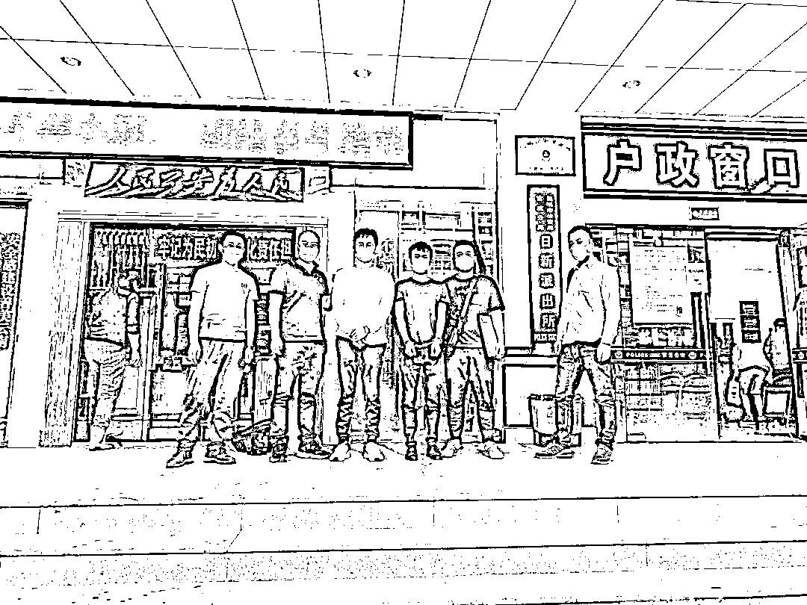
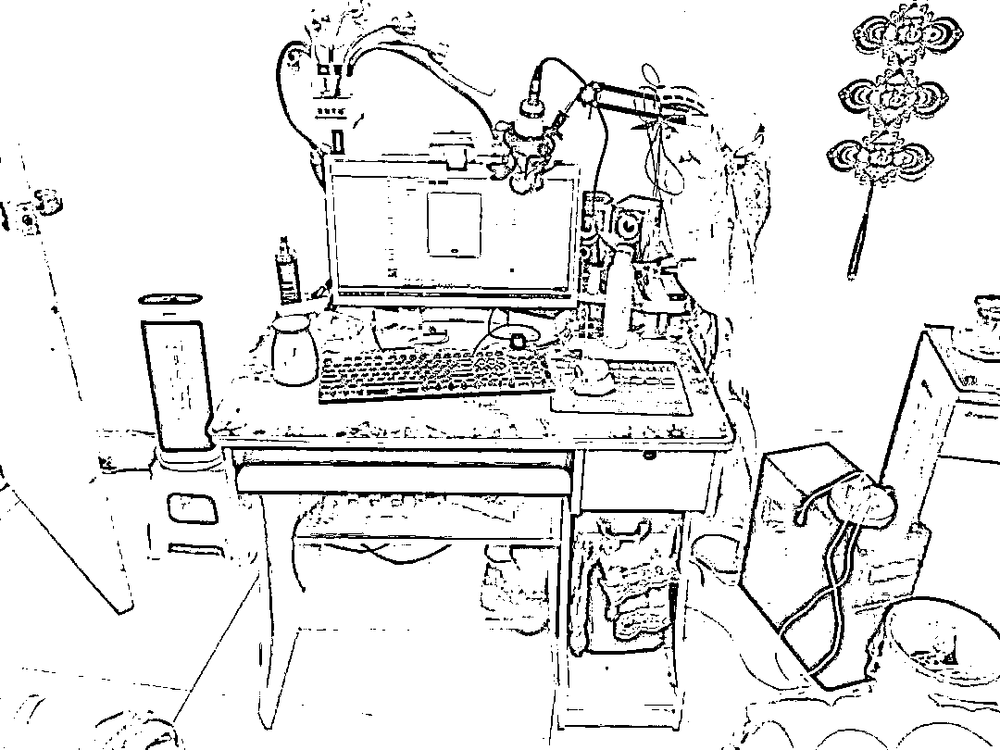
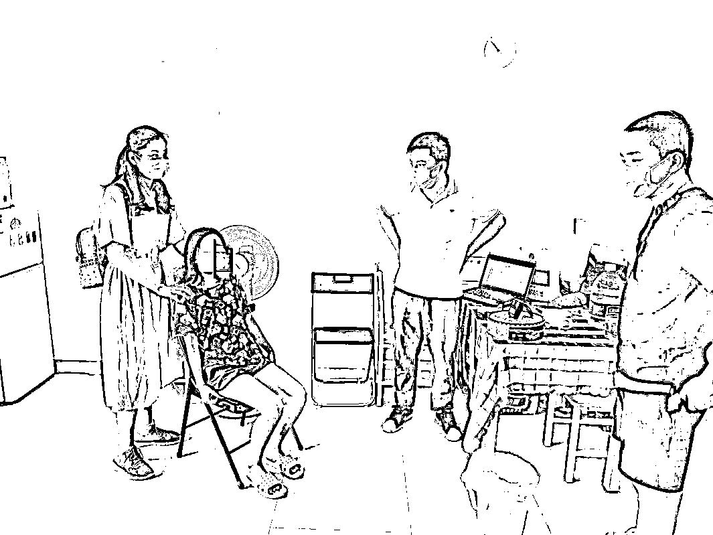
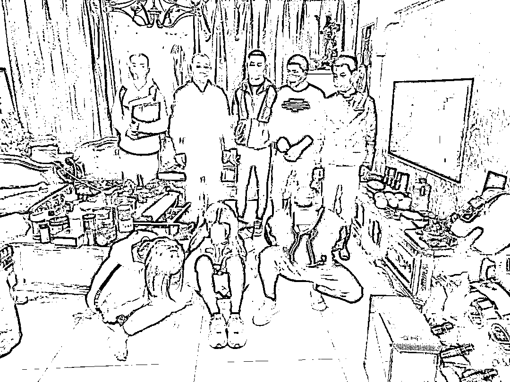
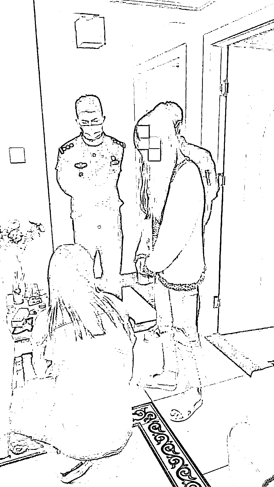
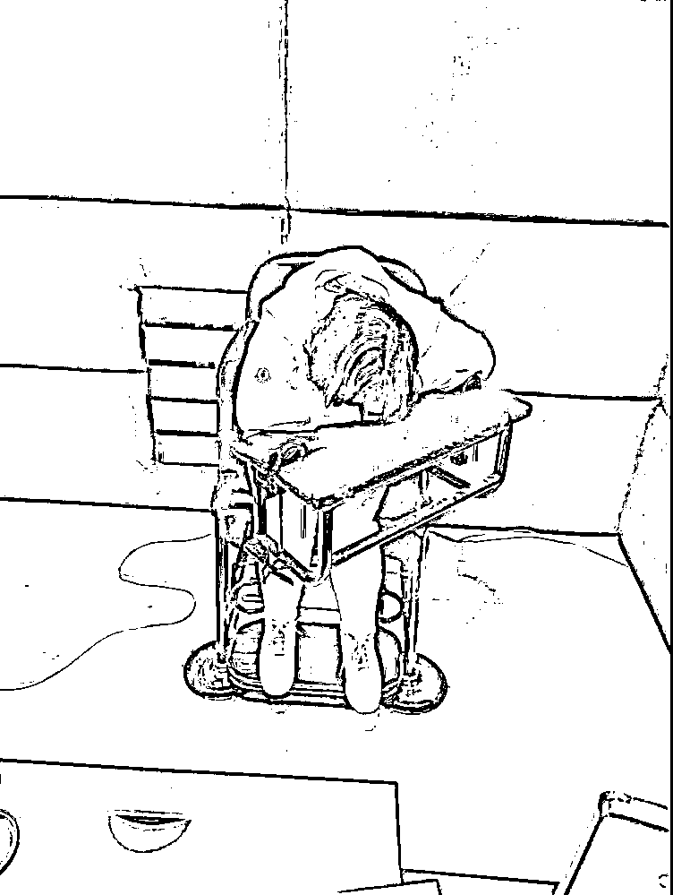
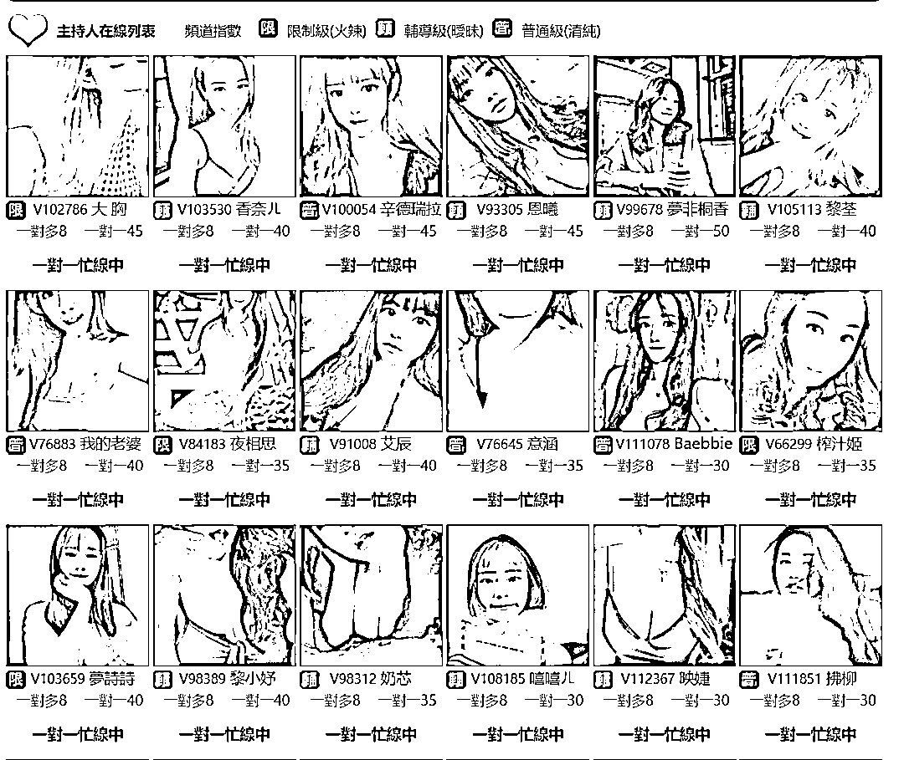
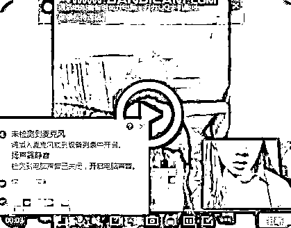
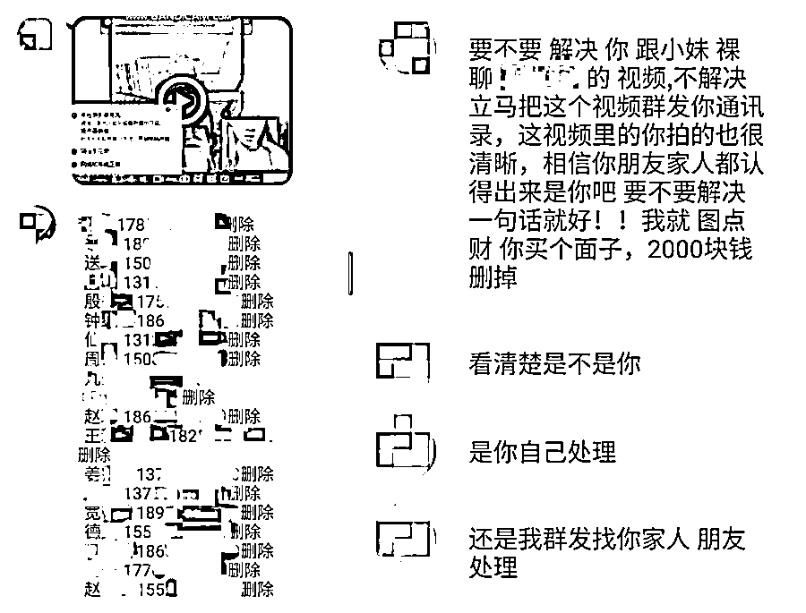

# 内容不堪入目！90 后女主播靠色情表演诈骗上百万！她们竟是这样“引诱”别人来“裸聊”...

> 原文：[`mp.weixin.qq.com/s?__biz=MzIyMDYwMTk0Mw==&mid=2247509673&idx=2&sn=6aed78c9f7c27bde3b2f32529fc847bc&chksm=97cb6d91a0bce4872511f99ff08ccde1763deb202ae0e36535eb23d1a7e593f94ff8fc77d997&scene=27#wechat_redirect`](http://mp.weixin.qq.com/s?__biz=MzIyMDYwMTk0Mw==&mid=2247509673&idx=2&sn=6aed78c9f7c27bde3b2f32529fc847bc&chksm=97cb6d91a0bce4872511f99ff08ccde1763deb202ae0e36535eb23d1a7e593f94ff8fc77d997&scene=27#wechat_redirect)

手机 APP“挂羊头卖狗肉”，表面以唱歌、聊天直播掩人耳目，实则暗藏涉黄网络直播，造成恶劣的社会影响。

## 近日，一特大跨境涉黄直播平台被警方捣毁。

近日，浙江温州苍南警方网安部门根据线索，辗转全国多地深入调查，在上级网安等部门的支持下，经分析研判、扩线深挖，一举捣毁多个涉黄直播平台，抓获境内外涉案人员 34 名，斩断了一条视频直播 APP 传播淫秽物品牟利利益链。 

内容不堪入目

犯罪团伙运营多个涉黄平台

净网 2020 专项行动开展以来，温州网安部门一直瞄准黄赌违法犯罪平台的侦查和打击。年初，苍南网安在日常巡查中发现，某手机直播平台存在大量涉黄、涉低俗内容。 

经初步调查，该 APP 仅少数主播进行唱歌、聊天等正常直播，**绝大部分主播穿着暴露，在大厅直播时使用言语挑逗、露点、艳舞等方式吸引大量游客付费驻足观赏，以此牟取暴利。**

经进一步调查，民警确定该直播平台与境内外多个淫秽网站、直播平台为相同视频源，即游客可在以上 APP 及淫秽网站观看同样的直播内容，且平台方为同一个犯罪团伙。随即，苍南警方成立专案合并立案侦查，对涉案人员、资金链、技术链等全力开展追查。 

涉案女主播 200 余人

头目境外遥控指挥

“我们专案人员分组开展案件侦破工作，有的赴全国多地走访调查，有的就一直盯着电脑分析研判。”经办民警介绍，与传统涉黄犯罪相比，利用网络直播平台传播淫秽具有更大的隐蔽性、欺骗性和社会危害性，侦查打击难度更大。 

功夫不负有心人，在近四个月艰苦调查取证中，专案组逐渐查清了该团伙的组织架构、内部运营模式和主要涉案人员身份。**该团伙由境外幕后老板、境外技术团队、境外运维团队、专业洗钱团队、境内主播、充值代充、家族长、推广营销人员等多个层级组成，组织严密、分工明确。** 

经办民警介绍，为了逃避侦查，位于团伙高层的犯罪嫌疑人作案时均在境外活动，在境内只招募层级较低的平台服务人员及女主播等，通过国内及境外即时聊天工具指挥联系。**仅该直播平台就招募女主播 200 余人，日常在线主播有 50 余名，注册会员超过百万。** 

直播平台 1 年吸金过亿元

警方赴 12 省市抓获 30 余人

4 月 15 日，随着抓捕时机成熟，苍南警方在上级公安机关的协调指挥下，抽调网安大队、安防大队及各派出所等警力 100 余名，赴安徽、山东、黑龙江等 12 个省市开展统一收网行动，抓获女主播、充值代理、家族长、洗钱人员等犯罪嫌疑人 30 余人，查扣资金 500 余万元，查获大量作案手机、电脑。**经调查，仅该直播平台一年来充值金额就达到一亿余元。** 

随后，苍南警方顺藤深挖、连续作战，很快掌握了该平台幕后指挥人员的身份信息及落脚点。4 月 21 日，躲藏在境外的涉黄平台经理杨某、运营主管郑某迫于警方追捕压力回国投案。5 月 13 日，因疫情影响而逗留在深圳的主管范某被警方抓捕归案。自此，该案成功告破。 

女主播多为年轻无业女性

排名第一的累计获利上百万

**“该团伙的主播的构成多采取‘家族’式组织，即由一名家族长以及若干名主播组成。**家族长通过网络招募人员，介绍至平台运营方注册认证成为主播，并提供直播技巧培训等。”经办民警调查发现，家族长名下女主播每日收入提成为 50%-60%，均会通过银行卡转账给家族长，再由家族长向女主播进行结算分成。**这些女主播来自全国各地，多为无业的年轻女性。** 

民警介绍，“游客”通过找官方或者个人代理购买“钻石”，消耗“钻石”进入房间观看色情表演，不少“游客”还会通过购买价格不菲的“火箭”等虚拟礼物打赏女主播以获得青睐。 

福建籍的林某，1991 年出生，是平台“钻石”收入榜单最高者，既是平台家族长也是女主播。据其供述，为引诱 “游客”观看，**她平时会招募一些男性，设置不同的情节与场景，扮演如“夫妻”、“保姆”等不同角色来进行表演，以刺激“游客”竞价打赏。近年来林某已获利上百万元。**“我原来只是一名普通的主播，看到有些人靠这个赚了不少钱，利益熏心下就走上了这条歪路。”在审讯室内，犯罪嫌疑人林某痛哭流涕。 

截至目前，该案共抓获犯罪嫌疑人 34 人，其中 31 人已移送起诉。案件正在进一步侦办中。 

视频聊天

看起来是一件在生活中很平常的事

但他们却利用这种方式坑钱！

下面

我们换个视角

让犯罪嫌疑人来交代

他们是怎么得手的

[`mp.weixin.qq.com/mp/readtemplate?t=pages/video_player_tmpl&action=mpvideo&auto=0&vid=wxv_1409194140029599745`](https://mp.weixin.qq.com/mp/readtemplate?t=pages/video_player_tmpl&action=mpvideo&auto=0&vid=wxv_1409194140029599745)

如何

让受害人一步步进入陷阱？

1 高薪招人

犯罪嫌疑人在越南、柬埔寨等多国设立窝点，以高薪引诱、吸引他人求职并吸纳加入团伙。 

2“公司化”运作

该跨境网络“裸聊”敲诈勒索恶势力犯罪集团实行“公司化”运作，分工明确，流水作业：一线成员负责添加被害人微信聊天，引诱“裸聊”；二线成员负责与被害人进行视频“裸聊”并录制“裸聊”视频图像；三线成员利用“裸聊”视频图像威胁被害人，进行敲诈勒索。 

敲诈勒索所得赃款，一二三线成员分别按级别领取底薪或提成。该恶势力犯罪集团还制定严格的“公司规章”和“奖惩制度”。

3 非法购买大量公民信息

主要犯罪嫌疑人非法购买大量公民个人信息，供团伙成员通过社交网络实施“裸聊”。 

值得注意的是，该恶势力犯罪集团将犯罪对象瞄准为国内的医生、公务员、教师等群体，利用事主顾忌社会影响，威胁恐吓、敲诈勒索钱财。该团伙自 2018 年年初开始疯狂作案，受害者达 200 余名。

2018 年 12 月起，广东深圳市公安局大鹏分局经缜密侦查，先后抓获犯罪嫌疑人 32 名，成功摧毁该犯罪集团，扣押各类银行卡 100 余张，收缴被非法收集的公民隐私信息和图片视频 10 万余份。

目前，该恶势力犯罪集团案已一审判决，主要被告人黄家辉被判处有期徒刑十一年六个月，并处罚金 42 万元。

**骗子手段层出不穷** 

**天上不会掉馅饼！**

很多人反映

主要是前期和“美女”聊天的时候

没有及时发现其中的陷阱

才导致后面被敲诈勒索

揭秘：

网络美女的“引诱”话术

**第一步**

犯罪团伙中的“键盘手”每天会冒充美女到处加好友。他们在聊天中，会把美女塑造成“单纯、热烈、发嗲”的形象，聊了一会就会主动要求“互看”，并抛出一张“可以线下约”的大饼，让人无法抗拒。

**第二步**

犯罪嫌疑人会主动提出“裸玩”的要求，然后让被害人下载某个指定的直播软件，并输入验证码。这个直播软件就是一个远程手机控制的程序，可以盗取被害人的通讯录、短信内容，甚至是手机位置。

**第三步**

犯罪嫌疑人会再三向被害人确认已经下载好直播软件，这样才能控制被害人的手机，也才能在后期以“把视频发给家人”的理由进行威胁。如果有人不懂怎么下载，他们还会一步步指导，直到安装好才会进行下一步。

**第四步**

****

犯罪团伙为了节省成本，不会让真正的美女来聊天，而是向被害人播放一段美女“裸聊”的视频，在视频播放中通过文字来逐步勾引你做出下一步动作。

**第五步**

有的被害人比较警觉，在开始会故意遮挡摄像头，这个时候“美女”就会发嗲，让被害人也打开摄像头，为的是要掌握被害人做不雅行为的视频证据。

**第六步**

遇到那种开了摄像头却坚持不脱衣服的被害人，“美女”会用激将法；如果还不脱，就威胁挂掉不再视频。在软硬兼施之下，被害人就会放弃抵抗，按要求脱掉衣服。

**第七步**

一旦被害人被录了不雅视频，嫌疑人就会立即把读取到的通讯录内容和不雅视频一并发给被害人，并特别交待被害人不能删除好友，这样为下一步持续敲诈做准备。

**第八步**

****

犯罪嫌疑人继续拿被害人家人来进行威胁，并且一再保证只要被害人给了钱就会删除视频。但实际上，如果真的转了第一笔钱，后面还会有各种角色跳出来轮番勒索。

警方提醒

①上网过程中不要乱下载来历不明的软件； 

②万一被敲诈勒索，不要妥协，果断报警；

③坚持文明上网，自觉抵制网络低俗信息。

来源：中国警察网，温州都市报、公安部网安局、浙江网警、南方法治报、反诈骗先锋

← 向右滑动与灰产圈互动交流 →

