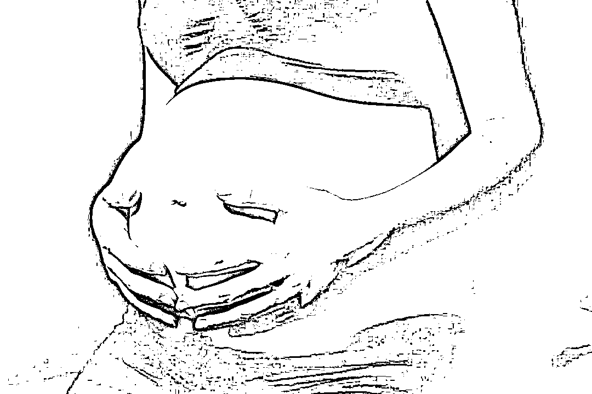
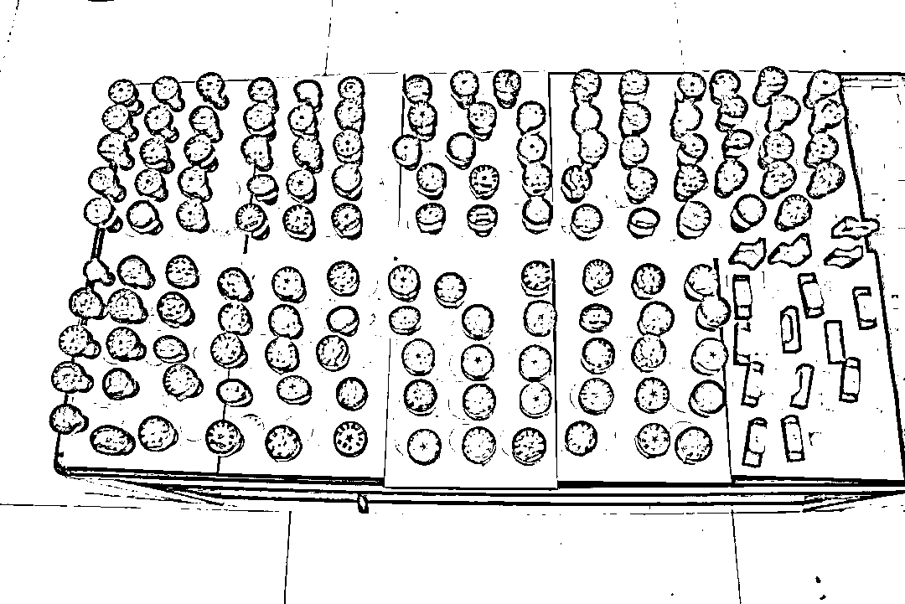

# 编剧都编不出来！一起口罩诈骗牵出“案中案”

> 原文：[`mp.weixin.qq.com/s?__biz=MzIyMDYwMTk0Mw==&mid=2247509673&idx=3&sn=8816a9fa68366517644ce8d563370c2e&chksm=97cb6d91a0bce48733d7c257ef4a670fd2a230869cf9b3fadfcdb920f8f94fd57df4d8379899&scene=27#wechat_redirect`](http://mp.weixin.qq.com/s?__biz=MzIyMDYwMTk0Mw==&mid=2247509673&idx=3&sn=8816a9fa68366517644ce8d563370c2e&chksm=97cb6d91a0bce48733d7c257ef4a670fd2a230869cf9b3fadfcdb920f8f94fd57df4d8379899&scene=27#wechat_redirect)

**为了进一步查明口罩诈骗犯罪事实**

**承办检察官来到公安机关**

**对犯罪嫌疑人林某手机中的**

**聊天记录进行审查**

**没想到****聊天记录中隐藏着另一条犯罪线索**

**利用代孕诈骗他人 300 余万元**

**……**

疫情期间一起看似寻常的口罩诈骗案，却意外牵出一系列连环诈骗案，涉案金额高达 400 余万元。**2020 年 12 月 24 日，经湖南省宁乡市检察院提起公诉，被告人林某被法院以诈骗罪判处有期徒刑十五年，被告人邱某被以伪造事业单位印章罪判处有期徒刑一年六个月，并处罚金。**

**没想到案中有案**

图片来源于网络，与正文无关

2020 年 2 月的一天，宁乡市公安局接到一通报警电话，报案人称自己被人诈骗了口罩款 15 万余元。12 天后，另一通报警电话打来，也称自己被这位微信名为林某的网友诈骗。3 月 8 日，警方正式对林某涉嫌诈骗案立案侦查，并先后在林某家中及存折内搜出 29 万元。原以为这只是一起寻常的口罩诈骗案，没想到，随着侦查的深入，案情的走向远超最初预料。

在审查逮捕期间，犯罪嫌疑人林某拒不认罪，始终否认自己具有非法占有目的，声称自己一直在寻找货源，如果找不到货就会马上退钱，且他在无法履约的情况下，如约退还了部分定金，甚至还曾向被害人交付过 3000 个口罩，这导致认定林某的口罩诈骗事实存在一定困难。林某的主观心态到底是什么？他有没有积极寻找货源？他手中的大额现金究竟来自何处？审查逮捕的期限马上就要到了，案件仍然处于僵局中。

**为了进一步查明本案事实，承办检察官来到公安机关，对犯罪嫌疑人林某手机中的聊天记录进行审查。没想到，在这次取证过程中，得到了另一条线索，犯罪嫌疑人林某可能还存在一笔利用代孕诈骗他人 300 余万元的犯罪事实。**

该线索涉及的犯罪数额特别巨大，林某以代孕为名收取他人 300 余万元，至今未提供任何代孕女及新生儿的详细资料，涉罪可能性极高。但线索目前仍处于初步核查阶段，公安机关目前仅对被害人进行了取证，尚未开展其他侦查工作，相关证据比较薄弱。而林某在本地没有固定居所，如果不尽快查明事实，对林某批准逮捕，那么其隐匿行踪、毁灭证据的风险将极大。

根据被害人的陈述和其提供的相关书证，林某一直声称代孕女在某妇幼保健院就医，并在该院产下了一名婴儿。为了进一步查证林某是否虚构事实，承办检察官第一时间来到该医院进行调查。该医院值班领导得知此事后，马上联系了相关工作人员，并在其办公系统内进行了详细查询，彻底戳破了林某虚构代孕女及新生儿的谎言。

**通过补充侦查，完善了相关证据锁链，成功将林某利用代孕实施诈骗的事实予以认定。2020 年 3 月 22 日，检察机关对其批准逮捕。**

**“代孕女子”实为自己女友**

图片来源于网络，与正文无关“你好，我是冯教授，你说的试管婴儿可以做，但胚胎培养的移植费大概需要 2 万元。”2017 年以来，求子心切的阳某、何某夫妇多次前往某三甲医院进行试管婴儿，就医期间恰巧住在林某所开的家庭旅馆内，从而结识了林某。“林某刚开始比较热心，很关心我们，他说他表妹在该三甲医院上班，能找到人帮我们代孕。”阳某表示。**林某见阳某夫妇一直没能生育成功，趁机称自己在某三甲医院有熟人，且有门路找到年轻女子为其提供代孕服务，只需阳某提供费用，由自己出面找到代孕女子，使用阳某夫妇留在该三甲医院的受精卵进行代孕。**为了进一步骗取阳某夫妇的信任，他让自己的朋友冯某自称是某遗传与生殖专科医院的冯教授，给阳某打电话，谎称可以帮其进行胚胎移植。此外，**他甚至还捏造了一个名为“谢沐阳”的女子，谎称她是自己找到的给阳某夫妇代孕的女子，**还将“谢沐阳”的照片发给了阳某，实际上照片中的女子并非什么“谢沐阳”，而是林某的女朋友胡某。之后，**林某来到医院附近的打印店，要求老板邱某按照自己的要求，制作“谢沐阳”在某妇幼保健院的入院记录和住院预交单，**并在预交单上填写住院金额，加盖由邱某伪造的某妇幼保健院印章。2019 年 2 月 28 日至 10 月 11 日，在林某的指示下，邱某多次将自己店内 B 超单模板上的姓名修改为“谢沐阳”，在 B 超单末尾加上用药建议，并随着时间的推移不断修改胎儿月龄，定期制作不同的 B 超单提供给林某向阳某夫妇行骗。邱某会根据材料是否需要盖章，每次收取十元至数十元不等的费用。林某手头一旦紧张，就以“谢沐阳”要住院、要保胎、要营养费用为由向阳某夫妇伸手要钱，最后还谎称孩子出生了，已按照阳某的意愿给孩子起名，并定期将小孩的照片发给阳某夫妇。**截至案发，阳某夫妇从未在现实中见到过任何代孕女子或新生儿。据林某交代，这些婴儿图片都是自己在网上下载的。**2018 年 10 月以来，林某以代孕为名不断要求阳某转账，前后共收取阳某 380 余万元用于挥霍。据冯某描述，林某爱去夜场，且挥金如土。一晚的花销一般在 1 万元左右，高的时候甚至可以达到四五万元，在夜场消费的总额已近 300 万元，诈骗款早被林某挥霍一空。

**打印店暗藏造假窝点**

该案查获的伪造印章 2020 年 3 月 23 日，公安机关对涉案打印店进行查处。5 月 20 日，邱某被抓获归案。公安机关在邱某经营的打印店里查获了各类印章 149 个，扣押激光刻章机器 1 台，并一举查获了其在某妇幼保健院、某三甲医院附近专门从事虚假印章的造假窝点。“某三甲医院附近的家庭旅馆都知道，这家打印店可以做假证。”邱某经营的这家打印店看上去普普通通，除坐落在医院旁边外，似乎与市内任何一家打印店别无二致，但令人吃惊的是，**这里实际隐藏着一个造假窝点，多年来已然形成了一条灰色产业链。**“三年前我的打印店开到某三甲医院附近的时候，我开始发现有人来我的店里要求修改医院的 B 超单，慢慢地要改的人越来越多。听客人说，他们是为了能做试管婴儿，如果妇女的生殖功能正常，医院是不允许做试管婴儿的，要想做试管婴儿就要改 B 超单，显示不能正常生育。”邱某说。**林某围绕医疗行业精心策划一系列骗局，除以销售防疫物资为名先后骗取童某等三人共计 41.9 万元外，还谎称自己在医院内有关系，先后实施了包括代孕诈骗、门面租赁诈骗在内的两起诈骗案，诈骗金额巨大。**邱某购进激光刻章机器，通过造假满足个人私利。2020 年 10 月 26 日，宁乡市检察院对林某以涉嫌诈骗罪、对邱某以涉嫌伪造事业单位印章罪提起公诉。在庭审过程中，林某和邱某当庭表示认罪认罚，法院遂依法作出前述判决。目前，部分被害人的损失已经追回，两名被告人均未提出上诉。

来源：最高人民检察院，利箭在出击

← 向右滑动与灰产圈互动交流 →

