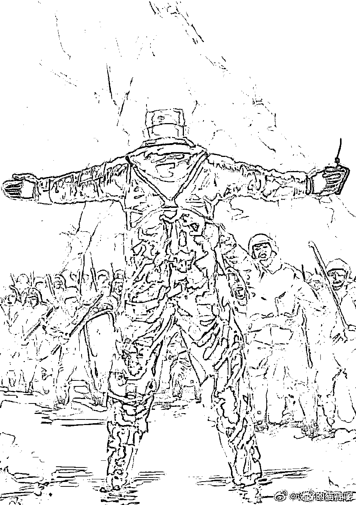
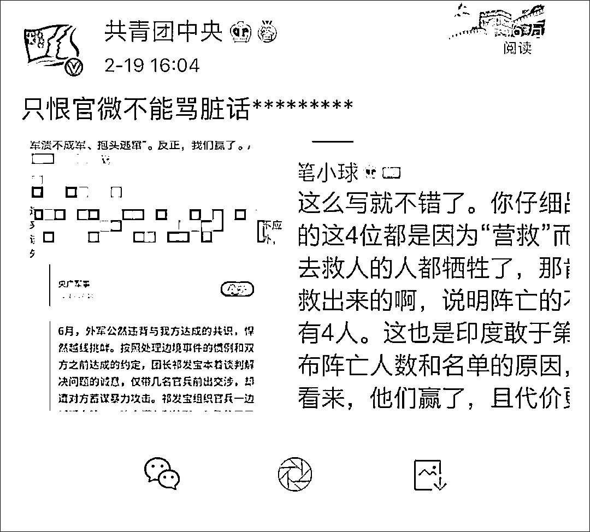
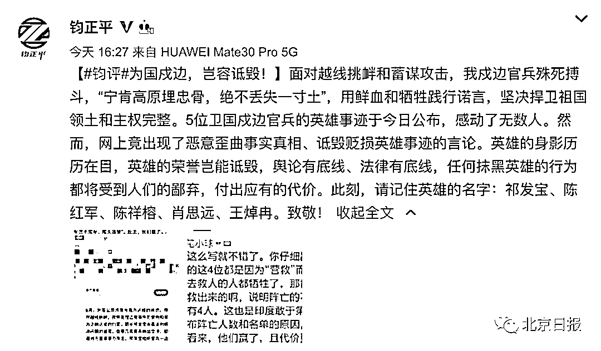
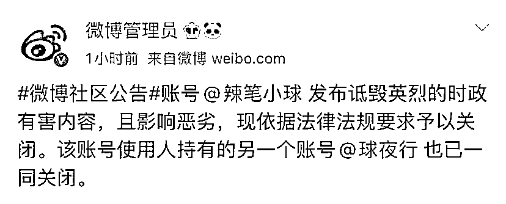
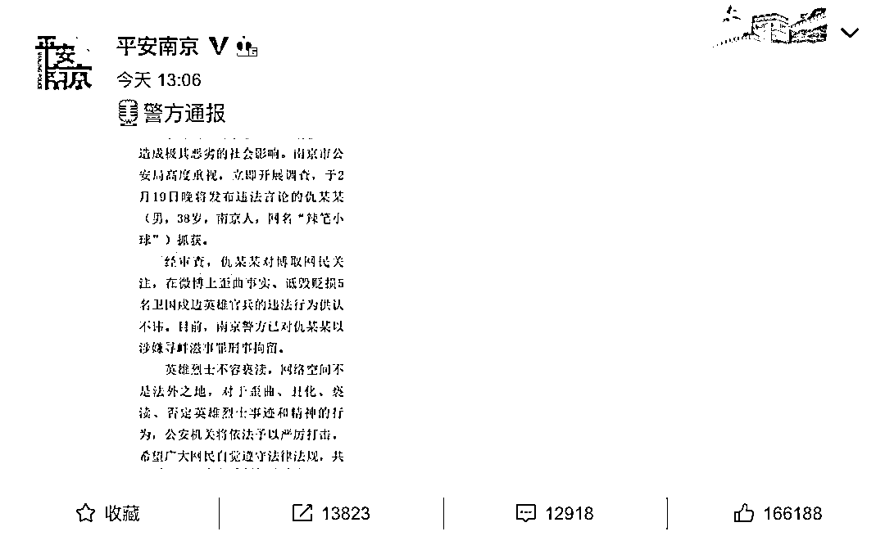
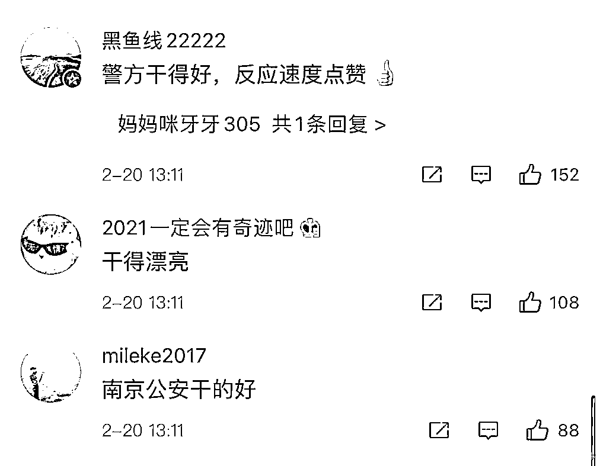
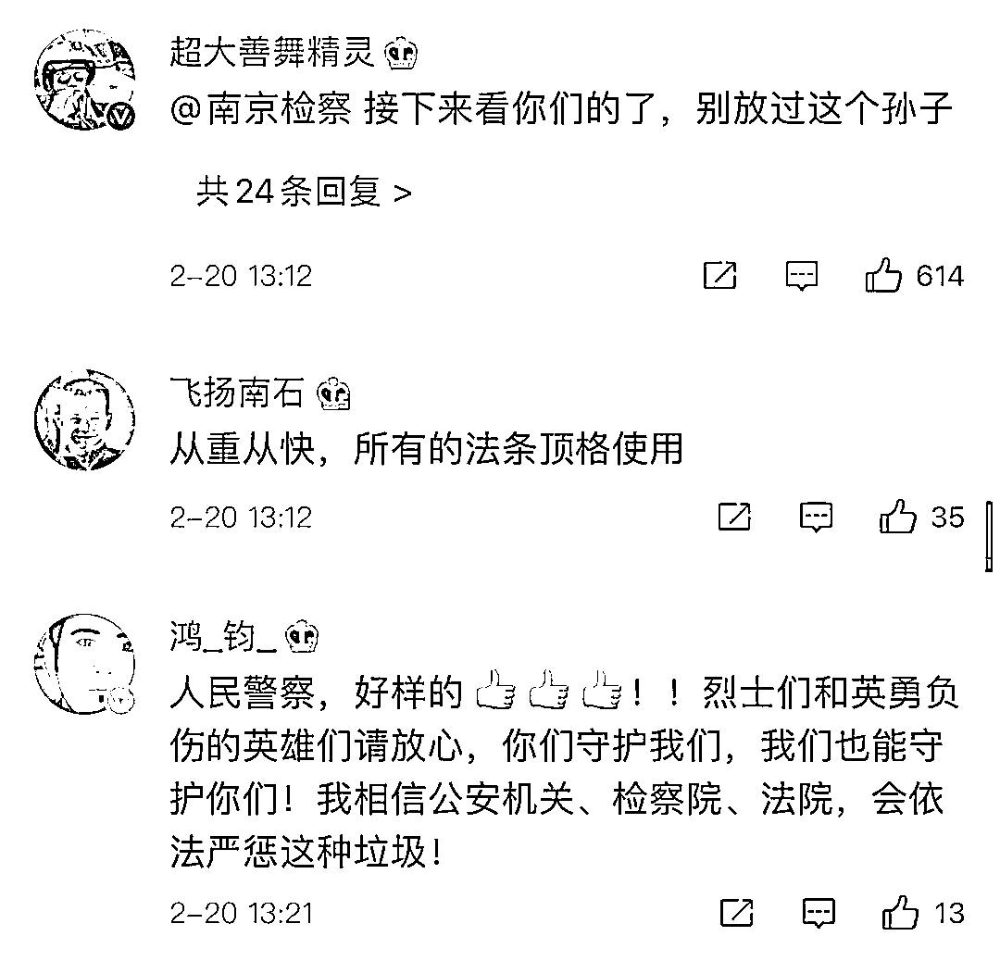
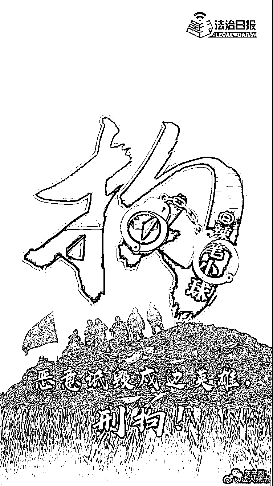

# @辣笔小球：诋毁英雄！封号刑拘！

> 原文：[`mp.weixin.qq.com/s?__biz=MzIyMDYwMTk0Mw==&mid=2247509673&idx=4&sn=96792db5fd937d6311c5227c778a8012&chksm=97cb6d91a0bce487e554d9366b014d7ae357ee5c2687d8294dc94bcd14e4a1539928e46bc54e&scene=27#wechat_redirect`](http://mp.weixin.qq.com/s?__biz=MzIyMDYwMTk0Mw==&mid=2247509673&idx=4&sn=96792db5fd937d6311c5227c778a8012&chksm=97cb6d91a0bce487e554d9366b014d7ae357ee5c2687d8294dc94bcd14e4a1539928e46bc54e&scene=27#wechat_redirect)

近日

5 位卫国戍边官兵的英雄事迹公布

感动了无数人

2020 年 6 月，外军公然违背与我方达成的共识，悍然越线挑衅。

在前出交涉和激烈斗争中，团长祁发宝**身先士卒，身负重伤**；营长陈红军、战士陈祥榕突入重围营救，**奋力反击，英勇牺牲**；战士肖思远，突围后义无反顾返回营救战友，**战斗至生命最后一刻**；战士王焯冉，在渡河前出支援途中，拼力救助被冲散的战友脱险，**自己却淹没在冰河之中。**

中央军委授予祁发宝**“卫国戍边英雄团长”**荣誉称号，追授陈红军**“卫国戍边英雄”**荣誉称号，给陈祥榕、肖思远、王焯冉**追记一等功。**

﹀

然而，**拥有 250 多万粉丝的“金 V”@辣笔小球** 却在个人账号中发表恶意歪曲事实真相、诋毁贬损英雄事迹的言论，引发网友强烈愤慨。

**@共青团中央** 更是直接点名，怒斥：**只恨官微不能骂脏话*******！**

随后，**@钧正****平** 发文评论称，**为国戍边，岂容诋毁！**英雄的身影历历在目，英雄的荣誉岂能诋毁，舆论有底线、法律有底线，任何抹黑英雄的行为都将受到人们的鄙弃，付出应有的代价。

当晚 20 时，**@微博管理员** 发布公告称，账号**@辣笔小球** 发布诋毁英烈的时政有害内容，且影响恶劣，**现依据法律法规要求予以关闭**。该账号使用人持有的另一个账号@球夜行 也已一同关闭。

﹀

与此同时，也有不少网友向公安机关举报，呼吁依法严肃惩处。**@南京网警** 接到群众举报后，迅速展开核查，**立即锁定违法嫌疑人仇某某，并于当晚将其抓捕归案！**

2 月 20 日 13 时许，南京市公安局官方微博**@平安南京** 发布消息称，网民仇某某(男，38 岁，南京人，网名“辣笔小球”)**目前已****因涉嫌寻衅滋事罪被公安机关依法刑事拘****留！**

***警  方  通  报***

**2021 年 2 月 19 日，公安机关接群众举报，网民“辣笔小球“在新浪微博发布**恶意歪曲事实真相、诋毁贬损 5 名卫国戍边英雄官兵的违法言论，造成极其恶劣的社会影响。**南京市公安局高度重视，立即开展调查，**于 2 月 19 日晚将发布违法言论的仇某某**（男，38 岁，南京人，网名“辣笔小球”）**抓获。**** 

**经审查，仇某某对博取网民关注，在微博上歪曲事实、诋毁贬损 5 名卫国戍边英雄官兵的违法行为供认不讳。**目前，南京警方已对仇某某以涉嫌寻衅滋事罪刑事拘留。****

****英雄烈士不容亵渎，网络空间不是法外之地，**对于歪曲、筹划、亵渎、否定英雄烈士事迹和精神的行为，公安机关将依法予以严厉打击，**希望广大网民自觉遵守法律法规，共同营造良好的网络环境。****

**南京市公安局**

**2021 年 2 月 20 日**

****

**通报发布后**

****广大网友纷纷拍手****叫好****

******还有不少网友强烈主张******必须从重处罚，严惩不贷**** ****

****网警说：**** 

**郁达夫曾在纪念鲁迅大会上说，**“一个没有英雄的民族是不幸的，一个有英雄却不知敬重爱惜的民族是无药可救的。”**** **虽然时空流逝已近百年，但这话今天读起来仍发人深省。**发表诋毁英雄言论的人，真是良知泯灭的无可救药之人。******诋毁英雄的大 V 账号“辣笔小球”自以为言论标新立异，**实则逾越道德底线、触犯法律红线。**损害英雄形象、伤害民族情感、毒害爱国之心，情理法皆不容！****英雄是民族的希望，崇尚英雄才能英雄辈出。**诋毁英雄，就是与祖国对立、与人民为敌！****************

**来源：公安部网安局，观察者网，今日头条，平安南京**

****

****

**← 向右滑动与灰产圈互动交流 →**

****