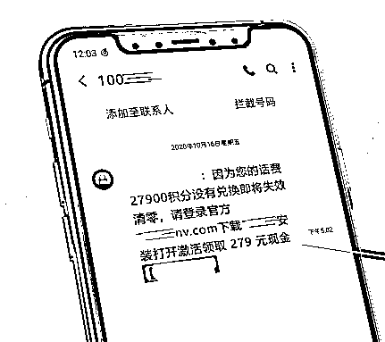
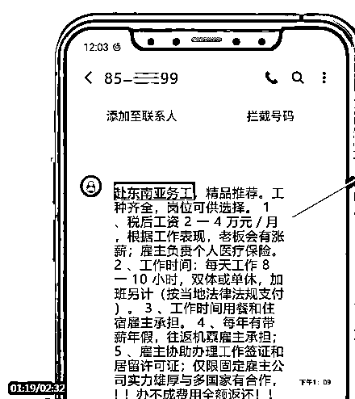

# 骗子演技无下限，各种套路骗你钱之"诈骗短信"

> 原文：[`mp.weixin.qq.com/s?__biz=MzIyMDYwMTk0Mw==&mid=2247509673&idx=5&sn=ceb918208af49dfe0415d8c736bcb94d&chksm=97cb6d91a0bce487ff9c7a1ec477b1a300be8ee9e57822b7feb74a0be0fba22c05f8dae45ef1&scene=27#wechat_redirect`](http://mp.weixin.qq.com/s?__biz=MzIyMDYwMTk0Mw==&mid=2247509673&idx=5&sn=ceb918208af49dfe0415d8c736bcb94d&chksm=97cb6d91a0bce487ff9c7a1ec477b1a300be8ee9e57822b7feb74a0be0fba22c05f8dae45ef1&scene=27#wechat_redirect)

骗子演技无下限

各种套路骗你钱

收到短信需谨慎

天下掉馅饼勿轻信

......

如无法核实对方身份

请勿轻易转账

[`mp.weixin.qq.com/mp/readtemplate?t=pages/video_player_tmpl&action=mpvideo&auto=0&vid=wxv_1717681845732999178`](https://mp.weixin.qq.com/mp/readtemplate?t=pages/video_player_tmpl&action=mpvideo&auto=0&vid=wxv_1717681845732999178)

犯罪手段揭示一冒充校方群发短信，诱导家长点击诈骗链接。

犯罪手段揭示二群发兼职广告，实为“刷单诈骗”。

犯罪手段揭示三 冒充航空公司群发航班延误短信通知，实施“航班改签诈骗”。

犯罪手段揭示四骗子以“工商登记”“房产登记”等需要更新、升级为由，发送诈骗链接，诱导填写资料实施诈骗。

犯罪手段揭示五冒充相关部门声称有项目可做请求引荐，收短信的人轻信后引荐给自己的熟人，无形中为骗子背书，造成熟人被骗。犯罪手段揭示六诈骗分子冒充房东群发短信诈骗。犯罪手段揭示七犯罪分子通过“伪基站”伪装成客服电话群发积分兑换的短信进行诈骗。

犯罪手段揭示八诈骗分子群发赌博、彩票短信，诱导受害人下载 app 实施诈骗。

犯罪手段揭示九诈骗分子以介绍出国务工为由诱骗受害人出国从事电信诈骗、赌博等违法犯罪活动。

犯罪手段揭示十虚假中奖诈骗，目的为骗取受害人信息或各类领奖手续费。

犯罪手段揭示十一骗子通过伪基站冒充领导群发短信要求转款，因手机号码显示与领导手机号码一模一样，迷惑性较强。但凡要求转账的，一定通过见面、通话等多渠道核实。

**警方提醒：**

*   伪基站可以冒充各类特殊号码或者受害人亲友号码发送短信，因此，涉及钱财务必通过电话、见面等来核实。

*   勿轻易点击短信中的链接，以免中木马病毒或被各类虚假网站骗取个人敏感信息。

*   错别字、异体字较多的短信，都是为了逃避相关部门的封堵，背后涉嫌各类违法犯罪活动。

来源：长沙警事，利箭在行动

← 向右滑动与灰产圈互动交流 →

