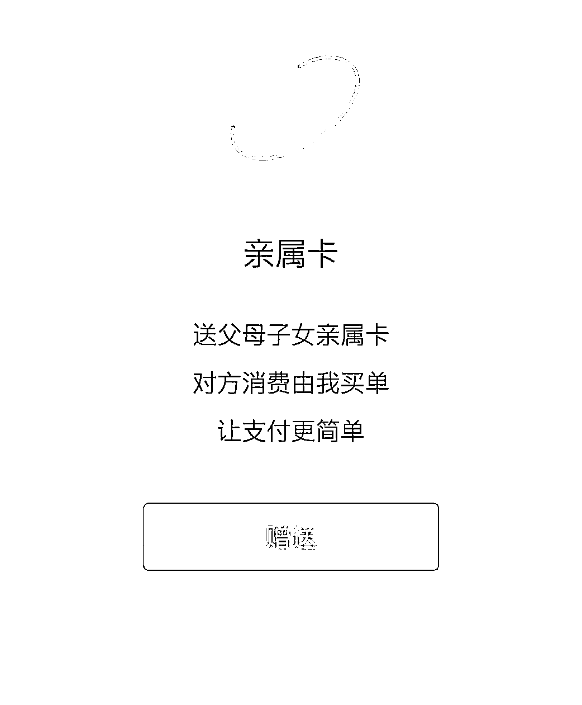
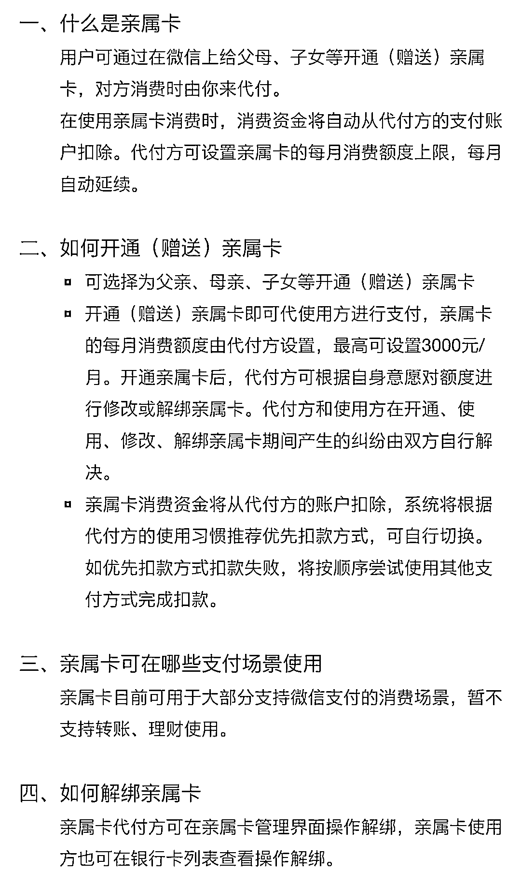
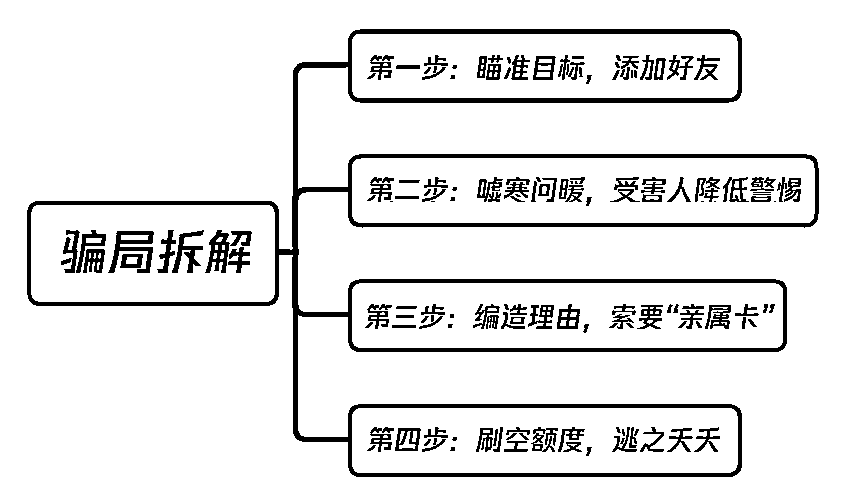

# 热恋!小伙给她绑定亲属卡，女友的操作很虐心！

> 原文：[`mp.weixin.qq.com/s?__biz=MzIyMDYwMTk0Mw==&mid=2247509673&idx=6&sn=af5057837a36364b0a5e883ee3fb0638&chksm=97cb6d91a0bce4873f9acefbf1a8ff99da0c511401c3935b98543bbe0afcb8814080a1a33948&scene=27#wechat_redirect`](http://mp.weixin.qq.com/s?__biz=MzIyMDYwMTk0Mw==&mid=2247509673&idx=6&sn=af5057837a36364b0a5e883ee3fb0638&chksm=97cb6d91a0bce4873f9acefbf1a8ff99da0c511401c3935b98543bbe0afcb8814080a1a33948&scene=27#wechat_redirect)

“情人节不知道送女友啥，不如送一张亲属卡”

“一键轻松帮心爱的她代付”

“对方消费我买单，支付变得更轻松”

“额度限制，即绑即用，随时解绑，超方便!”

……

真的是这样吗?

**小心你的“亲属卡”被骗子盯上!**

网恋女友索要“亲属卡”

小伙给了，账户瞬间消失一万多

1 月 16 日，市民刘先生报警称自己微信里一万余元被无缘无故转走了，这究竟是怎么回事儿?

1 月 3 日 20 时 30 分，刘先生通过微信添加了一个昵称叫做“恰如其分”的姑娘，之后便开始和对方聊天。

半小时后，两人聊得火热，这个姑娘提出要和刘先生处对象。真是天上掉下来个林妹妹，刘先生愉快地同意了。

1 月 13 日，这个新女友向刘先生提出绑定微信“亲属卡”的要求，因为对亲属卡并不是很了解，听对方说这种卡有额度限制，而且即绑即用，可以随时解绑，陷入热恋的刘先生就和对方绑定了**“亲属卡”**。

让刘先生万万没想到的是，当天对方就将自己在微信上的**11213 元**人民币转走了。自己被骗了!刘先生反应过来，随即报了警。

你以为她要的是一份保障

其实她要的就是你的钱

一旦将“亲属卡”赠送给骗子

骗子就会立刻扫描事先准备好的**“收款码”**

将钱款套现并将受害人拉黑

此时

就算当事人反应过来将**“亲属卡”**解除绑定

也无济于事

啥是微信“亲属卡”?

微信“亲属卡”是微信自带的代付功能，用户可在微信里赠送“亲属卡”给父母、子女作消费使用，一共可以开 4 张亲属卡。**点开“我-支付-钱包-亲属卡”就能赠卡给亲属。**

代付方通过设置“亲属卡”的每月消费额度上限，将额度控制在 0.01 到 3000 元之间，每月自动延续，当父母、子女使用“亲属卡”消费时，消费资金将自动从代付方的支付账户扣除。

微信“亲属卡”跟绑定银行卡的权限不一样，它只能用于日常消费，不能用于转账和提现。当领卡方使用亲属卡消费时，只需输入自己账户的支付密码，选择“亲属卡”支付的方式，即可完成一笔消费。

当亲属卡开通后，若想停止使用这项功能，代付方可在亲属卡管理界面操作解绑，亲属卡使用方也可在银行卡列表查看操作解绑。

正是因为这种表达爱的便捷支付方式

一些不法分子将罪恶的黑手伸向了“亲属卡”

对你套近乎、嘘寒问暖

专骗不了解**“亲属卡”**的小伙伴们!

便捷的“亲属卡”如何变成犯罪的“工具”?

1、假装熟人、亲戚添加微信好友。

2、套路满满地嘘寒问暖，通过平常聊天让受害人感觉到骗子的善意。

3、当受害人没有了提防心，时机成熟后，骗子莫名送一张“亲属卡”给受骗者，然后迅速和受骗者发信息索要同等金额的亲属卡或转账金额。

4、然而，骗子赠送的这张“亲属卡”虽标有额度但并不能完成支付。

**注意!**

**下面问题来了**

**骗子以什么理由来要回亲属卡的?**

“亲！我想给家人亲属卡，不小心发给你了，现在亲人在外面等着结账，非常着急，帮我退回来吧。”**（感情招牌）**

当被害人用骗子给的“亲属卡”消费时，会发现这张卡无法使用，骗子便以“需要互相赠送相同额度才能激活”为由，让被害人回送骗子一张同等额度的“亲属卡”。**（利用对软件功能的不熟悉忽悠你！）**

**反诈民警提醒：**

微信推出**“亲属卡”**功能本来是出于便捷支付的目的，但绑定“亲属卡”就等同于默认对方从自己的微信中或绑定的银行卡中自动扣费。所以，**不要随意赠送自己的“亲属卡”！**

如何防范电信网络诈骗？

**谨记“三不一多”原则****:**

未知链接**不**点击

陌生来电**不**轻信

个人信息**不**透露

转账汇款**多**核实

**** **遇到电信网络诈骗怎么办？******

**1、准确记录骗子的账号、账户名称，第一时间拨打邯郸市反电信网络诈骗中心报警电话 110 或 0310-3110110/4067110。**

**2、请保存聊天记录和转账记录等相关证据，及时到属地派出所或刑警队报案。**

**3、如果不慎点击“木马病毒”链接造成资金损失的，需将手机进行刷机操作，同时将手机绑定的银行卡第三方支付密码进行更改。**

****打击治理防范****

****电信网络****新型违法犯罪活动****

****我们一直在行动！****

**来源：昆明市反电信网络诈骗中心**

********

**← 向右滑动与灰产圈互动交流 →**

****