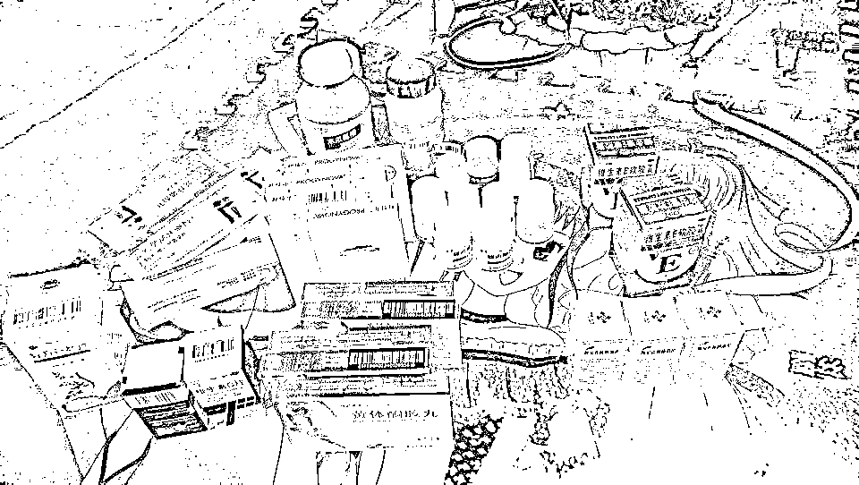
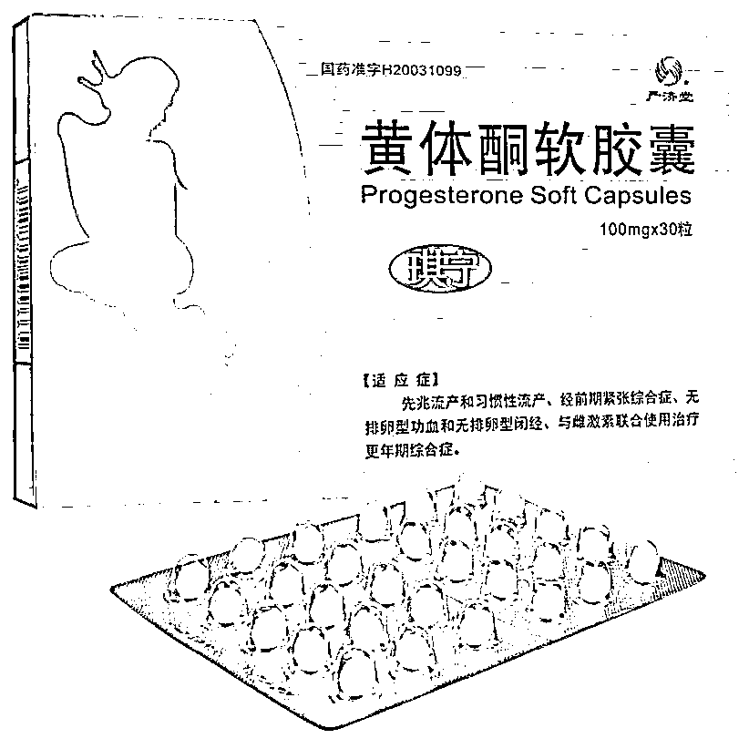
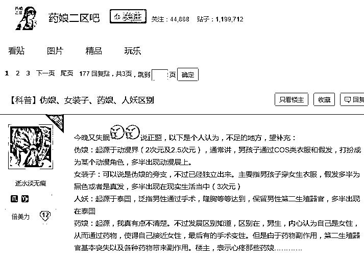
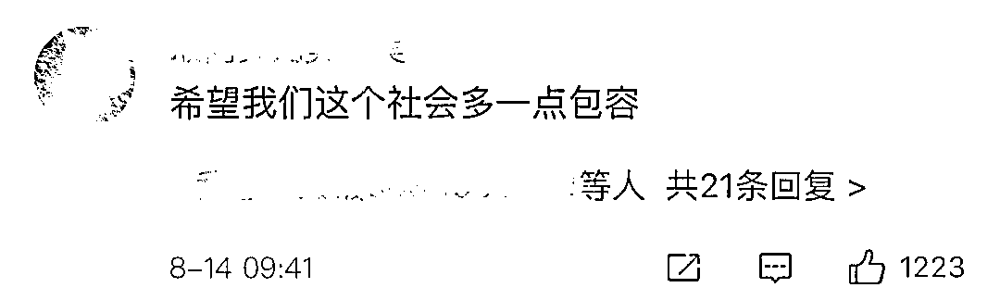

# 激素变性、自我阉割，药娘的喜悲没人看见...

> 原文：[`mp.weixin.qq.com/s?__biz=MzIyMDYwMTk0Mw==&mid=2247509739&idx=1&sn=42475603cc54dd46777fa0ef62a30772&chksm=97cb6dd3a0bce4c529768b23b0f1964a20c7a00f5b174db26875de70d6b1d66a4a1d534db555&scene=27#wechat_redirect`](http://mp.weixin.qq.com/s?__biz=MzIyMDYwMTk0Mw==&mid=2247509739&idx=1&sn=42475603cc54dd46777fa0ef62a30772&chksm=97cb6dd3a0bce4c529768b23b0f1964a20c7a00f5b174db26875de70d6b1d66a4a1d534db555&scene=27#wechat_redirect)

药娘是谁？这是一个群体，通俗来讲，就是吃药来让自己“变娘”的男人们。他们生理性别一般为男，心理性别为女。中国的药娘，多数藏在不为人知的社会夹缝里，离每个人的生活很远又很近。**跨性别者**药娘是国内的网络用语，专指通过服用或注射药物等手段，抑制身体男性化，使其生理状态（主要为体貌特征）更趋女性化的男性或双性别者，通常属于跨性别群体（LGBTQ 中的 T）的一个分支。 他们一般被称为性别认同障碍，或许是因为家庭环境，或许是因为校园暴力，或许只是简单地认为，自己本就该是女生。 性别认同障碍，又称性别改变症、易性症、变性欲。是指一个人的性别自觉与其生理性别完全相反，极想改变其性别。目前原因不明。性染色体和性征没有找到异常，也未发现确切的遗传证据。一些学者认为是胚胎发育时激素不协调的影响所致。另一些则认为是后天幼年性指定和习得行为，家庭环境或养育上的问题。 美国精神病学会在 2013 年 5 月出版了《精神疾病诊断与统计手册》第 5 版(DSM-5)。 DSM-5 去除“性别认同障碍”诊断名称，也就是认为，性别认同的差异不再视为一种障碍或疾病，性别差异认同的“去病化”，也让多元的性别认同“正常化”。对于跨性别者的处理，常从心理、激素和手术三个方面入手。而药娘，顾名思义，是需要吃药，也就是服用激素。 **“吃糖”**我们知道，女性的第二性特征都拜雌激素所赐，进入青春期有了月经之后，随着排卵的出现，雌激素才出现，所以才有女大十八变一说。比如柔美的嗓音，饱满的胸臀，娇嫩的皮肤，细小的毛孔等等。而男人吃了雌激素，也会拥有这些第二性特征……药娘通常是已经决心要变性了，在变性手术前这段时间，使用激素来诱使身体发生转变，药娘圈管这叫“吃糖”。在药娘圈子的交流过程中，大家默契地用“糖”指代“药”。作为约定俗成的规律，很难弄明白“糖”在最开始是以爱称的身份出现，还是单纯地作为圈子行话，方便隐藏秘密。可以肯定的是，小朋友一定不会喜欢这些糖，因为这些“糖”除了口味很怪之外，还会产生一定的副作用，比如恶心、乏力、想吐......不过这也是药娘们在不敢贸然做手术与迫切希望完成性别转换之间作出的妥协，有少数药娘迫于各方压力终生服药不手术。药娘通常服用的药物有三大类别，分别是抗雄激素药物，雌激素，以及孕激素。在吃“糖”之后，药娘的身体会发生明显的生理变化：乳房发育、胸部出现硬核；性欲和勃起功能下降、睾丸尺寸缩小；与肌肉质量相比较，身体脂肪的百分比较为增加；体毛长速变慢，臀部变大；体重以及体能（力量、耐力等）均是大幅下降。也曾有人在论坛中发过帖子，记录自己一年中吃药的经历。药娘群体日渐活跃，但药娘圈内常出现乱吃药、用药过度等问题，可谓是“以身试药”。要知道，长期错误得服用激素，除了恶心、头痛、无力、嗜睡等副作用，这些激素类药物会引起抑郁、狂躁。在生理上，可能出现高钾血症、心血管意外和栓塞等，对肝和肾的功能都有影响，且药效不可逆。事实上，这类激素类药物对身体伤害之大已经到了不可能被忽视的程度，可就算如此为什么药娘依然会如此选择？答案只有一个，就是性别认知障碍带来的痛苦远大于服用药物。许多药娘的终极目标是性转，在进行手术之前，他们只会像渐近线一样持续女性化。也就是说，与遥远梦想相对应的是，药娘没有康复一说，药不会停，伤害也不会停。**“买糖”**上述的这些“糖”，无一例外的，都是处方药，一般渠道下是无法购买的。而又要隐藏身份去购买，那么也只有那么仅仅几种的购买渠道“线下购买”、“熟人”、“电商黑市”。“线下购买”容易暴露身份，而“线上熟人”的话往往风险很高，一不小心就会上当受骗。对于这些有利可图的商人们来说，在电商黑市中仿佛看到了希望，通过乔装打扮的店铺来为“药娘”们进行售卖。“秋名源”就是其中做得较好的一家，药娘圈子开玩笑称其为“药娘领袖”。从表面来看只是一个简单的盆栽店，但其实背后是有着相应的交易暗语的。但是药三分毒，长期服用药物的“药娘”们，身体产生的副作用也是无法避免的。对于决心想要变身的“药娘”来说，往往这些副作用也在坚持之中忍受了过去。而这，也仅仅是他们悲惨生活的一点。对于这些处方药物和以后的手术来说，费用的花销也往往是一大笔数字。在生活的逼迫下，他们会想尽一切办法赚钱。对于这群大多数以未成年人为主的药娘来说，药娘未成年的身份让资本很难榨干他们的价值，只有铤而走险的黑中介才敢浑水摸鱼。他们认为药娘最值钱的，就是身份和身体。药娘圈子和二次元圈子在 COSPLAY 领域相交，有的药娘会兜售自己的 COSPLAY 照，胆子大一点的，会放一些更大尺度的照片。 在国内很难看到“药娘”援交的信息，但在推特上，这样的谋生手段比比皆是。一次线下的钱色交易，少说可以换来六七百元，足够买好 5 盒土耳其色谱龙，按每天 50mg 来算，可以吃 300 天。为了打针，为了吃药，为了做手术，在生活的压迫下，更在被外人当变态，亲人又反对，买药吃药都没保障，吃完了还副作用一大堆的情况下，大部分药娘活得很糟心，甚至自己都怀疑自己。可以说药娘这一生的经历是异常的坎坷和艰难。药娘选择以吃药的方式与身体进行斗争，然而他们需要斗争的，又何止是身体而已。许多药娘偷偷吃药，为的就是最终走到变性手术那一步。但 2009 年国家卫计委办公厅颁发的《变性手术技术管理规范（试行）》中规定：**变性手术除了需要有精神科医师开具的易性癖病诊断证明，还需要一个已告知其直系亲属拟行变性手术的相关证明。**这意味着国内的药娘必须先取得家人的同意，但很多父母对于这一突如其来的状况根本难以接受。对于药娘们来说，陌生人无法理解，亲人强烈反对，这种情况导致心理产生的负能量非常多，许多药娘都患有抑郁症，甚至一直有求死念头。随着药娘圈逐渐低龄化、无序化、半公开化，药娘圈里的很多人都是涉世未深的青少年，青春期本身就非常不稳定，容易受到各种观念的影响。在没有真正对自己内心想法有所确定的时候，盲目行事，很可能造成不可挽回的遗憾，甚至走向极端。仅有部分药娘会在后期实施变性手术。有一些药娘实在等不下去了，不惜“自我阉割”。然而，大血管一旦不小心破裂，结果是致命的。我们可以试着去体会那些药娘们的无力感和挫败感，但必须指出，在没有专业医师指导下随意吃药和自切睾丸都是非常危险的行为，是不理性的做法。**抱团取暖**相较于被更多人所认知和理解的同性恋群体，药娘这一群体隐秘和边缘得多，她们在大众视野的边缘处生存与抗争，找寻着一抹亮光。之前，在百度贴吧里搜索“药娘”两个字，会出现一个发帖数接近两百万的“药娘吧”，里面有近十万人保持常年活跃，已经形成了一个突出的亚文化领域。在贴吧的置顶帖里，用红字标注出来的是：【科普】伪娘、女装子、药娘、人妖区别这些药娘在生活里往往困在不被大多数人理解的孤独环境里，网络社交给他们打开了找到同类人群的便捷渠道。这个近十万人活跃于其中的贴吧还只是冰山一隅，但外界对这个群体却往往鲜有耳闻。除去贴吧，药娘较为集中的平台还包括 QQ 群、微信群、新浪微博和部分独立网站，这些社区的共同点是经常被查封。2014 年左右，百度贴吧掀起扫黄大潮，诱导未成年人“吃糖”的药娘吧，被冠上色情敏感的名头率先沦陷。从最早的“药娘吧”到“第三类天使吧”，再到“天使的花园吧”，其实贴吧官方已经封禁了 5 个比较大的药娘社区了。组织被打散，他们只能躲在一个个 QQ 群里，扎根在互联网隐秘的角落。遇到不顺心的时候，药娘们会相互鼓励：“笑着接纳自己”、“要坚强”、“加油”、“佩服你的勇敢”、“愿世界温柔待你”。面对一些年龄尚小，正准备进入圈子的准药娘，多数老人会劝他们想好各方面的问题，当然，他们说的最多的是“遇到困难随时可以找我私聊”。这样的和谐在此起彼伏的杂音中显得珍贵，药娘的喜悲没人看见，只有他们自己知道，一群用药物满足心理需求的人，在孤独中抱团取暖......“我们不是怪物，只是想做回真正的自己”，这是每位药娘的心声，事实上，我们看到，许多网友表达了自己理解、认同的声音——一位来自四川的药娘的母亲显得平静一些，她觉得儿子即使一辈子一个人过也没什么：“大不了妈陪你一辈子”。唯一的遗憾是自己可能没有机会抱上孙子了。原生性别本来就不是我们能够选择的，大部分药娘都是为了使自己成为应该属于的那个性别。**如果非要说的话，那这一定是上帝在安放灵魂的时候出了错吧......**来源：网络

← 向右滑动与灰产圈互动交流 →

