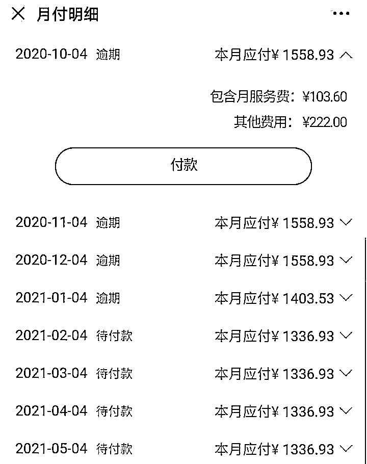

# “为了当网红，我贷款交了 19800 元的合伙费！”

> 原文：[`mp.weixin.qq.com/s?__biz=MzIyMDYwMTk0Mw==&mid=2247509739&idx=2&sn=7cb0919a3dfc59ff9a1bda86630b64e9&chksm=97cb6dd3a0bce4c5b9acc26977879cbfc718c69699f9c318de23791f359b2aeb0acb708efea0&scene=27#wechat_redirect`](http://mp.weixin.qq.com/s?__biz=MzIyMDYwMTk0Mw==&mid=2247509739&idx=2&sn=7cb0919a3dfc59ff9a1bda86630b64e9&chksm=97cb6dd3a0bce4c5b9acc26977879cbfc718c69699f9c318de23791f359b2aeb0acb708efea0&scene=27#wechat_redirect)

每年年后

都是换工作、跳槽的高峰

这转眼间又到了求职黄金季

最近有打算换工作的小伙伴吗？

相信大家找工作

都有一个共同的目的：**挣钱**

不过，最近却有求职者

入职之后不仅没有拿到工资

## 反而**背上数万元贷款**

到底怎么回事？

我们一起来看看

打着 “招舞蹈老师”的幌子

套路求职者落入贷款陷阱

前段时间，深圳龙岗女孩小陈（化名）在网上求职。 一间舞蹈工作室的前台岗位引起了她的注意。只要热爱运动，积极上进，就可以拿到 6000 元的月薪。 

（嫌疑人在某求职平台上发布的招聘广告）

老板亲自面试，毫不掩饰对小陈的赏识，**“五官、体态都不错，做前台可惜了……”** “前台工资低，如果你来学舞蹈，不仅可以转做舞蹈老师，一旦经过包装，还有机会网红出道。”

小陈没想到机遇来的这么突然

最重要的是

舞蹈学徒每月还有 2500 的底薪

三天试用期，小陈不仅刻苦练舞，每天一早还要来工作室打扫卫生，晚上更要上街为工作室发放传单。小陈咬牙坚持，“想做偶像练习生，吃点苦总是难免的”。

****

**（舞蹈工作室组织学员练舞）**

 签约当天，公司为小陈规划了诸多美好的职业前景。店长更是亲切地接过小陈的手机和身份证，替她办理入职。

但接下来的几天**，隔三差五就有学员堵在公司门口要求退钱。** 小陈突然想起签过的合同，还有办完入职后，**手机上莫名其妙多出来的贷款 APP。** 细看合同才发现，里面竟然约定了**19800 元的“合伙费”**，再看贷款 APP 也刚好多了 19800 元的放款记录。

现在回想，应该就是签合同那天，店长说要查询入职人员的征信，拿走自己的手机申请的网贷。

****

**（受害人被忽悠签下的合同）**

而且根据合约，舞蹈学徒每月要做到 5000 元的拉客户业绩，才能领取那 2500 元的底薪， 慌乱之中，小陈找公司讨要说法。

**公司解释说——**

这 19800 元是包装艺人的费用，以个人贷款的形式挂靠在公司，而贷款将由公司偿还。

小陈越想越不对劲，要求解除合约，但公司表示退钱没可能，除非小陈自己找个人来转让合同。

****

**（受害人与嫌疑人聊天记录）**

 又过了一段时间，小陈收到短信，**显示自己的贷款已经逾期 4 期未偿还**。

（受害人在贷款平台已逾期还款 4 期）

原来从合同签订之日起，贷款就已经开始计息，而公司一分钱也没有还过。若自己不还款，不良征信将会记在自己名下。 

**（受害人手机上的部分催款信息）**

无奈之下

小陈向警方报警

套路曝光

校长店长双双被刑拘

经调查

警方逐步摸清了该骗局的套路

** 1、暗度陈仓**

在网络招聘平台招聘前台岗位，吸引初入社会的女孩面试。 再以“学舞蹈当老师、量身打造网红”为名，诱骗签下合约。

** 2、瞒天过海**

忽悠签定合同，但绝口不提“包装费”等事项。借故办理入职，拿走女孩的手机和证件操作网贷。

**3、无中生有**

假称“贷款由公司偿还”，稳住女孩情绪。贷款是本人手机操作，合同是自愿签名，即便事后对峙，也有理说不清。

**4、以逸待劳**

公司收了钱拿着“合约”有恃无恐。再以长时间高强度的工作逼迫女孩主动离职。 女孩们背井离乡又没了工作，往往不了了之。 

随后，**该舞蹈工作室校长林某（男，25 岁）、店长李某（女，25 岁）被龙岗警方依法刑事拘留。**目前，已核实受害人十余名。

更讽刺的是，**所谓的校长林某只有小学文化，而且和店长李某一样，没有过任何舞蹈表演或教学经历。**

近年来

此类求职骗局时有发生

受害者众多

过往案例

**我们一起来看看这些案例**

**两周岗前培训变两年期培训贷**

**一男子背上 2 万多元贷款**

2020 年，刚毕业的郭安（化名），11 月，其应聘广州亿铭天纵传媒有限公司直播助理岗位，面试时约定进行两周岗前培训，底薪 6000 元。但郭安在"公司诱导"**下加入了为期 1 年的培训项目，并背上 2 万多元的培训贷，**同时，保底薪资也变成了培训完成后重新考核。

与郭安一同遭遇此事的，还有 13 位求职者。他们表示，入职至今没有任何收入，而每个月都需要还培训贷款。

女生应聘会所技师要求先整形

被骗 3 万多

2020 年 11 月 17 日，罗湖公安分局翠竹派出所接到一宗报警。

事主陈小姐称，自己在“58 同城”上找工作，看到一则招收酒店会所技师的广告，对方告知自己，**月收入可以达到 6 万元人民币至 15 万元人民币不等**。见面后，对方告知陈小姐，自己的个人形象不符招聘标准，**可以到整容医院先整容微调，**并且手术很快，术后恢复一周就可上班。随后，陈小姐**在网上贷款用来支付微整形费用。**

几日后，该公司客服经理通过微信通知陈小姐，**其没有被录用。**陈小姐怀疑被骗，赶紧报警，共被骗**34200 元。**

最近现在

各地陆续迎来求职旺季

今年找工作，这些陷阱必须警惕

**陷阱一：借招聘骗取个人信息**

现在有很多贩卖个人信息的中介公司，从求职者递交的海量简历中，精准获得求职者的个人信息。

**如何避免：**求职者看到招聘信息时，一定要查询该公司相关信息，判断公司的真实性。同时，专家建议，简历上的部分个人信息如身份证号、家庭住址、通讯地址等，不用写得过于具体，重点放在工作经历上。

**陷阱二：收取报名费、体检费、培训费等费用**

求职面试后，招工者以服装费、体检费、培训费、保险费、押金、手续费等名义向应聘者收取钱款。应聘者交费后，招工者要么迅速脱身，要么找借口不给安排工作，钱财积累到一定阶段便人去楼空。

**如何避免：**一般除了事业单位的考试公招之外，面试招聘单位是不需要报名费的。而体检通常都是到二甲以上的医院自行体检以及缴费。

**陷阱三：扣留个人重要证件**

一些企业在面试中以单位需要审核等理由要求应聘者递交身份证、学位证、毕业证等重要证件，并声称暂时由单位保管。

**如何避免：**不管是身份证，还是学位证、毕业证，单位都是没有任何权利扣留的。去面试的时候，特别是初次面试，最好只带上证件的复印件，正规企业是没有必保留求职者原件的。

**陷阱四：只“试用”不聘用**

有的单位为了降低用人成本，在公司业务特别繁忙的时候大量招聘员工。等试用期结束，便以各种理由不通过试用或解聘。有些单位，在实习试用期间，不仅不支付任何薪资，甚至要求交培训费。

**如何避免：**按照规定，任何单位和企业的实习试用员工，公司都应对其支付薪资，劳动者在试用期的工资不得低于本单位同岗位最低档工资或者劳动合同约定工资的百分之八十。

**陷阱五：受骗进入传销组织**

传销公司一般先安排面试者以销售人员的名义上岗工作，然后公司让他们交纳一定的提货款，再让他们去哄骗他人。

**如何避免：**传销通常具有以下特征中的一个或几个：在“入会”时告诉你的职责之一是发展更多的人；交纳昂贵的会费；在工作场所很多人情绪激昂。如果识别出为传销组织，应立即采取适当方式终止打工，及时报警。

**陷阱六：海量网络求职广告，让你收入轻松过万**

现在，很多人都会注意到网络上有各种招聘信息广告，在取得联系后，对方发来工作申请表和工作流程介绍，工作可能是买充值点卡刷信誉，信誉值达到某个标准，即可返还现金，另有佣金提成。实际情况是求职者大额支付后，佣金和本金不会到账。

**如何避免：**求职者要学会分辨网站的安全性，分辨招聘信息和招聘公司的真实性。在网上求职，一定要去正规大型网站，这类网站的信服度更高，其中选择招聘企业官网核实是最好的。

最后，反诈民警提醒大家

**这种听了就会动心的“高薪”招聘**

**一定要多留个心眼**

**千万别上当**

来源：南方都市报、深圳龙岗公安、余杭公安、深圳大事件

← 向右滑动与灰产圈互动交流 →

