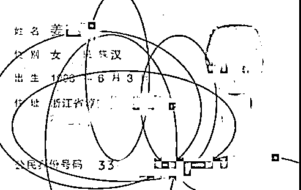

# “每次她叫我哥哥，我就转账了”

> 原文：[`mp.weixin.qq.com/s?__biz=MzIyMDYwMTk0Mw==&mid=2247509739&idx=3&sn=0dcf03f30f3831b5cf16374c662a4066&chksm=97cb6dd3a0bce4c53493bd9f60bcd91a3d298fc14f7f5591a6a5a98b5874737c6e18420c7cbb&scene=27#wechat_redirect`](http://mp.weixin.qq.com/s?__biz=MzIyMDYwMTk0Mw==&mid=2247509739&idx=3&sn=0dcf03f30f3831b5cf16374c662a4066&chksm=97cb6dd3a0bce4c53493bd9f60bcd91a3d298fc14f7f5591a6a5a98b5874737c6e18420c7cbb&scene=27#wechat_redirect)

“每次‘她’一叫我哥哥，
我就稀里糊涂转账了……” 

短短 3 个月时间

小李已多次转账给“网恋女友”

共计 35 万余元。

其实他不知道的是，

他深爱的“瑶瑶”不仅年龄说谎，

连性别都是假的！

一声声“哥哥”下的陷阱小李今年 21 岁，家住江苏省南京市，去年 9 月 26 日，他在某网络论坛上认识了一女子，对方自称叫“姜瑶旺”。双方添加微信后，“瑶瑶”还发来了自己动人可爱的自拍照，加上两人聊得又十分投机，久而久之就确定了交往关系。但小李并没想到，此时一张“大网”也正在向他铺开…… ▍对方发来“照片”在一起后不久，女友“瑶瑶”就跟小李提出自己要还信用卡，希望小李能够借她点钱，并答应之后会和他见面，小李没多想，便把钱打了过去。在交往期间，对方又以“父亲住院，急需救命钱做心脏搭桥手术”、“网贷遭遇黑社会”、“跑网约车赚钱需要押金”、“租网约车出车祸”……各种天花乱坠的理由向小李索要钱财，看着“女友”着急的样子，小李是既无奈又心疼，早已陷入爱河的他每次都有求必应，第一时间通过支付宝、微信给其转账。 ▍对方称“父亲急需救命钱做手术”期间，小李也要求过“女友”进行视频语音通话，可对方每次都以“家中有事”、“在医院没时间”等借口推辞，小李也只好作罢。 ▍对方称“网贷遭遇黑社会讨债”
虚假的承诺

为了让小李心甘情愿掏钱，对方经常作出**“马上就到你的城市嫁给你”、“我会以身相许来感谢你”**的承诺来安抚小李，还发来了自己的身份证，称后续会还钱，而小李就在这样的蛊惑下，越陷越深……

 ▍“女友”为安抚小李给出的“承诺”从去年 9 月底至今年 1 月初，两人的聊天对话内容多达 1 万 7 千多条，60%的聊天内容都是“瑶瑶”以各种理由问小李要钱。短短 3 个月时间，小李已经陆续转账给对方 42 笔，共计 35 万余元。 ▍对方发来的虚假身份证一人假扮多角到了后期，小李意识到欠款太多，开始催女友还钱，“瑶瑶”便将自己“母亲”的微信推给小李，称母亲会为自己还钱，而那个所谓的“瑶瑶母亲”也以各种理由向小李索要钱财。最终，在网贷 APP 借款到期，信用卡即将逾期等多重精神压力下，小李终于支撑不住，也起了疑心，向警方报案。1 月 18 日，小李约“瑶瑶”在杭州某酒店见面约谈，并提前报警，然而到了约定地点，映入眼帘的却是一位青年男子，该男子自称是“网约车的租车中介”，也是需要“瑶瑶”还钱，被她约到此地谈还钱的事。出警民警将男子带回所内询问，发现该男子姜某（31 岁 浙江杭州人）实则就是小李微信上女友的“姜瑶旺”。 ▍嫌疑人姜某承认自己的违法行为在审讯中，姜某承认自己从网上找了些美女的照片，假扮“姜瑶旺”、“姜瑶旺母亲”等多个身份骗取小李信任，并多次让小李转账，所骗得的钱财都已被他挥霍一空。这次来约定地点见面是怕事情败露，想以“网约车中介”的身份再欺骗小李为网恋女友还钱，但没想到小李已经提前报警。目前，犯罪嫌疑人姜某已被萧山警方依法刑事拘留，案件正在进一步侦办中，等待他的将是法律的严惩。**警方提醒：************1、****网络交友要谨慎****，网上信息真假难辨，****在无法甄别对方真实身份的情况下，不可轻信其甜言蜜语和各种说辞。************2、不要轻易添加陌生人 QQ、微信，****凡是涉及转账汇款都要提高警惕****，保持理性，避免因一时冲动而造成经济损失。************3、****一旦发觉遭遇诈骗，应当妥善保存转账凭据、聊天记录等证据****，及时拨打 110 报警或 0571-96110 杭州反欺诈中心止损。************还是那句老话，************你以为的清纯美女，************很可能是个“抠脚大汉”！************网恋有风险，交友需谨慎！**********来源：萧山公安、都市快报、红网********************

****← 向右滑动与灰产圈互动交流 →****

********