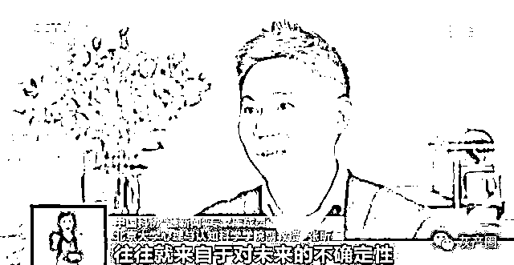

# 塔罗牌占卜骗局曝光：赚钱多少靠“忽悠”程度！

> 原文：[`mp.weixin.qq.com/s?__biz=MzIyMDYwMTk0Mw==&mid=2247509739&idx=4&sn=41961775a0ab9c5cfe66fc59d2676d67&chksm=97cb6dd3a0bce4c50ea17093d91366030f26a4ade3c01ae8a544c23d30e04e38a2b85e9fa640&scene=27#wechat_redirect`](http://mp.weixin.qq.com/s?__biz=MzIyMDYwMTk0Mw==&mid=2247509739&idx=4&sn=41961775a0ab9c5cfe66fc59d2676d67&chksm=97cb6dd3a0bce4c50ea17093d91366030f26a4ade3c01ae8a544c23d30e04e38a2b85e9fa640&scene=27#wechat_redirect)

时下“塔罗牌占卜”十分火爆。一些商家还开了实体店，线上线下互动。记者发现，不少所谓的“大师”，其实素质很低，他们靠花式营销牟取暴利。有些售价上万元的佛牌，其实是镀金材质，成本最多几百元，卖多少钱全看“忽悠”能力。这些迷信，谁信谁上当！

对此，有网友表示“千万别信”、”“自己的命运掌握在自己手中”......

网络占卜是“算命”还是“算钱”？

近年来，一些社交网络和视频平台上充斥着花样繁多的网络占卜：有中式周易、八字，西式塔罗牌、星盘以及高科技赋能的人脸识别相面等。尽管披上高科技外衣，占卜仍然是无本买卖。然而，无论是哪种形式的算命，其实都是在迎合消费者的一些心理需求。一个不小心，消费者就容易掉入这个“神秘的陷阱”。

**测运势测姻缘网络占卜花费几何？**

登录某短视频平台，以“占卜”为关键词进行搜索。结果显示，综合排名第一的是一条用塔罗牌预测未来情感走势的短视频，一共收获了 31.5 万个点赞，6.3 万条评论，还有 2.2 万个转发。

继续随机查询另外一个用塔罗牌测姻缘的短视频账号，该账号发布的其他短视频还包括帮你预测何时能升职加薪，以及预测来年运势如何等，每一条都关注度颇高。但是想占卜，要先掏钱。

比如预测来年运势，需要支付 348 元。而当记者表达出想发财的意愿后，视频发布者称这需要购买“招财黄水晶”，价格 368 元，并直接发给了记者收款二维码。

收费环环相扣慢慢掏空你的钱包

随机点开一个名为“AI 手相面相分析”的微信公众号，按照提示提交了一份面部完整无遮挡、五官清晰无眼镜的照片，开始体验所谓的人工智能“相面”。

类似于普通的人脸识别，仅用不到 30 秒钟，页面就显示“报告已生成”。但想要获取，需要支付 9.9 元。

而这只是付款的第一步，这份报告中还包含很多单项报告。

想要获取“鼻相解析”报告，需支付 2.9 元；

获取“事业运程报告”，需支付 19.8 元；

想要获取“情感运程报告”，需支付 19.8 元。

“AI 手相面相分析”账号 运营者：面相是 9.9 元，之后很多人都会测第二次或者第三次，最高一个人可以测 60 多元。

记者：一天能测多少？

“AI 手相面相分析”账号 运营者：一天好几千人。我们一天差不多有五六千的收入。

账户资料显示，截至记者调查当天，该账号已注册运营 15 个月。

其页面数据显示，仅所谓的“事业运程报告”就有 12301 人购买，按单价 19.8 元计算，该项收入超过 24 万元。

而所谓的“情感运程报告”则有 18532 人购买，收入超过 36 万元。

另外，想要获取这些分项报告，前提是花 9.9 元购买所谓的总体“面相报告”，累计计算，该账号的收入又要增加少则 12 万元，多则 18 万元。

仅此三项，该账号 15 个月的收入就多达近 80 万元。

不满足于“算命”钱拉“合伙人”继续吸金

除此之外，此类网络占卜账号还通过招代理继续敛财。

“AI 手相面相分析”账号 运营者：我们给你开通合伙人权限。你拉一个人进来测，我们就给你分钱，最高我们可以给你 90%的分成。

想要获得更高比例的提成，就要从“普通会员”升级为“高级代理”，或者是“合伙人”，相应需要缴纳 99 元或 199 元的“升级费”，这部分钱也是此类网络占卜账号的主要收入来源。

值得警惕的是，该类账号所发布的如《旺夫命和克夫命的面相辨别》等营销文章，大多套用所谓女德和宿命论等内容，充满对女性的偏见与贬损。而账号运营者表示，这样的营销文章，其实由专门的写手负责制作。

记者：公众号里的那些，都是自己编的是吗？

“AI 手相面相分析”账号 运营者：对，我们这边有专门的人写，就是自己在网上找了一些类似的东西。

记者：编得越像样就越能赚钱是吗？

“AI 手相面相分析”账号 运营者：对，还有就是曝光量。看的人越多，操作测试的人越多，就越赚钱。

当记者第二天查看时，发现该账号已被封号。

微信相关负责人表示，对于此类违规账号，微信一直在通过机器识别和人工审核相结合的方式打击和发现，发现一个就会封一个。

“算命”并无科学依据

为何依旧有人乐此不疲？

北京大学心理与认知科学学院副教授张昕表示，无论哪种形式的算命，都是为了满足算命者的一些心理需求。

北京大学心理与认知科学学院副教授 张昕：心理学当中有概念叫掌控感，是对于不确定性的一个规避。我们的很多情感或者生活压力，就来自于对未来的不确定性。

另外，心理学上的“巴纳姆效应”，也常常被算命者利用。

北京大学心理与认知科学学院副教授 张昕：他可能就是给你一个很模棱两可的答案，但这个答案却让你最容易对号入座，所以能让你觉得可信。

从几张塔罗牌

到人脸识别、AI 看相

网络占卜者

碰瓷儿高科技、钻研心理学

……

你想算命

而他们想算的却是你的钱

来源：映象网

← 向右滑动与灰产圈互动交流 →

