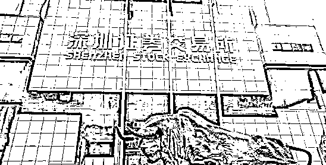
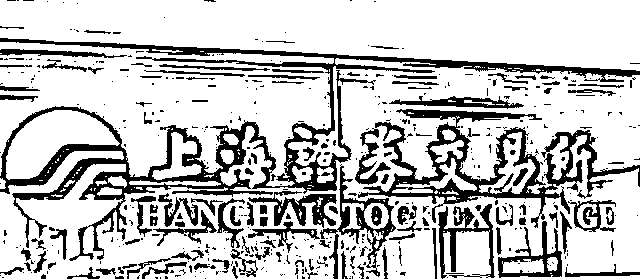
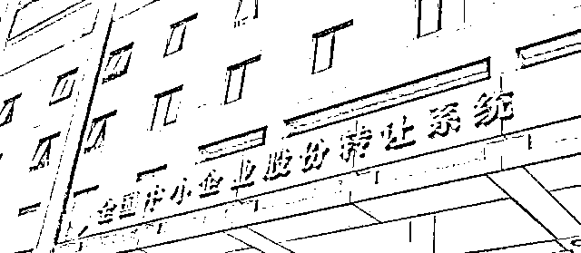
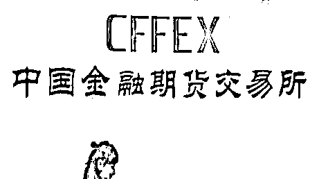
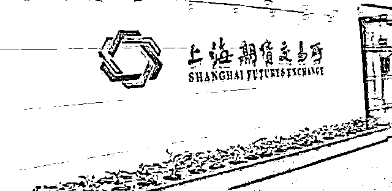
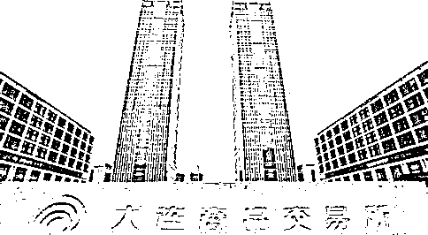
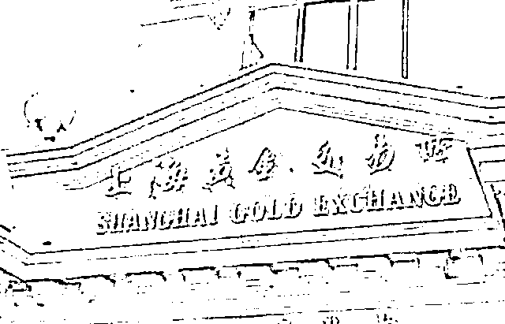
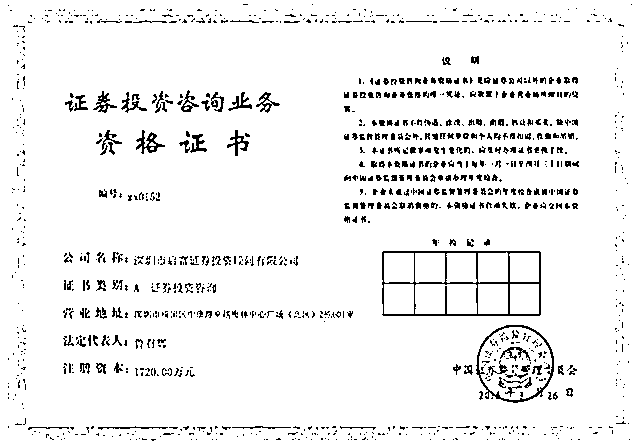
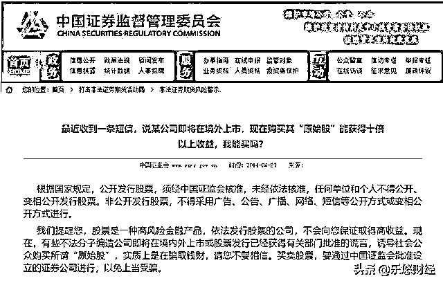
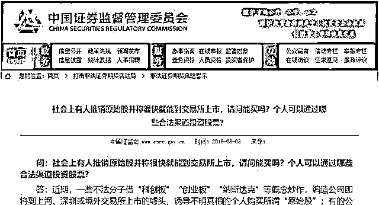

# 原始股骗局：国家只批了 8 家，剩下的都是骗子

> 原文：[`mp.weixin.qq.com/s?__biz=MzIyMDYwMTk0Mw==&mid=2247509739&idx=6&sn=60eacd8ed201165e21e4aca9e53e2734&chksm=97cb6dd3a0bce4c5cdd262fc2a9d8a42424cd13f4779fd87355174880f78419bf84c870a4716&scene=27#wechat_redirect`](http://mp.weixin.qq.com/s?__biz=MzIyMDYwMTk0Mw==&mid=2247509739&idx=6&sn=60eacd8ed201165e21e4aca9e53e2734&chksm=97cb6dd3a0bce4c5cdd262fc2a9d8a42424cd13f4779fd87355174880f78419bf84c870a4716&scene=27#wechat_redirect)

现在骗子太多了，稍不注意，就有可能被骗去几年的辛苦钱。特别是在投资市场，人人都想投资赚钱，却不知道盯着想赚钱的人的骗子更多！**贵金属、证券、期货等各种交易，都只能在八家交易所内进行！**地方交易所十分容易踩雷，最好就是不要参与！文内介绍了重点的相关骗局，请投资人一定要小心。

**全国性的交易所一共 8 个，3 个证券 4 个期货 1 个贵金属**。全是国务院批准，可以放心交易的，因为出了问题，有国家兜底。

其他全是不正规平台，不是和客户对赌，就是黑平台，或是个模拟交易系统，你的钱完全没有进入到交易平台里面去，所以赶快告诉身边的朋友，除这几大平台外，其他的交易产品和平台都不要碰。

**全国性的交易所一共 8 个!  **

其它的一律**不参与，不交易**，切记!!

八家全国性交易所

1**深圳证券交易所：股票交易**

2**上海证券交易所：股票交易**

3**全国中小企业股份转让系统：股转平台、新三板**

4**中国金融期货交易所：金融期货**

  

5**上海期货交易所：商品期货交易**

  

6**大连商品交易所：商品期货交易**

  

7**郑州商品交易所：商品期货交易**

  

8**上海黄金交易所：黄金交易**

  

对荐股机构要擦亮眼睛！

市场稍微红火了点，打着内幕消息旗号，在微博、微信上荐股的“大师”、“股神”们就活泛起来了。近日，中国证监会发布风险警示称，近期，证监会发现市场上通过微信荐股的活动呈增长态势，影响也越来越大。

如自称“XX 投资”的机构，通过微信朋友圈，在每天上午开市前和中午休市期间发布信息，宣称拟拉抬某股票，投资者向该机构缴纳一定费用后，可通过微信或者电话提前得知买卖该只股票的信息。投资者缴纳的费用，从 15800 元到 58800 元不等。

诈骗者一般先是从合法的证券咨询公司的网站获得推荐的 10 只股票，然后他们分别给 1000 人打电话，每 100 人推荐一只股票，那么根据涨跌的概率来说，有 500 人得到的荐股会出现上涨；第二天他们再给昨天上涨的这 500 人打电话荐股，依然是每 50 人推荐一只股票，还是根据概率大约有 250 人得到的股票是上涨的；第三天，他们再给这上涨的 250 人打电话荐股，以此类推……诈骗公司一开始肯定是不收费的，可是如果股民连续接到三四次电话推荐的股票都上涨，又有谁会不动心呢？当股民主动给他们打电话的时候，也就是他们上当受骗的开始。

股民如果想和专业机构合作，一定要找正规的证券投资顾问公司合作，**所谓正规的证券投资顾问机构，只有一个标准，那就是其拥有中国证监会批准的****《证券投资咨询业务资格证书》**，有证书的机构是证监会核准的合法合规的证券咨询机构，一般实力雄厚，服务专业，现在国内这种机构不多，多数集中在北京、上海、深圳三市，在中国证监会网站及中国证券业协会网站均可以查到完整的名单。

**大家记住了，和证券顾问机构合作，首先向它要这个证书**，如果没有这个证书，你就别听他吹的天花乱坠了，默默走开吧，这个机构本身就属于非法经营，老板及高层管理人员将来都是要坐大牢的，如果你给它交了费用，到时哭都来不及！凡是没有证券投资咨询业务资格证书的荐股机构都是大骗子！

新三板原始股？骗子！

“原始股”骗局隔几年就热一次，现在又是高峰期。

最近一次就是前几天，天津的舅舅知道我是搞理财的，所以向我咨询一件事。他说，“一个朋友的朋友是给上市公司做评估的，他们的一个客户正筹划上‘战略新兴板’，现在有上市前最后一次融资的需求，可以便宜的买到原始股。”然后他发给的一大堆资料，公司评估、尽职调查、战略新兴板的背景等等。

我一看就笑了，我对他说，“啥都不用看，**你们查查‘战略新兴板’的最新的新闻就全明白了。”事实上，刚结束不久的两会期间，“战略新兴板”已经从十三五规划中删除了，也就是说在 2020 年之前是明确没有此事的！**未来有没有也不清楚！所以，现在如果还有人讲“战略新兴板”股票的故事，那只能是骗局，而且很不专业的骗局。

**同时还要强调，上面说所的买卖“原始股”的行为都是不受法律保护的。**公开销售“原始股”，即使你花钱买到所谓原始股，也属于私下转让，并不受法律保护，也就是说你花钱买到的所谓“股权凭证”就是一张废纸。

所以，一般老百姓就别做原始股的美梦了，除非你以创业者的身份一开始就参与公司筹建，公司做大了，你的原始股也值钱了。而一个公司马上要上市了，然后原始股落到你头上了——做梦吧你！

原油贵金属期货交易，骗子遍地

**从事原油、现货原油交易的平台需要商务部批文，但商务部从未批准任何一家交易平台从事原油、成品油交易。**据中国证监会相关公布信息，目前我国只有 4 家期货交易所，分别是上海期货交易所、郑州期货交易所、大连期货交易所和中国金融期货交易所。而**这些交易所主要经营业务中也没有“原油”这一项。**

据中国证监会网站介绍，当前非法期货活动主要有以下三类表现形式：

一、非法组织期货交易。非法期货交易场所通常以**现货白银等热门投资产品和大宗农产品现货交易**为诱饵，面向社会公众开展业务。

二、非法经营期货业务。未经中国证监会批准，非法设立期货公司及其他期货经营机构经营期货业务。

三、利用期货对敲非法侵占他人资产。不法分子多以代客理财、期货配资等为名，以高额回报、虚假融资诱饵，骗取投资者的信任代为操作账户或资金，然后利用期货市场远期不活跃合约对敲交易转移窃取委托人资金。

同时，网站强调，**非法期货交易同样不受法律保护，亏掉的本金极难追回。**

邮币卡，微交易、二元期权诈骗

互联网上出现了很多二元期权网站平台，这些平台打着“交易简单、便捷、回报快”等口号，利用互联网招揽投资者参与二元期权交易。

经了解，这些网络平台交易的二元期权是从境外博彩业演变而来，其交易对象为未来某段时间外汇、股票等品种的价格走势，交易双方为网络平台与投资者，交易价格与收益事前确定，其实质是创造风险供投资者进行投机，不具备规避价格风险、服务实体经济的功能，与我会监管的期权及金融衍生品交易有着本质区别，其交易行为类似于赌博。目前，已有地方公安机关以诈骗罪对二元期权网络平台进行立案查处。

**微信目前正在全面封杀这种二元期权交易。**

诈骗四大假，注意了！

1  张冠李戴的假信托

要么是在公司名字中加入信托字样误导投资者；要么盗用信托公司之名发布虚假产品。

谨记，全国只有 68 家信托公司；正规信托公司推出的产品，可以通过信托公司官方网站或客户服务热线查询；信托都是百万起投的。

2  假民营银行

谎称已获得或正在申办民营银行牌照，虚构民营银行的名义发售原始股或吸收存款。现在，民营银行只有 5 家，其他都是假的。包括微众银行（腾讯）、华瑞银行（均瑶集团）、金城银行（正泰集团）、温商银行（天津华北集团）、网商银行（阿里巴巴）

3  假基金

设计虚假的基金网站，随后在网络广泛张贴广告信息，承诺高回报，最后跑路。投资者在网络购买基金时，一定要到基金公司官网、银行官网以及正规的第三方基金销售公司。

4  假券商

使用虚假身份冒充国内知名证券公司开设钓鱼网站，带有“内幕消息”、“代理炒股”、“炒股软件”“包赚不赔”、等特征的炒股信息。股票开户要到正规券商机构营业厅或官网进行操作

请大家让身边亲友记牢这八家交易所。这是救人命的事情！泛亚骗局搞得投资人家破人亡的故事还历历在目。目前全国还有几千个所谓的现货与期货交易平台，请务必远离这些交易平台！

**什么是原始股**

是指公司上市前首次发行的股票，可以在上市一段时期后出售!

原始股是非常非常稀缺的资源，一般只会是一个公司的初创团队、核心的高级管理层才有可能会拿到公司的原始股!

最高法院：非法发售原始股可定罪!而且公司越是临近上市，原始股就越稀缺，越贵!越难拿到!不是你有没有钱的问题!而是这个原始股就不是对外，是对内的!对极少数人的!

**原始股创富神话我们看得见!**

提到因为原始股致富的案例，可能我们第一时间想起来的就是阿里巴巴的前台小妹：童文红!

童文红当时到阿里巴巴最开始做的就是前台，但是因为受不了当时阿里巴巴的工作节奏，所以很快就提出了辞职!不过在某位领导的深情挽留下又留了下来，后来转到行政部门!很快就升职成为了行政经理!现在是阿里巴巴的首席人事官(CPO)菜鸟网络董事长!个人身家超过 20 亿!

阿里巴巴集团首席人力官、菜鸟网络董事长：童文红不过，最被人津津乐道的事情却是在童文红刚刚加入到阿里做前台的时候，工资只有紧巴巴的 500 块钱!即使是 18 年前，500 块也算是非常低的收入了!为此，我专门去查了 2001 年的收入数据：2001 年，上海市工人年薪 17910，为全国 31 个地区之首，北京市工人年薪 17221，位居其次。安徽省工人工资最低，年收入仅为 7928 元!即使是最低的安徽省人均工资，每个月也有 660 元的收入!所以，马云老师为了稳住这个工作认真负责发钱又少的前台小妹，许诺给了她 0.2%的股权!并告诉童文红，等阿里上市以后，公司的市值会达到千亿，到时候你手里的股份就会价值一个亿!当时的童文红信不信我们也不知道，我感觉是不信居多吧!毕竟每个月 500 块的收入跟一个亿差距太大太大!几年后，童文红问马云：阿里什么时候上市?马云回答说：快了!又过了几年再问，还是同样的回答!直到 2014 年，阿里成功上市!市值达到 2457 亿!童文红的身价暴涨到 3.2 亿!马云老师也兑现了自己的承诺!

**原始股创富的神话我们却摸不着!**

上面的故事是每一个拿原始股忽悠人的公司都会拿出来反复讲的案例!

但是，他们却不会告诉你，童文红在得到这份财富之前努力了 14 年，坚持了 14 年!奋斗了 14 年!14 年的职场生涯，坚持在一个公司，我相信童文红不是因为这 0.2%的股份!也有很多人当时获得了远比童文红多的股份，但是却没有坚持到阿里上市!跟这份财富失之交臂!为什么说现在提到原始股一定是骗局?!!首先从逻辑上来看，没有哪个公司会在上市前非要求着我们，让我们来认购点原始股!就拿最开始马云缺钱的时候说，到处求着人给他投资的时候，那个时候如果我们投资给马云一些钱，拿到的股权就类似于原始股。前段时间不是有一位穿红色大衣的大妈，说是在马云骑着单车到处融资的时候投资给了马云一万块钱，结果到现在拿到了 26 亿的回报!虽然这个事情我们不知道真假，但至少有一点很真实：那个时候，没人愿意投资给一个骑着自行车到处求钱的人!当时联想的柳传志拒绝了马云，说对马云印象深刻只是因为马云的相貌!雷军也拒绝了马云，说当时觉得马云说话天花乱坠，像是干传销的骗子!马化腾也拒绝了马云，因为马化腾不看好淘宝的前景，决绝了马云淘宝 15%的股权换钱的提议!

结果几年以后，伴随着互联网的发展，阿里展现出了惊人的活力!什么时候上市只是时间的问题!这个时候所有人都想投资马云了!结果人家根本不需要钱了!自然也不会接受什么投资!

所以，很多时候，当骗子们向我们吹嘘企业多么多么优秀，马上就要上市的时候，一定要冷静的想一想!天上不会掉馅饼!即使真的掉馅饼也不是我们普通人有机会吃得到的!原始股确实是财富和发财的代名词!这个事情一点都没假!原始股动辄百倍的财富增值也是常有的事情!但是，即使再想暴富，也必须有一颗冷静的心脏!这样的好事，真的轮得到我们么?原始股对于普通人来说真的就是一件看得见摸不着的事情!特别是在投资理财的过程中涉及到的原始股更是无一例外!800%的全是骗局!

**原始股骗局的常见包装**

为了满足很多投资者朋友迅速致富的心理，骗子们会精心的为其骗局进行包装，下面就带大家一一揭秘!三种常见的原始股骗局!

**第一种：先认购，上市后付钱!**

当很多投资者对企业能够上市产生疑问的时候，他们会告诉你，可以先抢占份额，等公司上市以后再付钱!

这本身就是违背常识和正常认知的事情，本来不应该有人那么容易上当受骗!但是人还有一种心理就是：反正不用付钱，就先占着呗，不上市就不付钱呗!怕啥!

等有足够的人认购了份额以后，公司会找到地方性的股权交易中心，然后像模像样的进行一下“挂牌”、“敲钟”。香槟和红酒都有!再跑到深交所或者是上交所的大门口来张合影!

然后回到公司就大肆宣传!公司已经成功“上市”!再来一招：限时补交认购费用!超时不交钱的，份额就会自动转让给其他人来出钱认购!很多从来没有炒过股的投资者，看着宣传的资料，敲钟的照片!好像跟上市的流程一样!也有“股票代码”，虽然不是 600 和 000 或者是 300 开头有点奇怪，但是也不是很懂!再加上限时的紧迫感!想着赶紧交钱去吧!晚了就亏大了!结果就真的亏大了!地方性股权交易中心的挂牌跟 IPO 上市完全是两个概念!100%的不同!挂牌≠上市!**第二种：债转股**上期文章中曾讲到自融类的公司最终面临的结果大多数都是资金链断裂，也有很多公司打起了原始股的主意!在资金链感受到压力的时候，就早早制定计划，宣传公司发展有多好，马上即将上市!然后退出债转股的方式!投资者可以将自己投资的资金转换成公司的股权!从来拿到公司的原始股!甚至，他们还会找一个看起来较为合理的理由：是因为你们这么久的支持和信任，我们才能发展这么好，才能上市!所以，你们用投资资金转换成原始股，算是我们公司对你们长久支持的回报了!(捂脸!听过这句话的人或者听着耳熟的人，想必已经被骗过了!)债转股以后，不仅不用再支付利息，也不用兑付本金了!甚至连一些法律责任也规避掉了!但是投资者就惨了，不但本金利息全无，还可能要根据所占股份承担相对应的债务!**第三种：跳板以及海外上市**国内对于公司上市的要求还是非常严格的，目前全国 A 股上市公司也才 3567 家!最基本的上市条件是：上海主板、深圳中小板要求净利润最近三年为正且累计超过 3000 万元，深圳创业板要求最近两年连续盈利且净利润累计不低于 1000 万元或最近一年盈利且最近一年营业收入不低于 5000 万元。从近两年来发审委审核批准上市的情况来看，实际上，上市的隐形门槛远远高于基本标准，要不也不止 3500 多家上市企业。想从地方性的股权交易中心跳板到主板、中小板几乎是不可能的事情!就算是跳进新三板的可能性都几乎为 0!无法达到国内的要求，所以就派去海外上市，不仅上市要求低，而且还可以给投资者包装成一种高大上的感觉!欺骗性更大!咱们就用两张证监会的公告结尾吧!希望大家可以远离“原始股”骗局!

安心做一个普通人!没有原始股暴富的机会也可以过得很好!

来源： 天下蕪骗，网议视点

← 向右滑动与灰产圈互动交流 →

