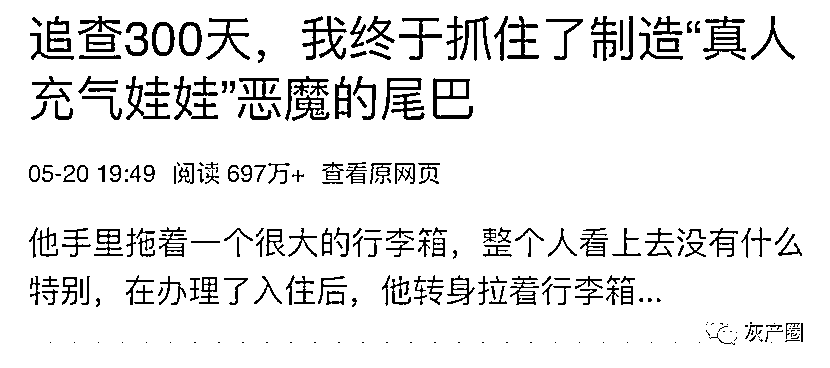
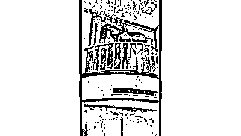
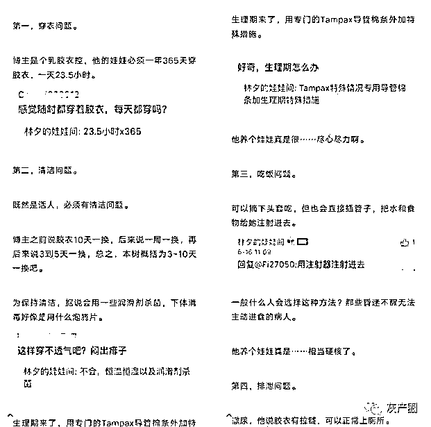
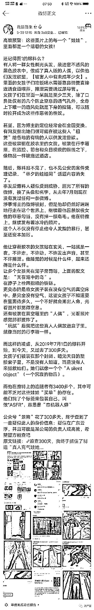
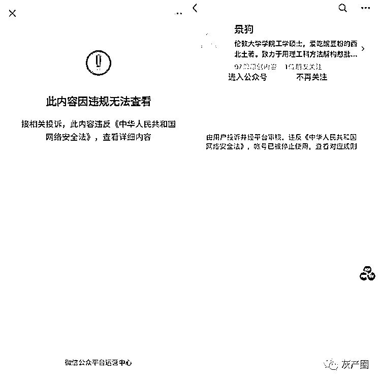
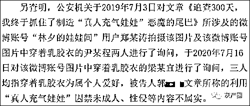
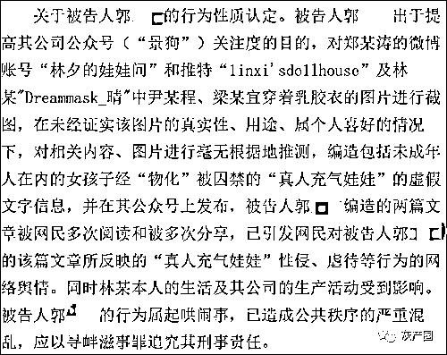
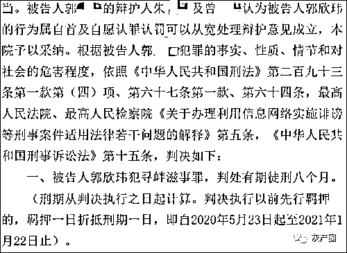

# 把女孩塞进"胶衣娃娃"，还全国配送？判刑了！

> 原文：[`mp.weixin.qq.com/s?__biz=MzIyMDYwMTk0Mw==&mid=2247509794&idx=1&sn=f80ff5fda5e009d38b790f540366b976&chksm=97cb6c1aa0bce50c628feddda45ce02a5e5ebfdbb41fec649efed2b06a794eeb37d7ac3c8e6d&scene=27#wechat_redirect`](http://mp.weixin.qq.com/s?__biz=MzIyMDYwMTk0Mw==&mid=2247509794&idx=1&sn=f80ff5fda5e009d38b790f540366b976&chksm=97cb6c1aa0bce50c628feddda45ce02a5e5ebfdbb41fec649efed2b06a794eeb37d7ac3c8e6d&scene=27#wechat_redirect)

2020 年，一篇题为**《追查 300 天，我终于抓住了制造“真人充气娃娃”恶魔的尾巴》**得文章，在全网疯传。

最近，这件事出现了反转。

事件回顾：

在典雅古朴的小阳台上，站着一个墨绿色的人偶，反射出油亮诡异的光。看不见五官，更别提表情，双臂微微摆开，直挺挺地站着。

这时，一个男性声音传来：“激活回家模式”，人偶娃娃开始像机器人一般左右摆动，好像在欢迎主人归来。

就像是高科技一样，可以声控，可以使用。乍一看，真让人觉得技术日新月异。

但是，这不是机器人。

据该博主“林夕的娃娃间”所说，这里面是一个真人——是一位女性穿着胶衣。为了保证娃娃的外观完美与身体健康，已经被“训练”了四年，她们会被剃光头发，做激光脱毛处理。目前共有六位娃娃，可以一站十几个小时，模仿机器人声音，带肛塞，通过鼻饲管进食。

2020 年 5 月 20 日，公众号“景狗”继微博“流水朝朝”之后，再次爆料真人胶衣娃娃，微博博主“我是落生”随即转载，从而掀起舆论的滔天巨浪。

微博注销、账号被炸、警方调查进度不明……仅有的证据窗口也被封锁，真相变得扑朔迷离。与模糊的真相形成对比的，是很多网友鲜明的态度：把真人当娃娃，供其发泄欲望，这就是恶魔，足够下地狱。

时隔一年，近日发布的裁判文书显示，真实情况是，博主“林夕的娃娃间”确实发了几张女性穿乳胶衣的照片，但“性侵”“虐待”等情况均系“景狗”运营者与文章作者郭某某为了“博眼球”而捏造的。

最终，郭某某因构成寻衅滋事罪，被判处有期徒刑 8 个月。

梳理一下，就是郭某某为了让自己公众号获得流量，写了一篇文章，引起网友愤怒转发，但揭发的内容也是他自己做的。自己揭发自己，然后被警察抓了，判刑。

今年 1 月 26 日发布的广东省云浮市云城区人民法院刑事判决书显示，2019 年 7 月 6 日，郭某某注册微信公众号“景狗”，并为了提高该公众号的关注度，在 2019 年 9 月至 2020 年 5 月 21 日期间捏造了多篇关于“林夕的娃娃间”的相关内容。

无论是@林夕的娃娃间 还是推特“linxi's doolhouse”（现已改名）上发布的女性穿乳胶衣照片都是真的，但均属于当事人为满足个人爱好的自愿行为。

而郭某某口中关于“无法正常进食排泄”“装入行李箱送到各地提供性服务”“随时成为这些作恶者的性奴”等说法，均不属实。

至于被郭某某斩钉截铁地认定为@林夕的娃娃间 真实身份的“Dreammask”老板林某，也与该事件无关，“林夕”与这位老板姓林也只不过是巧合。

（2020）粤 5302 刑初 227 号刑事判决书 图源：裁判文书网

郭某某编排事实是为了博取关注，他也确实吸引到了不少流量。

经公案机关调查，截止 2020 年 7 月 17 日被告人郭欣玮的该文章被转发到知乎、微博、豆瓣等网络平台，被分享数达 14483 次，阅读数达 394881 次，还引发了网友对文章所反映的“胶衣人偶”“真人充气娃娃”被性侵、虐待等行为的关注和恐慌，林某本人信息被“搜索”。

法院认定，郭某某编造的文章引发严重的负面网络舆情，也导致林某本人的生活及其公司的生产活动受到影响，属于起哄闹事，已造成公共秩序的严重混乱，构成寻衅滋事罪。

（2020）粤 5302 刑初 227 号刑事判决书 图源：裁判文书网

最终，考虑到郭某某有自首和认罪认罚情节，他被法院判处有期徒刑 8 个月。

（2020）粤 5302 刑初 227 号刑事判决书 图源：裁判文书网

曾号称自己为了揭露黑幕而“追查 300 天”的他，如今也面对了 200 多天的牢狱生活。

来源： 观察者网，二更鬼故事

← 向右滑动与灰产圈互动交流 →

