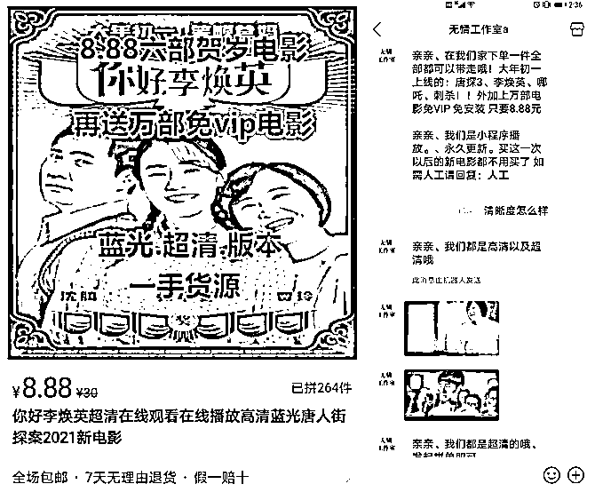

# 8.88 元看 6 部贺岁片！哪来的？

> 原文：[`mp.weixin.qq.com/s?__biz=MzIyMDYwMTk0Mw==&mid=2247509794&idx=2&sn=5af73a2caef9b3503e54ee72d33ac4d2&chksm=97cb6c1aa0bce50cca514e6bf727ec2372f2dd3ecaf26e329d530d26b0ce8ad9a46165272f43&scene=27#wechat_redirect`](http://mp.weixin.qq.com/s?__biz=MzIyMDYwMTk0Mw==&mid=2247509794&idx=2&sn=5af73a2caef9b3503e54ee72d33ac4d2&chksm=97cb6c1aa0bce50cca514e6bf727ec2372f2dd3ecaf26e329d530d26b0ce8ad9a46165272f43&scene=27#wechat_redirect)

“8.88 元六部贺岁电影，再送万部免 VIP 电影，蓝光·超清·版本，一手资源”。2 月 17 日，春节档电影还在火热上映中，就有电商平台商家打出这样的宣传标语。

国家电影局 2 月 18 日发布数据显示，2021 年 2 月 11 日除夕至 17 日正月初六，全国电影票房达 78.22 亿元。但记者调查发现，春节档电影上映后就有盗版资源流出。在电商平台，花费 5 元就能买一单《你好，李焕英》的电影资源；盗版影片的链接更是在朋友圈、贴吧中传播；在部分公众号上搜索电影名，以及通过一些网络群，也可免费获得盗版电影资源。

记者注意到，目前网络上流传出的春节档盗版电影资源多为盗摄。一些免费影片资源画面摇晃抖动，画质不清晰，声音也较为嘈杂，甚至可以看到前排观众的身影。但相比之下，也有一些网络售卖的影片盗版资源可达到 1080P 画质，画面稳定，无噪音干扰。

在公众号上搜索电影名，能看到大量相关资源

盗版电影多渠道传播

8.88 元 六部贺岁电影在家看

记者注意到，在社交媒体、电商平台、二手交易平台，找到相关电影资源并非难事。搜索春节档电影名，声称有这些资源的网络群、公众号随处可见，关注后就可以免费获得盗版电影资源。记者加入了三个以“你好李焕英”“唐人街探案 3”命名的网络群，人数均在 1500 到 2000 之间，群内互动频繁，管理员不时地更新“进群报视频名字就有链接免费看”的内容，《你好，李焕英》《唐人街探案 3》等春节档电影几乎全部“中招”。

记者注意到，这些群内免费分享的院线电影链接，有很多画面抖动严重，还可以看到影院中前排观众的身影，电影画质更是不清晰，声音也很噪杂。但在电商平台，花费几元钱就能购买多部“高清”春节档电影资源。在某电商平台，记者搜索“你好李焕英电影”关键字，就看到有商家宣称卖“8.88 元六部贺岁电影”。

电商平台上一商家售卖 2021 年春节档电影资源

“大年初一上映的：唐探 3、李焕英、哪吒、刺杀！！外加上万部电影免 VIP 免安装，只需 8.88 元。”该店铺客服系统提示称，电影都是小程序播放，永久更新。当记者询问清晰度时，系统自动回复称“高清以及超清，可达 1080P”，并发给记者两张春节档院线电影截图作为展示。从截图上看，画质偏黄，但画面看起来比较清晰。

随后的调查中，记者尝试购买了一份 8.88 元的电影资源。在商家推荐的一个公众号中，记者根据系统提示，打开一个观影小程序发现，该链接俨然一个视频网站的模样，除了电影，还包括连续剧、综艺、动漫等内容。在电影分类中，《你好，李焕英》《唐人街探案 3》位居热播榜首，《刺杀小说家》《人潮汹涌》《熊出没·狂野大陆》等春节档电影也在热播列表中。

记者付费后获得的一个小程序中包括多部春节档电影

记者浏览后发现，这些春节档电影盗版资源多印有“TC1080P”字样，电影画面稳定不抖动，画质虽然不及影院级别，但是画面清晰，声音听起来虽然有些空荡，但是没有其他杂音干扰，整体观感要大大高于上述免费链接资源。

这些电影资源是怎么拍摄的？在观看了记者提供的两段盗版电影素材后，中国电影科学技术研究所技术专家刘达表示，视听质量和影院母版级差距还是不小，初步判断或是在影院用摄像机偷拍的，属于所谓的枪版，这种情况小城市发生的概率相对较高。他进一步解释道，枪版属于盗版的一种形式，TC 一般是 TeleCine 的缩写，从影院版或蓝光版等转录，图像质量相对较高，1080P 是指分辨率是高清（1920*1080）。从技术上说，在影院播放电影时使用数字摄像机录制，只要摄像机技术参数不要太低，固定好三脚架，录制出来的内容差不多就是高清及以上的质量。

对于盗版电影是谁录制的问题，刘达认为，不排除有个别影院的员工与盗录人员里外配合盗录电影的可能性。但是在小城市看电影人数不及一二线城市，选择一个人不多的非高峰期，普通消费者也具备这种录制环境。

“如果这背后存在一个从录制到传播的灰色产业链，那对于电影行业来说是非常致命的。”中国电影评论学会会长饶曙光在接受记者采访时表示，今年春节档非常火爆，市场需求大，经济利益的驱动或是盗版出现的原因之一。

盗版问题更是引发电影制作方的关注。2 月 17 日，《你好，李焕英》导演兼主演贾玲发布微博呼吁，希望大家不要剧透，网友纷纷评论“拒绝剧透，拒绝盗版！”2 月 18 日，电影《唐人街探案》官方微博发布侵权链接线索举报邮箱，呼吁网友坚决打击盗版，保护电影版权。

交 168 元成“代理”，

用春节档电影引流赚钱

**值得关注的是，在网络中，还出现了一种名为“电影代理”的人群。他们非法获取院线和其他电影资源，然后倒卖给其他人，或者利用手中电影资源发展“下线”获取利润。**

**“这种电影资源在我们同行群里就会发，一般都是新资源。”一名“电影代理”告诉记者，交 168 元就可以成为代理，全网资源可以终身免费使用，既可以看剧，还可以赚钱，“一般一部电影卖 5 块，院线上映的唐探、李焕英这些都有。”**

**那么，这些资源从哪里来？该人士称，成为代理后，记者会被拉到一个资源群里，群里每天会更新链接，也包括很多院线电影。但这些资源出自哪里，他并没有告知记者。交谈中，他几次推荐记者成为代理，一次付费后，不仅可以卖电影资源赚钱，还可以发展“下线”，利用手中资源再找其他代理，所有代理费都可以由自己赚取，不需要和其他人分成。**

**“我从 2020 年 3 月份做的代理，不到一年时间就赚了一万多元，还收了三十个代理。”在上述人士看来，倒卖电影资源不仅没有风险，还是个赚钱买卖，寻找代理与卖资源相比更是一条生财之道。“我们自己整合了一个公众号，如果有人想买资源，就可以把公众号里的电影资源提取到百度网盘，然后从百度网盘里面分享给他。”**

**今年春节档电影资源的流出，更是成为这些“电影代理”的引流渠道。记者在与多名“电影代理”的沟通中了解到，因为今年春节档电影火爆，很多人会在贴吧、知乎、微博等多平台发布春节档电影信息，有需求的网友就会根据这些信息联系他们，等把这些目标顾客聚集在一起，第一部电影免费提供后，之后再想看其他电影就需要付费观看。**

**“引流才能赚钱嘛。”有自称从事这一行业的人士说，“这个资源，你卖多少就赚多少，无限利用及循环。”他告诉记者，在倒卖影视资源的产业链上，偷拍是最赚钱的，但是他直言自己也了解不多。**

**刘达认为，盗版领域里，盗录、传播、交易等环节应该都有分工，由不同的团队负责。单从传播渠道来看，公众号、小程序或者百度云传播等多元化传播通道给打击盗版带来很多困难。**

**对此，刘达建议，要充分利用数字水印、数字指纹、数字签名、数字证书等现代信息与网络安全技术手段实施盗版追溯、精准定位和版权保护。数字水印等技术主要是通过检测盗版内容进而确定盗版源头，可以定位到某城市的某影院，某个影厅的放映设备上及时间段。**

**对盗版电影说不：这些行为触犯法律******

**北京市京师律师事务所律师李源对记者表示，从法律层面分析，一些人盗摄和传播盗版电影的行为，不仅属于民事侵权，还可能触犯刑法，最终被追究刑事责任。**

**李源表示，我国著作权法规定，著作权包括发行权和信息网络传播权。发行权是权利人以无偿或有偿方式，向公众提供作品的原件或者复制件的权利；信息网络传播权是权利人以各种方式向公众提供作品，使公众可以在其个人选择的时间和地点获得作品的权利。以上权利均为著作权人专属。一些人未经允许盗摄、传播盗版电影资源的行为，显然已经侵犯了电影权利人的发行权和信息网络传播权。**

**此外，盗摄、传播行为达到一定程度还可能涉嫌犯罪。李源称，刑法规定，以营利为目的侵犯著作权，违法所得数额较大或者有其他严重情节的，处 3 年以下有期徒刑或者拘役，并处或者单处罚金；违法所得数额巨大或者有其他特别严重情节的，处 3 年以上 7 年以下有期徒刑，并处罚金。**

**电影盗版对影视行业危害极大。公开信息显示，2019 年春节期间，以《流浪地球》为代表的 8 部国产影片上映期间遭集体盗版。根据中国版权协会监测数据，这 8 部影片高清版侵权链接达 3.89 万条，点击播放总量约 8288.2 万人次，初步预估票房损失和正版视频平台损失约 7.87 亿元。**

**“电影产业的收入主要依靠影院票房，如果很多人都看盗版电影，自然来影院的人就少了，而且盗版会对整个电影产业链造成重大损害，涉及制片、后期制作、发行、院线和影院等多个环节。”刘达说。**

**就在今年春节前夕，因盗版《流浪地球》等春节档影片牟利，8 人被判处有期徒刑，被最高检列入典型案例，成为敲打盗版不法分子的一记警钟。**

**当然，杜绝观看盗版影片需要从每个人做起。饶曙光表示，治理盗版问题要采取行政、法律、社会多方面综合治理的办法，公众更应该提高法律意识，对盗版电影说不。**

**来源：央广网微信**

********

**← 向右滑动与灰产圈互动交流 →**

****