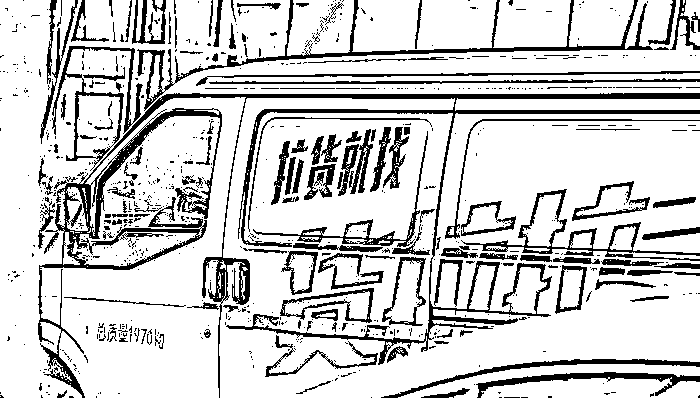

# 女生搬家途中跳车身亡，到底发生了什么？！

> 原文：[`mp.weixin.qq.com/s?__biz=MzIyMDYwMTk0Mw==&mid=2247509794&idx=4&sn=862a37c8d2cc47971ea478c07b0bfd21&chksm=97cb6c1aa0bce50c5c2e98bc4ffd940ff58a43de78bc674a5c4ced708c178eafb9c5166abc67&scene=27#wechat_redirect`](http://mp.weixin.qq.com/s?__biz=MzIyMDYwMTk0Mw==&mid=2247509794&idx=4&sn=862a37c8d2cc47971ea478c07b0bfd21&chksm=97cb6c1aa0bce50c5c2e98bc4ffd940ff58a43de78bc674a5c4ced708c178eafb9c5166abc67&scene=27#wechat_redirect)

## 

2 月 22 日，湖南长沙 23 岁女子在货拉拉车上跳窗身亡一事引发热议。 

## 

[`mp.weixin.qq.com/mp/readtemplate?t=pages/video_player_tmpl&action=mpvideo&auto=0&vid=wxv_1750862645643001857`](https://mp.weixin.qq.com/mp/readtemplate?t=pages/video_player_tmpl&action=mpvideo&auto=0&vid=wxv_1750862645643001857)

澎湃新闻

**23 岁女生跟车搬家途中跳车身亡**

## 

2 月 21 日晚

一名网友发微博称

自己年仅 23 岁的姐姐莎莎

从货拉拉副驾驶上离奇跳窗

抢救无效不幸身亡

据该网友描述 

2 月 6 日晚 8 点

莎莎使用货拉拉搬家

**从天一美庭到梅溪湖步步高公寓**

**车程不到 10 公里**

21 点 17 分

莎莎上了司机的车

21 点 24 分

**她在工作群中回复消息**

**看不出有情绪异常**

21 点 30 分，意外发生 

车开到曲苑路时

司机拨打了 120 和 110

**称莎莎因为面包车三次偏航**

**在岳麓区曲苑路跳窗**

**120 赶到现场后**

**莎莎已昏迷不醒**

2 月 7 日凌晨 2 点

莎莎第一次手术结束

2 月 7 号早上 5 点

做完第二次手术

被送入重症监护室

从诊断书中可以看到 

莎莎身体多处受伤

尤其是头部：

**颅内血肿、脑挫伤** 

**创伤性脑疝、脑干受压**

**颅底骨折、颅骨骨折**

**……** 

2 月 8 日

**莎莎出现高钾、尿崩的情况**

医生表示

最好的结果也是植物人

2 月 10 日，莎莎去世

**货拉拉：将全力配合警方工作**

2 月 21 日，货拉拉回应车女士预约搬家，跟车时跳窗不治身亡：成立专项调处理小组，配合警方工作。对当事人家属致以歉意和慰问，以最大诚意跟进善后事宜。

以下为货拉拉官方微博@货拉拉 APP 发布《关于长沙用户跳车事件的说明 》↓↓↓

2 月 8 日从警方获悉事件后，货拉拉第一时间成立了专项处理小组，即刻配合警方提供所需的一切订单资料，并于 2 月 9 日抵达长沙与家属取得联系，表达深切歉意和负责到底的态度。

在警方的安排下，货拉拉于 2 月 11 日与家属就善后事宜展开第一次商谈，但遗憾未能达成一致，由于当日为除夕，在警方建议并取得家属同意的情况下，双方约定在春节假期后继续商谈。

2 月 18 日假期结束后，专项小组立即开展工作，并多次联系车女士的家属表达积极处理善后的意愿，于 2 月 20 日获得家属的回应。目前，货拉拉正积极与家属约定商谈善后的时间。**目前警方对该事件的调查仍在持续，尚未形成定性结论。**货拉拉将全力配合警方工作，对于在该事件中平台应当承担的责任，绝不会逃避。

**家属：司机曾三次偏航**

22 日上午，有记者联系上车莎莎的叔叔车细强等家属，并进一步了解到事件详细情况。

车莎莎的叔叔车细强告诉记者，今年 23 岁的车莎莎，前年刚大学毕业，在湖南长沙某公司从事人力招聘工作。车莎莎叔叔表示**侄女搬家当晚没有任何异常**“，9 点十几分的时候，她都还在和她阿姨，也就是我爱人聊天说刚装好行李。”

来源：视觉中国

车莎莎叔叔表示事件中家属最大的疑惑就是司机为什么会多次偏航，驶向偏僻路线。家属向记者展示的平台截图显示，当晚司机并没有按照货拉拉平台推荐路线走西二环至枫林路行驶，而是走岳麓大道至下旺龙路，之后便频繁偏航绕路行驶到曲苑路上。

平台订单截图 

“旺龙路、佳园路、曲苑路那附近晚上路灯都基本没有，有的路段在夜里甚至可以说是伸手不见五指”车莎莎叔叔告诉记者，侄女跳车的时间与地点都充满着疑点。

关于司机为何会多次偏航及车内是否有录音监控等措施，货拉拉官方曾回应家属称，司机端没有相关录音录像设备及措施。关于偏航及事件原因，在 11 日协商会上家属称得到的司机方解释是：司机因不懂导航操作致使偏航，三次偏航后女子选择跳车。

就女子跳车与偏航原因是否相关，记者向警方及货拉拉方面进行询问，暂时尚未得到回复。

**因证据不足，涉事司机已被释放**

家属后来向派出所询问调查进展时得知，因证据不足，涉事司机三天后便被警方释放，目前警方还在补充调查中。

货拉拉的官方说明中提到 2 月 8 日公司便成立了专项工作小组积极与家属进行对接。但车莎莎的叔叔向记者表示对方与家属取得联系后却一直在不停改见面时间，没有人到医院探望过莎莎及家属，直到 11 日车莎莎去世后第二天，双方才在民事协商会上见面。

我们将继续关注事件后续进展！

**大家对此有什么看法？请在下方留言**

来源：澎湃新闻、紫牛新闻、沸点视频、半岛都市报、央视新闻

← 向右滑动与灰产圈互动交流 →

