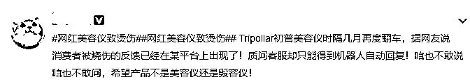

# 李佳琦又摊上事了！

> 原文：[`mp.weixin.qq.com/s?__biz=MzIyMDYwMTk0Mw==&mid=2247509794&idx=5&sn=ed2139c8efaa50106794b5d00af7d0e6&chksm=97cb6c1aa0bce50c36991915e04761537a5b1a9bfd6f83181ff981df5b3a7b31dd8cbbcfcc88&scene=27#wechat_redirect`](http://mp.weixin.qq.com/s?__biz=MzIyMDYwMTk0Mw==&mid=2247509794&idx=5&sn=ed2139c8efaa50106794b5d00af7d0e6&chksm=97cb6c1aa0bce50c36991915e04761537a5b1a9bfd6f83181ff981df5b3a7b31dd8cbbcfcc88&scene=27#wechat_redirect)

凭借李佳琦一句“所有女生，买它，买它买它……”而爆火的初普 TriPollar 美容仪，又出事了……

据此前报道，TriPollar 美容仪登上李佳琦双十一预售直播当天，创造了 1 亿美元的 GMV，同时也成为淘宝直播美妆行业一小时破亿的 12 个单品之一。

到底怎么回事？基金君给大家捋一捋。

#网红美容仪致烫伤#冲上热搜

京东已悄悄下架

近日，#网红美容仪致烫伤#的话题冲上热搜。截至发稿，该话题阅读已经突破 1 亿次。

不少网友在多个平台反映，在使用初普 TriPollar 美容仪时被烫伤了……

随后，一项涉及 9 款家用美容产品的检测报告，也将 TriPollar 初普 Stop EYE 美容仪推向舆论的风口浪尖。

权威检测机构信息显示，TriPollar 初普 Stop EYE 美容仪使用温度能升至 74.1℃，超出限值 49.1K，容易导致用户发生烫伤情况。

初普两度否认

京东旗舰店悄然下架

对此，TriPollar 初普官方微博深夜回应，否认产品温升超限说法。

接着，在今天下午 1 点左右，TriPollar 初普官方微博再次表示，一次约 4 分钟的使用，前后对照发现，皮肤表面最后的温度为 38.9°C。Stop Eye 美容仪的温度是有效且安全的。

然而蹊跷的是，TriPollar 初普却在其京东旗舰店悄然下架了该款产品。

但是淘宝旗舰店仍有销售。 

“童颜”神器变“烂脸”神器

李佳琦曾多次在其直播间里推荐 TriPollar 初普美容仪，一度被人成为“童颜神器”。 

但是近日，网友反映，初普美容仪不仅在使用过程中会导致烫伤之外，还会引发刺激性皮炎。

据《北京日报》报道，来自北京的金女士从李佳琦网络直播间购买的初普 TriPollar 美容仪，仅用了 4 次，额头和脸颊就相继冒痘。经北京协和医院皮肤科专家医生诊断：这属于刺激性皮炎，应马上停用美容仪。

协和医院变态反应科的文医生看过 TriPollar 美容仪的凝胶的成份表后表示，凝胶中含有的香料(香茅醛、芳樟醇)、丙二醇等都是容易引起皮肤过敏的物质，因此很可能是导致疱疹的原因。

(金女士的诊断证明)

据了解，TriPollar 初普美容仪官配凝胶成分中添加多种香料成分，香味浓郁， 相比于没有添加香料成分的凝胶，这款凝胶更容易有致敏风险。同时，没有任何活性成分，**基本都采用甘油体系成分，容易倒吸皮肤水分，脸部会有灼热感，肤感黏腻，清洗不到位，容易导致毛孔粗大，或诱发痤疮等皮肤问题。**

同时，国家药监局网站进口非特殊用途化妆品备案服务平台查看显示，TriPollar 和初普品牌无任何备案记录。

不少网友表示，网红美容仪效果一点都不好，还有可能毁容。

 直播带货乱象丛生

最高检出手了

截至目前为止，带火了初普 TriPollar 美容仪的李佳琦并没有对此事做出任何回应。但是有细心的网友发现，李佳琦的 38 节直播商品预告合集里已经没有了初普这款产品。

相比去年快手网红主播辛巴所售燕窝被检测为糖水一案，李佳琦在此次销售中是否要承担相应的责任，还有待法律的评判。

有些人认为，根据《广告法》，关系消费者生命健康的商品或者服务的虚假广告，造成消费者损害的，其广告经营者、广告发布者、广告代言人应当与广告主承担连带责任。

同时，根据《广告法》第十七条规定：除医疗、药品、医疗器械广告外，禁止其他任何广告涉及疾病治疗功能，并不得使用医疗用语或者易使推销的商品与药品、医疗器械相混淆的用语。

而李佳琦在其带货过程中，也对产品功效等使用效果进行了相关宣传。

因此，有部分业内人士认为，品牌方应承担主要责任，而李佳琦也可能也要承担部分次要责任。

而这并不是李佳琦直播带货第一次翻车，此前的空气炸锅质量有问题、不粘锅糊锅等多次大型翻车现场，让人对网红代言、直播带货的产品质量表示深深的担忧。 

近日，最高人民检察院第八检察厅厅长胡卫列在接受采访时表示，随着网络经济的发展，“网红代言”“直播带货”等线上经济持续火爆，但行业良莠不齐、缺乏监管等多种乱象引起不少消费者吐槽，外卖包装材料影响食品安全问题社会各界也广泛关注，这些伴随新业态发展产生的食品安全问题，对广大消费者的生命健康权构成了潜在侵害风险。

为更好回应人民群众新期待、新需求，最高检正在**开展为期三年的“公益诉讼守护美好生活”专项监督活动**，将外卖包装材料安全、“网红代言”、“直播带货”等网络销售新业态涉及食品安全及监管漏洞作为重点监督领域。

来源：中国基金报 

← 向右滑动与灰产圈互动交流 →

