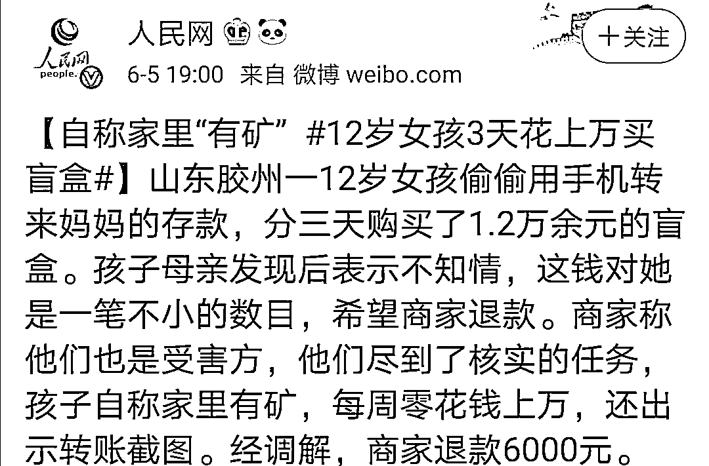
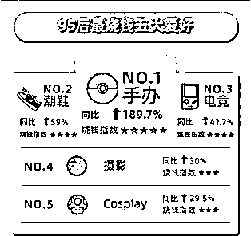
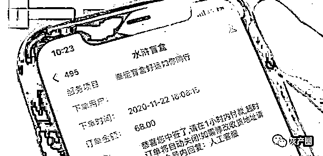
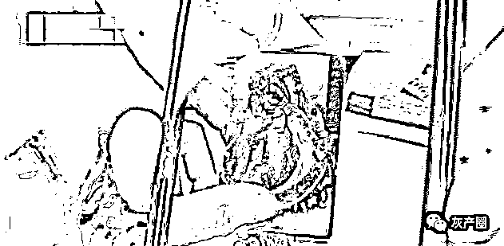
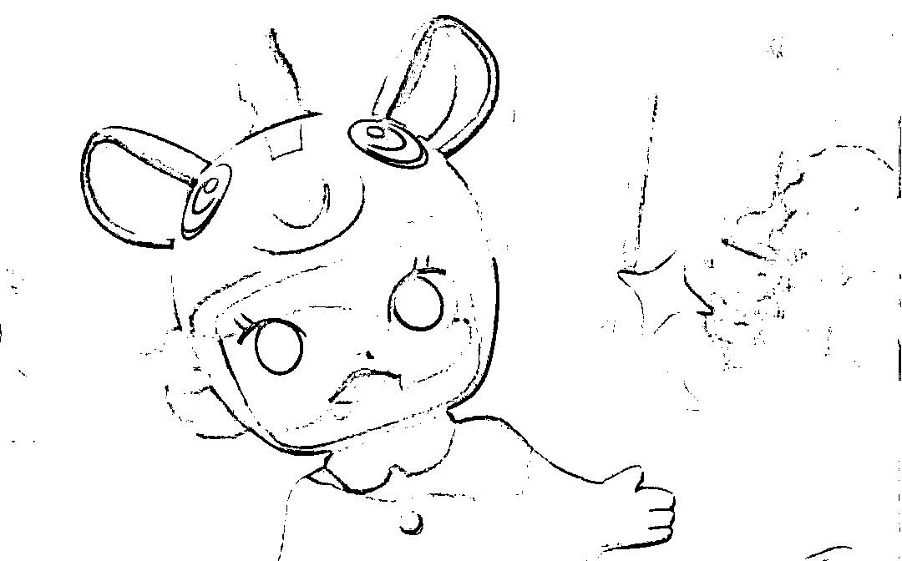

# 盲盒诈骗来袭！

> 原文：[`mp.weixin.qq.com/s?__biz=MzIyMDYwMTk0Mw==&mid=2247509794&idx=6&sn=5a782142ff35209e5352dbb1fea1572c&chksm=97cb6c1aa0bce50c80e2d2d7ec8b076cf981f0fcc9ebaaba07d24461cd0e6180637de2c5c4cd&scene=27#wechat_redirect`](http://mp.weixin.qq.com/s?__biz=MzIyMDYwMTk0Mw==&mid=2247509794&idx=6&sn=5a782142ff35209e5352dbb1fea1572c&chksm=97cb6c1aa0bce50c80e2d2d7ec8b076cf981f0fcc9ebaaba07d24461cd0e6180637de2c5c4cd&scene=27#wechat_redirect)

相同的盒子中放置不同的商品，消费者事先不知道盒子里装的是哪一款，但有一定概率能够抽到自己心仪的商品——时下，这种叫“盲盒”的消费形式非常火爆，有的消费者甚至到了“买买买”停不了手的地步。

**盲盒，**是指消费者不能提前得知具体产品款式的玩具盒子，具有随机属性。只有打开才会知道自己抽到了什么。不确定的刺激会加强重复决策，因此一时间盲盒成了让人上瘾的存在。就这点来看，这和买彩票颇为相像，都有赌运气的成分。

除了最初的玩具，眼下餐饮、美妆、文具、图书等商品的销售都掀起了“盲盒风”。有调查显示，2019 年国内盲盒行业市场规模为 74 亿元，预计 2021 年将突破百亿元。

“盲盒热潮”中的问题不容忽视：商家过度营销，消费者易中套“上瘾”。经营者营销花样很多，有的是通过与明星、网红主播等合作，提高曝光率；有的是通过玩家分享、讨论、交换等方式，唤起消费者的收藏心理和炫耀心理，激发购买欲望；还有的打造“系列”概念，并设置一个最难获得的“隐藏款”进行饥饿营销，而抽中概率极低。

2019 年 8 月，天猫发布《95 后玩家剁手力榜单》

潮玩手办在 95 后最“烧钱”的爱好中排名居首而“盲盒”收藏成为硬核玩家数增长最快的领域

从 2019 年至今，炒盲盒风靡各地市场，在商家赚得盆满钵满的同时，犯罪分子也盯上了这门生意。

2021 年 1 月 26 日，中国消费者协会官方网站发布消费提示指出，有经营者用盲盒清库存，损害消费者合法权益，扰乱市场，提醒广大消费者勿盲目购买。近期，盲盒消费更是催生出一些新型诈骗手段！

让小编带你“以案识诈”

让你在“剁手”前悬崖勒马...

“盲盒”套利

钱花了东西却卖不出去

小王是一名在校大学生，最近和同学玩起了一种叫“水浒盲盒”的东西。不过小王并不是想要盲盒里的商品，而是通过买卖盲盒来“套利”。然而，如今小王利没套到，自己反倒被人给套路了。2020 年 8 月份，小王通过微信群关注了一个叫“水浒盲盒”的公众号，该公众号出售盲盒并高价回收，小王等人通过不断购买卖出赚取差价。“盲盒是 68 块钱一个，他回收就给我八十几块钱一个，我一单就可以赚十几块钱的样子”，小王说。为了赚取更多的差价，小王和同学一起筹集了近两万元进行操作。但到 11 月份，“水浒盲盒”微信公众号先是回收周期变长，后来突然暂停运营了，小王等人才意识到，自己被骗了。根据微信登记信息显示，“水浒盲盒”这个公众号背后的实体公司名叫“四川好货多直播科技有限公司”，如今拨打公司电话，已无人接听。案发后，小王反思：“回过头来看，就像一个人在操作一个资金盘，有点类似旁氏骗局这种东西”。目前小王等人已向警方报案。

** 大牌“盲盒”****遭遇假货骗局**

2020 年 9 月，胡先生网购了一款某品牌盲盒，可到手发现其中的手办做工粗糙，经鉴定为假货。

据调查，该犯罪团伙自 2019 年 4 月起，从网上购入假冒“molly” “泡泡玛特” “若来”等知名品牌盲盒手办，以正版近一半的价格倒卖牟利。根据报案线索，警方赴广州抓获 3 名涉嫌倒卖假冒知名品牌盲盒的卖家，证实其已销售 9000 余件假冒盲盒，案值 15 万元。

**民警提醒**

广大市民要认识到盲盒具有不确定性的本质，认清并防范商家过度营销的套路，切勿跟风与攀比；要结合自身经济能力、消费需求和兴趣爱好等，量力而行、理性消费。购买盲盒时，要尽量选择信誉高、口碑好、售后服务完善的商家进行交易。

1、市民在购买盲盒系类商品时，一定要通过正规官方渠道，或者选择证照齐全、信誉度高的正规平台及商铺；同时，警惕通过微信、qq 等私人社交网络发布的各种信息、链接，以免上当受骗。

2、消费者在购买任何商品或服务时，应注重保留购买凭证，包括但不仅限于发票、收据等，如发现被骗，要第一时间向警方报警，及时维权。

3、选择兼职时，一定要谨慎，低价销售、再高价回购，这种商业模式本身就存在难以为继的风险，不要抱有侥幸心理，参与这些炒卖盲盒的活动。

既然拦也拦不住那就擦亮双眼，理性消费希望大家都能抽到自己想要的款！

来源：平安济源，利箭在行动

← 向右滑动与灰产圈互动交流 →

