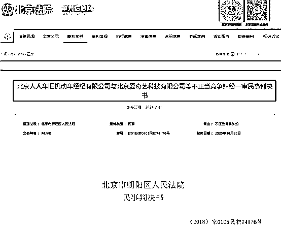
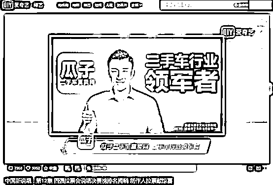
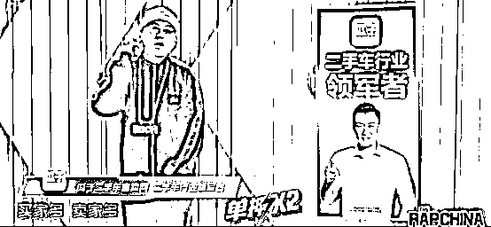
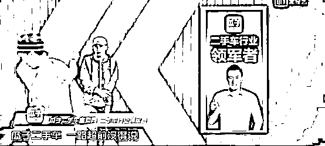
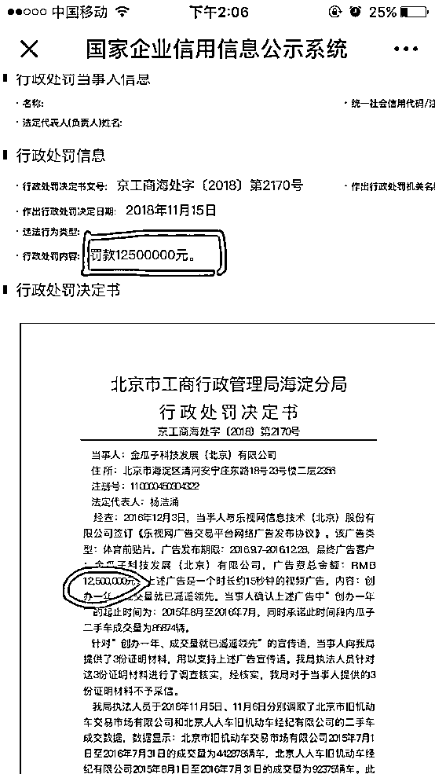
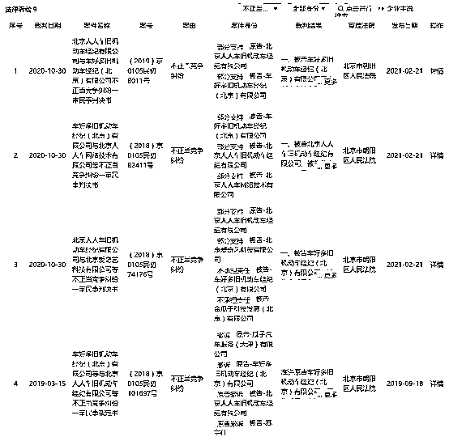

# 因为广告，这家互联网平台又输了！

> 原文：[`mp.weixin.qq.com/s?__biz=MzIyMDYwMTk0Mw==&mid=2247509865&idx=2&sn=8c69d49004b0601189d9998a045411ae&chksm=97cb6c51a0bce5473f48646e2ba09553a31a808b5a70dc91c47314c7c3b0a4280525a355be53&scene=27#wechat_redirect`](http://mp.weixin.qq.com/s?__biz=MzIyMDYwMTk0Mw==&mid=2247509865&idx=2&sn=8c69d49004b0601189d9998a045411ae&chksm=97cb6c51a0bce5473f48646e2ba09553a31a808b5a70dc91c47314c7c3b0a4280525a355be53&scene=27#wechat_redirect)

瓜子二手车直卖网还在为夸大的广告语付出代价。

因为在网络节目《中国有嘻哈》中的争议宣传用语，瓜子二手车直卖网和爱奇艺卷入官司，被人人车告上法庭。2 月 21 日，该案民事判决书公开，人人车获赔 100 万元。

在节目中称“冠军舍我其谁”

瓜子二手车直卖网摊上官司

这起官司，与爱奇艺公司出品的一档说唱音乐节目《中国新说唱》中的推广词有关。

原告北京人人车旧机动车经纪有限公司（即人人车）诉称，在这档节目中，车好多公司、金瓜子公司（均为瓜子二手车直卖网的经营者）在该节目中投放了含有虚假宣传内容的广告，宣称瓜子二手车直卖网是“行业领军者”“冠军”。

此外，还在节目中使用了“一路超前没得说”“对手总想超过”“冠军舍我其谁”等宣传用语。 

人人车方面认为，瓜子二手车直卖网方面的上述行为属于为获取竞争优势，过分夸大自身实际水平，误导相关公众的虚假宣传，不仅扰乱了市场竞争秩序，也不当减损了我公司的交易机会，给我公司造成了严重的经济损失。

同时，其认为爱奇艺公司作为广告发布平台，在其自制节目中投放了涉案广告，与车好多公司、金瓜子公司构成共同侵权。

被告抗辩：属于节目表演的一部分

被告车好多公司、金瓜子公司共同提出了以下抗辩意见：

首先，二公司在《中国新说唱》节目中使用“冠军舍我其谁”“一路超前没得说”“对手总想超过”等用语，系属于节目表演的一部分，并非虚假宣传广告。

其次，“领军”或“领军者”并非指代第一，而是某一行业中相对比较优秀的群体，不是一个特指概念。

再次，二公司提交了大量证据表明瓜子二手车各项市场指标表现优异，属于行业内卓越群体，因此，二公司使用“领军”“领军者”不构成虚假宣传。

另一被告爱奇艺公司也辩称，爱奇艺与人人车之间没有直接竞争关系，人人车向爱奇艺主张不正当竞争行为没有依据。虚假宣传行为的法律后果在反不正当竞争法中仅规定了行政责任。人人车未提交任何证据证明其受到的经济损失或不良影响。

法院：涉案广告宣传语使用了最高级、绝对性的表述

北京市朝阳区人民法院认为，人人车公司、车好多公司、金瓜子公司均系二手车交易经纪服务的提供者，其提供服务的对象、方式、内容、范围均具有高度重合性，属于同业竞争者。本案中爱奇艺作为广告平台发布者亦参与到被诉虚假宣传广告的投放中，其行为属于市场竞争行为，应当受到反不正当竞争法的调整。

本案被诉虚假宣传内容为“一路超前没得说”“对手总想超过”“行业领军配备冠军舍我其谁”以及“二手车行业领军者”等用语。

结合被诉虚假用语所使用的语境来看“瓜子二手车 一路超前没得说 买家多 卖家多 对手总想超过……行业领军配备冠军舍我其谁”，很显然这段广告语所表达的意思是瓜子二手车在行业竞争中一路超前，超过了其他竞争者，其他竞争者均在竞争中处于落后状态，瓜子二手车处于冠军地位。

法院认为，上述广告宣传语使用了最高级、绝对性的表述，瓜子二手车宣称其为行业冠军或第一，其他竞争者均处于落后地位；尽管瓜子二手车占有一定市场并具有较高的知名度，尤其在某些领域取得了一定成绩，较之其他竞争者确实具有一定优势，但在案证据均不足以证明其在二手车交易领域中整体处于第一或冠军地位。更何况在激烈的不断变化的市场竞争中，企业在某一方面取得了行业领先优势并不代表其整体在行业中超过了其他所有竞争者。

法院认定，车好多公司、金瓜子公司上述宣传内容既无充分依据又与事实不符，其目的在于使消费者认为瓜子二手车是最好、最优的二手车交易平台，通过使用引人误解的宣传用语影响消费者的购买决策从而获得更多交易机会，该行为扰乱了公平的市场竞争秩序，构成虚假宣传。

而对于“领军者”的表述，法院认为，结合瓜子二手车平台的市场知名度、影响力、综合实力、业内竞争地位以及取得的社会荣誉，其作为二手车交易行业的优秀代表宣传“行业领军者”并非毫无事实依据；且车好多公司、金瓜子公司使用“领军者”宣传其行业领先地位，并未贬低或排除其他同业竞争者的竞争优势，消费者也不会基于对“领军者”字样的理解，而对瓜子二手车的市场竞争地位产生错误认识。

法院：平台应对广告内容进行合理审查

对于作为涉案广告的发布平台的爱奇艺公司，法院认为，其应当对节目中的广告内容进行合理审查。

法院表示，爱奇艺公司作为从事广告发布的专门平台，应当知道车好多公司、金瓜子公司投放的广告内容缺乏充分依据极易造成消费者的误解，其仍为获取商业利益而发布了涉案广告，与车好多公司、金瓜子公司共同实施了涉案虚假宣传行为，应当就该行为承担停止宣传、赔偿损失、消除影响的连带责任。

最终，法院判令车好多、金瓜子、爱奇艺三被告于判决生效之日起立即停止涉案虚假宣传的行为，并向人人车赔偿经济损失 100 万元。

同时，车好多、金瓜子、爱奇艺自判决生效之日起三十日内需履行在“瓜子二手车直卖网”新浪微博、微信号、爱奇艺官网中连续三日刊登声明的义务，以消除涉案虚假宣传行为对人人车的不良影响。

人人车主张赔礼道歉等的其他诉求则被驳回。

瓜子二手车曾因四字吃千万罚单

实际上，早在 2018 年，瓜子二手车曾因“遥遥领先”四个字，支付了 1250 万元的罚单，平均每个字 312.5 万元，相当于 11.4 千克黄金。

北京市工商行政管理局海淀分局向“瓜子二手车”的经营主体——金瓜子科技发展（北京）有限公司下达行政处罚决定书，认定其二手车广告宣传中使用的“创办一年、成交量就已遥遥领先”的广告语缺乏事实依据，与实际情况不符， 违反了我国《广告法》第四条、第二十八条规定，罚款 1250 万元。

行政处罚决定显示：2016 年 12 月 3 日，瓜子科技发展（北京）有限公司与乐视网信息技术（北京）股份有限公司签订《乐视网广告交易平台网络广告发布协议》，广告类型为体育前贴片，广告发布期限为 2016.9.7-2016.12.28，总计 112 天，广告费总金额人民币 1250 万元。

上述广告为一个时长约 15 秒钟的视频广告，内容为“创办一年、成交量就已遥遥领先”。

针对该宣传语，瓜子向工商局提供了 3 份证明材料，用以支持上述广告宣传语。

经瓜子二手车确认，上述广告中“创办一年 ”的起止时间为：2015 年 8 月至 2016 年 7 月，同时承诺此时间段内瓜子二手车成交量为 85874 辆。但工商局执法人员于 2018 年 11 月 5 日、11 月 6 日分别调取了北京市旧机动车交易市场有限公司和北京人人车旧机动车经纪有限公司（人人车）的二手车成交数据。

数据显示：北京市旧机动车交易市场有限公司 2015 年 7 月 1 日至 2016 年 7 月 31 日的成交量为 442878 辆车；北京人人车旧机动车经纪有限公司 2015 年 8 月 1 日至 2016 年 7 月 31 日的成交量为 92375 辆车。

两者的二手车成交数量均超过瓜子二手车的成交数量，85874 辆的销量并非业界领先。因此工商部门“对于当事人提供的 3 份证明材料不予采信”。

执法人员据此认为，瓜子二手车在广告宣传中使用的“创办一年、成交量就已遥遥领先”宣传语缺乏事实依据，与实际情况不符。工商局责令瓜子停止发布违法广告，并在相应范围内消除影响，罚款 1250 万元。

工商部门认为，这条广告违反了《广告法》第四条的规定，同时构成《广告法》第二十八条第二款第（二）项之规定，服务的销售状况与实际情况不符，对购买行为有实质性影响。

瓜子二手车曾多次被罚

公开资料显示，此前瓜子二手车就已多次卷入法律纠纷中。

2017 年 6 月，瓜子二手车在西安的分公司就因为存在“以虚假的商品说明、商品标准、实物样品等方式销售商品的行为”，侵害了消费者的权益，被西安市工商行政管理局双生分局处以责令改正并罚款一万元。

2017 年 11 月，瓜子二手车的竞争对手人人车因不满其广告语，以不正当竞争关系为由，将瓜子二手车告上法庭，向瓜子二手车索赔 1 亿元人民币。最终北京市海淀区人民法院发布诉前禁令裁定，认为瓜子二手车”遥遥领先”等相关广告，尚无充分事实依据，涉嫌构成引人误解的虚假宣传的不正当竞争行为，责令瓜子二手车立即停止使用"遥遥领先"、"全国领先"等虚假宣传用语。

2018 年 6 月 25 日，瓜子二手车又因为广告违法，被石家庄市工商行政管理局处以罚款二十万元的行政处罚。

2018 年 9 月 28 日，北京市朝阳区人民法院向瓜子二手车及《中国新说唱》制作播出方爱奇艺下发禁令，要求瓜子二手车及爱奇艺立即停止在《中国新说唱》中投放、植入和传播涉案广告语。

另据天眼查显示，人人车与瓜子二手车的经营者车好多公司存在多起关于不正当竞争的法律纠纷诉讼。

来源：中国基金报

← 向右滑动与灰产圈互动交流 →

