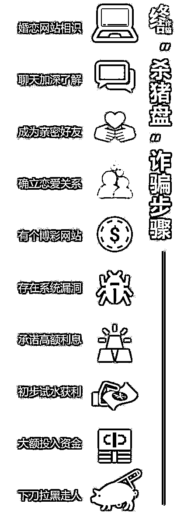

# 3 人网上“投资理财”被骗 625 万！

> 原文：[`mp.weixin.qq.com/s?__biz=MzIyMDYwMTk0Mw==&mid=2247509865&idx=3&sn=81805e452edd7e9fdddb3c75a6eb7f8d&chksm=97cb6c51a0bce547bb036e0d56ade491a89d5e63b330fa3e98107c6ff38f271615cd557d8489&scene=27#wechat_redirect`](http://mp.weixin.qq.com/s?__biz=MzIyMDYwMTk0Mw==&mid=2247509865&idx=3&sn=81805e452edd7e9fdddb3c75a6eb7f8d&chksm=97cb6c51a0bce547bb036e0d56ade491a89d5e63b330fa3e98107c6ff38f271615cd557d8489&scene=27#wechat_redirect)

网上的投资理财 APP 链接 

千万不能随便点击下载

近期

宜春已经有人中招了

**  一  **

     2 月 5 日，袁州一男子周某某报警称，被网友叫去一个平台投资理财，结果被骗了。

去年 11 月份，周某某在微信上认识一个陌生网友，对方自称是做投资理财的，可以带着周某某赚钱，随后向其发送了一个叫**“富银娱乐”**的 APP 下载链接，周某某在该平台充值 5 万元盈利 8000 元后提现，并把平台删除了。

今年 1 月份，周某某再次下载该平台，从**1 月份至 2 月 5 日**陆续在平台充值**145.8 万元**。2 月 5 日下午，他发现平台不能提现，且那个陌生网友也联系不上，于是报警。

   **二**  

2 月 13 日，万载一女子刘某报警称，在一个名为“兴业资本”的平台上炒黄金被骗**312 万元**。

去年 2 月份，刘某在某聊天软件上认识一陌生男子，随后相互添加微信，两人聊天一个月，对方告知其在一个名为**“兴业资本”**的平台上投资可以赚钱，并发送平台二维码要其下载，然后教她操作。看到对方如此赚钱，刘某在平台注册并充值，前期成功提现了三次。

于是，刘某不断加大投资，陆续往平台里共充值**312 万元**后，发现平台无法提现，对方也联系不上，意识到被骗后，赶紧报警。

**  三**

2 月 16 日，丰城一女子袁某报警称，在网上被诈骗了**167.65 万元**。据了解，袁某在微信群里认识了一名自称为“刘子涵”的网友，说带着袁某去做副业，后发送了一个名为**“盛大睿投”**的 APP 链接给袁某。袁某下载注册后尝试投资，“刘子涵”以各种方式让袁某充值**167.65 万****元**到“盛大睿投”APP 上。

**第一次投资 1 万元，成功提现；** **第二次投资 10 万元，成功提现；** **第三次投资 30 万元，“刘子涵”借口家中有事无法教她赚钱，袁某盈利后暂未提现；****“刘子涵”又借口 APP 搞活动，袁某继续投资 90 万元；****投资全部亏损后，袁某为了止损，继续加大投资……**

后来袁某发现平台无法提现，“刘子涵”也联系不上，意识到自己上当受骗后马上报警。

**该类案件俗称"杀猪盘”**

****

**该类案件作案周期长**

**被害人前期不易察觉**

**一旦被害人投入巨额资金**

**嫌疑人就马上断线将资金转移**

**导致被害人蒙受巨额损失**

**▼**

**谨记**

**网友发送的理财链接**

**千万不能点击下载**

**投资提现不能相信**

**请大家提高警惕**

**防止类似案件发生!**

“杀猪盘”诈骗步骤

(请认真阅读此图，保存到手机中)

▼

**提醒**

**1. **网络交友需谨慎，特别是对那些没见过面的人，尤其在涉及金钱往来时，一定要提高警惕，并与身边亲朋好友多沟通、多询问，防止落入圈套。

**2. **对于引导在网上玩彩票、投资、理财之类，先给甜头再诱导继续投入的，必是骗子无疑。

**3. **天上不会掉馅饼，所谓“低成本、高回报”往往都是骗人的幌子，一定不要贪图利益，赚钱还是要脚踏实地。

****

**一定要记住哦**

**一定要记住哦**

**一定要记住哦**

来源：宜春公安，利箭在出击

← 向右滑动与灰产圈互动交流 →

