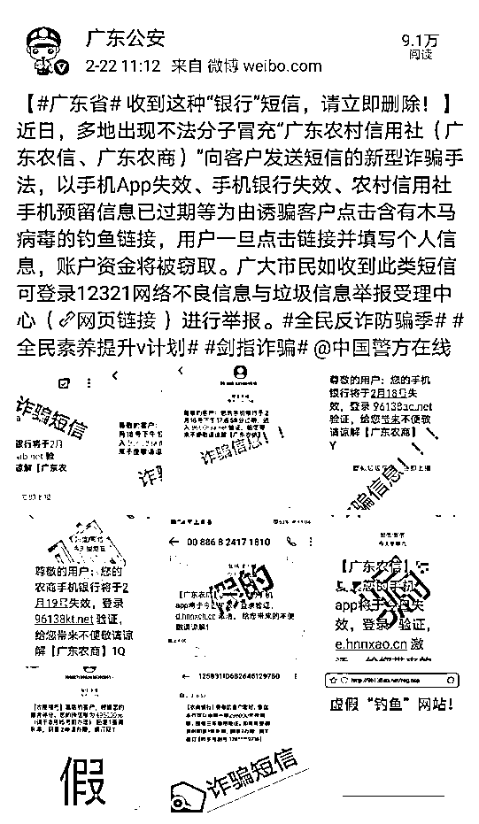
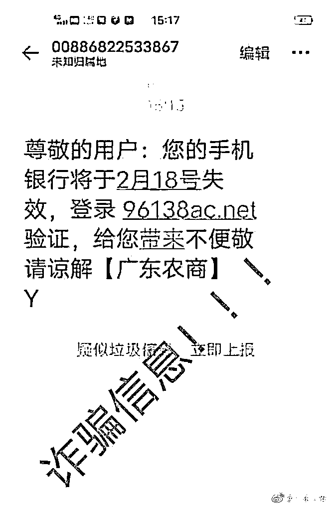
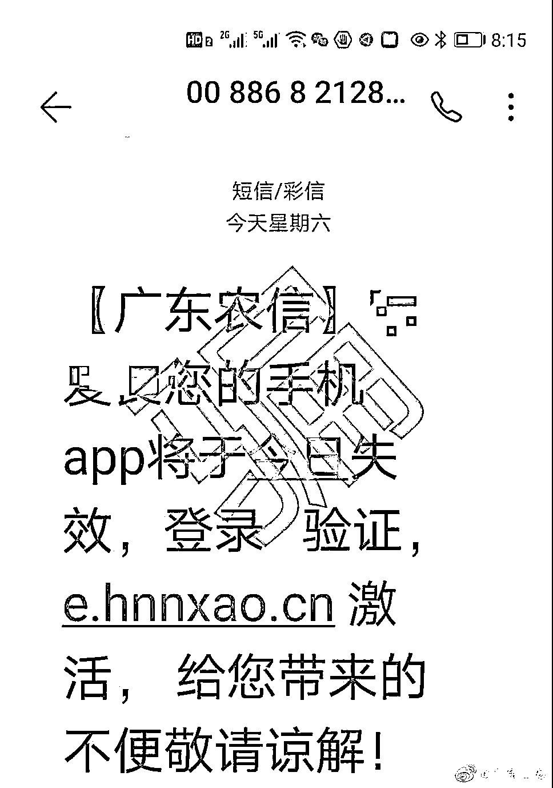
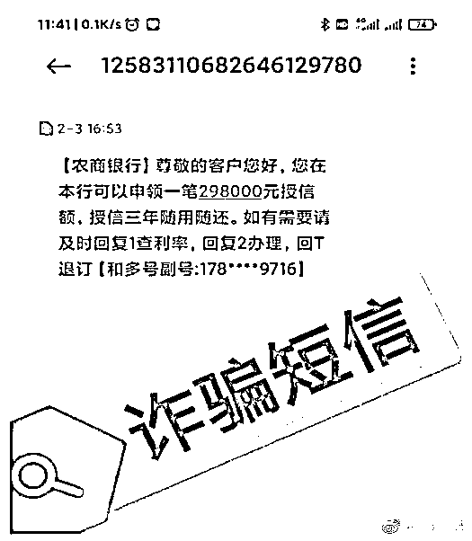
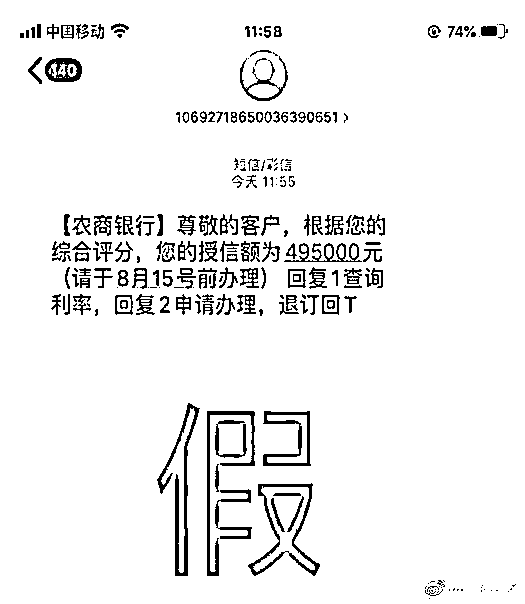
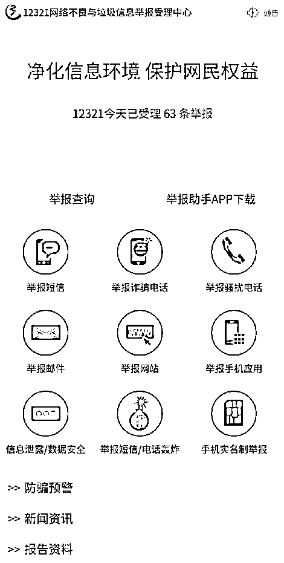
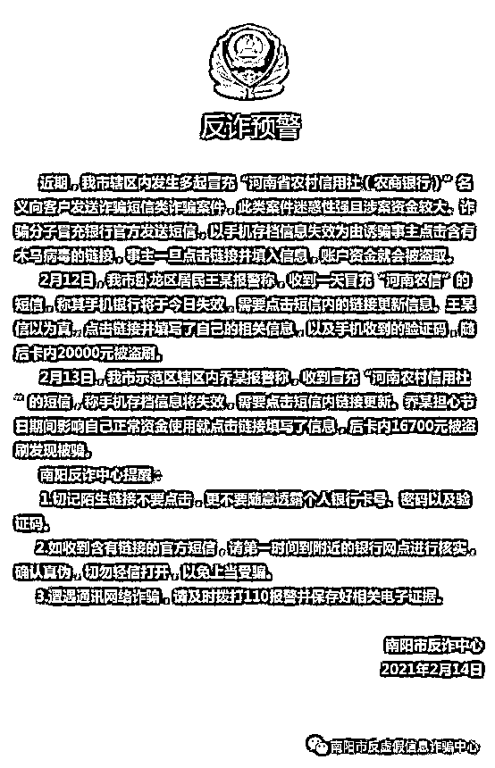
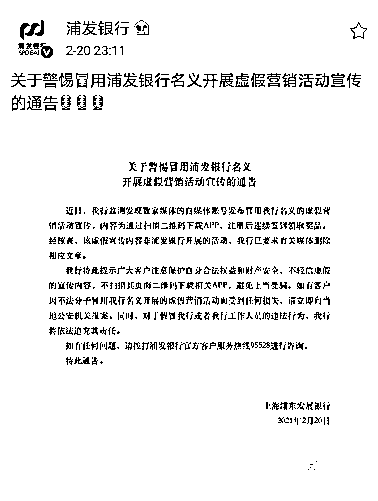
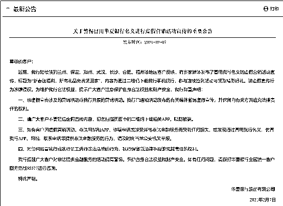

# 紧急扩散！多家银行被冒充！甚至惊动公安厅发微博…

> 原文：[`mp.weixin.qq.com/s?__biz=MzIyMDYwMTk0Mw==&mid=2247509865&idx=4&sn=d602b0eaa1798ba9f64c3e4b9aae1fdf&chksm=97cb6c51a0bce5478d9e50430f8f6656a5114b6e9669d27b859534939fe90f261929193a3871&scene=27#wechat_redirect`](http://mp.weixin.qq.com/s?__biz=MzIyMDYwMTk0Mw==&mid=2247509865&idx=4&sn=d602b0eaa1798ba9f64c3e4b9aae1fdf&chksm=97cb6c51a0bce5478d9e50430f8f6656a5114b6e9669d27b859534939fe90f261929193a3871&scene=27#wechat_redirect)

近期，陆续出现多起不法分子冒充银行事件，涉及包括农行、浦发、华夏等多家银行。相关银行接连发声，提示风险。

冒充农信社发送“钓鱼”链接

2 月 22 日，广东省公安厅官方微博“广东公安”发布消息表示，近日，多地出现不法分子冒充“广东农村信用社（广东农信、广东农商）”向客户发送短信的新型诈骗手法。

具体来看，这种手法以手机 App 失效、手机银行失效、农村信用社手机预留信息已过期等为由，诱骗客户点击含有木马病毒的钓鱼链接，用户一旦点击链接并填写个人信息，账户资金将被窃取。

广东省公安厅提醒，广大市民如收到此类短信，可登录 12321 网络不良信息与垃圾信息举报受理中心进行举报。 

另据“南阳市反虚假信息诈骗中心”2 月 14 日微信公众号消息，近期，河南省南阳市辖区内发生多起冒充“河南省农村信用社（农商银行）”名义向客户发送诈骗短信类诈骗案件，此类案件迷惑性强且涉案资金较大。

诈骗分子冒充银行官方发送短信，以手机存档信息失效为由诱骗事主点击含有木马病毒的链接，事主一旦点击链接并填入信息，账户资金就会被盗取。 

冒用银行名义开展虚假营销活动

除了发送木马病毒链接，“李鬼”们还频频冒用银行名义开展虚假营销活动。

2 月 20 日，浦发银行发布通告称，该行近日监测发现数家媒体的自媒体账号发布冒用该行名义的虚假营销活动宣传，内容为通过扫描二维码下载 APP，注册后连续签到领取奖品。经核查，该虚假宣传内容非浦发银行开展的活动，该行已要求有关媒体删除相应文章。

浦发银行提醒客户注意保护自身合法权益和财产安全，不轻信虚假的宣传内容。对于假冒该行或者该行工作人员的违法行为，浦发银行也将依法追究其责任。

无独有偶，2 月 7 日，华夏银行也在官网发布重要公告，该行近期陆续接到兰州、保定、郑州、武汉、长沙、合肥、福州等地区客户反映，有多家媒体发布了冒用该行名义的虚假营销活动宣传，内容为通过二维码下载该行手机银行，参与连续签到活动可领取精彩好礼。该虚假宣传行为涉嫌侵权。

华夏银行声明，请广大客户不要轻信虚假宣传内容。如有客户因虚假营销活动、非法网站和 APP、诈骗电话或接受其他非法金融服务而受到任何损失，或发现通过冒用该行名义、仿冒该行 APP、网站、联系电话等提供非法金融服务的行为，请及时向当地公安机关举报。

在今年 1 月 4 日，农行泰安分行也对防范冒用银行名义进行虚假宣传进行警示。该行表示，某公司存在冒用与该行合作名义进行虚假宣传的嫌疑。同时声明，该行业务信息以官方渠道发布为准，其他非官方渠道发布的虚假信息与该行无任何关系。

该行表示，该行依法合规为各金融信息服务、财富管理、投资理财等单位提供正常的开户和资金结算业务，但并不存在与金融服务外包、财富管理、理财投资类公司有“投资理财、增信担保、银行转贷承诺”等方面的合作关系，该行也未授权任何金融服务外包、财富管理、理财投资类公司使用农行标识进行宣传。

冒充银行名义办理贷款

此外，消费者还需警惕不法分子假借银行名义套取信息办理贷款等业务。

2 月 5 日，中山农商银行发布声明，提示防范冒用该行名义营销贷款业务。该行表示，发现有第三方冒用该行名义，自称是中山农商银行工作人员或中山农商银行合作机构，通过电话、短信、微信等方式，实施虚假宣传等非法行为。该行声明消费贷款业务以官方渠道发布内容为准。

1 月 27 日，贵州大方农商银行公告称，发现有不法分子冒用该行名义以低门槛办理贷款为由，收取中介费用。该行表示办理的信贷业务，不收取任何手续费用，且未委托任何第三方或个人办理该业务和收取中介费。

去年末，民生银行成都分行针对有关机构或个人冒用银行名义进行虚假宣传及涉嫌金融诈骗作出声明，表示有机构或个人自称是银行工作人员或银行合作机构，通过骚扰电话、微信加好友或发送【XX 银行】冒名短信（短信中可能包含高额度、低利率等诱骗性信息）等方式，实施虚假宣传或涉嫌金融诈骗等行为。该分行表示，民生银行产品在该行网上银行、手机银行、远程渠道或柜台进行销售，可通过官方渠道查询。

银保监会提示风险：

防范不法分子冒用银行保险机构名义非法集资

今年年初，银保监会在行业内部下发《关于防范不法分子冒用银行保险机构名义非法集资风险提示的通知》，称近期部分理财公司或平台虚假宣传与保险公司合作，声称投资项目由保险公司担保，保证投资资金安全。监测发现，相关主体涉嫌虚构投资项目、承诺高额收益、面向公众募集资金，存在非法集资隐患。其假借金融机构名义增信，一旦爆雷，风险极易向金融机构传染。

为有效防控应对此类问题，上述通知作出了如下提示：

一是各银行保险机构要加强舆情监测，持续搜集报刊杂志、广播电视、互联网等媒体上涉及本机构的广告资讯信息，发现有假借本机构名义开展非法集资活动的，立即报告监管部门，并视情公开警示风险，发现涉嫌犯罪线索及时向公安机关报案。

二是各银行保险机构要完善内控机制，强化员工、印章、办公场所管理，严防内外部人员利用本机构印章、网点、柜面、交易渠道开展非法集资等非法金融活动，筑牢风险“防火墙”。

三是各银行保险机构要履行好非法集资监测防控职责，积极开展面向公众的防范非法集资宣传教育，加大对账户交易、业务办理中涉嫌非法集资情况的监测识别力度，及时报告可疑线索，切实发挥风险防范“前哨”作用。

来源：中国基金报

← 向右滑动与灰产圈互动交流 →

