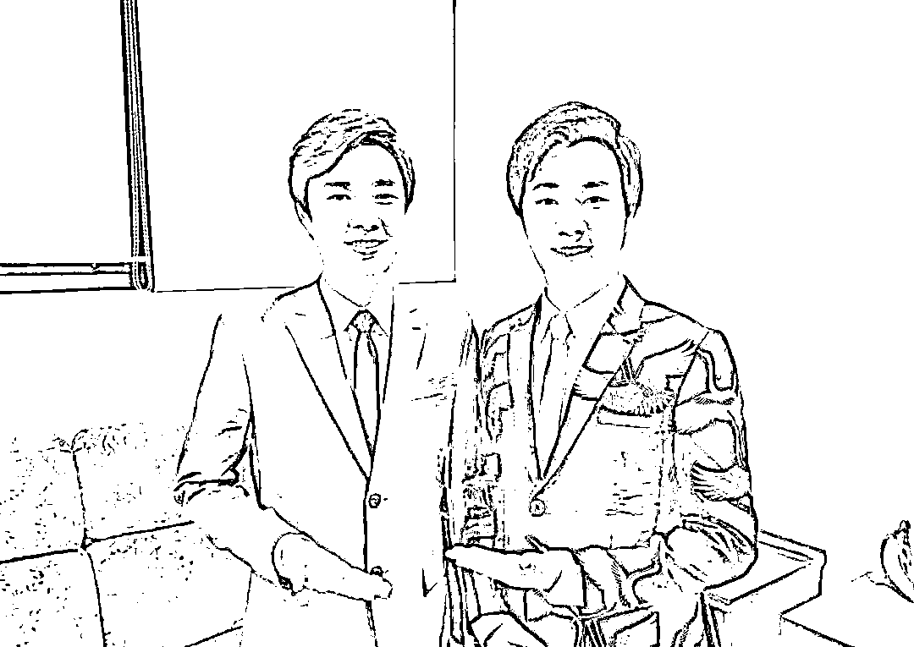
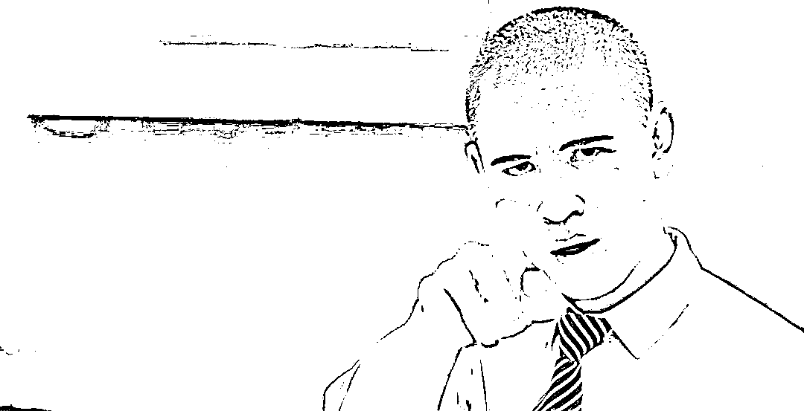

# 月入五十万，山寨明星产业链有多疯狂？

> 原文：[`mp.weixin.qq.com/s?__biz=MzIyMDYwMTk0Mw==&mid=2247510017&idx=3&sn=9e0b4cd6975c500110f19b6d6e27770f&chksm=97cb6339a0bcea2fde6aeef211869b08df30e3c439e9d3e0260cc71de16d040618703f2d9690&scene=27#wechat_redirect`](http://mp.weixin.qq.com/s?__biz=MzIyMDYwMTk0Mw==&mid=2247510017&idx=3&sn=9e0b4cd6975c500110f19b6d6e27770f&chksm=97cb6339a0bcea2fde6aeef211869b08df30e3c439e9d3e0260cc71de16d040618703f2d9690&scene=27#wechat_redirect)

 “明星模仿秀”曾经在中国的电视屏幕上流行过相当长一段时间，最近重新回归的《百变大咖秀》就是热潮下的产物。

不过与《百变大咖秀》请明星来模仿明星的机制不同，让长着明星脸的素人来山寨明星，才是长期以来广大模仿秀的主流。 

虽然随着电视的没落，模仿秀节目的风光大不如从前，但是“山寨明星”却已经由最初只为博人民群众一乐，发展成了一条隐秘而吸金的庞大产业链。

**从整容到圈钱，一条龙的山寨明星产业链**

想要山寨明星，拥有一张明星脸是最首要的一件事。 

如果天生长得像明星，那是老天赏饭吃；不过即便没有先天优势，如今发达的美容整形技术也可以帮你离明星脸更进一步。 

电影《整容日记》里有这样一个片段，一家整容医院里坐满了各种各样山寨明星脸，山寨成龙、山寨莫文蔚、山寨陈冠希……在现实生活中，这样的场景也真实存在着。

沈阳的一家整形医院搞店庆，就有一堆山寨明星前来助阵； 

曾经因与“山寨范冰冰”何承熹离婚而闹得沸沸扬扬的余小泉，其实就是前妻何承熹的整容主刀医生，他本人还拥有一家专门打造明星脸的整形机构。据他本人在媒体采访中称，机构已经成功 copy 了李嘉欣在内的十几位明星脸，机构营业额一年可达 3000 万。

余小泉，以及从他的机构里走出的山寨明星

在日益内卷的山寨明星圈，一些本身已经挺像明星的人也会为了精益求精，而去进行整形手术。 

拥有了明星脸后，第二步就是增加曝光。 

在从前，增加曝光的最好方式是上电视。早在 1999 年，北京电视台的《欢乐总动员》栏目就有了“超级模仿秀”环节。

**在娱乐相对贫乏的年代，和明星高达 95%相似度的素人对于人民群众而言算得上是一种奇观**，如果还能模仿明星唱个歌跳个舞就更加精彩了。 

随着模仿秀越来越火，从央视到地方卫视都推出了自己的模仿秀节目，比如《超级明星脸》《开门大吉》等等，一批山寨明星也从籍籍无名到走入寻常百姓家。

 “山寨葛优”王东林带领“周润发”、“李宗盛”、“梅艳芳”、“李小龙”等高仿明星以组合形式参加《中国达人秀》

另一档名为《明星转起来》的模仿秀节目

不过能够上电视的终究还是一小撮幸运的人，随着网络时代的来临，越来越多山寨明星们选择在抖音快手上迅速扩大自己的粉丝群。 

拿最为出名的周杰伦模仿者“雍杰伦”来说，他在抖音上拥有近 200 万粉丝，最近一条获得 200 多万点赞的视频，来自他和另一位山寨谢霆锋的梦幻联动。

除了“周杰伦”外，从王俊凯、蔡徐坤、易烊千玺等新生代流量，到杨洋、赵丽颖、迪丽热巴等小生小花，再到刘德华、周华健等更老一辈巨星，你都可以在短视频平台找到山寨版。 

除了娱乐圈明星，连马云这种商界大佬也有着数十个 copy 不走样的版本。

在马云的地盘山寨马云

其中抖音上最火的要属一个叫“JV 马总”的用户，他不仅长得和马云宛如同胞兄弟，同时还自己设计“有钱人炫富”等浮夸剧本，因此吸引了 1000 多万粉丝，日常随便发个视频作品都动辄有几十万点赞，比一些四五线明星还要再红一点。

在积累了一定人气后，就是山寨明星变现的时候了。 

在从前，许多山寨明星完全是草根式操作：没有经纪人、没有团队、没有公司，所以在接一些商业合作时常常吃亏。 

为了解决这种情况，越来越多明星加入了“中国山寨明星艺术团”、“明星帮”等山寨明星公司抱团取暖。这些企业常年承接各类商业演出、演唱会、品牌代言、电视栏目演出等，并为旗下艺人大力宣传。

有了公司这一整套成熟操作的加持，山寨明星们赚起钱来更加省心。外出商演时，公司往往还会给他们配备妆发、造型等随行人员。 

事实上，有着“中国第一模仿天团”之称的“明星帮”，就是由山寨演员创立的。“帮主”王东林是山寨版葛优，主管和总管则分别是山寨汪涵和山寨李宗盛。

号称“中国第一模仿天团”的“明星帮”，你能从中认出几张明星脸？

**年入百万不是梦：疯狂吸金的山寨明星们**

“跑商演”，对于山寨明星来说是最为常见的赚钱手段，三十八线小县城里那些热热闹闹的楼盘开盘现场、新店开张暖场、土豪婚礼仪式等，这些山寨明星们甚至呈现出供不应求的局面。

跑地产活动的山寨伍佰 

在网上曝光的明星商演价目表里，邀请一位有点咖位的明星演出，少则几十万多则几百万，越是观众熟悉的面孔报价越高。那么与之相对应的，山寨明星商演的价格又如何呢？ 

根据财经媒体 AI 财经社的报道，山寨明星的商演报价高低，取决于他们到底有多像本尊。如果相似程度一般，一场商演的价格在七八千左右；如果长得极为相像，报价就可以上涨到一场 1-2 万，碰上年底旺季或热门活动还可以再涨价。 

除此之外，他们接的产品代言，仅仅两年的合约就能赚上五万到七万，一张像素不太高的照片印在产品上，能起到迷惑消费者的作用。

山寨周杰伦接的代言 

在山寨明星的鄙视链里，长得越像也意味着能接到更多的单，最红的那些山寨明星一个月可以接到 20 多场商演，按 12000 元一场来算，月收入也有 25 万左右。 

这对于比较红的山寨明星来说，是一个比较平均的收入水平。根据腾讯娱乐的报道，在明星帮帮会，年收入 100 万算不上什么；年收入 300-400 万，才能算得上帮会里的红人。

早在 2013 年前后，模仿秀最火的那几年，模仿梅艳芳的演员张丽就已经能够轻松年入百万，汪涵的模仿者张强当时就表示：年入四五百万也是有可能的。

在商演方面，山寨明星走的是薄利多销路线：尽管单次报价仅为明星的一个零头，但却因为足够便宜而能接到更多的活儿。 

对商人来说，高仿意味着性价比。正如一些人愿意氪金买高仿 LV 包包一样，无非是想有一些能装点门面的大牌但又不舍得花正品的钱而已。便宜的高仿明星们能给不明就里的观众带来和明星相似的视觉冲击。**与其请一个十八线小明星，不如请一个价格相当的山寨巨星来得性价比更高。 **

有数据显示，山寨明星背后的公司每年从正牌明星那里截胡的演唱会，就多达一千场。日积月累，山寨明星的商演收入丝毫不逊于二三线小明星。 

在周华健山寨者孟华健就常常在抖音里发布自己活跃于各大商演场合的视频，所到之处都受到观众的热烈欢迎。他还曾和雍杰伦一起在北京的 livehouse 里开过一场演唱会，门票售价 220 元。

除了商演之外，山寨明星还有很多赚钱手段。 

一个是靠直播赚取打赏和流量补贴，并且推广商品赚取广告费。在“雍杰伦”的推广商品橱窗里，从眼影到水果，甚至绞肉机，应有尽有，单个商品的浏览量往往就有几十甚至上百万。

赵丽颖的模仿者，一场直播下来就可以收到上百万打赏。

如果哪天想退隐江湖，这些山寨明星的账号也可以卖个好价钱。根据中新经纬的报道，账号的价格按粉丝数量算，1 万个粉丝 700 元，那么接近 200 万粉丝的山寨明星号可以卖什么价格，你也可以估计了。 

除了打广告、搞直播、跑商演，山寨明星们还有一条鲜少被提及的黑色牟利手段。一位任贤齐模仿者曾对媒体表示，有人联系他炒作，安排他假装任贤齐，被狗仔拍到从三流宾馆走出来，再拿这些照片去卖给媒体赚上一笔。 

尽管这位任贤齐模仿者拒绝了这种要求，但我们很难说，这背后又有多少山寨明星在巨大的利益面前，接受了这种明显有违职业道德底线的赚钱方式。 

**他们到底是不是在钻法律漏洞？**

山寨明星们被明星本尊告上法庭的案例，也有过好几起。 

2015 年，“山寨汪峰”丁勇在自己的演唱会海报上使用了“汪峰”的真名，并在为演唱会宣传的微博里使用了汪峰本人的 4 张照片。汪峰一怒之下将丁勇以侵犯姓名权和肖像权为由告上法庭，要求赔偿 50 万。

丁勇本人一开始的态度很强硬，在微博回应称“长得像是我的错吗？”之后态度急转直下，在微博道歉称自己“本是热爱音乐，而今却改途易辙、一错再错，只因欲望是内心的魔鬼”。最终法庭判定丁勇确实构成对汪峰的侵权行为。 

除了汪峰之外，林俊杰也不堪山寨明星之扰。一个名叫范一贤的人从 2012 年开始就靠着模仿林俊杰捞金，后来干脆直接冒充林俊杰本人，在海报上写“我和 JJ 林俊杰有个约会”，并开酒吧做商演赚钱。

韩红发微博指责他，“模仿秀，我们能接受，因为都要活着，要吃饭，放你们一马，但是你用‘林俊杰’的名字欺骗消费者实在太无耻！” 

而 JJ 的经纪公司也表示，其实他们早就对这个模仿者的行为不满，但是却苦于收集不到证据。 

事实上，山寨明星只要学会打一点擦边球，就能让人抓不到把柄，比如在宣传时，在明星的名字后面小小地标注“模仿秀”，或是对明星的名字略加改动，就可以钻到法律的漏洞里。

比如有个模仿伍佰的台湾山寨明星，就把自己的艺名改为“月光伍佰”，每每走穴演出时，广告中的“月光”二字都被刻意缩小。在一些商演场合，他甚至被当成伍佰本人来做宣传。

在一次苏州地产商演时，主持人没有认出这位月光伍佰是山寨的，直接把这位他介绍成伍佰本人，他也没有否认澄清，继续以伍佰的身份进行表演。后来被粉丝和伍佰经纪团队公开指责后，他才乖乖道歉。 

类似事件层出不穷：在婚礼献唱的“山寨腾格尔”，被经纪人和粉丝斥责唱的都走音了；走商演的“山寨高晓松”，被高晓松本人发微博指责，称自己比这位山寨者要高得多、瘦得多。

不过，在法律层面上来说要追究这些山寨明星并不容易，因为有着许多模糊地带。

比如，如果是本人真的 99%酷似明星本尊，或者整容成明星的样子，在商演时用自己以假乱真的照片宣传，算不算侵权？如果不直接用明星的名字，而是使用“小林俊杰”、“阿伦”等名字做宣传，算不算侵权？ 

一位知乎法律答主周俊武分析道，**“倘若山寨明星只是尽力模糊自身特征但并不直接使用本尊大名，就并不会构成姓名权侵权；其次，能否把整容行为解释为侵犯他人肖像权，存在一定的不确定性；最后，并非所有仿冒明星的情况都足以构成名誉权侵权，若明星的社会评价没有因山寨行为降低时，则很难主张山寨者构成名誉权侵权。” **

一次又一次的道歉事件，给山寨明星们留下的经验教训或许只是下一次打擦边球时如何更不留痕迹。  

**成也明星，败也明星：他们都活成了别人的影子**

那么，山寨明星最后的归宿是哪里呢？ 

在他们之中，不乏和明星本人保持着良好关系的：

“山寨费玉清”费包包曾多次和费玉清同台演出；

“山寨汪涵”张强——也就是“明星帮”的总管，曾获得汪涵本人的鼓励；

“山寨陈小春”马永新则因为拒绝了商业活动要他冒充陈小春的需求，获得陈小春本人转发点赞。

也有一些，最后走上了“正途”。周展翅早年凭借模仿周杰伦在模仿秀节目中获得冠军，后来却逐渐往歌手和演员的身份发展，推出个人原创单曲《山寨大王》，并且出演了好几部电影电视剧。

曾参演《让子弹飞》《龙门飞甲》《狄仁杰探案》《智取威虎山》等多部电影电视剧的演员杜奕衡，早年最知名的标签其实是“山寨刘德华”，他也是刘德华用过最久的替身。

不过像这样最终能够走出明星光环的山寨明星，只是这个庞大群体中极为个别的例子。更多的人，可能要花费一生的时间，往“和明星 100%相似”这个几乎不可能的终极目标而努力。 

作为“明星的影子”，他们的命运并不完全掌握在自己手中。随着模仿的那位明星的星途起伏，山寨明星们的命运也随之波动，一荣俱荣，一损俱损。

曾经是名保安的肖基国，为了专职模仿奥巴马而辞了工作，但是随着奥巴马卸任总统，他本人也跟着没那么红了。

模仿赵本山 25 年的张二楞，曾经一招鲜吃遍天，不仅凭借山寨赵本山这一门绝活找到了工作，在深圳买房买车，还收了许多徒弟。 

在他最红的那段时间，去外地演出时不仅有两辆专车接送，还有专职随行人员，他觉得自己真的成了腕儿，找上门来的商演，他都会挑选一番，尽管如此依然吃穿不愁。 

然而随着赵本山在 2014 年底被卷入负面舆论风波，张二楞也开始变得不安起来，焦虑得睡不着，他在公开场合举牌“力挺赵本山”，但演出机会还是肉眼可见地减少了。

到最后他不得不接一些从前根本瞧不上的陪酒的单子。

他说自己也不是没想过走出赵本山的影子，但是“表演你自己，还要获得这么多人来看，这条路真的太难了”。 

参考资料：

AI 财经社：山寨明星乱象：商演接到手软，碰瓷明星拍广告，有人一个月赚 25 万

南都深呼吸：山寨明星的模仿浮生

腾讯娱乐：山寨明星现状调查

← 向右滑动与灰产圈互动交流 →

