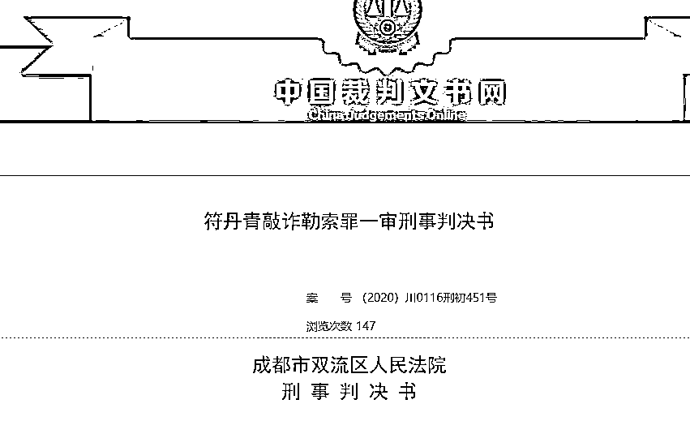
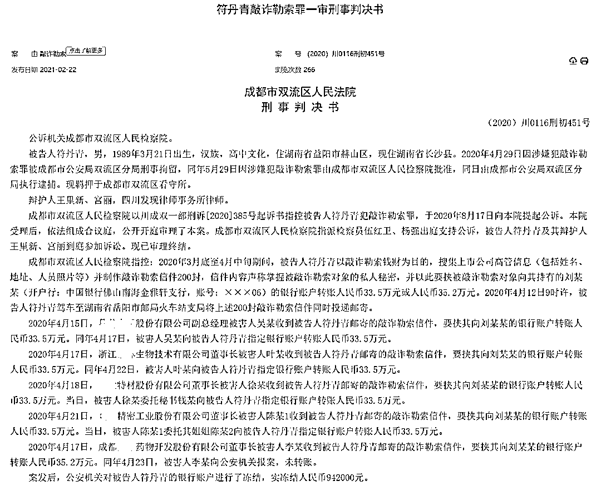

# 高中学历男子写 200 封信件敲诈上市公司高管，真有人乖乖打钱了！

> 原文：[`mp.weixin.qq.com/s?__biz=MzIyMDYwMTk0Mw==&mid=2247510017&idx=4&sn=5651e8542d60c81c655a006d3aa7263d&chksm=97cb6339a0bcea2fc2b61fe54693425f056a7dd0df84b4654f09ccbbf7e6c71f1f194948e3e2&scene=27#wechat_redirect`](http://mp.weixin.qq.com/s?__biz=MzIyMDYwMTk0Mw==&mid=2247510017&idx=4&sn=5651e8542d60c81c655a006d3aa7263d&chksm=97cb6339a0bcea2fc2b61fe54693425f056a7dd0df84b4654f09ccbbf7e6c71f1f194948e3e2&scene=27#wechat_redirect)

一个高中学历的 80 后，用了一个月不到的时间，制作了 200 封敲诈勒索信，寄给了各大上市公司高管，有几家公司高管也不报警，老老实实打钱，一下被骗了 134 万！

**网友不禁怀疑，高管们到底藏了多少秘密？******

****近日，成都市双流区人民法院披露《符丹青敲诈勒索罪一审刑事判决书》，为我们披露了这桩“奇案”的来龙去脉。**** 

********

****多家上市公司高管老实打钱************

****2 月 22 日晚，中国裁判文书网披露《符丹青敲诈勒索罪一审刑事判决书》显示：**** 

****2020 年 3 月底至 4 月中旬期间，1989 年出生的被告人符丹青冒充新闻记者，以敲诈勒索钱财为目的，搜集上市公司高管信息（包括姓名、地址、人员照片等）并制作敲诈勒索信件 200 封，声称掌握被敲诈勒索对象的私人秘密。并以此要挟被敲诈勒索对象向其持有的刘某某的银行账户转账人民币 33.5 万元或人民币 35.2 万元。****

****2020 年 4 月 12 日 9 时许，符丹青驾车至湖南省岳阳市邮局火车站支局将上述 200 封敲诈勒索信件同时投递邮寄。****

******最后，还真有四家上市公司的高管中了招，给符丹青打了钱。******

******判决书显示：******************

******2020 年 4 月 15 日，奥 X 家居股份有限公司副总经理被害人吴某收到被告人符丹青邮寄的敲诈勒索信件，要挟其向刘某某的银行账户转账人民币 33.5 万元。同年 4 月 17 日，被害人吴某向被告人符丹青指定银行账户转账人民币 33.5 万元。******

******2020 年 4 月 17 日，浙江泰 X 生物技术有限公司董事长被害人叶某收到被告人符丹青邮寄的敲诈勒索信件，要挟其向刘某某的银行账户转账人民币 33.5 万元。同年 4 月 22 日，被害人叶某向被告人符丹青指定银行账户转账人民币 33.5 万元。******

******2020 年 4 月 18 日，广 X 特材股份有限公司董事长被害人徐某收到被告人符丹青邮寄的敲诈勒索信件，要挟其向刘某某的银行账户转账人民币 33.5 万元。当日，被害人徐某委托秘书钱某向被告人符丹青指定银行账户转账人民币 33.5 万元。******

******2020 年 4 月 21 日，瑞 X 精密工业股份有限公司董事长被害人陈某 1 收到被告人符丹青邮寄的敲诈勒索信件，要挟其向刘某某的银行账户转账人民币 33.5 万元。当日，被害人陈某 1 委托其姐姐陈某 2 向被告人符丹青指定银行账户转账人民币 33.5 万元。******

************

********只有高中学历的符丹青还真的成功敲诈了 4 家 A 股上市公司高管，合计敲诈 134 万元。********

****这 134 万，符丹青先花了 10 万，又买了 30 万的理财产品。****

****一公司高管报警****

****嫌疑人最终落网****

********

******那这件事是怎么曝光的呢？有个公司老总，选择了报警。******

****判决书显示，2020 年 4 月 17 日，成都 X 导药物开发股份有限公司董事长被害人李某收到被告人符丹青邮寄的敲诈勒索信件，要挟其转账人民币 35.2 万元。****

****5 天之后，被害人李某向公安机关报案，未转账。****

****最终警方调查，2020 年 4 月 29 日，符丹青因涉嫌犯敲诈勒索罪被成都市公安局双流区分局刑事拘留，同年 5 月 29 日因涉嫌犯敲诈勒索罪由成都市双流区人民检察院批准，同日由成都市公安局双流区分局执行逮捕，羁押于成都市双流区看守所。从 4 月 17 日收到第一笔敲诈款，到 4 月 29 日被成都警方刑拘，时间还不到两周。****

********

****最后怎么判？************

****法院审理查明，符丹青收到 4 被害人转账人民币 134 万元后，其中人民币 10 万元被其消费耗用，其中 30 万元人民币被其购买理财产品，现已到期并存入该账户内。公安机关已将该银行账户冻结，该账户现有存款余额人民币 1243493.13 元。****

****2020 年 9 月 3 日，被告人符丹青通过其辩护人宫丽律师向本院退缴赃款人民币 28500 元，该款现暂存于法院账户。****

******成都市双流区人民法院认为，被告人符丹青以非法占有为目的，冒充新闻记者以揭露他人隐私的方式敲诈勒索多人财物，数额特别巨大，其行为已构成敲诈勒索罪，依法应追究其刑事责任。**成都市双流区人民检察院起诉指控事实和罪名成立，成都市双流区人民法院予以支持。****

****公诉机关认为，被告人符丹青以非法占有为目的，敲诈勒索他人财物，数额特别巨大，其行为触犯了《中华人民共和国刑法》第二百七十四条之规定，应当以敲诈勒索罪追究其刑事责任。鉴于被告人符丹青系初犯、如实供述、自愿认罪认罚，建议判处有期徒刑 10 年至 11 年，并处罚金人民币 10 万元至 15 万元。****

****被告人符丹青当庭表示，对公诉机关起诉指控基本犯罪事实及罪名量刑建议无异议，并自愿认罪认罚且签字具结，但提出其系主动投案，并主动交代公安机关尚未掌握的其他罪行，系自首。其辩护人提出敲诈勒索被害人李某系未遂，其系初犯、偶犯，如实供述，认罪悔罪态度好，有立功情节，家庭困难，积极退赔，请求从轻处罚。****

****鉴于被告人符丹青如实供述并自愿认罪认罚、主动退赔部分赃款，成都市双流区人民法院在量刑时酌情予以从轻处罚。最终判决如下：****

****一、被告人符丹青犯敲诈勒索罪，判处有期徒刑 10 年 6 个月，并处罚金 15 万元。****

****二、分别退赔被害人吴某、叶某、陈某、徐某各 33.5 万元，不足部分继续予以追缴后退赔被害人。扣押在案的手机 1 部、笔记本电脑 1 台、U 盘 1 个、平安银行卡 1 张、中国银行卡 1 张依法予以没收并销毁；扣押在案的其他银行卡 3 张由原扣押机关依法处理。****

****网友热评****

****@Zlink:****

****想看看那些敲诈信，太好奇了！****

****@韩振:****

****也是个天才，这么多高管都能被一招制服，到底是什么样的敲诈信？****

****@浩然之气:****

****打钱的是不是心虚？********来源：潇湘晨报********************

****← 向右滑动与灰产圈互动交流 →****

********