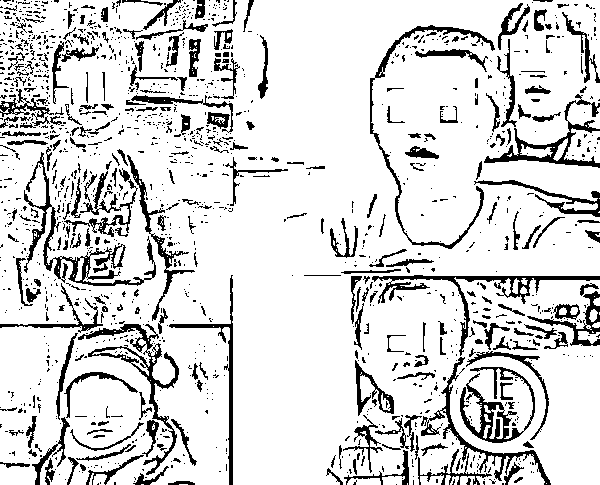
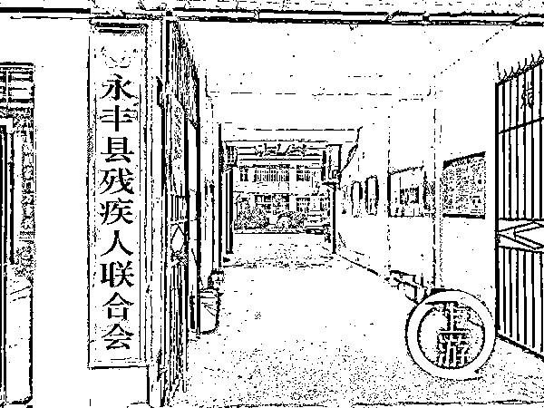

# “小马云”最新消息：鉴定为智力二级残疾

> 原文：[`mp.weixin.qq.com/s?__biz=MzIyMDYwMTk0Mw==&mid=2247510017&idx=5&sn=a0543e80e9d5ad423197ccb12ed3dbae&chksm=97cb6339a0bcea2f7e0f8011351155dd6ab8a836025ed7a5b1c09f360db76a44ea3e08367117&scene=27#wechat_redirect`](http://mp.weixin.qq.com/s?__biz=MzIyMDYwMTk0Mw==&mid=2247510017&idx=5&sn=a0543e80e9d5ad423197ccb12ed3dbae&chksm=97cb6339a0bcea2f7e0f8011351155dd6ab8a836025ed7a5b1c09f360db76a44ea3e08367117&scene=27#wechat_redirect)

[`mp.weixin.qq.com/mp/readtemplate?t=pages/video_player_tmpl&action=mpvideo&auto=0&vid=wxv_1754430750960992258`](https://mp.weixin.qq.com/mp/readtemplate?t=pages/video_player_tmpl&action=mpvideo&auto=0&vid=wxv_1754430750960992258)

澎湃新闻记者：王佳珺 编辑：胡宝秀 实习生：武菲菲 素材来源：网络 责任编辑：周琦 校对：栾梦

2 月 24 日下午，记者从江西省永丰县残联处获悉，经“小马云”范小勤父亲范家发申请，永丰县残联已于 2 月 22 日为范小勤办理了残疾证，经专业机构鉴定，范小勤系智力二级残疾。

“小马云”范小勤。  本文图均为 上游新闻 图

永丰县残联副理事长陈广圣介绍，在范小勤办理残疾证次日，哥哥范小勇也向县残联申请办理了残疾证。经鉴定，范小勇系智力三级残疾，比弟弟轻一点。

“按照政策，两兄弟可获得每月数十元的护理补贴和数十元的残疾生活补助。相应证件预计下周发放，到时候可由监护人来领取，或者我们委托镇政府工作人员送过去。”

永丰县残联副理事长陈广圣介绍，经申请，他们已为范小勤、范小勇办理了智力残疾证件。 

永丰县委宣传部工作人员此前曾告诉记者，“小马云”范小勤于 1 月 6 日回到石马镇严辉村，将到村小继续上学。届时，范小勤将会到该校四年级就读。校长表示，将结合范小勤实际学习情况，制定具体施教方案。

今年 14 岁的范小勤由于长相神似阿里巴巴创始人马云而受到包括马云本人在内的广泛关注。

陈广圣介绍，范小勤妈妈也有类似智力残疾，但没有来办理残疾证，父亲范家发有肢体残疾。

2 月 24 日，永丰县石马镇严辉村，范小勤的哥哥范小勇在村中小卖部挑选水果。

记者从永丰县民政局了解到，当地民政部门已为范小勤全家办理了低保。 

2 月 24 日，记者来到严辉村采访，未见范小勤父子，家中留下母亲和哥哥。范小勇告诉记者，弟弟已去南京。不过，这一说法被范小勤的表哥黄新龙否认。

“22 日本来我带他们一起去南京的，有个老板愿意资助他们，但被村里叫回去了。22 日中午，我在南昌打了个的士，把他们送回去了，现在哪里，我也不知道。”黄新龙说。

来源：澎湃新闻、上游新闻、潇湘晨报

← 向右滑动与灰产圈互动交流 →

