# 14 岁少女追星被骗近 6 万！警方发布紧急预警

> 原文：[`mp.weixin.qq.com/s?__biz=MzIyMDYwMTk0Mw==&mid=2247510017&idx=6&sn=5df65cb73777b9058bf9b3ba8d36bb1e&chksm=97cb6339a0bcea2f7df47ec11552d956be1b9ff3b4245e7a3ae19b59bf41bcc9423ed4bc029c&scene=27#wechat_redirect`](http://mp.weixin.qq.com/s?__biz=MzIyMDYwMTk0Mw==&mid=2247510017&idx=6&sn=5df65cb73777b9058bf9b3ba8d36bb1e&chksm=97cb6339a0bcea2f7df47ec11552d956be1b9ff3b4245e7a3ae19b59bf41bcc9423ed4bc029c&scene=27#wechat_redirect)

你的账号做过违规事情！ 

你是未成年人

所以你的父母要为你顶罪坐牢！

你要好好配合我们的调查！

▲骗子诈骗话术

近日

一起不法分子冒充警察

恐吓诈骗未成年人的案件

引发广泛关注

2 月 1 日，浙江 12 岁女孩小英（化名）

收到一条网络好友发来的消息

该好友是小英十几天前添加的

之前未曾联系过 

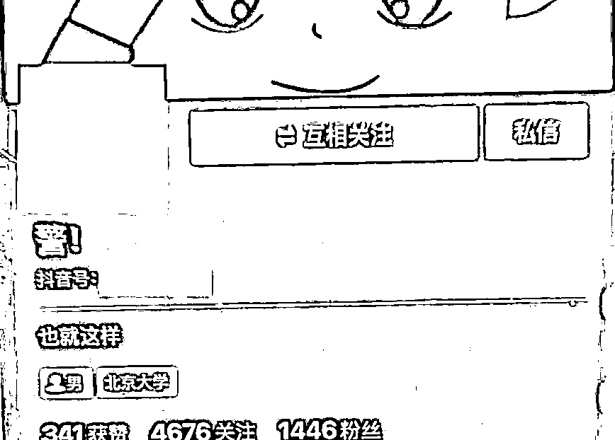

小英好奇地点开消息

没想到对方却是不怀好意

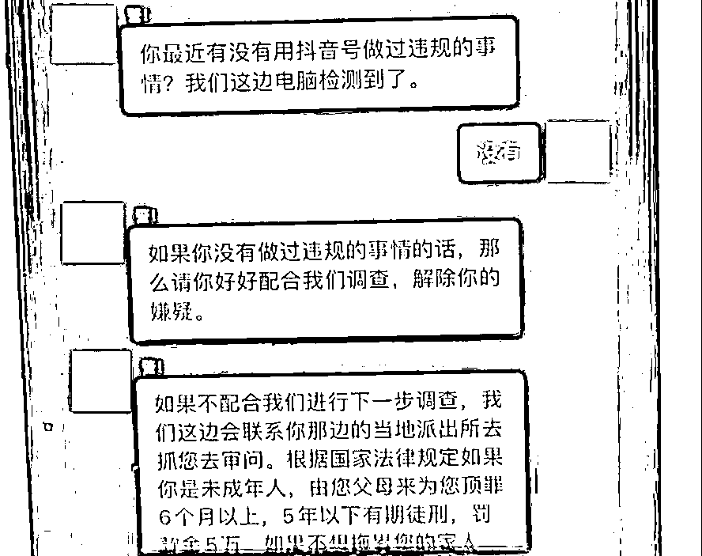

对方同时发送来一段视频 

内容为派出所接处警大厅景象

小英顿时慌了神

一下就相信了对方的话

害怕父母被抓走

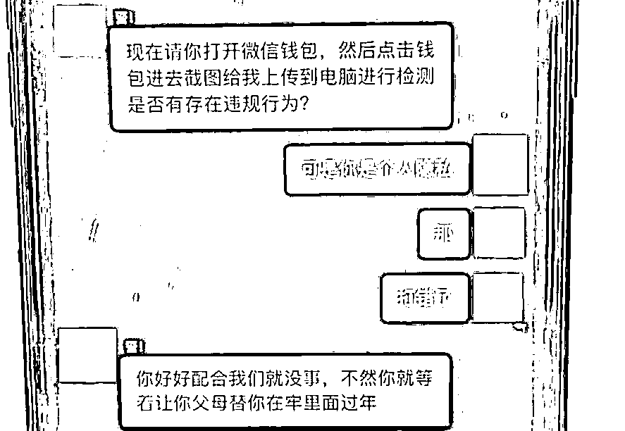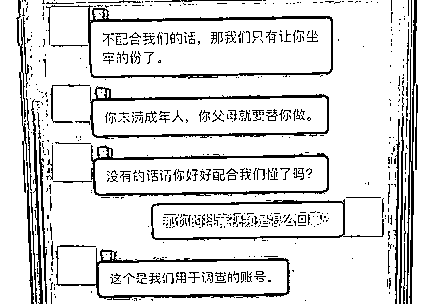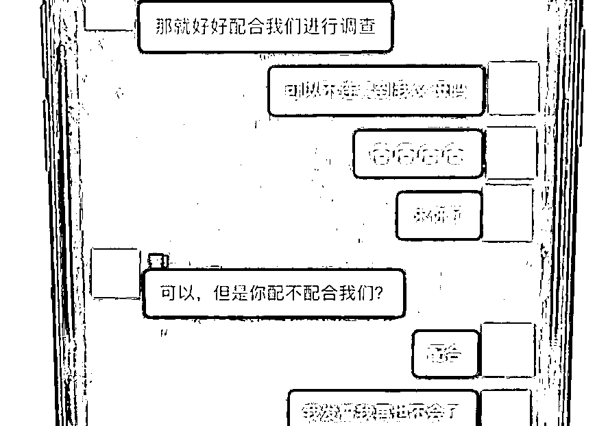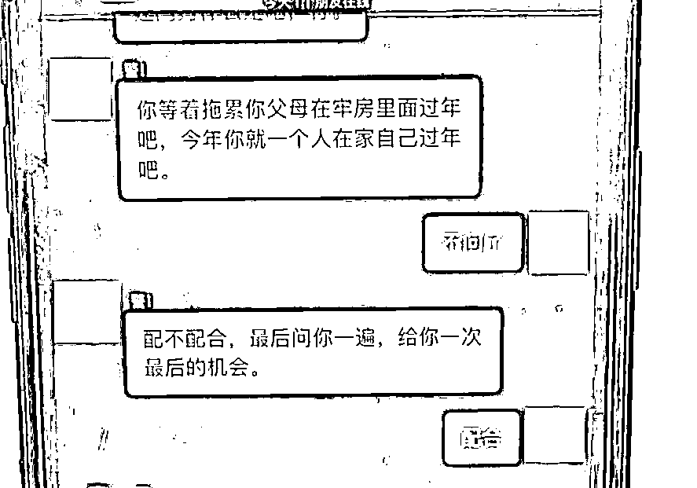▲左右滑动查看更多

随后，小英按照对方的要求

将账号内的 5000 余元尽数转给对方

又按对方的要求注销了微信支付功能 

事后，小英越想越觉得不对劲

于是把这件事告诉了父亲

小英的父亲意识到女儿被骗了

于是赶紧带着小英到派出所报警

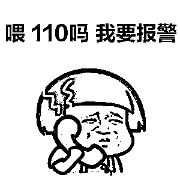

这种诈骗手法主要针对

**社会经验较为缺乏、**

**判断力不够强的未成年人**

不仅如此

诈骗分子还“炮制”了各式诈骗手法

专门向未成年人下手

近日，广东多名学生中招

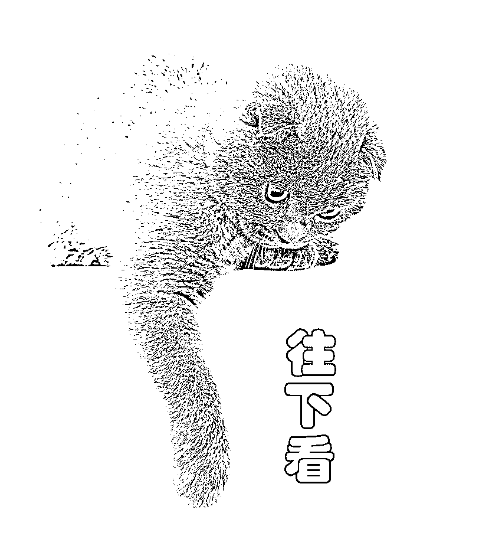

14 岁少女追星路上被骗近 6 万元

2 月 9 日，佛山 14 岁学生小珍（化名）

通过同为“追星族”的网友介绍

加入了一个“XX 全国粉丝群”

顺利找到了“组织”

2 月 11 日晚，该粉丝群发出一个通告

称目前有一个回馈“粉丝”的福利

只要进行简单的操作证明不是“黑粉”

就可以送偶像签名照

**并且不收取任何费用**

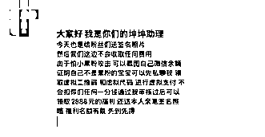

随后，该群的管理员

发出一个收款二维码

并称需要扫描“虚拟二维码”

进行 99 元的“虚拟支付”来确定名额

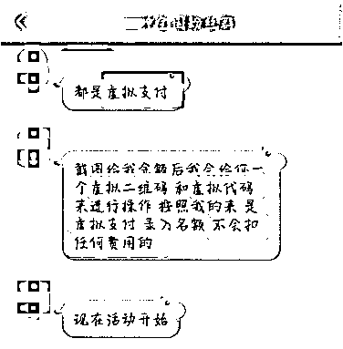

想着可以免费拿到偶像签名照

小珍抱着试一试的心态

转账了 99 元给对方

不久后

“坤坤助理”突然询问小珍年龄

得知其只有 14 岁后

立马称公司规定不允许收取未成年人的钱

还表示要把钱退给小珍

随后，小珍根据对方指示的“退款”操作流程

**分别向对方转账 8001.31 元、10100 元**

**以及两笔 20200 元**

当小珍问对方款项什么时候退还时

却发现自己已被对方“拉黑”

慌乱的小珍只能向父母坦白

并于 2 月 12 日到派出所报警求助

为免费领取礼物 小学生被骗 20 万余元

2 月 16 日晚 

佛山南海小学六年级学生小新（化名）

在用母亲手机玩 QQ 期间

在一个名为“X 泽哥哥生日派对现场群”内

看到一条消息称只要扫个码

就能免费领取生日派对礼物

随后，对方发来一个微信收款码

并承诺扫码不会成功支付

只要将支付失败的页面截图给他即可

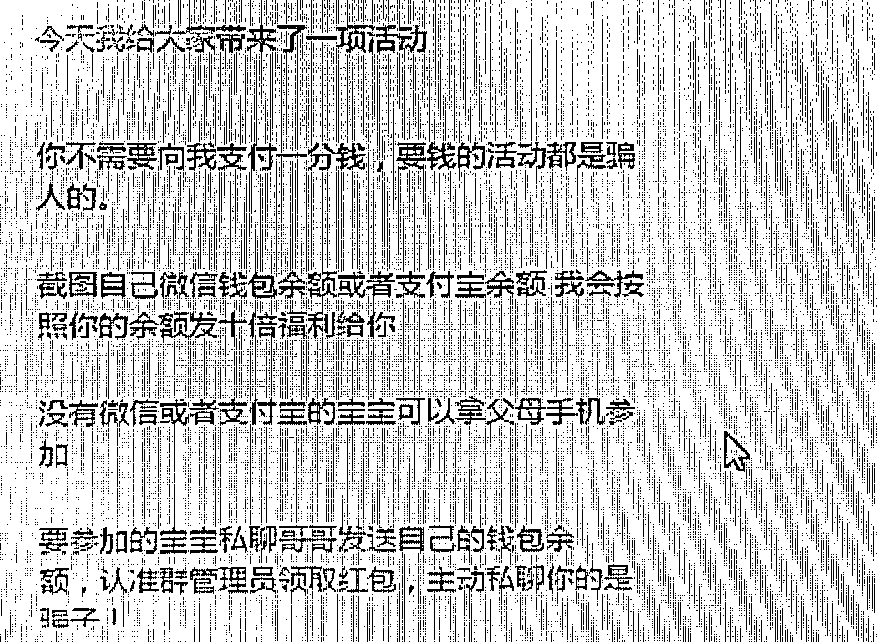

因小新曾多次用母亲的手机网购

知道母亲微信支付密码

一心想得到礼物的她没有多想

就将 66.66 元转给了对方

但令小新没想到的是

她竟然支付成功了

于是急忙要求对方退款

对方遂将其拉进另一个群

并要求其添加财务人员为 QQ 好友

称对方会帮忙办理退款

2 月 17 日，该“财务人员”以办理退款为由

让小新登录母亲微信

将微信零钱内的 7701 元转账给其

并承诺操作完后将全数退回

急于拿回退款的小新添加了对方微信

并将 7701 元全部转给了对方

然而退款并未如期到来

“财务人员”又要求小新在微信上进行贷款

小新当即拒绝

但“财务人员”威胁如不按要求操作

就会影响其母亲的征信，还会持续扣钱

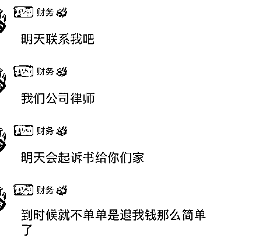

此时十分害怕的小新只好偷偷申请贷款

为了避免母亲责备，在人脸认证时

小新欺骗母亲称是为了完成网络作业

需要拍照作为证明

小新的母亲没有多想，便让小新拍照上传

最终，**小新分多次共贷款 20 万元** 

随后，“财务人员”又要求小新

在一个购物小程序里购买购物卡等物品

就这样，**小新分 10 次将 20 万元转给了对方**

直到小新再次按照对方要求提供银行卡

并在寻找银行卡时被母亲发现

才知道自己被骗了

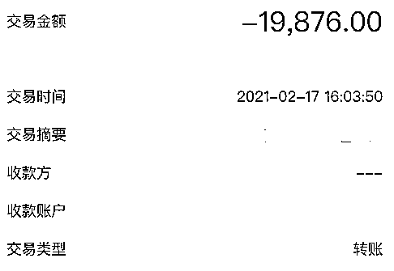

针对近期诈骗未成年人的案件高发

警方发布紧急预警

家长们一定要留心孩子的上网内容

警惕孩子的支付需求

**要求先汇款、转账、扫码缴费的**

**全是诈骗**

孩子们也要提高警惕

这份防诈指南

家长和孩子都要认真看

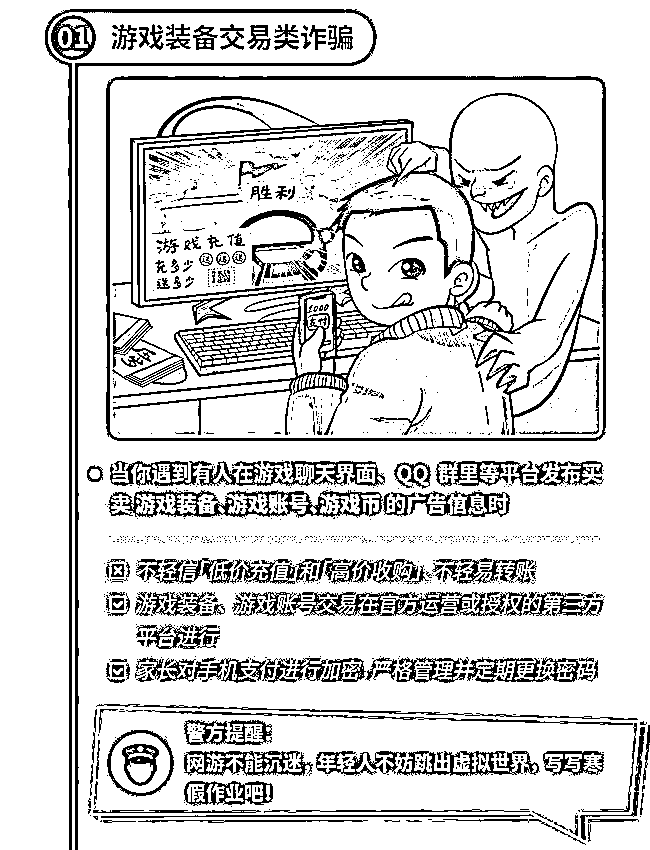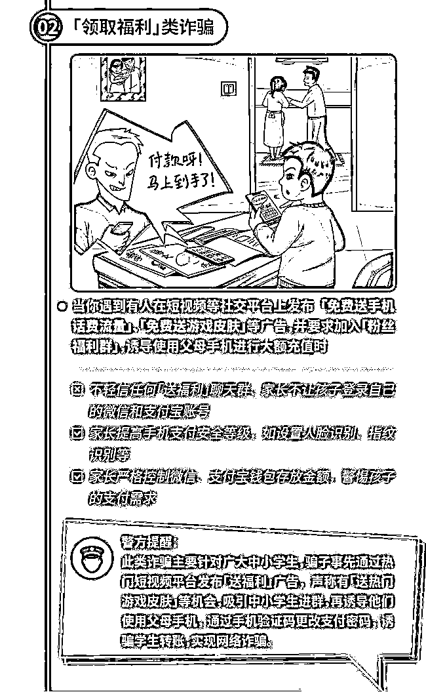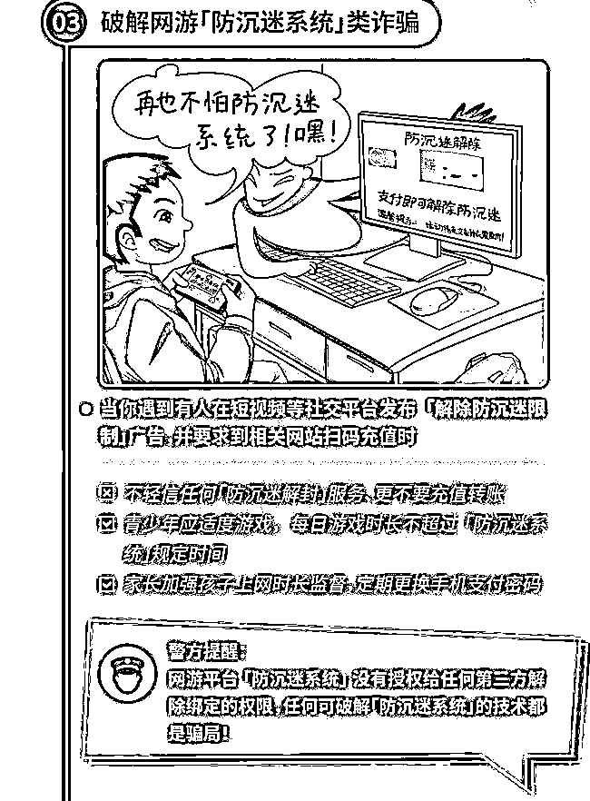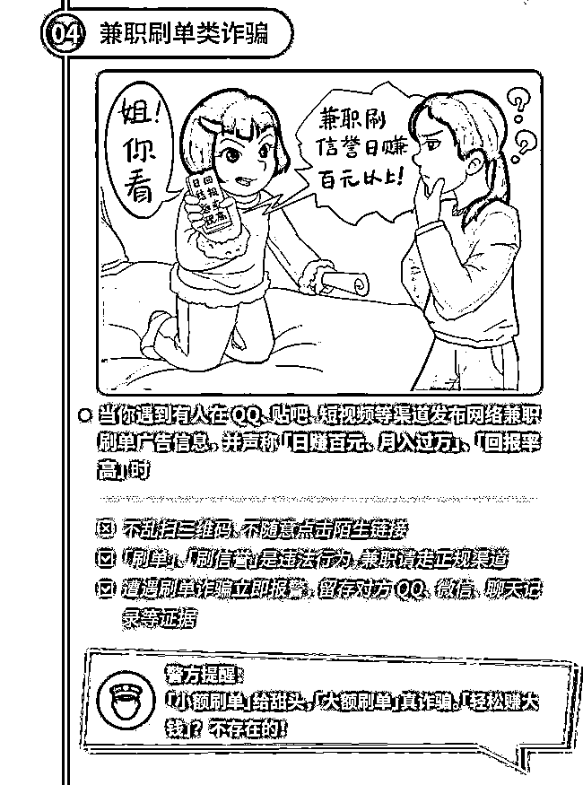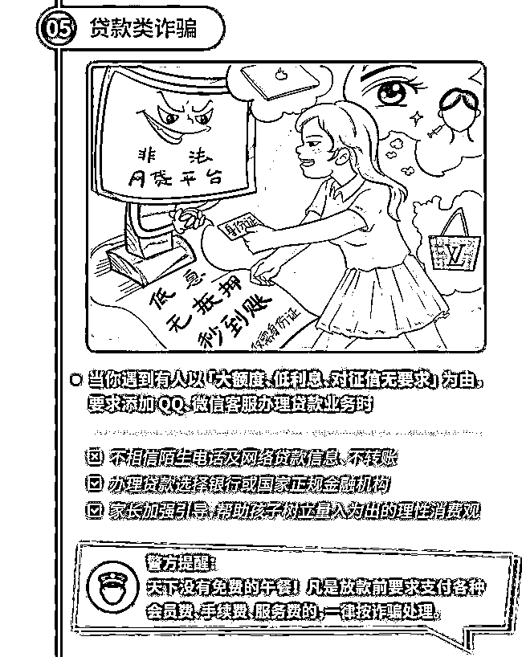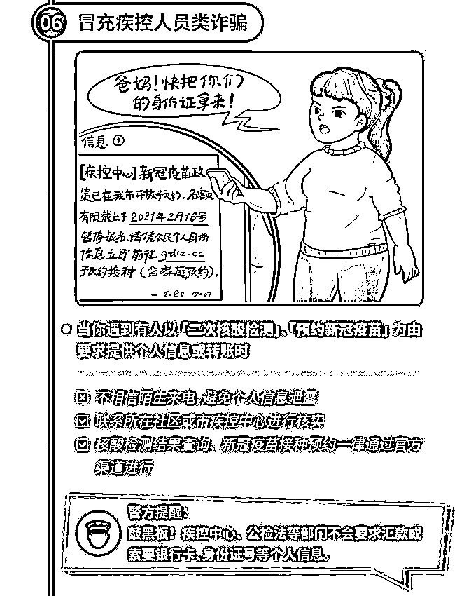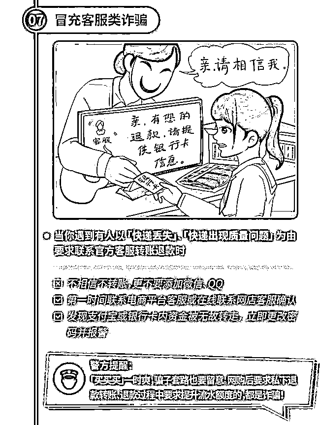

**未成年人判断能力不足**

**家长务必加强对孩子的关注**

**多引导、多教育、多沟通**

**增强孩子防骗意识和能力**

**避免孩子掉进诈骗陷阱**

来源：平安广州、广东公安、中山市公安局、佛山市公安局、南海公安

← 向右滑动与灰产圈互动交流 →

