# “山寨货”出现，已有人被骗！

> 原文：[`mp.weixin.qq.com/s?__biz=MzIyMDYwMTk0Mw==&mid=2247510017&idx=7&sn=88e350dafba70e9ab21275c10e7d4772&chksm=97cb6339a0bcea2f052aa5926ec62d614f4415a06323ac586a6fa4dd5bda1f2eea30b88bc1a9&scene=27#wechat_redirect`](http://mp.weixin.qq.com/s?__biz=MzIyMDYwMTk0Mw==&mid=2247510017&idx=7&sn=88e350dafba70e9ab21275c10e7d4772&chksm=97cb6339a0bcea2f052aa5926ec62d614f4415a06323ac586a6fa4dd5bda1f2eea30b88bc1a9&scene=27#wechat_redirect)

近日

为在网上给机动车处理交通违法

山东的肖先生听说

“交管 12123”是交管部门的官方软件

便通过手机应用商店搜索相关 APP

随后便下载了一款带有 12123 字样的 APP

打开并逐步进行办理

**可没想到自己一顿操作下来损失惨重**

[`v.qq.com/iframe/preview.html?width=500&height=375&auto=0&vid=m32299shgj9`](https://v.qq.com/iframe/preview.html?width=500&height=375&auto=0&vid=m32299shgj9)

肖先生在操作中发现

需要填写的信息十分详细

便没有起疑心

他根据 APP 内的提示要求

将个人及车辆信息进行了提交

然而就在这时，问题出现了

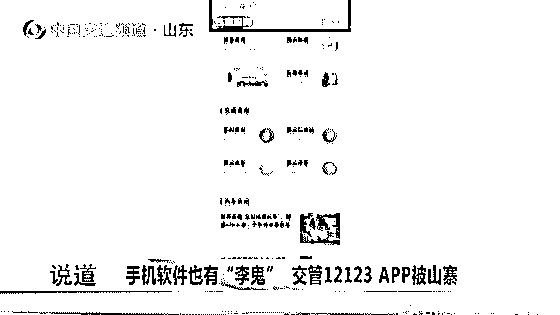

处理交通违法还需要手续费

这可是第一次听说

而且肖先生在付款后发现

支付凭证上显示的是违章代办的字样

这一点也让他疑惑不已

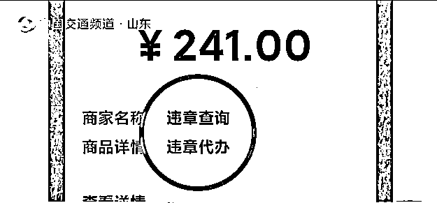

带着这些疑问

肖先生重新查询了相关资料

这才意识到

自己所使用的 APP 并不是官方 APP

且在不知情的前提下

被额外收取了一笔代办费

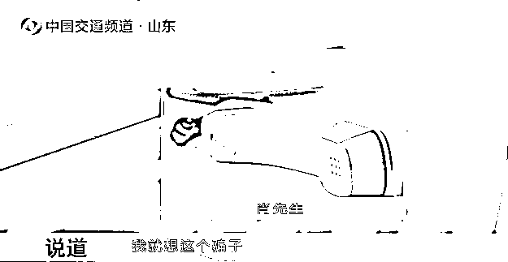

许多带着 12123 字样的 APP，页面内却打着各类广告，与官方“交管 12123”APP 截然不同，不仅是一款山寨 APP，同时还带有一定的诱导性和欺诈性，很容易对用户带来损失造成不利影响。

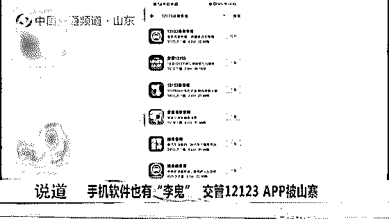

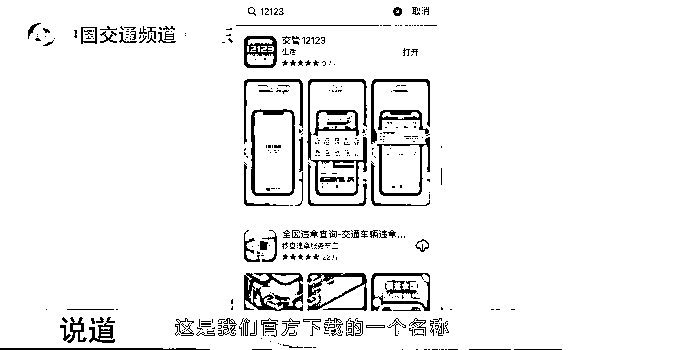

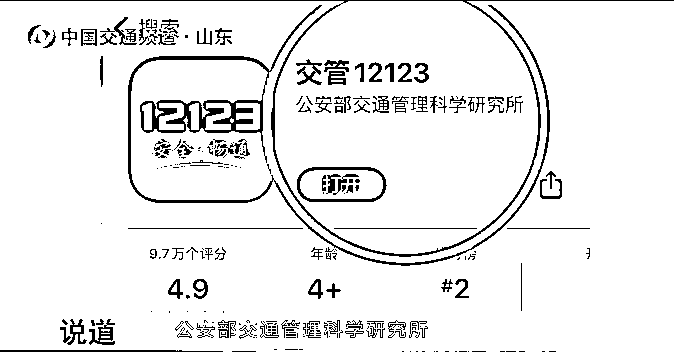

**那么如何辨别 APP 是否正规呢？**

民警：“交管 12123”APP 是官方下载的一个名称，并且它的研发机构是公安部交通管理科学研究所。告诉大家识别假的 APP 的两个方法：

第一，如果**有代办费、服务费等额外的费用**，那么说明它一定是假的。

第二，如果你发现**有违法代办等字样**的话，那么它也一定是假的。

**大家在下载 APP 时**

**可一定要擦亮眼睛**

**最简单、安全的方式**

**扫描下方二维码下载**

01 下载安装

在手机应用商店（苹果手机）或应用市场（安卓手机）中搜索“交管 12123”下载安装，或直接扫描下图中的二维码下载安装。

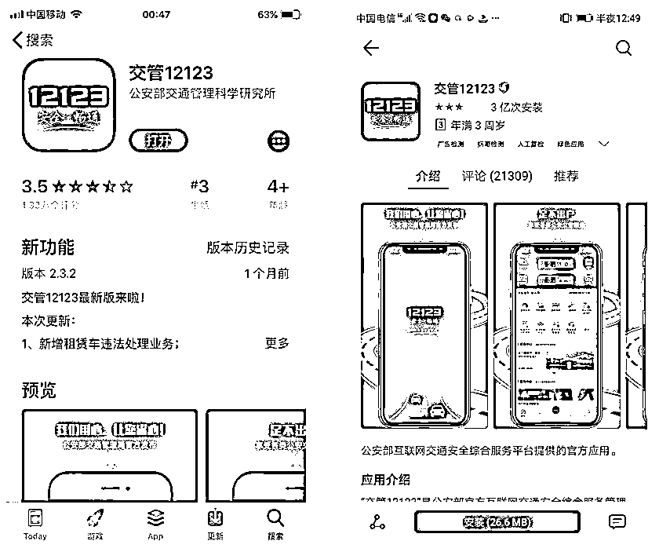

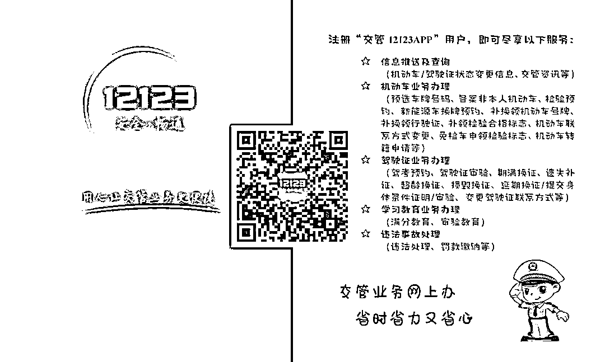

02 用户注册

分为个人**用户注册**和**单位用户注册**。

**1.个人用户注册分为面签注册和在线注册**

面签注册有两种方式：

**一是**至公安网窗口办理现场面签。窗口面签时，申请人须携带本人有效的身份证明原件至指定窗口办理。

**二是**通过“交管 12123”APP 完成实人认证注册（在线面签）。APP 实人认证注册时，申请人须是二代身份证持有人，注册时根据 APP 提示，录入姓名、身份证号码、目前使用的手机号码，完成活体检测及远程人脸识别即可。个人用户面签注册成功后，即可结合个人需求使用 APP 所有有关功能。

**1.1 实人认证注册（在线面签）流程：**

1

**对于首次注册用户：**

**步骤 1**：下载“交管 12123”手机 APP，点击“注册”；

**步骤 2**：填写个人基本信息（用户姓名、二代身份证号码、手机号码等），点击“同意协议并继续”；

**步骤 3**：完成检测及远程识别，通过后成为互联网平台面签注册用户。

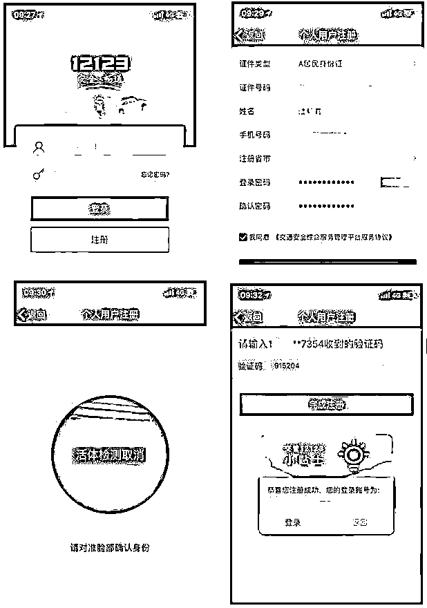

如用户多次尝试都无法通过人脸识别，将转为在线注册（实名认证）流程。

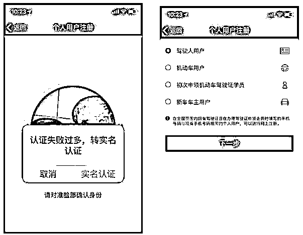

在线注册时，需核查机动车或驾驶证预留的手机号码，如号码不一致的，用户可通过支付宝授权的方式，使用支付宝预留的手机号码进行在线注册。

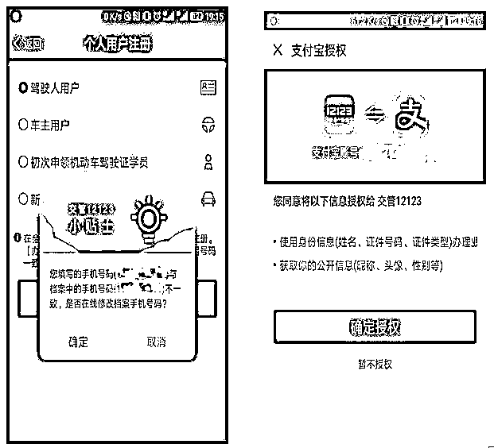

2

**对于已在线注册用户：**

使用 WEB 端在线注册的用户（网址：gd.122.gov.cn）或使用 APP 端在线注册但未办理或未通过实人认证的用户，可登录手机 APP 进行实人认证。

长按识别二维码进入：gd.122.gov.cn

**步骤 1**：登录账号；

**步骤 2**：点击首页右上角“我的”；

**步骤 3**：使用“实人认证”功能，根据提示完成操作即可，该流程用户须额外录入“证件有效期限”。 

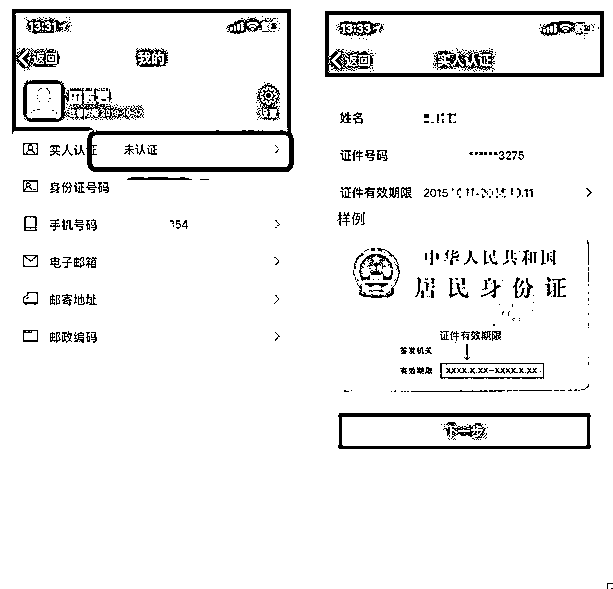

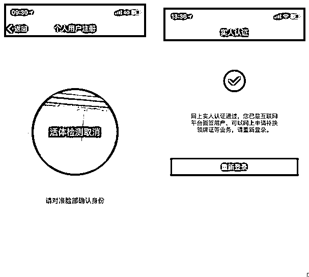

如用户多次尝试都无法通过系统人脸识别，可根据提示拍摄二代身份证的正反面照片，供后台人工审核，审核后即完成实人认证手续。

**1.2 在线注册：**

未通过 APP 实人认证的个人用户可以进行在线注册，注册时车主、驾驶人或学员仅须录入本人基本信息，完成公安预留手机号码验证即可。

在线注册时如提示手机号码与公安预留的不一致，可通过授权支付宝认证的方式，使用支付宝预留手机号码完成注册。在线注册成功后，个人用户可使用电子监控违法处理、绑定非本人机动车、缴纳罚款、预选机动车号牌、免检申领检验合格标志（6 年免检）、机动车检验预约、驾驶证期满换证等业务功能。

**2.单位用户注册**

单位用户注册需通过公安窗口办理面签，注册时单位代理人须携带有效的具有统一社会信用代码的营业执照或组织机构代码证书、委托书以及代理人身份证明原件。

面签注册成功后，单位用户可使用单位名下**机动车违法查询、机动车二维码生成、预选机动车号牌、免检申领检验合格标志（6 年免检）、机动车检验预约**等业务功能。

来源：公安部交通管理局、广东交警、纵横齐鲁

← 向右滑动与灰产圈互动交流 →

