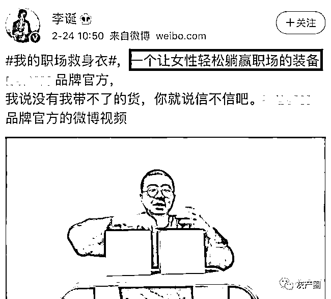
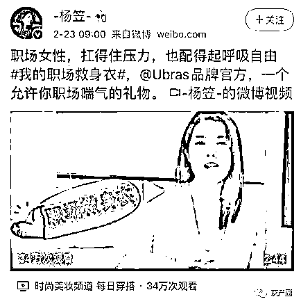
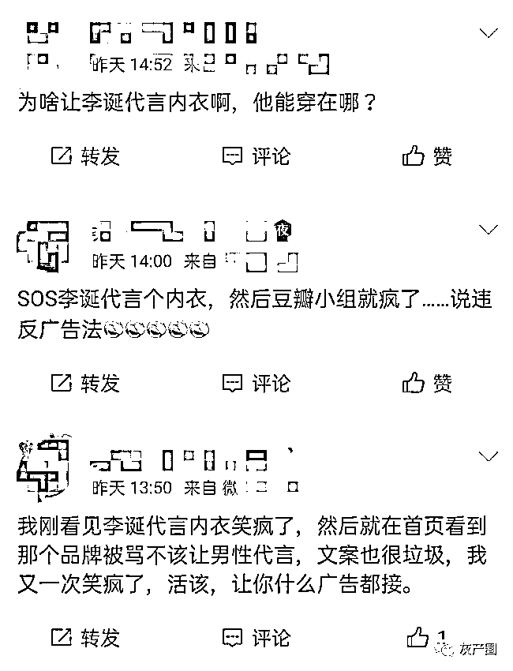
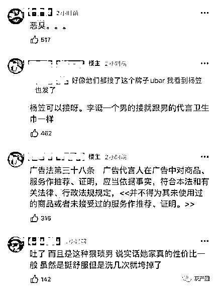
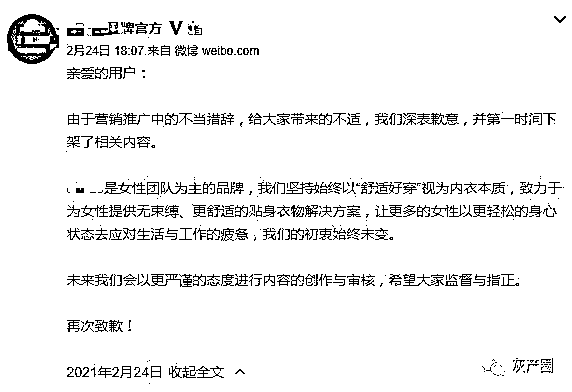
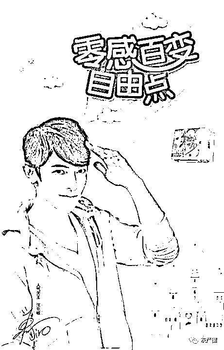
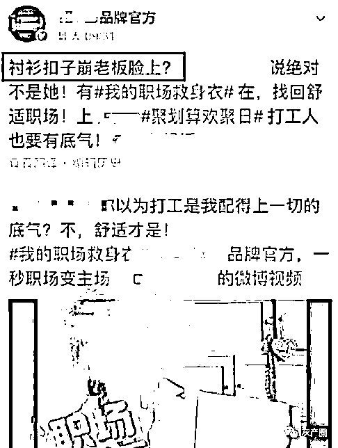

# 李诞为女性内衣代言？躺赢职场？冒犯女性！

> 原文：[`mp.weixin.qq.com/s?__biz=MzIyMDYwMTk0Mw==&mid=2247510097&idx=1&sn=f969a1c0e6afe7a628c11a443a7b1115&chksm=97cb6369a0bcea7f42ca857166d8898ae4d6ee91e160a214ab167694bbba373266819b595f9d&scene=27#wechat_redirect`](http://mp.weixin.qq.com/s?__biz=MzIyMDYwMTk0Mw==&mid=2247510097&idx=1&sn=f969a1c0e6afe7a628c11a443a7b1115&chksm=97cb6369a0bcea7f42ca857166d8898ae4d6ee91e160a214ab167694bbba373266819b595f9d&scene=27#wechat_redirect)

近日，脱口秀演员李诞代言了某品牌女性内衣，内容一出，立即引起了网友的不满。 

　　该广告宣传语称“一个让女性轻松躺赢职场的装备”，这一言论让网友们瞬间炸开了锅，很多人认为这句广告语是在冒犯女性。

　　

　　除了李诞，该品牌还同时请了欧阳娜娜、杨笠、思文等人做推广。杨笠发布的文案内容是 " 职业女性，扛得住压力，也配得起呼吸自由 "，听起来比李诞用的舒服多了。

　　

　　还有很多人发出质疑：“广告法规定，广告代言人不得为未使用过的商品或者未接受过的服务做推荐”、“为什么男的都要来分一杯羹？”、“男明星代言美妆这些也就忍了，为什么女性内衣还要来？”

　　李诞的行为就好像一个没有头发的艺人，在推荐洗发水一样滑稽。

　　

　　

一个女性私密用品让男士来代言实在令人不解，还说出这么冒犯女性的话，再说这些品牌自己也无法体验，盲目来代言也违反了广告法的规定。 

　　随后，随后迫于舆论的压力，李诞将发布的该品牌相关宣传广告删除。目前，李诞并未就此事公开回应。

　　24 日下午，该品牌官方发声明表示道歉，称未来会以更严谨的态度进行内容的创作与审核，希望大家监督与指正。

　　

此前，汪东城就因代言女性卫生用品被骂多年。尽管品牌方并没有宣布李诞是代言人，但他的行为本质上是属于代言性质的。 

　　

　　据网友爆料，此前该品牌官方就发布过相关不尊重女性的言论。

　　

　　对于男性代言女性专用品，这事你怎么看呢？

来源：番茄娱乐说

← 向右滑动与灰产圈互动交流 →

