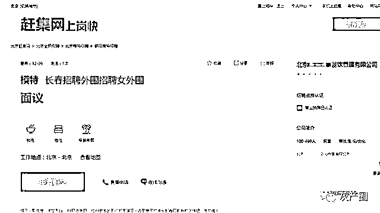
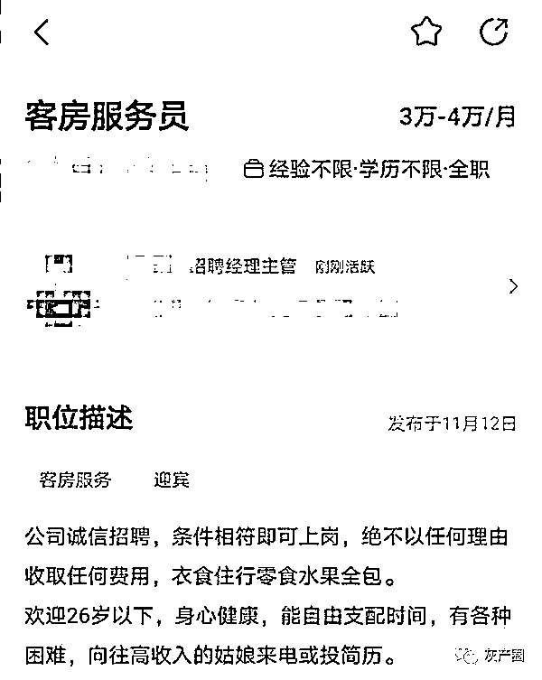
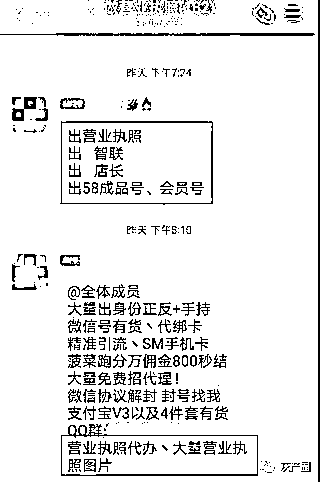

# 又见色情招聘！赶集网等多个平台被捶！

> 原文：[`mp.weixin.qq.com/s?__biz=MzIyMDYwMTk0Mw==&mid=2247510097&idx=2&sn=604a9f05fb33d1cea0b1ce5cf7590100&chksm=97cb6369a0bcea7ffd7ed2eded096266200f9363dea6a43b75246df770db506a8fa8871ad144&scene=27#wechat_redirect`](http://mp.weixin.qq.com/s?__biz=MzIyMDYwMTk0Mw==&mid=2247510097&idx=2&sn=604a9f05fb33d1cea0b1ce5cf7590100&chksm=97cb6369a0bcea7ffd7ed2eded096266200f9363dea6a43b75246df770db506a8fa8871ad144&scene=27#wechat_redirect)

近日，人民网发布了一篇题为《[“女外围”也能招？多家平台无需企业资质可招聘](http://mp.weixin.qq.com/s?__biz=MjM5NzI3NDg4MA==&mid=2658660872&idx=1&sn=cea159404d9ce9a23843a1aec8358ad1&chksm=bd5f26678a28af7164308a1882a1964ffb4ee82a38d31f672654386ed4acd08ea3d634119d3c&scene=21#wechat_redirect)》的文章。文中提到，通过对智联招聘、卓博人才网、BOSS 直聘、36 招聘、猎聘等 12 家招聘网站以及抖聘、上啥班两个短视频 App 进行实测，发现有些平台暗藏色情陷阱。

人民网记者以年轻女性的身份创建求职简历以后就有招聘人员联系记者，称有“娱乐主播”职位招聘，需要“穿得露点，尺度大点儿”。下载相关应用时，页面提示该应用含不良信息，该招聘人员直言：“放心下载，没有任何病毒，只有黄。”

招聘网站上的色情招聘信息

除此之外，有些招聘网站的涉黄信息更加“赤裸裸”。记者在某招聘网站上发现了一则“模特，招聘女外围”的招聘信息，发布方显示为一家已通过招聘资质认证的“餐饮管理公司”。点击申请职业后，页面显示投递成功。

人民网这篇文章一经发布便引起了网友们的广泛热议，但这不是招聘网站首次深陷“色情陷阱”的舆论旋涡。早在去年，CNMO 便报道过智联招聘和 BOSS 直聘上存在色情招聘内容。

招聘网站深陷“色情陷阱”舆论漩涡并非首次

去年 11 月份，CNMO 便报道了 BOSS 直聘上出现的“色情招聘”内容。当时，BOSS 直聘上出现了一些以“董事长助理”“生活助理”为名的招聘内容，其工作内容描述得不清不楚。当应聘者与招聘人员实际接触以后才恍然大悟：原来这是色情招聘。（详情请看：[“情色陷阱”招聘：招助理实为“拉皮条”](http://mp.weixin.qq.com/s?__biz=MzIyMDYwMTk0Mw==&mid=2247504928&idx=1&sn=b7199ddb9b8dc8477704f1f95b037ece&chksm=97cb1f18a0bc960e927f42269cc39f531fb6da751215fb892bb0e9db8a425a35d8ad967a6487&scene=21#wechat_redirect)）

      这些招聘人员身份不尽相同。有专门为“客户”物色女性的中介，也有亲自在别墅面试并对应聘者伸出咸猪手的“老板”，还有“尽心尽力”为自己客户寻找性伴侣的公司。尽管他们的身份不一定相同，但是他们都抱着相同的目的：要求应聘者提供性服务。

同样是在去年 11 月，曾深陷“泄露用户隐私”舆论漩涡的智联招聘也被传出有“色情招聘”的现象。当时在智联招聘网站上，出现了一部分“高薪招聘客房服务员”的招聘信息。职位描述表示：欢迎 26 岁以下，身心健康，能自由支配时间，有各种困难、向往高收入的姑娘来电或投简历。

智联招聘的色情招聘信息（图源微博）

当记者添加招聘人员的微信后，该人隐晦地问道：“我们这边是招高薪岗位哦，应该清楚做什么吧？”并更详细提出了“福利待遇”：1 个月 5-10 万起，包吃住，日结工资。为了吸引求职者，该招聘人员表示，自己这边都是做高端客户的，价格最低都是几千一次。

据了解，除了这类打着“高薪招聘客房服务员”的幌子外，智联招聘上还有许多以“私人秘书”为名义的色情招聘内容。（详情请看：[智联招聘用户隐私泄露旧疾未愈,又现疑似“皮肉招聘”魅影](http://mp.weixin.qq.com/s?__biz=MzIyMDYwMTk0Mw==&mid=2247506023&idx=1&sn=d8a3a70e659adcc2a41d0cda60a11357&chksm=97cb135fa0bc9a495ae4fffee90ed4bb7189b5cf730e0064c656ccb0618d074491a76b9ecf29&scene=21#wechat_redirect)）

为什么色情招聘内容能在一些招聘网站上大行其道？各招聘网站不够严格，甚至有些敷衍的企业审核机制助长了色情招聘的发展。

招聘网站监管缺失 企业、个人认证敷衍了事

我们回到人民网发布的那篇文章。在人民网记者的调查中，部分招聘网站的企业、个人认证机制存在巨大的漏洞。

有些招聘网站完美体现了“有钱好办事”的风格。在卓博人才网中，一名卓博网客户经理表示，最低交 3980 元年费后，企业资质没办下来可以提前发布职位。而在一览英才网中，记者发现自己发布的职位“被停止”，客服表示，网站实行会员制，一年最低 5000 元，签订合同时附名片即可开通招聘服务。

出售营业执照和招聘账号的群组（图源人民网）

就算你没有营业执照不能完成企业认证，同样还有渠道能满足你的需求，现在网络上有不少出售营业执照和招聘账号的群组。有卖家表示，各大平台的招聘号都有，企业类型可以指定也可以随机。同时，他还表示，自己所提供用来认证的营业执照都是真的，也能够搜到相应的信用代码。

而另一卖家则表示，营业执照基本都是 PS 的，买家想要哪类企业的营业执照，可以去企业信息查询平台找，确定后他再去招聘平台检索是否已注册。他还透露，有的招聘平台需要人脸识别登录，不建议购买，因为容易被封号。

行业普遍缺失的监管机制以及某些平台形同虚设的认证系统，这些都让非法的色情招聘信息在网络上生根发芽。想要终结行业乱象，需要有关部门逐步健全相应的法律法规，各招聘平台也需要强化自身的监管机制和认证系统。

   风波不断的网络招聘该何去何从？

互联网的发展极大地便利了我们的生活，但是也让一些不法行为找到了新的滋生土壤。网络招聘平台的诞生，本来是为了方便求职者更加精准和高效地找到工作，也是为了让招聘方能够提前了解到求职者的信息，从而筛选出最适合自家企业的人才。但是，如今混乱的网络招聘平台却显得有些乌烟瘴气，部分网络招聘平台唯利是图的价值观让不法者有了可乘之机。

BOSS 直聘

建立健全相应的法律法规和加强行业监管是目前相关部门迫在眉睫的任务。2020 年 9 月，人力资源社会保障部发布了关于《网络招聘服务管理规定（征求意见稿）》（以下简称《规定》）。《规定》提出，网络招聘服务机构应当建立完备的招聘信息管理制度，依法对用人单位所提供的材料真实性、合法性进行审查；网络招聘服务平台应当要求申请进入平台的网络招聘服务机构提交身份、地址、联系方式、人力资源服务许可证等真实信息，进行核验、登记、建立登记档案，并定期核验更新。目前，《网络招聘服务管理规定》已经审议通过，自 2021 年 3 月 1 日起施行。

有关部门已经制定了相应的法律法规，网络招聘平台就需要严格按照相关规定开展工作，建立起自家的监管机制和认证系统，让网络招聘平台成为求职者和招聘方重要的信息交流平台，而不是打着各种幌子进行非法活动的灰色地带。

来源：手机中国

← 向右滑动与灰产圈互动交流 →

