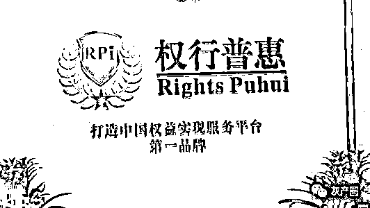
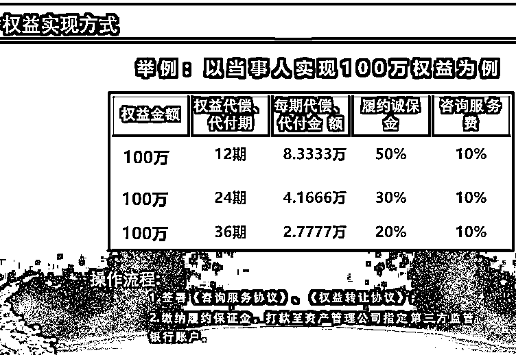

# 仿冒银行"权行普惠"套路起底：交钱买级别 层层分红

> 原文：[`mp.weixin.qq.com/s?__biz=MzIyMDYwMTk0Mw==&mid=2247510135&idx=2&sn=cb2c0fbc2948c938b62c4e796336056c&chksm=97cb634fa0bcea597e8ba78f296acff8a53894a8292dd9d617eed6d15e023f28644eeef0c382&scene=27#wechat_redirect`](http://mp.weixin.qq.com/s?__biz=MzIyMDYwMTk0Mw==&mid=2247510135&idx=2&sn=cb2c0fbc2948c938b62c4e796336056c&chksm=97cb634fa0bcea597e8ba78f296acff8a53894a8292dd9d617eed6d15e023f28644eeef0c382&scene=27#wechat_redirect)

****

**仿冒银行“权行普惠”号称以帮人“解债”为主业，到底是如何帮人解债，以至于有上亿资金被卷入其解债业务呢？**

从《每日经济新闻》记者调查中获得的信息来看，其加盟商制度和类似传销的分红模式，是其迅速壮大的重要原因；而其对解债人所采取的套路，则使得资金滚滚而来。

**套路一：可最低以 30%的成本解决债务**

“权行普惠”这种实现权益的模式，可最低以 30%的成本解决债务。债权人可以找“权行”代还资金，债务人也可找“权行”代自己向债主偿债，不管是债权人，还是债务人，为解债向“权行”方面支付的费用都是一样的。

1、假设你出借 100 万元，但借款人没还款，“权行普惠”可按以下方式帮忙做代还，即帮助实现你的权益：

1.1 如果是分 12 期代还出借人 100 万元，每期还 8.3333 万元，出借人（或借款人）须缴纳：保证金 50 万元+咨询服务费 10 万元；

1.2 如果是分 24 期还 100 万元，出借人每月收到权益金 4.1666 万元。出借人或借款人须缴纳：履约保证金 30 万元+咨询服务费 10 万；

1.3 如果是分 36 期还 100 万元，出借人每月收到权益金 2.7777 万元。出借人或借款人须缴纳：履约保证金 20 万元+咨询服务费 10 万；

2、10 万元手续费是支付给“权行普惠”。

3、保证金支付给中民普惠社区服务有限公司。

4、相关代偿事宜、债权转让事宜是与益顺资管签署《权益转让合同》，由益顺资管公司向出借人代偿其出借的金额，同时，出借人将债权让渡给益顺资管，由益顺资管向借款人追债。益顺资管完成代偿后，最终享有当事人交纳的履约保证金，作为其代偿的服务费。

在记者调查的过程中，包含债务人在内的多名当事人告诉表示，“权行”并没有对真实的债务人进行过债务催收。

既然“权行”及其代偿债公司并没有向欠债人进行过催收，那么，代偿债主的资金，就得“权行”方面自掏腰包。

然而，债权人/债务人只需要向“权行”方面交 10%服务费和 20%~50%履约保证金，就可获得 100%的债权/债务金额，这样一来，“权行”方面不是在做亏本生意吗？

但是，从记者调查接触到的当事人来看，“权行”方面收取他们服务费和履约保证金后，其代偿方深圳益顺资管并没有按协议进行代偿，大多只代偿了 1~2 期就停止了兑付，最多的也只代偿了 5 期。

因此，维权人士认为，“权行”方面让他们交费是真，代偿是假。

在整个解债过程中，“权行普惠”还宣称提供**“三重保障”**：

第一重保障：益顺资管公司给出资人的出资（保证金、服务费）给予等额的资产保障，房产、黄金珠宝、保函、商业承兑汇票等任选。

第二重保障：如果深圳益顺资管没有代还或者没完全还完解债人的资金，资金监管公司就把履约保证金原路退还付款人。

第三重保障：如果当事人还不放心，可以再付整个欠债金额的 3%作为服务费，100 万元债金即为 3 万元服务费，交给商业保理公司，由商业保理公司为深圳益顺资管整个偿还过程作全额的兜底。

不过，就目前的情况来看，当事人认为这些写在合同里的保障条款，无法获得保障。记者采访到的这些债主及欠债人，除了向“权行普惠”交钱之外，他们说根本没有看到过宣传资料里声称的珠宝、承兑汇票等，“权行普惠”及关联方也没有向他们办理过房产抵押手续。

**套路二：完成 400 万元就可获赠一家“支行”**

“权行普惠××支行”“权行普惠××分行”，在这些与银行店招颇为相似的营业网点，为何发展如此迅速？

除了其宣传的帮助别人实现权益（如代偿还别人欠你的债务金额）制度外，记者关注到了其针对加盟商的奖金制度。

**“权行普惠”奖励制度：**

一、完成任务可开办“支行”

加盟商只要完成 400 万元的业务任务，就可以获赠一家“支行”，从而可成为“行长”，就能利用“权行普惠”的奖励制度，坐享“支行”的分红。

而实际上，加盟商向“权行普惠”预存 10 万元，就可以抵 100 万元任务，只需要再完成 300 万元业务，并打款 30 万元咨询服务费给“权行普惠”，即：付出 40 万成本后，也能获赠一家“支行”，同时由“权行普惠”赋予 10 万元经费发放。

二、交钱买级别

“权行普惠”的层级分为所谓的央企、权行总部、支行。

一个支行的从业人员又分为：行长、从业经理、合格从业人员、在编从业人员。

实际上，除“在编从业人员”外，其他层级都是用钱向“权行普惠”购买的，交的钱越多，层级就越高，而分红也越多。

**他们需要向“权行普惠”交多少钱呢？**

“行长”——完成 400 万元业务任务，或交 40 万+完成 300 万元业绩，获赠 1 家“支行”；

从业经理——缴纳 3 万元学习费，经考核合格成为从业经理；

合格从业人员——缴纳 1 万元学习费，成为在职从业人员；

在编从业人员——未参加统一业务培训者，即未交纳培训费。

三、层层分红，级别越高，分红越多

但无论是“行长”还是最基层的“在编从业人员”完成的业绩，都需要向所谓的央企及“权行普惠”总部上交一定比例。

**以完成 100 万元业务任务为例：**

1、3 万元需上缴机构（也就是其宣称的所谓国企）；

2、剩余 7 万元作为 100%：

2.1 10%+12%即 15400 元为权行总部所得；

2.2 65%即 45500 元为区县“支行”所得；

3、4.55 万元作为 100%：

3.1 若是行长业务提成就是 100%，即 4.55 万元；

3.2 若是从业经理，业务提成 40%，即 18200 元；

3.3 若是合格从业人员，提成 30%，即 13650 元；

3.4 若是在编从业人员，提成 20%，即 9100 元； 

3.5 8%即 5600 元市场开拓奖励，也就是开办的所属分行的业绩分享奖励。

3.6 2%即 1400 元为优秀运行年底业绩奖励。当然根据每人的业绩能力，行长会为每人提供最优业务奖金方案。 

4、（上述 3.5 中的 8%）5600 元作为 100%：

4.1 60%即 3360 元为上述分行经理（即个人）分享业务所得；

4.2 40%即 2240 元为上属分行分享业务所得。律师说法：这种模式一看就是圈套，涉嫌合同诈骗

对于“权行普惠”的盈利和分成模式，四川纵目律师事务所李凌鹏律师表示，表面来看，如果公司业务利润足以支撑这样的分红比例的话，也没什么违反法律问题。

但问题的关键是，这家公司的利润从哪里来？公司有没有向欠债的人催收欠款？

如果没有收回欠款，公司就没有利润来支付各层级的分红。

以目前记者调查的情况来看，包含债务人在内的当事人声称“权行普惠”并没有认真调查债权债务的真实性，也没有向债务人进行过催收。李凌鹏律师认为，由此可见其真实目的只是为了合同诈骗。

而其业务模式允许债务人也参与解债，比如：债务人欠债 100 万元暂时还不上，却要向“权行普惠”缴纳 60 万元（50%保证金+10%服务费）请求“权行普惠”一年分 12 期帮忙还债，这明显是圈套。如果债务人有这 60 万，为何不先还债权人 60 万？

其内部管理模式，李凌鹏律师则认为和传销“不重产品只重视拉人头”类似。

追踪债权人/债务人的出资流向，记者调查中获得的维权人士银行回单显示，其资金流入的账户为权行普惠企业运营管理有限公司和中民普惠社区服务有限公司。分期偿还权益的主体是深圳益顺资产管理有限公司。

但记者发现，上述 3 家公司均无金融牌照。

而且据启信宝显示的工商资料，益顺资管的经营范围中，更是明确不得从事金融资产管理。

**李凌鹏律师介绍，根据我国《刑法》第二百二十四条，有下列情形之一的，构成合同诈骗罪：**

没有实际履行能力，以先履行小额合同或者部分履行合同的方法，诱骗对方当事人继续签订和履行合同的；收受对方当事人给付的货物、货款、预付款或者担保财产后逃匿的。

文中提的这些“解债”公司及其关联的资产管理公司，没有实际履行能力，部分履行（只代偿了 1~5 个月），骗取咨询费和保证金，李凌鹏律师认为已经符合合同诈骗罪的构成要件了。

至于今年 1 月 10 日给出的清退方案，李凌鹏律师认为，如果清退方案拖延解决，无法执行，只是缓兵之计的话，不影响它本身是合同诈骗的认定。

**事件进展：“解债”业务已引起监管关注**

2020 年 11 月中旬在现场调查时看到，在“权行普惠”总部所在办公楼通往其办公室的电梯口斜对面公告栏，重庆市江北区打击非法金融活动领导小组办公室张贴了《警惕债事化解服务 避免失财又增债》的风险预警提示，不过，该提示没有点名“权行普惠”。

记者以解债人身份拨打了江北区金融办值班电话，工作人员在电话中表示，他们已经联合警方对权行公司进行驱逐，要求其停止经营相关业务，并且搬离江北区。

记者还以解债人身份前往江北区公安分局经侦部门报案，恰好遇到了来自贵州的 5 名受害者在报案。记者现场看到，该公安分局经侦部门已经受理了报案并制作了笔录。

对于“权行普惠”事件的后续进展，记者将持续关注。

来源：每日经济新闻

← 向右滑动与灰产圈互动交流 →

