# “我在传销组织待了三天，赚了 1040 万。”

> 原文：[`mp.weixin.qq.com/s?__biz=MzIyMDYwMTk0Mw==&mid=2247510135&idx=3&sn=d2d2c411ff69f9ef35282f6bd794c540&chksm=97cb634fa0bcea593ea4cdf7fa8e701b3a4919bfaf7fb80c211e41c16e681161f1e96adb0cdd&scene=27#wechat_redirect`](http://mp.weixin.qq.com/s?__biz=MzIyMDYwMTk0Mw==&mid=2247510135&idx=3&sn=d2d2c411ff69f9ef35282f6bd794c540&chksm=97cb634fa0bcea593ea4cdf7fa8e701b3a4919bfaf7fb80c211e41c16e681161f1e96adb0cdd&scene=27#wechat_redirect)

“如果你一没技术、二没资本，也没有当大官的爸爸。却有人跑过来说可以让你一夜暴富，而且他不是上帝本人。那么他多半是要骗你的钱。”

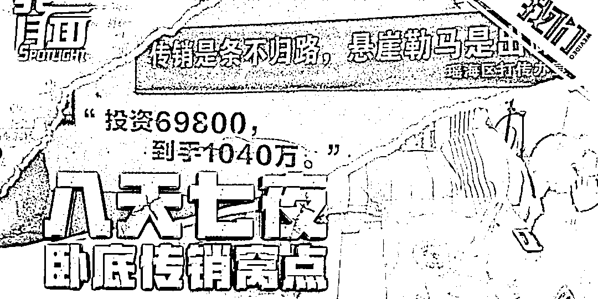

“投资 6.9 万元，赚 1040 万元。”

“什么行业能让我们立马翻身？就是连锁经营业”

“上连锁，每月拿 6 位数的收入！”

“为什么美国成为世界霸主，就是因为用了这个模式”

“今天我们的生意叫 1040 阳光工程”

……

在 2018 年 11 月的那一天，丁元，就是这么被自己的朋友，以招工的名义，骗到了安徽合肥的。

先是每天至少 4 个人一对一的座谈，座谈之后提供 24 道简答题，要求背诵随时抽查。

**不断的聊天洗脑拉近关系，反复强调不违法，不断地告诉你“投资越多，挣得越多”。**

然后为了博取你的信任，还会有模有样的告诉你，这门生意之所以赚钱是因为“有一个非常公平的奖金分配模式，叫五级三阶制。” 

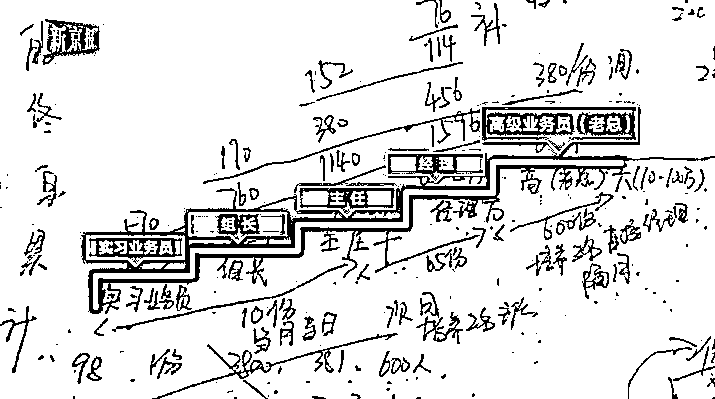

而几天过后的“老总约见”还会跟你说，这是一个不对外公开的国家项目，有“红头文件”！

拿出一张百元钞票，告诉你钞票上的编码是暗语。

带你去合肥的政府大楼，告诉你这是专为“连锁经营业”而建，大楼加起来是 1040 块玻璃，代表在这个组织，能够赚 1040 万。

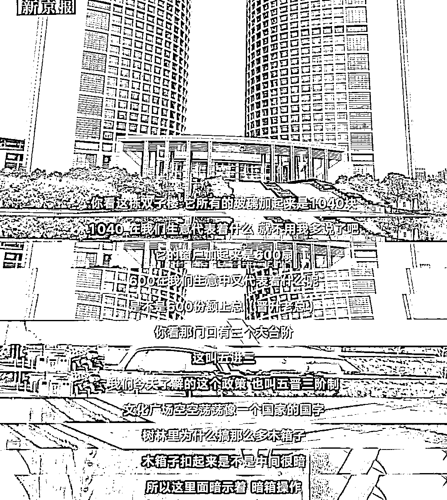

听起来很可笑吧。

可后来的丁元回忆说：“我到现在都考虑不清楚，我自己咋会想起来把这个钱直接给人家打过去。”

是的，那次听到最后，她一次性给这个组织，缴纳了 1.3 万元。

……

好像是每隔一段时间，“传销”这只打不死的小强，就要出现站在风口浪尖上一次，一边警醒世人，一边告诉人们，它从未离开，它一直都在。

**它就像是每个中国人都知道的一个公开的秘密。不是什么新鲜事，但也不是什么烂事。**

可惜的是，没有人搞明白它，也没有人真正了解过它。

更没有人知道，其实在中国，每年都会有几百万甚至几千万的人都在为此前赴后继。

但今天，我要告诉你一个很可怕的事实是：

**小到不知道名的小山村、大到一线城市的大学毕业生，家破人亡、妻离子散。**

我们不知道的传销，其实一直在用最无声的方式，毁灭着每一个本该幸福的人生。

作家慕容雪村用真名郝群混进传销组织当卧底的时候，是 2009 年年末。 

那是来自江西上饶的一个传销团伙。

之所以选择上饶，是因为在这里，在每天来往的人群中，有很大一部分，都是传销者，而活跃在这个城市的传销总人数，也远比想象的要多。

卧底了 23 天，遗书也安排的妥当。可眼前见到的世界，还是出乎了他的预料。

用他的话来形容就是：**像《西游记》中的盘丝洞和狮驼国，每一个在身边真实上演的情节，都极为荒谬。**

那两个年纪都不怎么大，穿着却一副寒酸的女人，一个叫“小琳”一个叫“嫂子”，都是专门来接待他的。

她们一边抢着帮忙提行李，一边亲切的问候到：“哥，你终于到了，给家里打个电话，报个平安，省的家人惦记。”

**如果不是早有防备，在陌生的环境下，或许真的会被她们的这种热情所打动。**

但实际上，从知道他来的前一晚，这群人就已经开了一夜的会，会议内容只有一个，就是怎么对付他。

一切，从踩在上饶这片土地开始，就是落进了一个猎人步步为营的陷阱。

而那让人感到亲切的一声哥，一句报平安，只不过是她们团伙接待新人的第一条规矩：

**让新人给家里打电话，否则如果新人发现自己进了传销，一个电话，都会酿成大祸。**

毕竟，在“电话管理”方面，这些传销团伙的办法真的是多到无法想象，像之前那种把手机偷偷拿走，然后打到欠费，最后新人只能悉听尊便，就是最典型的例子。

**紧接着，他们一行人，便坐着车，来到了传销窝点附近的一家小吃店。**

后来郝群形容当时的场景：“蒸饺不够再加一笼、再加一笼”“葱油拌面不够再加一碗、再加一碗。”两个来接待的姑娘一直在吃，他们不是馋嘴，而是饿急了。

因为十几天后，他也同样切身体验了一把这样的滋味：看见旁人吃东西就流口水，闻到香味就走不动道，如果能光明正大的吃一顿好的，就跟过年是一样的。

对于传销团伙来说，节俭是非常有必要的。包括他们生活的窝点。

穿过黑黑的巷子，昏暗的光线看不清脚下，好不容易爬上四楼，一进门，一股子霉味、馊味、脚汗味便活着一股胶皮烧焦的味道，扑面而来。

弹簧吱吱作响的沙发、变黑发黄的便池、污迹斑驳的墙面、几十条又脏又臭的毛巾……郝群说，就像魔鬼的洞窟。

任人无法想象，这里住着一群，相信自己可以暴富的人们。

而第二天的郝群，在被模式化一般的被嘘寒问暖之后，便跟着他的“引导人”刘东，出去遛弯去了。

忘了说，别看这个团伙生活的乱七八糟，但分工却非常明确，比如小琳是他的“推荐人”还有他的“联络人”“监视人”等等，对你无微不至的“关怀”让你稍不留神，就陷入他们的思想漩涡。

而刘东第一天首先带他见的，是一个名叫“贾总”的人。在传销组织里有一个非常明显的阶级观念是，只有非常优秀的人，才能被称为“总”。

这个贾总见了他，首先第一件事情，就是解释谎言。

传销组织很习惯会把谎言分为恶意和善意两类，甚至还有一句口号：

**世界因谎言而美丽。**

如果你发现你是被骗来的，他们会这么告诉你：

“你被骗了，一定很生气吧？我劝你消消气，因为不光你，他，他，他，还有我，都是被骗来的，不光我们，这里还有大学教授、硕士博士、黑社会老大、身家千万的大老板……我告诉你，全是被骗来的！人家大学教授都能接受，你为什么不能接受？”

“你仔细想想，他骗你钱了？骗你人了？他图什么呀？无非是看到一个好机会，想拉你过来一起发财，你有什么可生气的？”

“为什么不跟你明说？嘿，明说你会信吗？你现在工资多少？一千？两千？如果我告诉你，现在有个机会，可以让你每月赚到万元收入、六位数，你会信吗……”

这番话对大多数人都有效，因为迎合了人们的从众心理。

被骗不是什么好事，但如果所有人都被骗了，那就没什么大不了的。

而如果你直截了当的质问他们是不是传销，他们干脆会告诉你：

“哥真聪明，就是传销！所以说，销售模式分为三个发展阶段：传统销售、连锁销售、传销。传统销售最低级，所以被连锁销售取代，而传销最高级，又取代了连锁销售。可在一九九〇年，我们国家犯了个大错误，越过连锁销售，直接引进了传销，可是我们的生产力水平、国民素质都跟不上啊，最后怎么样？”

“假货泛滥、偷税漏税、绑架勒索、打针吃药……最后国家没办法了，只好在一九九八年明令取缔，也就是在同一年，又花七亿元引进了另一种更符合中国国情的销售模式，那是什么？就是我们现在干的连锁销售！”

“2004 年，凤凰卫视这样报道：在祖国的大陆上，正发生着一场没有硝烟的战争，一支不穿军装的部队，一所没有围墙的大学，一个打造百万富翁的摇篮，吸引了成千上万的有志之士，他们在媒体的掩护下，忍辱负重，积极运作，默默构筑着祖国的经济长城。”

**以上这些言论，一听就是假话，但是总能被传销团伙说的极为气势磅礴、动情之处口水唾沫横飞。**

他们习惯于伪造领导人讲话、媒体报道，他们习惯于引用经典名著当中的名句，装模作样，给他们诈骗的行为安上冠冕堂皇的理由。 

对于那些没有什么文化、也不关心热点时事的人来说，几个招数下来，就能被忽悠的团团转。

而接下来的几天，光是各种“总”，郝群就不知道被引荐了多少个。

他们会不厌其烦的一遍又一遍告诉你：

**“连锁销售是利国利民利己的好事，可以推动经济发展，可以让国家多税收、老百姓多赚钱，还可以解决就业问题。”**

“之所以经常听到各种打击传销的传闻，是因为这是国家的宏观调控，所以这么多年都没打绝，而为了行业健康发展，有时候要做样子给外国人看，才会看到那么多的负面新闻。”

“只要加入这个行业，人人都能成功”

“一个人成功，只要拉够六百个下线就可以”

……

对，就是六百个。在传销案组织中，通常会有五个级别，分别是：实习业务员、业务组长、业务主任、业务经理、高级业务员。看起来“业务”挺多，其实只有一个业务：拉人头。

按照传销组织的“成功哲学”，如果你把身边的人都拉来，凑够六百个人，每人交三千八百元，总数是二百二十八万。你就会因此赚到二十四万，拿二百二十八万换二十四万，这就是 “成功”。

可关于这些说辞，稍微动点脑子的人都知道，这些都是传销团伙们的惯用伎俩：

首先，“合法性谎言”。先入为主和传销划清界限，把自己说成是“新生事物。”国家暗中扶持他们，所有的行为规范都由国家制定。

其次是“伟大使命谎言”。什么经济危机、物价飞涨，什么民生凋敝、企业破产等各种夸大社会现实的词汇直直的甩到你的耳朵里，然后告诉你，我们如今是为了振兴中华、提升国民经济水平。

然后是“美妙前景谎言”。一万换十万，十万换一百万甚至一千万，翻倍的暴利赤裸裸摆在你的面前，你不抓住你就是傻子，毕竟，马云也都是这么过来的。

但实际上，真正的事实是，传销根本不会创造任何的经济价值，传销也根本达不到拉人头就能成功的效果，不信你仔细算一算：

一个人成功，六百人垫底；六百人成功，三十六万人垫底；三十六万人成功，两亿多人垫底；两亿人成功，要有一千两百亿人垫底；

**这是什么概念，郝群形容道：放眼望去整个地球不够才 70 亿人，想要成功，可能只能去火星发展下线了。**

更何况，有专家计算过，在传销的金字塔结构中，百分之九十八都是炮灰。

而在那 23 天时间里，郝群说他见过太多的上饶传销者，他们深信不疑自己会成功，即使拉全家人下水，搞垮身体、耗尽积蓄、名利散尽都在所不惜。

因为对于传销组织来说，如果不能晓之以理动之以情，他们会先用亲情、友情把人留下，然后慢慢地做工作，很多自负聪明的人就是这么上当的：

“听着他们似是而非的歪理，一天比一天糊涂；听着他们的恭维，一天比一天自大。再加上宗教般的仪式、军队般的纪律、日日灌输的谎话，再坚定的人都会动摇，从怀疑到茫然，从茫然到相信，从相信到狂热，一步步落入彀中。”

直到最后郝群在书中还是讲了很多关于传销的套路，写了他如何在警察局见到那群还在执迷不悟的人们，我都觉得没有任何一段话像接下来说的如此打动我，他说： 

“在这里，你会看见善良的好人被骗子愚弄，过着悲惨的生活；人们离乡背井，为一个谎言虚耗时光；被践踏的伦理和情感，每个人都在欺骗自己的亲人；病体孱弱的老人、营养不良的青年，他们经过了邪恶的教育，越发乖张，越发贫穷，对社会怀有深深的敌意……”

**在传销面前，很多人都不仅失去了钱财，连三观都变得极为扭曲，除了“组织”，他们不肯相信任何人，哪怕是家人。 **

他们与世隔绝、忍饥挨饿，自以为学到很多，其实一直在自我堕落。

大把的时间和光阴耗去，只为看到只存在于脑海的暴利王国。

没有人知道当她们内心的信念破灭，等待他们的是什么。

反正，对于传销，总有源源不断的人，走火入魔到可以将生死置之度外。

据相关数据统计，截至到 2018 年 2 月底，国家工商总局反传销机构共识别到 3500 多个疑似传销平台，参与人数高达 3176 万人。 

而实际数字，其实还要比这个多得多。

因为 3176 万人背后就是 3176 万个家庭，甚至更多。

在腾讯安全发布的《2018 年互联网金融安全报告》中显示，光是网络传销活跃的人数就也已经超过了千万人。

他们从传统的线下拉人模式转移到了互联网。打着“微商”、“电商”各种各样的旗号，以除了“连锁销售”，还有可能是直复营销、直复加盟、框架营销、网络营销、网络加盟、人际连锁、人际加盟等等各种名义忽悠人群。

2012 年 5 月，青岛警方组织 400 多警力成功毁掉一特大传销组织，捣毁窝点 50 多处的时候，一名老年传销人员还带着 6 个月的孙子。

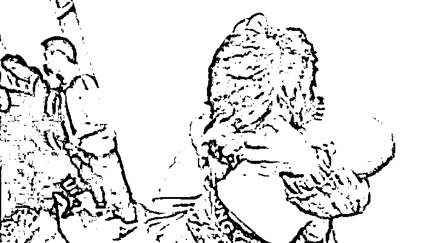

同年 6 月，浙江省金华市的一个传销窝点，70 平米的房子睡着 23 个男女，他们的信念是：“今天睡地板，明天当老板”。

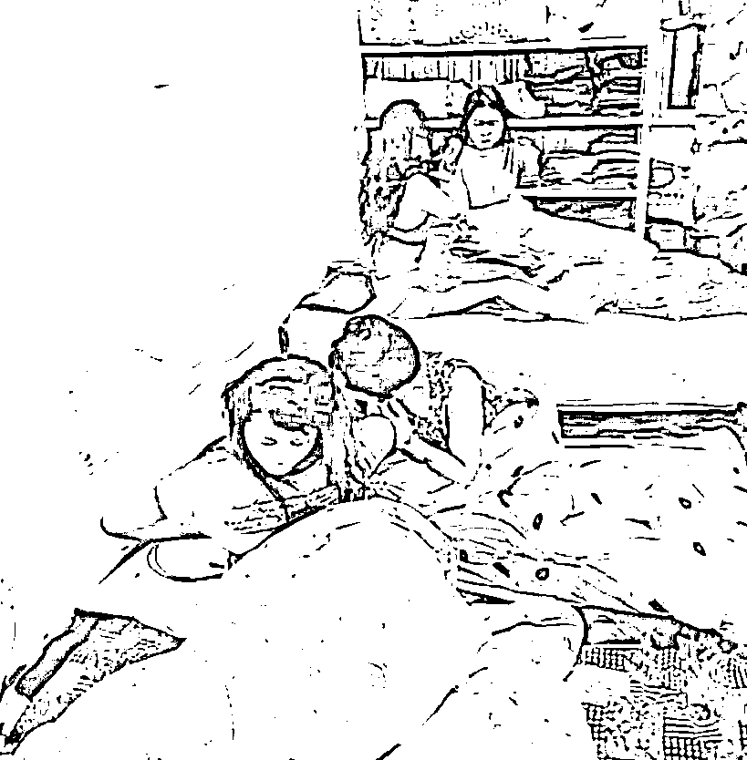

2013 年，杨兰在妹妹介绍下误入传销，三年后，女儿李诗涵被查出神经母细胞瘤，她拒绝让女儿化疗，让其服用保健品代替。丈夫多次劝说，均未能拉回“疯狂的”妻子。2018 年 1 月，女儿李诗涵离世。

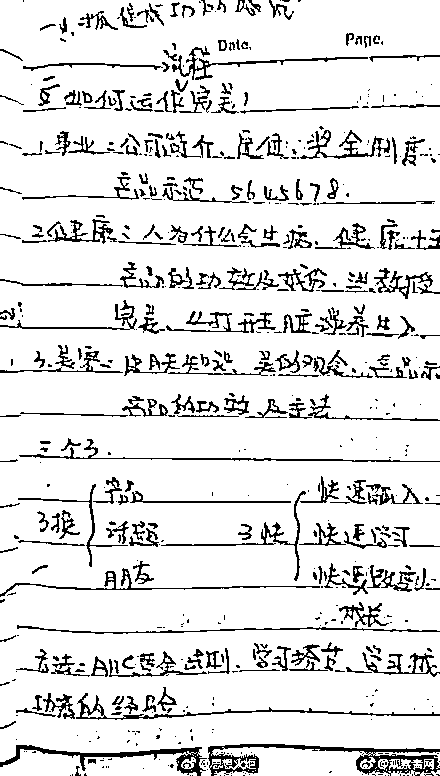

2014 年，湖南一大妈去安徽旅游被骗入传销，儿子千里迢迢从深圳赶到合肥，报警后救出母亲，可是母亲竟然说我不认识你，不会和你走。儿子的深情劝说起不了任何作用。

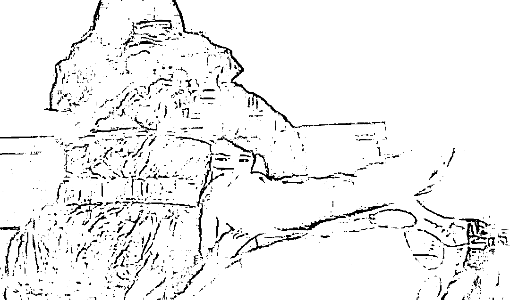

安徽合肥清理传销人员。一名孩子跟随深陷传销的父母，她本该拥有幸福童年。

来源：合肥晚报牛国梁/摄

2015 年，江西南昌一姑娘下跪也没能唤醒被传销迷惑的母亲，还要和她断绝母女关系。

2016 年，李欢的弟弟被父母带去了秦皇岛，一起加入了“中绿组织”，这个组织其实没有实际的产品在卖，他们的领导宣称当上“经理”后，每月工资可达 20 余万元，最终出局时可获得 1.5 亿元。

李欢不断劝说父母离开这里，但父母告诉李欢，不要多管闲事。

2017 年 5 月，海原小伙和朋友一起组建传销组织，不仅对新人限制人身自由，并拳打脚踢，最后直接上升至抢劫犯罪行为。

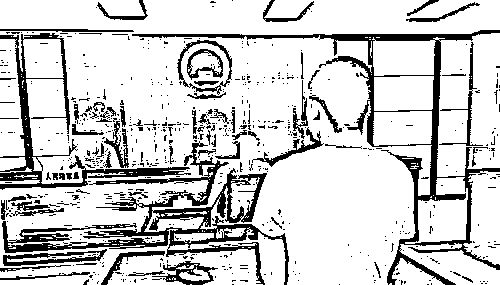

2018 年……2019 年……

几乎每一年，这样的事件都层出不穷的出现在大众面前。

逛知乎时，看到这样一个问题：

**“你身边朋友亲戚或者认识的人进过传销么，后来怎样了？”**

回答高达七百多个。

进去的、逃离的、出来的、出不来的、还有那些不愿意同流合污，最终搭上生命的，那鲜血淋漓的背后，都是数不完的教训。

可能还有人记得“被传销害死的 985 求职少年李文星”。

李文星，毕业于东北大学资源勘查工程专业。

为了方便照顾年迈的父母，李文星不想离家太远和总出差，便决定放弃本专业，选择当一名 java 工程师。

通过贷款学成 Java 之后，2017 年 3 月，李文星开始上网求职找工作。

由于背负着贷款，所以李文星找工作的心情比一般人都要急切。

他通过 boss 直聘网站，被“北京柯蓝公司”聘用。

之后他从北京前往天津入职，开始了自己的职场生涯。

然而，没有想到的是，在天津迎接他的不是暗波涌动的职场生涯，反而是死神的等待。

到了天津之后，李文星就被控制起来，与家人亲人的联系也少的可怜。

胞妹给其打电话，态度十分冷淡，一反常态。

从前要强不求人的李文星，两个月间以花呗还不起了等之前根本不会用的理由，多次管朋友借钱。

唯一一次主动给家人打电话，是在他临死前的几天，对母亲说：“谁打电话管你们要钱你们都别给”。

一周之后，李文星的尸体在天津市静海区 G104 国道旁的一个水坑里被人发现。

是的，经过两个多月挣扎，他终于彻底脱离了“蝶蓓蕾”传销组织。

可惜的是，没有人能够详细的还原，他在传销组织到底遭受了到什么。

唯一能知道的是，与他深陷同一个传销组织的人，比他幸运，通过自残的方式，逃了出来。

而李文星却只能用死，逃离这片苦海。

**他的父母，亲爱的胞妹，他再也无法照料；他曾经许下的诺言，再也无法兑现。**

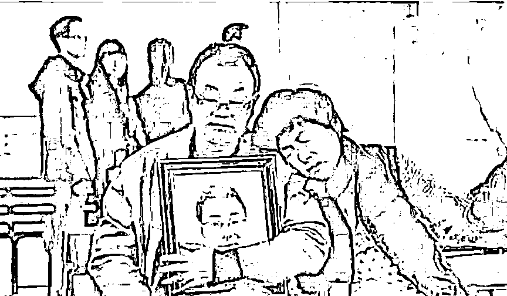

可怕的是，李文星这类用鲜血涂抹传销的事件并非个例。

“我叫张云成，男，汉族，现年 47 岁，家住河南省淮阳县冯塘乡蔡李庄村。

2017 年 6 月 5 日,我的儿子张旭(17 岁)从郑州回到家里,向家里要钱,说他和姐姐张莉在郑州做康宝莱直销产品没法维持了，儿子是 4 月份刚被姐姐拉到郑州做康宝莱的。

我就问他，年前以来已经先后给你姐汇了六、七万元钱，家里已经拿不出钱了。儿子就把情况反馈给他姐姐了。6 月 7 日，女儿张莉手机关机失去联系。

8 日早上，儿子张旭打通姐姐张莉的电话，是一民警接的，说张莉出事了，让家人赶快来处理……”

以上这段话，熟悉吗？

这是一个失去女儿的父亲所写的自述。

张莉，一个还没走出校园的花季少女。因为参与了康宝莱蜜兔俱乐部的传销组织，最终走向了轻生的道路。

和我们传统观念里那些扣押、看管的传销窝点不同。这家公司有自己的“吸引”下线方法。

他们会安排员工去澳门赌场参观、去 4S 店看豪车、去高档酒店参加培训……当无数个一夜暴富后的画面在人们面前划过时，他们就接受了公司提出的任何诉求。

张莉死后，康宝莱公司表示此事与公司无关。

同样的还有 2016 年春节，一男子从佛山去广州见网友，没想到女网友带他进了传销窝点。男子想离开，却被传销组织的人员拳打脚踢致死。

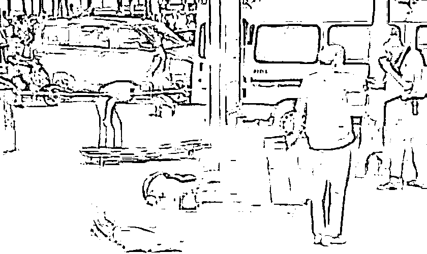

2015 年 3 月 25 日,一个 19 岁的女孩被骗到一个传销窝点。此后，她遭遇了一系列的非人待遇：轮番的殴打、虐待、折磨。

期间，女孩还被掐挠腋下和大腿内侧、用手指戳肛门、用脚踢裆部、用被子捂头、用皮带勒颈、用拳头和脚按踩腹部等方式轮番折磨和殴打，还被用皮带头撬开嘴巴往里塞袜子。

在女孩昏迷后，传销人员对其嘴里灌辣椒水、在眼睛上抹洋葱以及用冷水浇灌等方法想将其弄醒。

**最终，法院判决书上显示，这个可怜的姑娘因全身软组织严重挫伤致挤压综合征引起急性肾衰而死亡。**

而如果你有心留意，一定会发现，在中国裁判文书网站上，搜索传销、故意杀人罪，可以搜到 196 个结果。

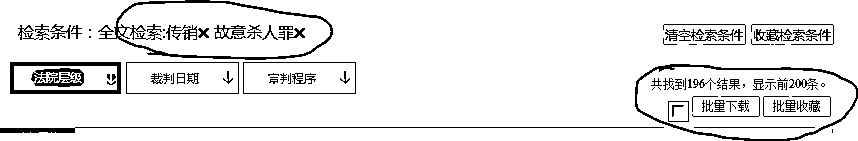

每一起案件，都至少会有一个生命为此而陨落。

这让我想起今年过年的时候，许久未见的旧友聚会。

一个朋友突然聊到今年过年时春晚上蔡明、潘长江她们一起演的那个讲述骗子的小品，不免一阵唏嘘。

他说他在刚刚毕业的时候，也曾差点被卷入传销当中出不来，事后有一段时间不与外界联系，朋友们都以为自己是出国了。

其实不是。

那是他刚毕业还在迫切找工作的日子，突然有一天，一个亲戚家的哥哥问他是不是已经毕业了，有没有兴趣跟他一起干。

他被这个表哥描述的巨大产业前景吸引了，又因为是亲戚，便毫无防备的背着行李，去了河北。

事后他才知道，被骗入传销组织的人，大多数都有一个共性，都是朋友以投资或者找工作的来进来，而这个朋友很多都是多年不联系突然和你十分亲密，把你骗进局之后，在共同利益的驱使下，一步步变为传销人员，之后开始发展下线，获取非法利益。

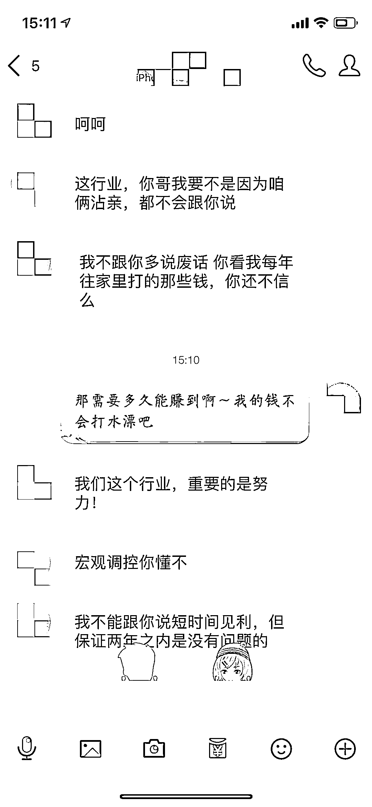

可当时，被幻想的利益帝国景象冲昏了头脑的他，根本不愿意想那么多。 

到了地方，表哥带她来到了居民区的一处住房内，连续说了两次暗号，里边的人才开了门。 他突然开始起了疑心，可这疑心没过多久，就被表哥的那些朋友热情的关心打破了。

他们十分热心的邀请他打扑克，而且可以放水，让他连赢多场。

看他没有了戒备，便提议让他发一条已平安的短信给家人。

然后，安排他休息，告诉他，一切都睡起来再说。 

可真的等自己睡了一夜之后，他突然发现除了衣服，自己的钱包手机全部都消失。一波又一波接着来的人，借口跟他聊天。

他才意识到，可能是传销。

慌张、无助……可理想占据感性之后的思考是，接下来，自己该如何脱身？

借口说离开，可门被铁链锁住，每天做饭都是由专人去买菜。

哀求表哥放他回家，可一遍又一遍被她们强拉硬拽不断的灌输各种行业洗脑的话术，你要不听，就用“废物”“傻子”各种难听的话来侮辱你。

要你背诵她们的行业手册，背不上来，就不能吃饭、也不能喝水。 

直到你的肉体和精神都面临双崩溃，屈服于她们为止。

他一度濒临绝望，甚至假意迎合她们的把戏也被看了出来。

所以两个星期后的那个下午，他是抱着一死的决心，在监视他的人上厕所之后，从三楼的窗户跳下去的。

但有时候命运幸运就幸运在这儿，她被旁边刚好巡逻的社区保安救下来了，表哥他们听见了动静，但只是窗户上看了一眼，没敢追出来。

后来，医生检查说她除了右腿股骨骨折、轻微脑震荡，其他指标都是正常。

后来我们分开时，他跟我们说，他恨传销，一辈子都恨。

**而我，看着在回家的那条路上，那些徒留在那些大街小巷上张贴的反传销海报。**

觉得尤为讽刺。

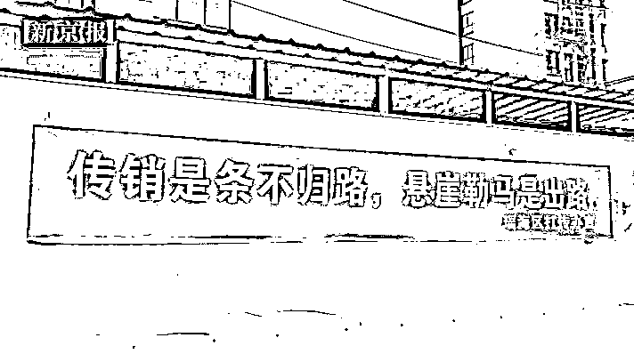

为什么传销屡禁不止？ 

为什么又这么多惨痛的经验在前，还是有人不愿意从中脱离，无法自拔？

很多人内心都有这样深深的疑问。

**因为你会发现，就算有时候端掉了一个窝点，解救了一群人，但没过多久，去接着坑蒙拐骗的，还是那帮人。 **

心理学中，有个词语叫做群体效应，指的是个体形成群体之后，通过群体对个体的约束和指导，群体中个体之间的作用就会使群体中的一群人在心理和行为上发生一系列变化。

**这种作用会凝聚成一股无形的能量游走在每个成员之间，让每个个体的能量在群里中都能得到强化。**

传销组织所谓的“洗脑”，其实就是每天向你灌输“谎言”。

只要坚持说谎，天天讲、月月讲、年年讲，再坚强的人也会动摇，再荒谬的事也会变成真理，不仅能骗倒别人，连自己都会信以为真。更何况，身边的人都已经信以为真。

再加上传销组织严密的作息时间和详尽的安排。新人很难抵挡这种力量，甚至会对自己的迟疑产生怀疑。当新人彻底被洗脑之后，他们这个观念又会因为新人的加入而变得更强。团体更大，于是这种能量更强。

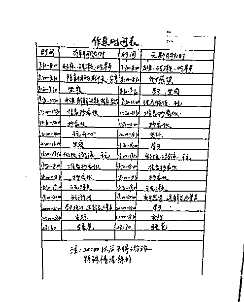

长期生活在谎言之中的人，早就忘记了真实是什么。当你把真实摆在他们面前，他们反而无所适从。

传销人员被解救出来以后，面对现实生活的艰难，停留在脑海里的那个力量，又会不自觉指引他们重新走向那个地方。

不仅如此，对于传销组织之所以像恶臭的狗屁膏药甩都甩不掉的原因。有网友曾归结为四点：

**第一、传销具有隐蔽性。**传统传销一般藏匿于住宅区，他们有很强的反侦察意识，平时就是三五人聚在一起上课做笔记，既不是非法聚集，也根本没办法抓到把柄，所以比较难发现。

而网络新形势下的经营模式也并不好确定。比如很多人问一些“微商”、“环球捕手”、“夸克联盟”等是不是传销？由于法律目前无法定义这些模式究竟是合法的创新还是违法的骗局，也不能轻易扼杀。

所以造成传销前期被发现的概率比较低。前期发现难，到后期有些人已经被“洗脑”，所以增加了一些难度。

**第二、传销形成固定的利益链。**传销组织一般都会租住在经济发展程度不高的住宅区，他们会抬高当地的房租，同时对住宅区附近的餐饮、超市等有一定的促进作用。再加上他们表面上非常文明友好，所以，当地人并不怀疑他们。即便有所怀疑，也会看在经济利益的份上，不闻不问。

**第三、传销具有可复制性。**传销头目被抓后，下面的人还可以另立山头，重新复制。因为他们接受过严密的培训，重新开始也是非常容易的。

**第四，传销的法律惩罚太轻。**现行的法律对一般性质的传销惩罚太轻，一般都是拘留。真正判刑的并不多，所以形不成强大的震慑作用。

传销从 1980 年引入中国，经过长期的发展，目前有“北派”和“南派”之分。它们的区别主要在于经营模式上。

“北派”打着“直销”、“网络营销”、“人际网络”等旗号，以“三商法”、“五级三阶制”为制度，入门费主要有 2900 元和 3900 元不等，有控制手机、非法拘禁等限制自由的情况。比如李文星遭遇的传销就是“北派”。

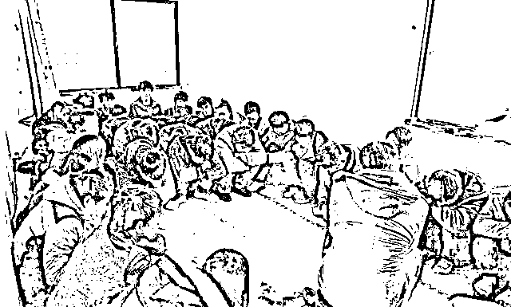

“南派”主要打着“连锁销售”、“自愿连锁经营业”、“纯资本运作”、“商会商务运作”、“民间互助理财”等旗号，以考察项目、包工程、旅游探亲为名把新人骗到外地，然后以串门拜访为由一对一洗脑。

**但不管是什么形式的传销，它的本质不是暴力+人身控制+骗亲友钱财，而是利用人性贪嗔痴的精神控制。**

英国作家乔治·奥威尔有句名言：一切问题的关键在于承认一加一等于二。不承认这一点的时候，故事就会有多种多样的可能性。

就像后来郝群卧底在传销组织中认识的那位只有 21 岁的朋友，郑杰。

郝群曾一直尝试去影响他，让他脱离苦海，有次两个人聊到理想。

郝杰说，他这辈子最大的梦想就是像魔兽世界里的传奇人物摩恩一样，一辈子悠闲自在，干最惬意的活儿、赚最轻松的钱。

郝群鼓励他勇敢去做，去找份正当的职业，努力赚钱。

但他却说，“一个月赚那么点钱，有什么用？还是干这一行好，只要吃两年苦，我就能赚几百万，到时候，我想干什么就干什么。”

后来还有一次，郝群和他两个人路过肯德基，看到门前的乞丐，一手拿着包子，一手喝着营养快线，吃的香甜。

郝杰羡慕说：“唉，乞丐都比我们吃的好。”

郝群以为有扭转余地，劝他一起去吃点东西。

结果，他却一脸认真的说：“哥，这就是你的不对了，行业有行业的纪律……”

那天，郝群在书的最后一段写道：

“郑杰，当代的典型产品，一个高智商笨蛋。他受过高等教育，谈起相对论来如数家珍，却看不破最简单的骗局；他知道什么是黑洞、什么是白矮星，甚至知道什么是普朗克常数，却唯独不懂最简单的道理：饿了要吃饭。”

一个作家曾形容传销说：“这是一条让你很想上的船，它会给你梦想，给你光环，给你奋斗的幻觉，给你成就感，甚至给你家的温暖；

**“但这也是一条上了便很难下的船：执念、欲望、面子、利益捆绑，以及没有面对现实的勇气。”**

深以为然。

这个社会的人们，从来不缺理论，但唯独缺常识。

他们无知，随便偷换概念的几句话就可以被忽悠的团团转。

**于是，一个白痴诞生了，两个白痴诞生了，一千万个白痴诞生了……**

他们急功近利，内心贪婪的欲望冲破喉咙的时候，一双眼睛只会盯着最不切实际的目标。

于是，一个执迷不悟的人出走了，两个执迷不悟的人出走了，一千万个执迷不悟的人出走了……

可惜的是，他们都忘了，天下从来没有免费的午餐，是人世间亘古不变的道理。

**这是人性，也是惰性。**

**这是梦魇，也是地狱。**

最可怕的是，当传销的一幕幕总是在身边上演，当人们把这件事已经当做习以为常，当传销正在不断以跟各种与时俱进的方式渗透在中国成千上百万的家庭里。

正是这些我们不以为然，以为距离自己非常远的实物，正在将每一个中国人的思想默默且毫不留情的吞噬在黑暗中。

“一百多年前梁启超说过，中国若要富强，首先要开启民智。在一百多年后的今天，要打击传销，开启民智依然是第一要务。用常识对抗谬论，用智慧揭穿谎言，让更多的人独立思考、明辨是非，则传销可绝、人心可安，否则这邪恶的骗局将永远流传。”

其实我们都知道，仅仅一篇文章，或是几段文字，并不能对这个社会有任何改变。

对这个隐匿于市斤、藏于黑暗中的组织，并不能起到任何的震慑作用。

但我们还是做了。我们还是愿意尽我们所能。

**鲁迅所说：救救孩子。希望应该看到希望。而邪恶，也不应该属于善良。**

来源：来了少年（ID：Flgh12），反传 365

← 向右滑动与灰产圈互动交流 →

