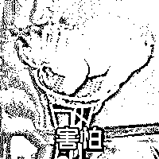

# 多人中招，却有人不愿报警！中专学历骗子凭何骗倒高材生？

> 原文：[`mp.weixin.qq.com/s?__biz=MzIyMDYwMTk0Mw==&mid=2247510135&idx=5&sn=a118615684708470560cd5e64ef525c7&chksm=97cb634fa0bcea593a4fa420822f1cc4912cf2e30a8c944faf46cb377d308868fc03539a5fc5&scene=27#wechat_redirect`](http://mp.weixin.qq.com/s?__biz=MzIyMDYwMTk0Mw==&mid=2247510135&idx=5&sn=a118615684708470560cd5e64ef525c7&chksm=97cb634fa0bcea593a4fa420822f1cc4912cf2e30a8c944faf46cb377d308868fc03539a5fc5&scene=27#wechat_redirect)

一遇论文误终生

从此职称是路人

这不，有人为了快速晋升

铤而走险**找人代发论文**

谁知竟掉入诈骗团伙的圈套

**最终“文”财两空**

家住广东佛山的小成（化名）

是某单位的一名正式职工

**处于事业瓶颈期的他**

**为了评上职称**

**正苦找门路发表论文**

但多年未执笔

小成很是苦恼

2020 年 5 月

小成接到一个陌生电话

**对方称不仅可以代发论文**

**甚至可以代写，并保证见刊**

在之后几次电话沟通中

对方不停跟小成分享

自己顺利帮助多人刊发过论文

并评上职称的案例

于是，小成抱着试一试的心态

添加了对方微信

 

为了彻底打消小成的疑虑

对方还表示

**论文发表费用可以先付一半**

**发表成功后再付尾款**

之后

小成选择他理想的核心期刊名称

**并以 6000 元和 5750 元的价格**

**先后让对方帮忙发表了两篇论文**

6 月，小成收到对方发来的

期刊录用论文通知书

于是拨打通知书上的固定电话

来确定是否被录用

在得到肯定答复后

小成向对方付清了尾款

▲部分转账记录

直到 10 月

小成到杂志官方网站查询论文发表情况

却发现根本查不到

再想联系对方

发现微信已被“拉黑”

这才知道被骗

于是立即报警求助

接报后，警方立即展开侦查

于今年 2 月 3 日成功将 3 名嫌疑人抓获

目前

3 名嫌疑人已被警方依法刑拘

据了解，该犯罪团伙组织分工明确，由销售人员找到目标人员的联系方式，并通过电话联系确定需求以及价钱，随后再由行政人员负责制作虚假录用通知书，发送给对方骗取论文发表费用。

令人意想不到的是

**该团伙成员的教育水平**

**最高只有中专文凭**

根本不具备代写专业论文并发表的水平

**而诈骗对象**

**却几乎都是高学历、有稳定工作的群体**

经调查，警方发现

被骗的远不止小成一人

却很少有人报案

甚至当办案民警与这些被骗事主联系时

**不少人都不愿配合**

有的甚至表示根本就没有这回事

诈骗分子正是利用了

**“事主自知代写论文本就不合法**

**即使被骗也不敢吱声”**

这一心理实施诈骗

警方提醒

写论文是完成学业、晋升的必经之路，找人代写一旦被查出，多年的辛苦学习、工作就付诸东流。

有论文发表需求的市民，切勿轻信网上所谓的快捷发表渠道，一定要充分了解文章发布流程，选择正规渠道。正规期刊都有对公账号，遇到要求通过微信、支付宝等方式转账至个人账户的情况，一定要谨慎对待、再三核实。一旦发现被骗，请立即报警，切勿让不法分子逍遥法外，欺骗更多受害人。

同时，警方也呼吁高校、单位完善学业、职位评价机制，不让代写论文者钻空子。

来源：广东公安、南海公安

← 向右滑动与灰产圈互动交流 →

