# 一夜之间，朋友圈都在“蚂蚁牙黑”！小心背后的风险！

> 原文：[`mp.weixin.qq.com/s?__biz=MzIyMDYwMTk0Mw==&mid=2247510186&idx=1&sn=b0ed24d0dede5f1a223719f5814acbdc&chksm=97cb6392a0bcea84ecb0570f1fd9dc8e5d08bf0c7208bfd75eff32f5314c560029874709a9c5&scene=27#wechat_redirect`](http://mp.weixin.qq.com/s?__biz=MzIyMDYwMTk0Mw==&mid=2247510186&idx=1&sn=b0ed24d0dede5f1a223719f5814acbdc&chksm=97cb6392a0bcea84ecb0570f1fd9dc8e5d08bf0c7208bfd75eff32f5314c560029874709a9c5&scene=27#wechat_redirect)

这两天

很多人满脑子都是一首循环播放的 

**“蚂蚁牙黑”**

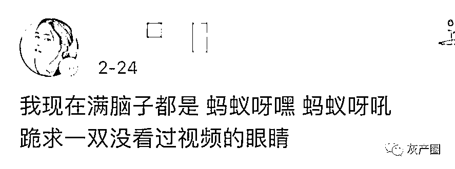

火到什么程度呢？

你打开任意一个社交软件

都可能被这个魔性的音乐洗脑

[`v.qq.com/iframe/preview.html?width=500&height=375&auto=0&vid=c3230q7te48`](https://v.qq.com/iframe/preview.html?width=500&height=375&auto=0&vid=c3230q7te48)

连你平时不太上网的七大姑八大姨

都要问你怎么弄的程度

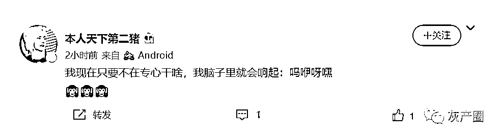

火到如果你的朋友问你一个冷笑话

“蚂蚁牙是什么颜色的？”

如果你不是秒回“黑”就落伍了

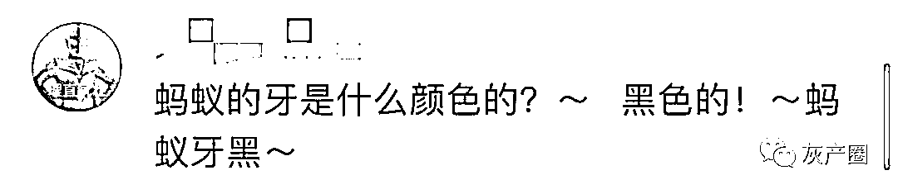

这到底是个什么事儿？ 

其实很简单 

**就是把你的一张静态照片**

**↓**

**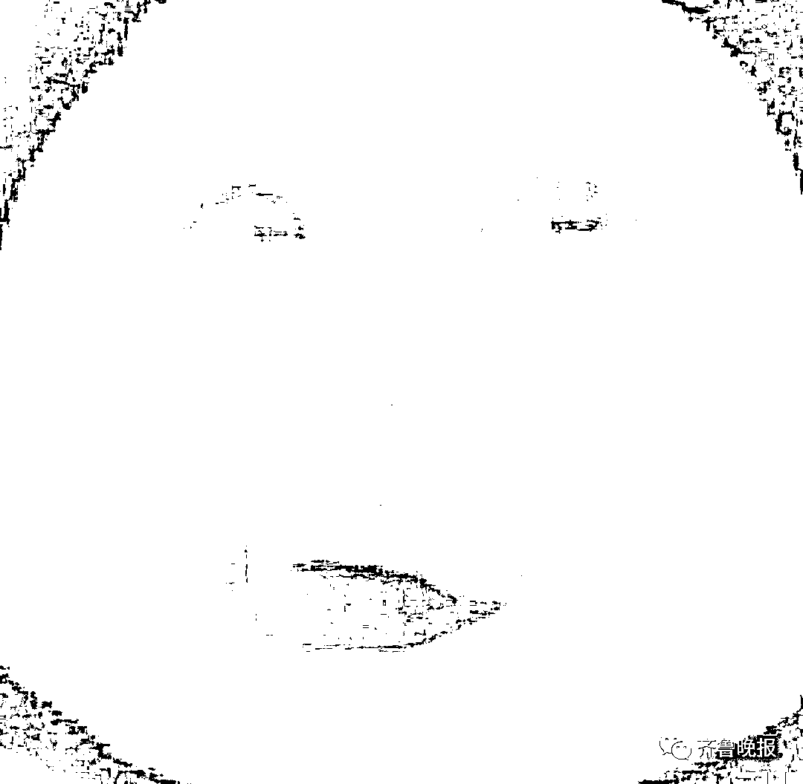**

**通过****某换脸软件**

**制作成一个动态小视频**

**（请自行脑补“蚂蚁牙黑”的 bgm）**

↓

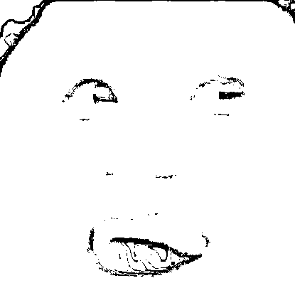

由于该软件需要付费

所以小编去某二手平台搜索 

果然...

已经上线了“视频代制作”的服务

售价在 1 到 5 元不等

看销量也有不少人购买

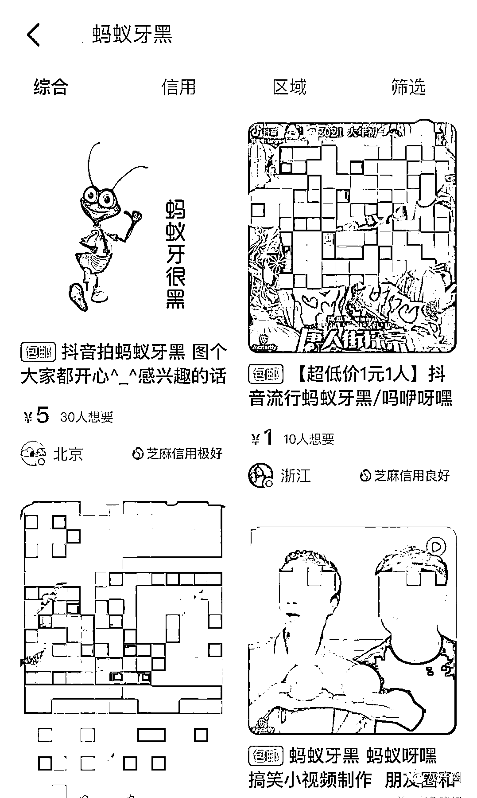

小编也跟风做了很多个小视频

追了一波风潮

但仔细想想

**这跟之前爆火的一款“换脸软件”一样**

**存在很多可能性的风险**

不免也有些后怕

如果使用别人的照片进行制作

可能还存着侵犯肖像权的风险 

把自己清晰的正面照片上传

自己的生物信息真的不会暴露吗？ 

一旦“丢脸”我们将面临哪些风险？

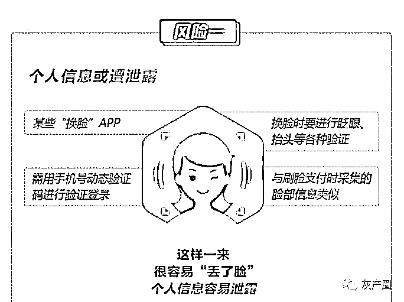

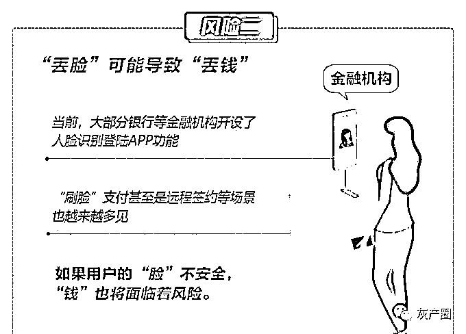

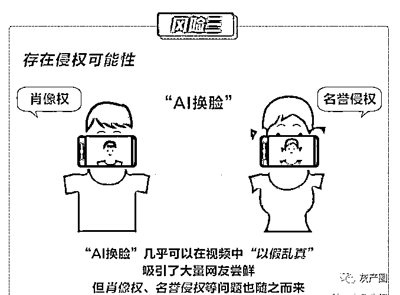

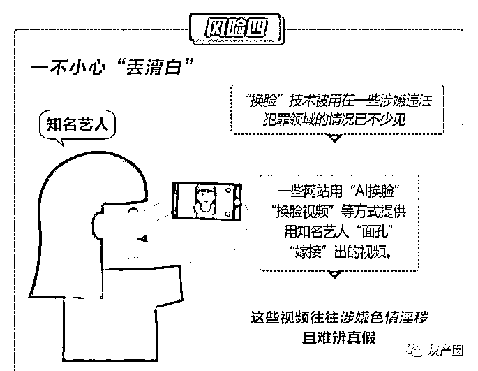

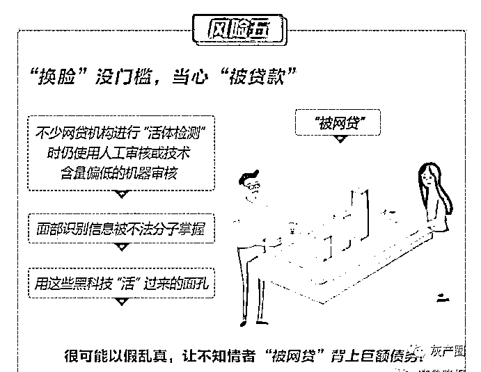

虽然说这些都是潜在的风险

大家开心的同时，还是要注意

跟风虽快乐，风险需自知

**你会把照片上传到这些软件**

**或者**

**让别人代制作视频吗？**

来源：齐鲁晚报、界面新闻、新浪微博

← 向右滑动与灰产圈互动交流 →

