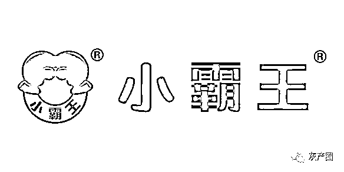
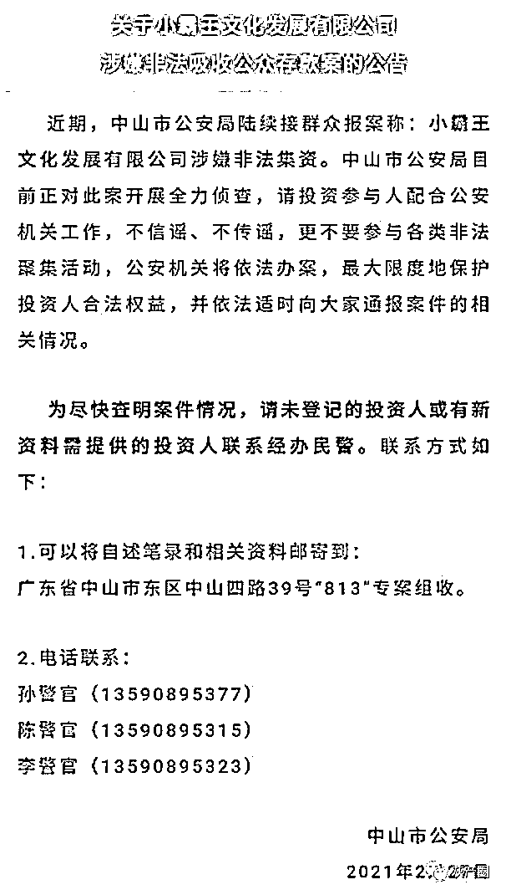
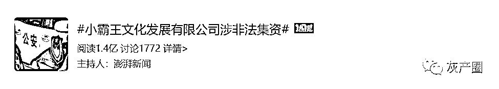
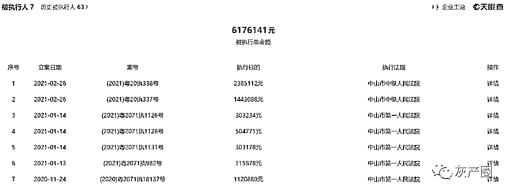
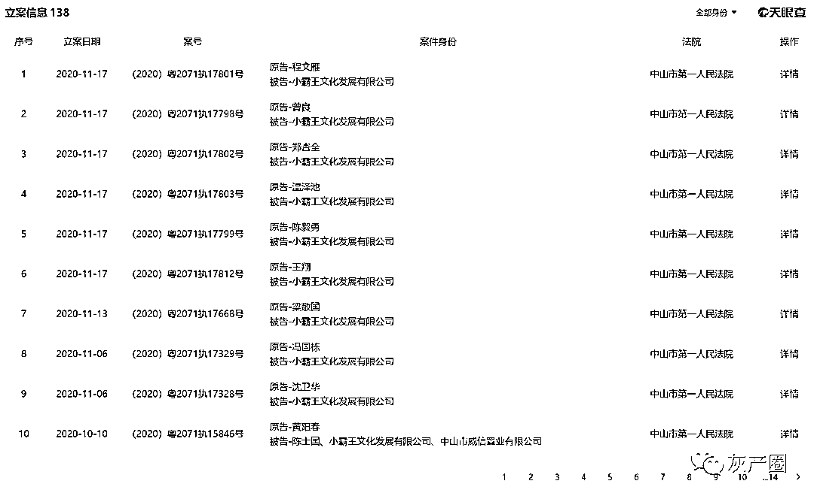
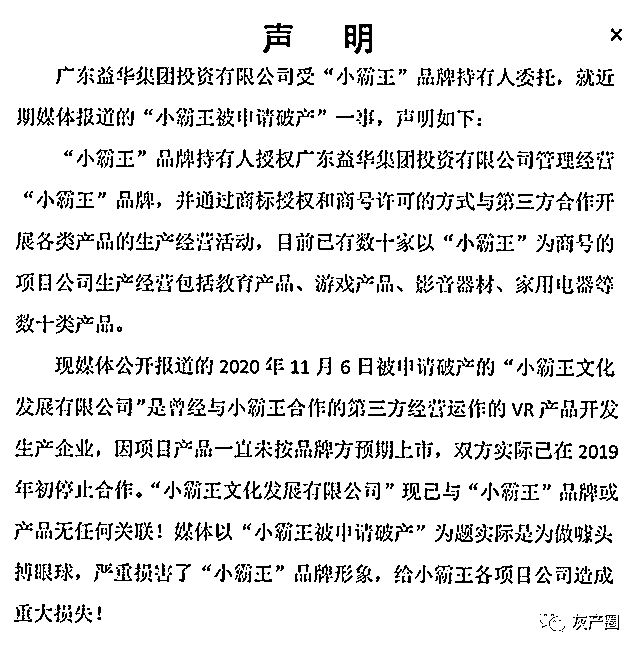

# “小霸王”涉嫌非法集资！

> 原文：[`mp.weixin.qq.com/s?__biz=MzIyMDYwMTk0Mw==&mid=2247510186&idx=2&sn=0ffefbd38a076bfc93e25c07e56dda7c&chksm=97cb6392a0bcea84e53293e6424f7fcdd9dbb4102a907fea2dead0aea38c9513b22ac75b0a31&scene=27#wechat_redirect`](http://mp.weixin.qq.com/s?__biz=MzIyMDYwMTk0Mw==&mid=2247510186&idx=2&sn=0ffefbd38a076bfc93e25c07e56dda7c&chksm=97cb6392a0bcea84e53293e6424f7fcdd9dbb4102a907fea2dead0aea38c9513b22ac75b0a31&scene=27#wechat_redirect)

图片来源：图虫

[`v.qq.com/iframe/preview.html?width=500&height=375&auto=0&vid=y3230giv3re`](https://v.qq.com/iframe/preview.html?width=500&height=375&auto=0&vid=y3230giv3re)

2021 年 2 月 27 日，广东省中山市公安局官微发布关于小霸王文化发展有限公司涉嫌非法吸收公众存款案的公告

该公告发布后，“小霸王文化发展有限公司涉非法集资”话题迅速登上微博热搜榜，阅读量已超过 1.4 亿。

该公告显示，中山市公安局近期陆续接群众报案称：小霸王文化发展有限公司（下称“小霸王文化”）涉嫌非法集资。中山市公安局目前正对此案开展全力侦查，请投资参与人配合公安机关工作，不信谣、不传谣，更不要参与各类非法聚集活动，公安机关将依法办案，最大限度地保护投资人合法权益，并依法适时向大家通报案件的相关情况。 

公告指出，为尽快查明案件情况，请未登记的投资人或有新资料需提供的投资人联系经办民警。

此次小霸王文化遭调查，可回溯到该公司 2016 至 2017 年的筹备上市和原始股销售一事。

小霸王文化成立于 2015 年，是一家儿童早教机研发商，主要产品包括红白游戏机、儿童早教机、儿童平板电脑、VR 教育影音等。2016 年，益华百货（益华控股的百货业务主体）入股小霸王文化，陈健仁担任其副董事长。随后小霸王文化与小霸王合作开发 VR 产品。

一直以来，小霸王文化以“小霸王集团”的名义召开会议，“小霸王集团”并未在官方平台有备案资料，而微信公众号上显示的账号主体就是“小霸王文化发展有限公司”。小霸王文化开始高调宣传并推销其上市计划，表示将打造出一个 500 亿市值的 VR 帝国，并以此为由头进行原始股集资。

2016 年，小霸王宣布回归游戏机业务，与 AMD 签署合作协议，并斥资 4 亿元委托 AMD 为小霸王开发一款游戏主机芯片，进军 VR 领域。2017 年，小霸王文化在中山市国贸逸豪五星酒店举行上市启动大会，正式启动上市，并为签约新老合伙人分发 3000 万元原始股。

原始股属小霸王文化上市前的首轮增发，形式分两种：一是股权认购，主要对与奔着购买原始股权来的供应商、合作商。一种是现场订货股权赠送，主要是对与小霸王文化的老代理商、新签约的合伙人。两种方式均承诺一定收益，并称若小霸王文化公司未能如期上市，投资人可退回本金。

“承诺 2019 年上市，净利润 4 亿，会有 5 至 8 倍收益，随时可以选择退出。假如不上市以年化 4%进行回购，无投资风险。”界面新闻看到的一份宣传材料称。

但至今，小霸王游戏主机在发布会上短暂现身后，产品的发售日期一拖再拖，最终未在市面上激起水花。小霸王文化上市也遥遥无期，公司经营也陷入严重困难。2020 年 11 月 8 日，据全国企业破产重组案件信息网公告显示，小霸王文化已于 11 月 5 日被申请破产重整。

天眼查 APP 显示，2019 年至今，小霸王文化已牵涉近 100 起司法案件，其中涉及多起股权投资款的纠纷。多份判决书显示，有多位投资者购买了小霸王文化的原始股，小霸王文化向这些投资者颁发股权证书，股权由公司原董事长方鸿祺代持。

但小霸王文化承诺的投资收益并未兑现，甚至一些投资人也未收到退回的本金。“2019 年初，原告了解到小霸王的办公地已经人去楼空，大量与原告类似的投资人上门索要退款。”裁判文书网上一份判决书这样写道。

“承诺三年上市，然后一年之后就转让给中山巿益华控股有限公司。至 2018 年大家见上巿无望，申请退款，至今未退，这种行为属于期诈行业，非法集资。”一位在社交网络上疑似参与小霸王文化原始股投资的用户投诉称。

随着小霸王文化破产一事发酵，“小霸王”商标持有方也广东益华集团投资有限公司也声明切割，称小霸王文化是曾经与小霸王合作的第三方经营运作的 VR 产品开发生产企业，因项目产品一直未按品牌方预期上市，双方实际已在 2019 年初停止合作。小霸王文化现已与“小霸王”品牌或产品无任何关联。

就在今年年初，小霸王文化因破产重整一事曾引发大众关注。2020 年 11 月 5 日，广东省中山市中级人民法院下发通知，称收到对小霸王文化破产清算的申请，2021 年 1 月 6 日，小霸王文化被破产重整。网友纷纷表示“小霸王游戏机是童年回忆”，“爷青结”，但“小霸王”品牌对此撇清关系。

“小霸王”官网发布《声明》表示，媒体公开报道的被申请破产的小霸王文化是曾经与小霸王合作的第三方经营运作的 VR 产品开发生产企业，因项目产品一直未按品牌方预期上市，双方实际已在 2019 年初停止合作，“小霸王文化发展有限公司”现已与“小霸王”品牌或产品无任何关联。

“小霸王”品牌持有人授权广东益华集团投资有限公司（下称“益华集团”）经营管理该品牌，并通过商标授权和商号许可的方式与第三方合作开展各类产品的生产经营活动，目前以“小霸王”为商号的项目公司生产经营包括教育产品、游戏产品、影音器材、家用电器等数十类产品。

值得一提的是，广东益华百货有限公司（下称“益华百货”）曾是小霸王文化的大股东，目前仍是工商股东。益华百货是港股上市公司益华控股（HK.002213）的全资附属公司，2020 年 1 月 7 日，益华百货老板陈健仁退出小霸王文化董事、董事长职位，目前仍在益华集团担任法定代表人、董事长、经理。

益华控股本身自 2019 年起就被债权人申请清盘，直到现在仍在停牌中。据 2 月 17 日益华控股发布公告显示，集团位于广东省中山市、清远市、阳春市的若干百货店已在 2020 年第四季度停止运营，目前益华控股 2019 年业绩报告仍未披露。据此前《新京报》报道，据益华百货商户提供的数据，仅中山和江门两地门店，益华百货所欠货款金额已达上亿元。

来源：界面新闻，新京报，天眼查

← 向右滑动与灰产圈互动交流 →

