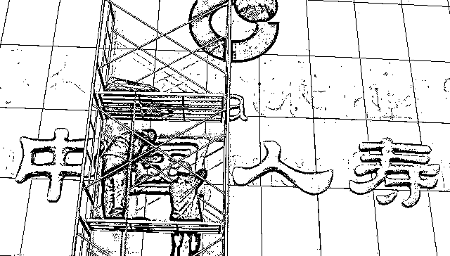
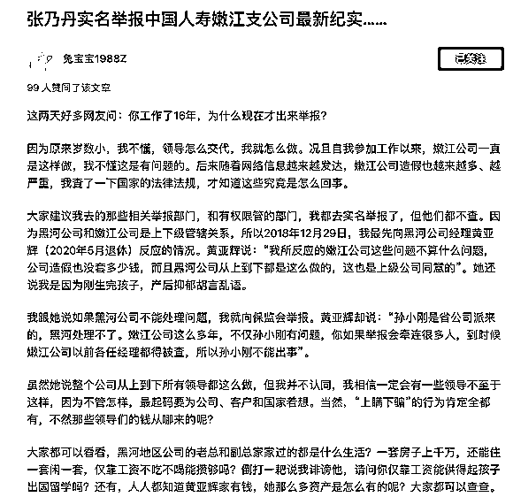
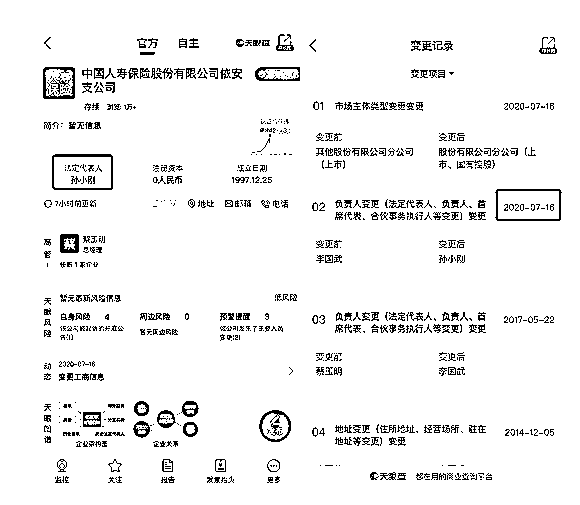

# 实名举报中国人寿当事人再发声

> 原文：[`mp.weixin.qq.com/s?__biz=MzIyMDYwMTk0Mw==&mid=2247510186&idx=3&sn=bbb9745c0bf939c5a4dfc1d7cadd35e9&chksm=97cb6392a0bcea8471b4f5c343280d197219e4e4859bafada091ab6d6dcaf4978d09a1ea5626&scene=27#wechat_redirect`](http://mp.weixin.qq.com/s?__biz=MzIyMDYwMTk0Mw==&mid=2247510186&idx=3&sn=bbb9745c0bf939c5a4dfc1d7cadd35e9&chksm=97cb6392a0bcea8471b4f5c343280d197219e4e4859bafada091ab6d6dcaf4978d09a1ea5626&scene=27#wechat_redirect)

图片来源：视觉中国 2 月 27 日，此前实名举报中国人寿的当事人张乃丹在社交网站上再次发声，回应网友质疑。（此前报道：[16 年老员工实名举报中国人寿大量造假！](http://mp.weixin.qq.com/s?__biz=MzIyMDYwMTk0Mw==&mid=2247510017&idx=1&sn=7741d14f9c81c07255df44abb45f505f&chksm=97cb6339a0bcea2f9f316bfba8bc9112b7997a10461533b51d4d6bfc12aaadd006cbe1dec13e&scene=21#wechat_redirect)）她表示，之所以工作 16 年才出来举报，是由于原来岁数小，不懂这是有问题的，后来查了国家法律法规才知道究竟是怎么回事；针对“网友称她误导客户去退保，坑了保险公司员工和销售人员”等问题，她表示，自己没误导客户、也没劝客户退保。自己实名举报的是事实，有证据支撑，也查证属实。她还提到，如果真的没有问题，为什么黑河公司和嫩江公司明明是上下级关系，我提供证据实名举报，不仅不处理，反而是黄亚辉联合孙小刚和白洁无所不用其极地打压我、报复我。“正是因为我举报了，公司现在不敢克扣员工奖金了，不敢强制逼迫员工去造假、去骗保了。她在文章最后陈列其在中国人寿的诸多成绩，表示“感恩不代表必须抛弃底线。”

随着中国人寿员工举报造假事件的不断发酵，当事人、中国人寿以及监管层均陆续作出回应。2 月 24 日事件发酵当天，中国人寿相关人士回应界面新闻称，目前正在调查研究，下午将出公告回应。24 日晚，中国人寿再次回应称，公司对此事高度重视，已成立专门调查组赶赴当地开展全面调查。公司一贯坚持依法合规经营，严格按照国家法律法规及监管规定，开展经营管理活动，维护客户和员工合法权益。如调查发现违规违纪问题，将严肃处理，绝不姑息。同日，被指控对象孙小刚也通过媒体进行回应，承认在经营上存在不妥，并表示其已被当地银保监局做出了相关处理，但否认了举报人张某某“造假”的指控。“之前和张某某曾因工作问题存在矛盾，张所说的经营上不妥当的问题，当地银保监局也有相关处理记录。”孙某某表示：“她说我造假、做假保费、贪污套取资金并且占为己有均不属实。她还说我窃取客户资料、虚假增员和身价千万都不存在。现在她的行为侵犯了我个人权益，我准备起诉她。”公开资料显示，黑河银保监分局曾于 2019 年 5 月和 12 月向嫩江支公司开出两份处罚单，处罚事由为“虚列费用”。2019 年 5 月，因虚列费用，嫩江支公司被责令改正，并处罚款 10 万元，孙小刚和鲁志纯均被警告并分别罚款 1 万元；12 月，嫩江支公司因虚列费用被黑河银保监分局连开 4 张罚单，被罚款 10 万元，孙小刚因对虚列费用问题负直接责任，被警告并罚款 1 万元。此外值得注意的是，中国人寿相关人士在 24 日接受界面新闻采访时表示，孙小刚已经在 2020 年离职嫩江支公司。但张乃丹在 25 日的回应中透露，孙小刚在离职嫩江支公司之后，于 2020 年 5 月份被另外调回齐齐哈尔依安公司当经理。天眼查 APP 数据显示，中国人寿依安支公司的负责人正与孙小刚同名，其任职时间为 2020 年 7 月份。此孙小刚是否为彼孙小刚，界面新闻向中国人寿方面求证，尚未获得答复。

此外，此事同样引起监管层高度重视。2 月 24 日，黑龙江银保监局相关工作人员对界面新闻回应称，目前该局正在研究此事，相关问题有专人在负责，“对于具体处置问题，我们肯定会有后续措施。”26 日，银保监会相关负责人表示，事件发生后，银保监会要求黑龙江银保监局第一时间成立专项工作组展开调查。前期，针对举报人反映的问题，黑龙江银保监局黑河分局对中国人寿黑河市嫩江支公司依法进行核查，对已查实的违法违规问题依法作出了行政处罚。下一步，黑龙江银保监局将把核实信访举报与查处违法违规行为结合起来，全面排查中国人寿黑龙江省辖内相关业务，并根据查实的情况，对相关机构和责任人依法严肃处理。

同时，银保监会责成中国人寿总公司深入核查问题线索，全面自查，加大追责问责力度，切实保障消费者和从业人员合法权益。目前，中国人寿已作出具体安排，正在加紧开展有关工作。

来源：界面新闻

← 向右滑动与灰产圈互动交流 →

