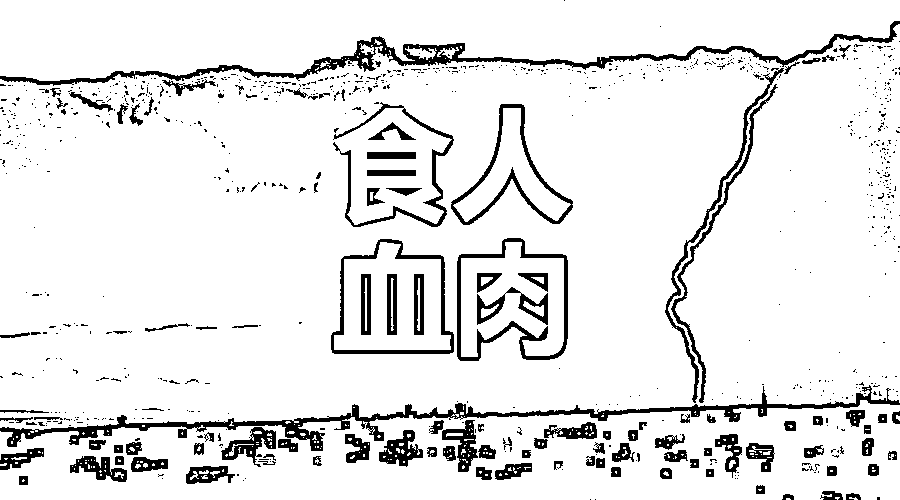
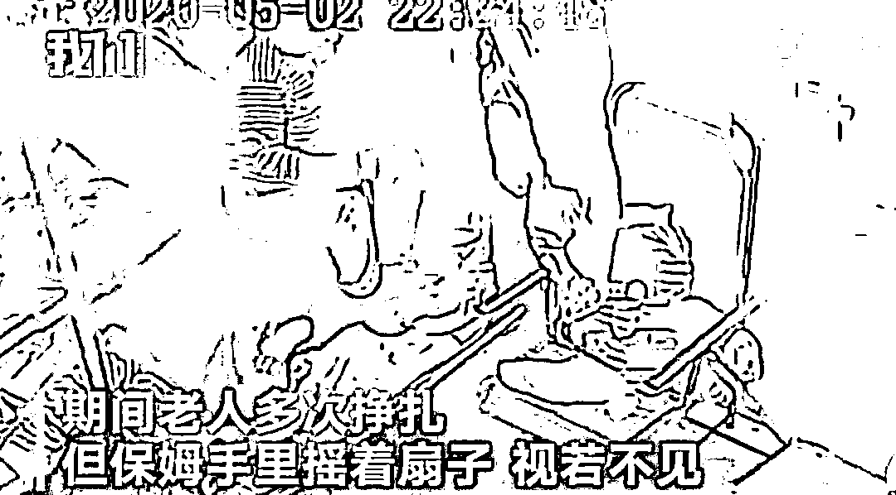
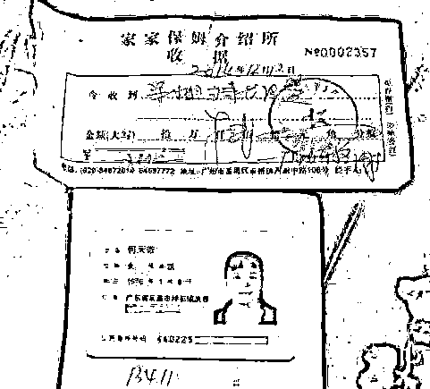
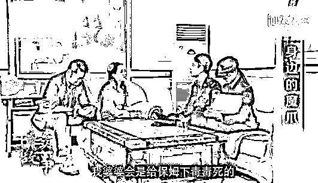
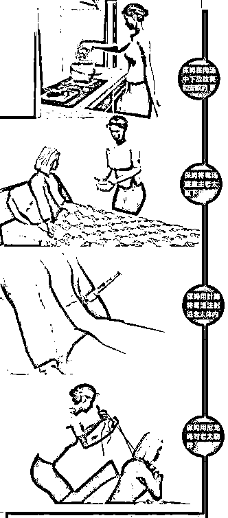
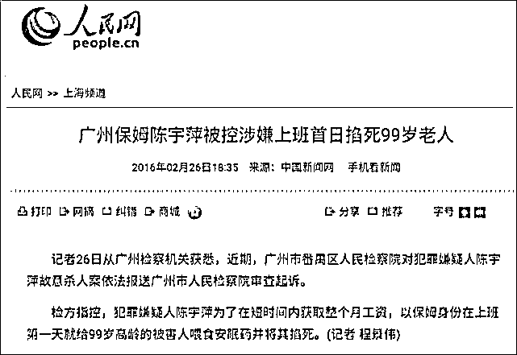

# 比保姆闷死老人更恐怖的是家政圈的“杀人产业链”！

> 原文：[`mp.weixin.qq.com/s?__biz=MzIyMDYwMTk0Mw==&mid=2247510236&idx=1&sn=8e7d6fb1554c201328d5a7b9d2b74b27&chksm=97cb63e4a0bceaf2380342a9a10250c429be35dc4069adab5eb55734c1eb7c0c0986b0d8507f&scene=27#wechat_redirect`](http://mp.weixin.qq.com/s?__biz=MzIyMDYwMTk0Mw==&mid=2247510236&idx=1&sn=8e7d6fb1554c201328d5a7b9d2b74b27&chksm=97cb63e4a0bceaf2380342a9a10250c429be35dc4069adab5eb55734c1eb7c0c0986b0d8507f&scene=27#wechat_redirect)

‍

写在文前：

之前江苏的保姆杀老人案在热搜上沸沸扬扬，

前几年震惊全国的杭州保姆纵火案还历历在目，

保姆杀人的事儿这几年时不时地能听到几起。

今天这篇文章带大家深入了解一下“家政圈”不为人知的一面

让更多人了解这个“灰色产业”！

让更多人远离伤害！ 

让更多人重视起来！

01 

恶毒保姆活活闷死老人

这篇文章，是在极其愤怒的情绪下写下的。

因为最近爆出的这则新闻，真心让人怒不可遏！

2020 年 5 月 2 日，江苏溧阳一名 83 岁的老人，被保姆闷死。家中监控录下了这一幕。

[`v.qq.com/iframe/preview.html?width=500&height=375&auto=0&vid=k09650xufq3`](https://v.qq.com/iframe/preview.html?width=500&height=375&auto=0&vid=k09650xufq3)

可以看到，保姆先是环顾四周，然后用毛巾捂住老人面部。

接着，她一屁股坐在老人胸口，期间老人多次挣扎，但保姆扔摇着扇子，视若无睹，直至老人死去。

无法想象，那个老人在挣扎时，该有多绝望！

据被害人家属称，保姆行凶后还非常镇定地教他们处理后事。

如果不是监控录像拍下，恐怕他们还不知道真凶就是“好心肠”的保姆。

从观察环境、捂嘴到坐胸，再加上悠然自得地扇扇子……这一套手法之娴熟，这让网友忍不住猜测，这个保姆绝对是个惯犯。

更可怕的是，保姆在与老人家属沟通后世时，还说了这样一句话：“不要慌，我送走过很多人了……”

**这句话，真是细思极恐。**

目前，案件还在调查中，保姆具体的作案动机，还不得而知。

对于涉案保姆是惯犯的猜测，常州市公安局相关部门负责人回应称，目前未掌握其他犯罪线索，案件正在进一步侦办中。

其实，网友们关于“惯犯”的猜测并不是空穴来风的。

早年前，就已发生过多起类似的事件。

因为家政行业有个行规，照顾老人的话，如果不足一个月老人死了，也要支付一个月的工资。

于是，很多保姆为了赚快钱，在短时间内将老人杀死，并按行规仅工作几天，就可以收取一个月的工钱，再迅速换下一个目标。

这个在业内，居然还有个专门的术语，叫做“执死鸡”。

看看以前发生过的“毒保姆”案，手段之残忍，更是让人脊背发凉！

02 

解密“执死鸡”保姆群体

专杀老人赚快钱

**在家政圈里，流传着一条隐形规矩：“如老人身故，即使只做几天也要支付全月工钱”。**

原本的出发点是迎合当地风俗习惯，他们认为照顾快过世的老人，是沾染了‘晦气’，雇主给足 1 个月工资其实是当给一份安慰金，是为保姆“解晦”，所以这个钱也称为“解秽金”。

谁能想到，还能有人丧心病狂的利用这一点来赚快钱。

广州曾经出现过一位毒保姆，叫何天带，她随身携带针筒毒药，1 年半里毒杀了 10 位老人。

她的作案手法更加渗人，任谁听了都不寒而栗。

第一次杀人，雇主家的老人患有高血压，帕金森，生活不能自理，也不能说话。

才照顾没几天，何天带就给老人喝了带有敌敌畏、老鼠药的毒水。

老人死后，医生诊断是中风，家人没有怀疑。

何天带躲过一劫，她非常开心领到第一笔快钱。

第二次杀人，老人 90 多岁。

雇佣之前，何天带就说，“如果做了几天老人就死了，也得付我一个月工资。”

儿女们出于好意答应了，没想到，这一句话已经暗藏杀机。

上班三天，她就用一根尼龙绳杀死了老人。老人的儿女没有怀疑，给了她一个月工资。

何天带收好绳子，觉得这钱太好赚了。

于是，有了第三次，第四次…..再后来，何天带杀人的动机，简单粗暴到就为了能够只做几天就能得到一个月工资。

有一次，老人喝下敌敌畏的汤后很久还在挣扎，她有点害怕，打电话给老人的儿女送去医院急救，因为老人不会说话，医生诊断成了高血压等旧疾。

这让何天带又放下了心，同时改进杀人方法，小学文化的何天带，竟然想到掺和敌敌畏的毒汤注射进老人臀部的方法。

直到第十次，在广州南沙，她被抓了。

2014 年 10 月，她被雇去照顾一位 70 岁的老人，才上班第三天，何天带就连续三次对老人下毒手。

第一次，凌晨 4 点时，她用事先准备好的安眠药敌敌畏等勾兑在肉汤里，诱骗老人喝下。

第二次，过了十分钟，或许是药效不够，老人没死，何天带就用一大一小两个针筒，吸满了混有敌敌畏和安眠药的矿泉水，在老人的臀部打了两针。

曾经在医院做过护工的她知道往腹部打流射药物容易被身体吸收，又往腹部打了一针。

第三次，到了早上 6 点，老人已经快不行了，但还没彻底死亡，何天带已经等不及，干脆拿出尼龙绳直接勒脖子，一分钟后，就剩一口气的老人彻底死亡。

**整个作案过程看得我头皮发麻。**

杀死老人后，何天带还拿了老人的耳环，存折，再通知家属老太过世了，要求支付 2600 元保姆费。

在进行死亡登记时，因民警多问了一句是否发现体外伤、家中是否有财物丢失，才导致案发。

被抓以后，何天带显得很烦躁，说：“怎么就你们南沙的警察这么麻烦，我在广州、佛山做这样的事情多了去了！”

民警一听，不对劲啊。 

当场在其行李中搜查出了注射器针筒和针头各 17 个、敌敌畏药水 2 瓶，毒鼠强 2 包，剃须刀 2 把。

再加大审讯力度，才知道在 2013 年 6 月-2014 年 12 月，她已经杀了 10 位老人，家属都没有发现端倪。

如果不是最后一次贪财被发现，她一定会继续杀人，不知又有多少老人惨遭毒手。

2015 年，何天带被处以死刑。

一个何天带已经让人惊悚，另一个比何天带更狠。

这个毒保姆叫陈宇萍，她作案时间更长、杀人可能比何天带还多。

陈宇萍当时四十多岁，最喜欢接老人的活。

案发前，陈宇萍接了一个将近百岁的老爷子的活，老人家平时身体不错，胃口也还好。

陈宇萍照顾他的时候，已经临近过年，她又动起了歪心思。

想着他死了自己就能早点回家，还能拿一个月工钱，两全其美。况且之前就做过不少，那些雇主都没发现。

于是，半夜趁老爷子熟睡她活生生把人掐死了。只做了一天就拿了一个月工资。

在处理后事时，一个亲戚随口说了句他大嫂也是请了个保姆，不到一天就死了。

“和这家情况一模一样！”再问保姆叫什么。”也叫陈宇萍“。

那家人当即报警，一桩桩恶行才随之暴露。在她手下，已知的至少有 6 名老人很快过世了。

广州番禺区西丽路一些家政人员介绍，陈宇萍外号叫“鸡萍”，是专门“执死鸡”（粤语捡便宜的意思）。意思是专门整死重病的老人来赚快钱。

“凡是有生病的老人，她就抢着去做，为赚快钱。”两年时间，陈宇萍存了 13 万。

两个“毒保姆”来自相近的地区、在同一片家政公司上岗。

有受害家属认为，番禺一带就专门有这样的一个“执死鸡”群体，用这样的手段来赚快钱。

“一日赚一个月的钱，一个月可以做十单。” 

**“执死鸡”保姆有几大共同特点：**

*   **喜欢照顾患病老人** 

*   **老人死亡很突然** 

*   **老人多是很快去世** 

*   **上岗前先提行规，在受雇之前，都会强调：“行规是做一两天，也要按一个月的费用来收取。”** 

*   **觊觎老人身边财物**

如果你家雇佣的保姆，出现了上述几个特征，一定要多长点心！

保姆介绍所只管收费，不管工作审查，家属们的疏漏，都无形中助涨了“执死鸡“保姆的气焰。

一旦老人卧病在床，和老人独处的保姆就处在优势地位。轻则谩骂虐待，重则谋财害命。

03 

毒保姆事件

和我们每一个人息息相关

有人会问，怎么有人能做出这种事，老人都不放过。

有一本书叫《当良知在沉睡：辨认你身边的反社会人格者》，这本书告诉我们：

这世上，真的有人是没有良心的。

作者玛莎·斯托特指出：在人群中，天生就没有良心行事完全不按正常规则来的那种人，出现的可能性为 4%。

坏人作恶不会觉得自己在干坏事，他完全意识不到。 

“毒保姆”现象令人深度忧虑的，不仅仅是一两个保姆的作恶，更在于进入老龄化社会之后，广大老人的生存、生活状态。

这些毒保姆的出现，其实和我们每一个人息息相关。

无论是父母或自己，都有老到动不了只能任人摆布的时候，谁能保证自己绝对不会遇到这 4%。不会遇到“执死鸡“。

现在中国正成为人口老龄化最严重的国家之一。到 2050 年，中国的老年人口将占总人口的三分之一，65 岁以上的老人约为 4.8 亿。

80、90、00 后群体面临更严重的老龄化危机。 

特别是单身主义盛行，未来孤独老人的比例会更大。即使组成家庭，大多也是两人赡养四位老人的情况，家政服务市场会更加火爆。

目前，家政行业尚缺乏监管，体系尚未完善，而人心永远是一个黑洞。

如果你实在无暇照顾老人，聘请保姆时请务必注意以下几点：

*   **尽量选择专业、规范的家政公司；**

*   **尽量选择有护理培训经验的保姆；**

*   **一定要在家中安装摄像头，并及时查看；**

*   **不要轻易相信保姆的“善”，凡事多留心眼；**

*   **不当甩手掌柜，要经常查看老人身体，问询他们感受；**

*   ** 重视老人提出的问题，及时协商和解决，一旦发生侵害，立即报警。**

从家庭来看，赡养老人，是每位子女的责任，我们千万不能掉以轻心。

从社会来看，打击灰色保姆产业链、立法规范保姆行业、恶性保姆伤害案问责等，都需要国家引起重视，并进行推动和实施。

从长远来看，我们也应该思考现有养老模式是否有不妥。

日本是人口老龄化严重的国家，为了解决这个问题，推出了《介护保险法》，使得商业养老爆发，大量服务对接老人养老需求，如今已经渐趋成熟，值得我们借鉴。

社会无序，往往不是因为无道德，而是因为无规则。

相信通过我们的关注和发声，通过有关部门的整顿和完善，长期游离在灰色地带的家政服务行业，一定能够早日步入正轨。

最后，我想说：

再小的微光形成合力，也会成为照亮黑暗的火炬，只有全社会一起凶狠地对待这个世界的恶，善良才能自保，世界才会变得美好起来！

来源：一介

← 向右滑动与灰产圈互动交流 →

