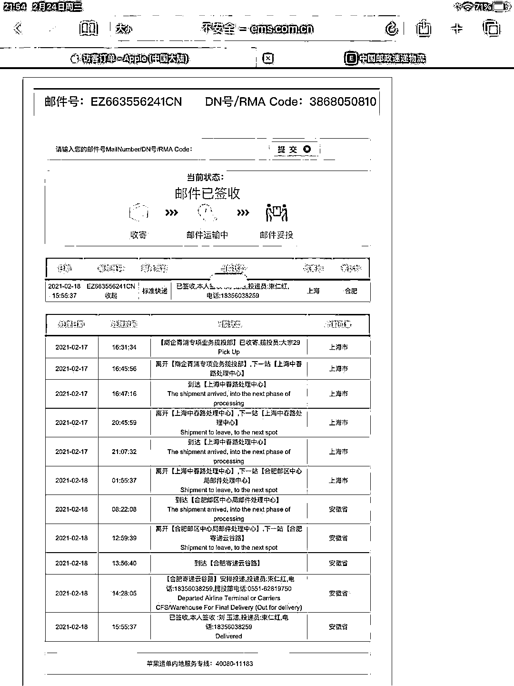

# 一万多买苹果手机，包裹打开竟然是苹果味的酸酸乳！

> 原文：[`mp.weixin.qq.com/s?__biz=MzIyMDYwMTk0Mw==&mid=2247510236&idx=2&sn=5458399336f33c7bb07f1ee5dd059719&chksm=97cb63e4a0bceaf2b7fa2ada9a57eeacbebfe54be51f4eb830d24fdc55568c44697fad14ed14&scene=27#wechat_redirect`](http://mp.weixin.qq.com/s?__biz=MzIyMDYwMTk0Mw==&mid=2247510236&idx=2&sn=5458399336f33c7bb07f1ee5dd059719&chksm=97cb63e4a0bceaf2b7fa2ada9a57eeacbebfe54be51f4eb830d24fdc55568c44697fad14ed14&scene=27#wechat_redirect)

新安晚报·安徽网·大皖新闻 2 月 27 日消息，1 万多元的苹果手机，官网购买，邮政配送，到手时却成了 250ml 的苹果味酸酸乳，近日，合肥刘女士的遭遇引起热议。

记者采访获悉，距刘女士收到酸酸乳已有近十天，目前苹果方还没有回应，邮政表示”在查“，却没有结果。

2 月 27 日下午，刘女士被告知”本应发给她的手机已被激活“，但工作人员未向记者证实此说法。目前，警方已介入调查。

寻帮助：收到”苹果“味的万元“手机”

找说法：十多天只说”查”却没个结果

疑问：到底哪里出了问题？

2 月 28 日，邮政速递合肥云谷路揽投部工作人员告诉澎湃新闻，27 日下午，经合肥市公安局包河分局刑警大队调查，已确认手机被盗换事件与快递公司无关，“现在被偷的手机定位显示是在北京”。

同日，合肥公安局包河分局刑警二队工作人员告诉澎湃新闻，**该案以盗窃案立案，经调查，目前已经确定嫌疑人。**

“我们身正不怕影子斜，一直积极配合警方和总部的调查，他们已经判定这件事与快递无关，警方告诉我们，现在手机已经被激活使用了，手机定位显示是在北京，是苹果公司出现的问题，也就是快递源头的问题，与我们快递是没关系的，现在就进一步的调查结果。”该工作人员称，此前负责投递该快递的快递员也备受争议，目前已经恢复正常工作。

同日，合肥市公安局包河分局刑警二队工作人员告诉澎湃新闻，该案以盗窃案立案，经调查，目前已经确定嫌疑人，具体调查情况暂时不方便透露。

此外，澎湃新闻记者多次致电苹果公司询问调查进展，截止发稿，未获得回复。

来源：澎湃新闻

← 向右滑动与灰产圈互动交流 →

