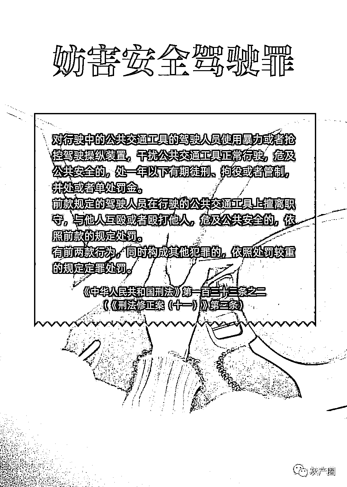
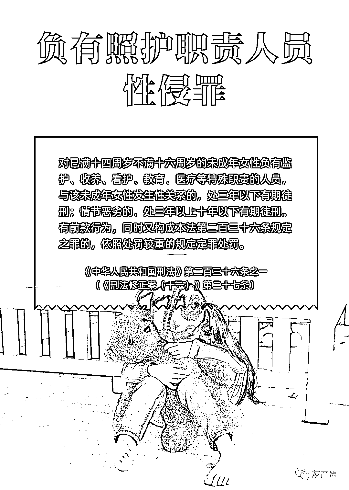
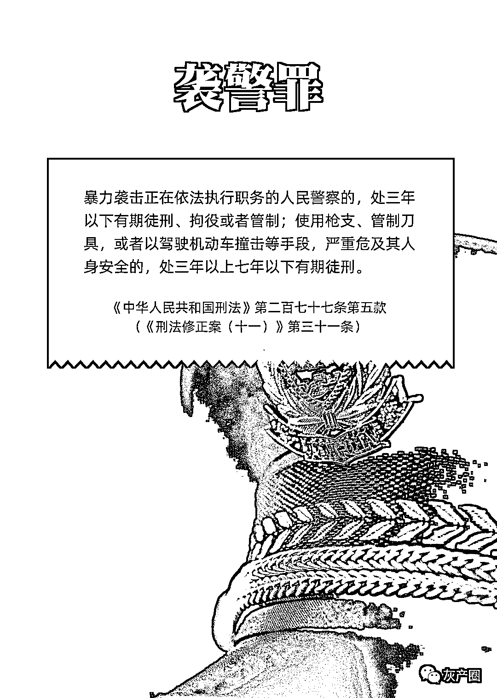
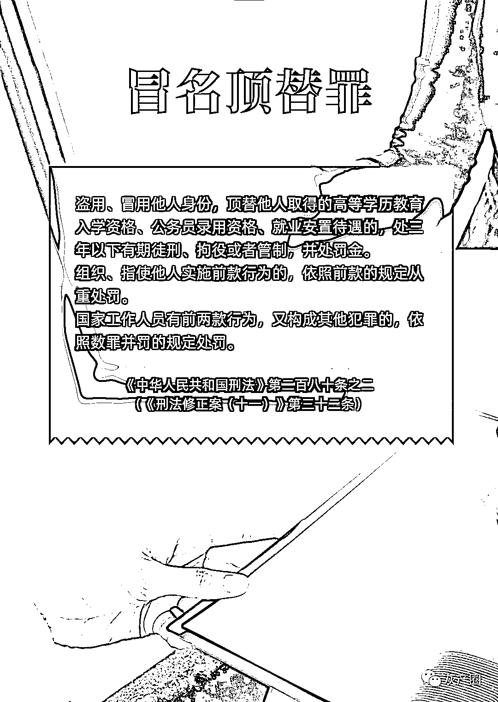
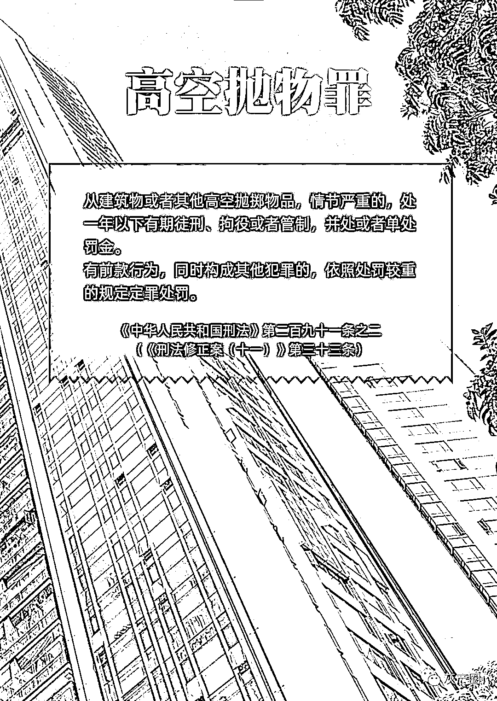
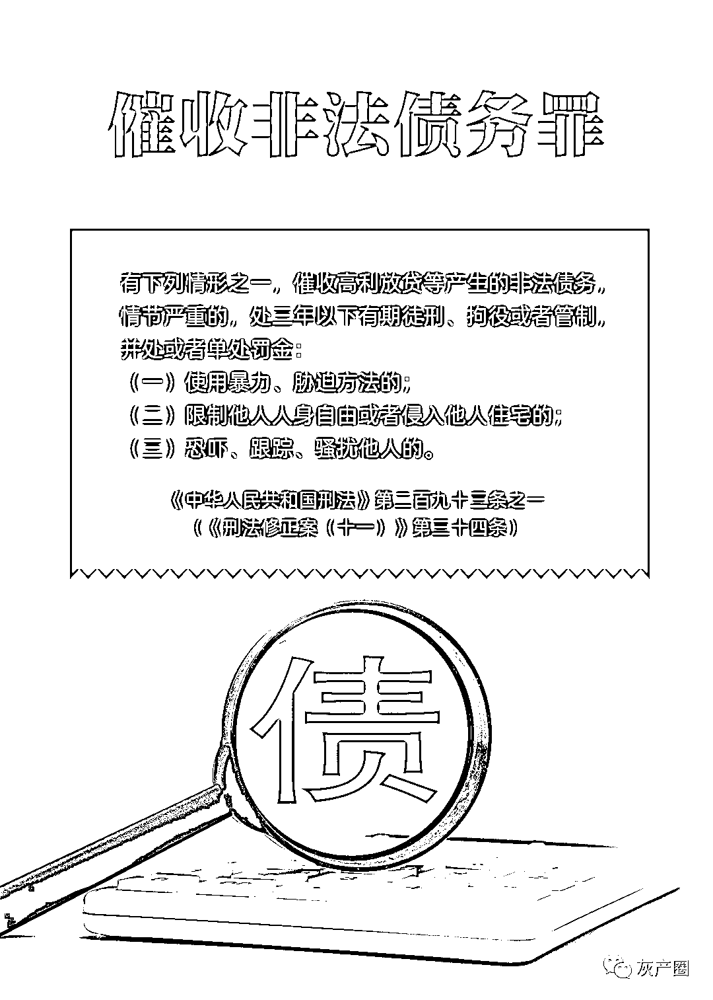
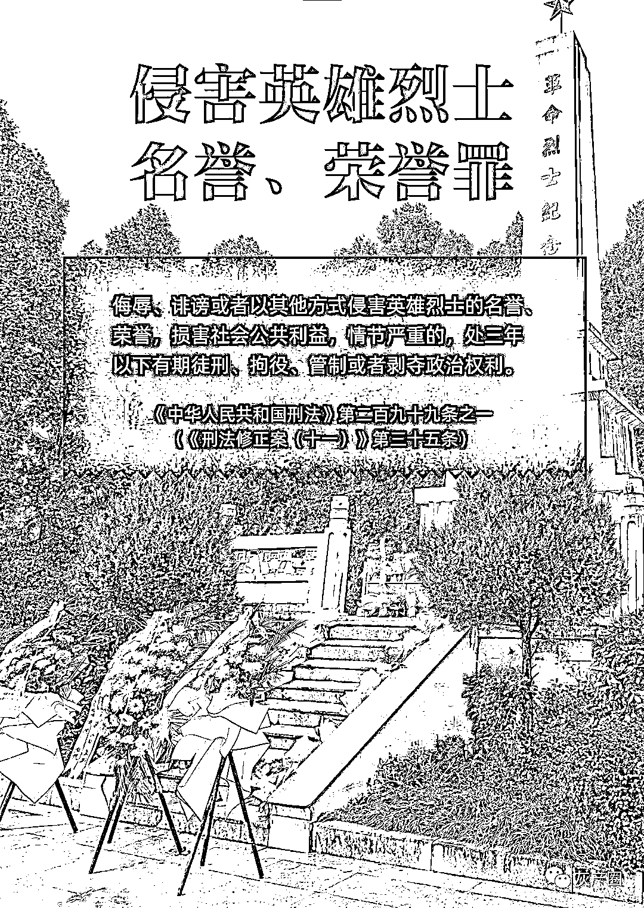
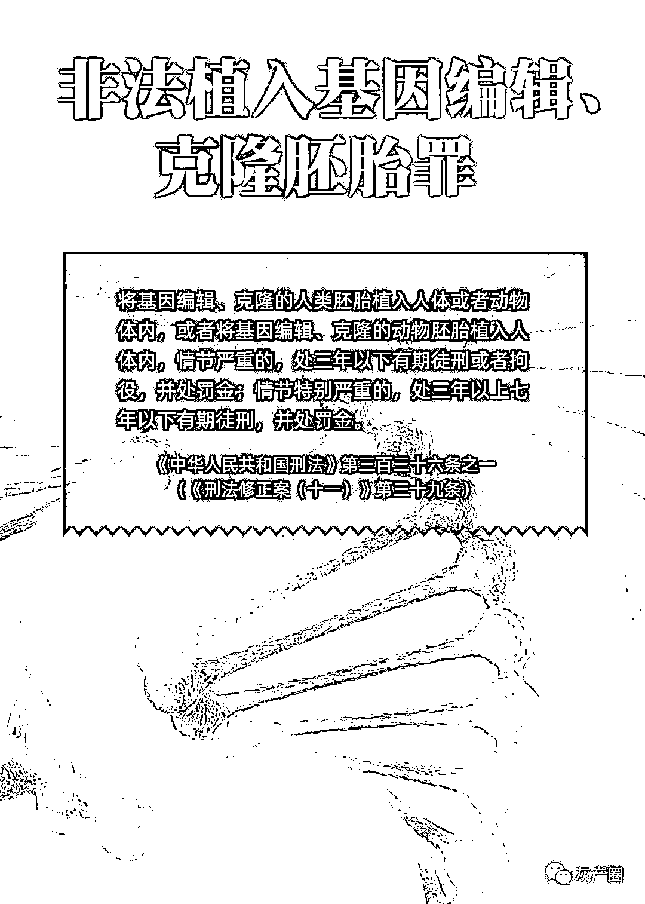
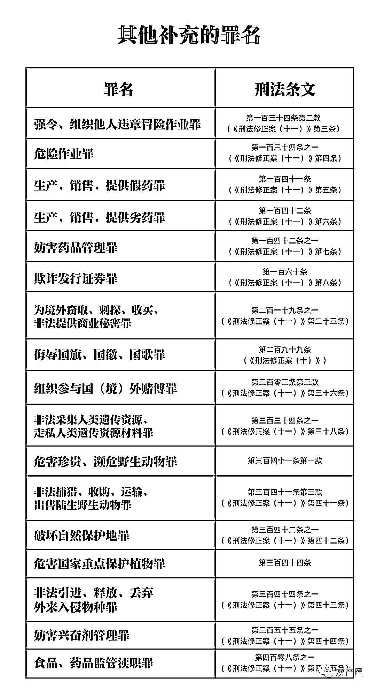

# 明天起，这些行为将入刑！

> 原文：[`mp.weixin.qq.com/s?__biz=MzIyMDYwMTk0Mw==&mid=2247510236&idx=3&sn=551945338baebb450f525fd3cda56cd3&chksm=97cb63e4a0bceaf27c63b6343ced7e131deb4bd9e73ff642b665049128901dc7f4d745babde6&scene=27#wechat_redirect`](http://mp.weixin.qq.com/s?__biz=MzIyMDYwMTk0Mw==&mid=2247510236&idx=3&sn=551945338baebb450f525fd3cda56cd3&chksm=97cb63e4a0bceaf27c63b6343ced7e131deb4bd9e73ff642b665049128901dc7f4d745babde6&scene=27#wechat_redirect)

明天（3 月 1 日）起，《中华人民共和国刑法修正案（十一）》将施行。“高空抛物罪”“冒名顶替罪”“妨害安全驾驶罪”“负有照护职责人员性侵罪”等新罪名也在《最高人民法院、最高人民检察院关于执行〈中华人民共和国刑法〉确定罪名的补充规定（七）》中明确。

看图，了解这些与你我息息相关的法律知识。

来源：央视新闻

← 向右滑动与灰产圈互动交流 →

