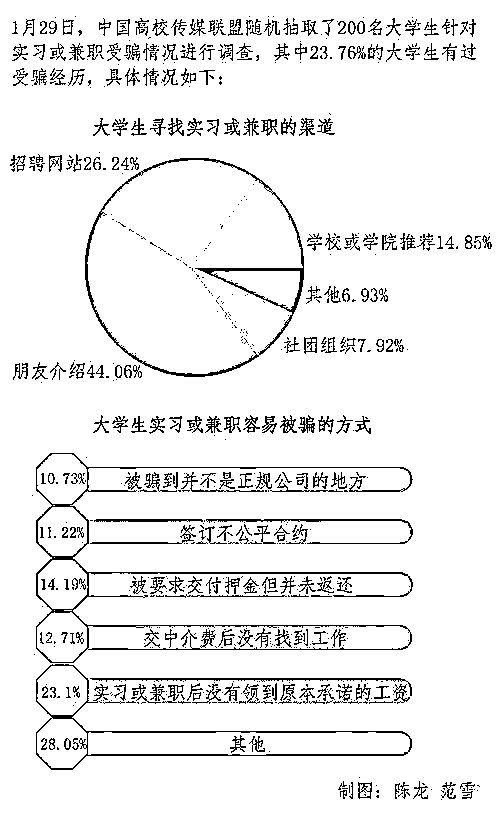
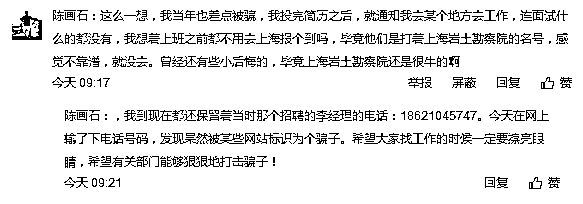
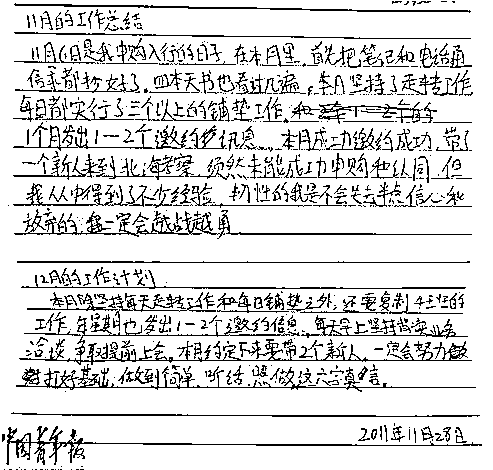

# 别傻了！你以为你聪明绝顶，就不会被传销骗了？

> 原文：[`mp.weixin.qq.com/s?__biz=MzIyMDYwMTk0Mw==&mid=2247510236&idx=4&sn=3ea5cca73d175316c7e2beb89697d401&chksm=97cb63e4a0bceaf22b7f06304b4aa34c2ab23f637bd93fc821f34b364bf638e92afe3914ea0d&scene=27#wechat_redirect`](http://mp.weixin.qq.com/s?__biz=MzIyMDYwMTk0Mw==&mid=2247510236&idx=4&sn=3ea5cca73d175316c7e2beb89697d401&chksm=97cb63e4a0bceaf22b7f06304b4aa34c2ab23f637bd93fc821f34b364bf638e92afe3914ea0d&scene=27#wechat_redirect)

许多人以为，自己受过高等教育、读过揭露传销术的文章，就会跟传销绝缘。其实，每个普通人都可能坠入传销陷阱。

我曾深入传销组织卧底采访，在传销组织中，有涉世未深的大学生，也有身居高位的银行行长、政府官员，更有阅历丰富的生意人、大学教师，在看似离我们很远的组织中，公务员、律师、医生、甚至警察……任何一个常见职业的从业者都可能出现。

李文星是被一家名为“BOSS 直聘”网站上的虚假招聘信息骗到天津市静海区的。在请君入瓮的传销骗局中，谎言邀约是第一步。如今，提起“国家项目”，提起一些传销重灾区的地名，很多人马上就会联想到“传销”而拒绝。

但为了把人骗来，传销组织可以说无所不用其极。有以介绍工作为名的，有以邀请朋友旅游或考察投资项目为名的，有假借谈恋爱发展感情骗人上钩的，甚至还有人向亲友谎称自己在外地出了车祸、让对方马上带钱过来救急的。总之，不管打着什么样的幌子，把人骗过来是传销洗脑的第一步。

事后，有记者调查发现，通过 BOSS 直聘求职“被骗去天津”的事件不止个例。记者在网上搜索显示，自去年以来，已有数十名网友在网上发帖，称在直聘平台遭遇“招聘骗局”，其中多人自称“被骗去天津”。 

在互联网时代，网络招聘本已司空见惯。很多大学生都有在前程无忧、智联招聘、58 同城等招聘网站上投简历找工作的经历。据一个用过智联招聘的学生反映，简历信息填完放在智联招聘上，甚至一些没投过简历的公司也会打电话邀约面试。“虽然当时也通过这个平台找到了实习，但感觉个人信息在网上是完全公开的，一点儿也没有安全感。”

记者亲身验证发现，涉事招聘平台“BOSS 直聘”的审核机制存在严重漏洞，事发前，用人单位不经认证就能发布至少一条职位信息。换言之，发布招聘信息的人可以打着任何企业的名义收简历、获取应聘者个人信息。这也给了疑似传销组织的幕后操作者假扮成上市公司招聘人员的机会，吸引年轻的大学毕业生应聘。很多像李文星一样，毕业不久没有经验又着急找工作的大学生很容易上当受骗。

可以看出，李文星的求职历程并不顺利，在无法获得理想职位之时，过度信赖不规范的招聘网站，是其陷入骗局的直接原因。但是，这并不能怪李文星自己大意，事实上，很多大学生都曾通过缺乏规范的招聘网站求职，甚至通过求职群、论坛等不正规渠道获取招聘信息。一些人也许侥幸找到了理想工作，一些人或许及时识破骗局，避免进一步损失，但总有人不慎被骗子所利用。

大学生找工作时尽量要选择校园招聘、学校就业信息网等正规渠道，同时也要提高自身的判断能力，仔细辨别招聘单位的信息。

**毕业生求职过程中谨防传销组织**

李文星的悲剧发生后，有评论将其遭遇与魏则西事件相比较。两起事件的主人公都是名校大学生，魏则西因不当医疗加速病情恶化而身亡，李文星则上了虚假招聘和疑似传销组织的当，看似事件性质天差地别，不过 缺乏规范的网络服务商都在其间扮演了重要的角色。安全规范的互联网环境为我们提供了很大的便利，但诸如此类虚假的网络招聘信息也害人不浅。

李文星之死不仅令人痛心，也提醒我们，面对频繁发生的招聘陷阱，在求职时不得不多一个心眼，警惕传销组织的骗局。网友们也表达了“规范招聘平台，严厉打击传销组织”的呼声。

在校毕业生社会认知能力普遍不强。传销组织正是看准了毕业季，大学生求职难的时机，对求职心切的大学生下手。翻阅近几年公开报道的类似案件，不难发现，工作越难找，大学生被骗入传销的可能性越大。中国反传销协会会长李旭就曾表示，近年来，加入传销组织的大学生有增多趋势。据其了解，几乎每个传销组织都有大学生加入，有的传销组织中大学生竟然占到了 80%，这与大学生就业形势严峻不无关系。

误入传销组织其实并不可怕。传销发展至今，已经衍生出“南派”和“北派”，北派传销会进行人身控制，迫使加入者本人或家属支付入会费。南派传销打的是感情牌，人员来去自如，通过全方位洗脑，让对方死心塌地为了一个所谓的发财目标而心甘情愿拉人入伙。

一名传销人员认真记录的工作总结和工作计划。 

无论南派还是北派，要甄别性质并不难。当对方以介绍工作或谈恋爱等理由把你拉到一个陌生的地方，却连正式的办公场所都没有，“恋爱对象”连份正式工作都没有，这时你可以基本确认已被骗入传销组织了。如果接下来你还被安排参加有关行业现象、分成规则、邀约新人的课程，那更加可以确认对方在从事传销。

在这种情况下，如果手机还没被收走，要第一时间给朋友发定位信息，让其帮忙报警。如果运气不好，一来就被控制，要假装顺从，不当面拆穿和反抗，保全自身安全是首要的。因为传销人员图的是你的钱，以及将来利用你的社会关系给组织拉来新的下线，只要配合一段时间，你总会有机会逃离组织，哪怕身份证和钱被扣留，也可以通过报警或找当地人（传销组织一般不发展当地人）寻求帮助来解决。

传销人员内部交流的资料

更重要的是保持清醒认识，时刻提醒自己不要被洗脑。一边是暴利诱惑，一边是周围群体无时无刻地渗透影响，缺乏社会经验又急于改变命运的大学毕业生，很容易被攻破心防。

毕竟人性都有弱点，心理防线一旦被打开一个小缺口，欲望就会难以抑制。这需要我们平时就建立起一种常识，如果一份工作能让人短时间实现上百倍财富的增长，那不是抢就是骗，现实中绝无可能。

传销对一个人的戕害是全方位的，消耗的不仅是金钱、青春，更是亲情、信任和良知。传销组织对一个人价值观的扭曲相当可怕，在那样的话语体系中，一个人会把说谎当成习惯，把骗人的本事当成值得炫耀的能力，即使将来传销组织解散了，也很难适应正常的生活。

针对大学生容易上当受骗的特点，相关的反传销和法治教育也亟待跟上。希望每个大学生在走出校门前，都能补上这一课。

来源：反传销 365，利箭在出击

← 向右滑动与灰产圈互动交流 →

