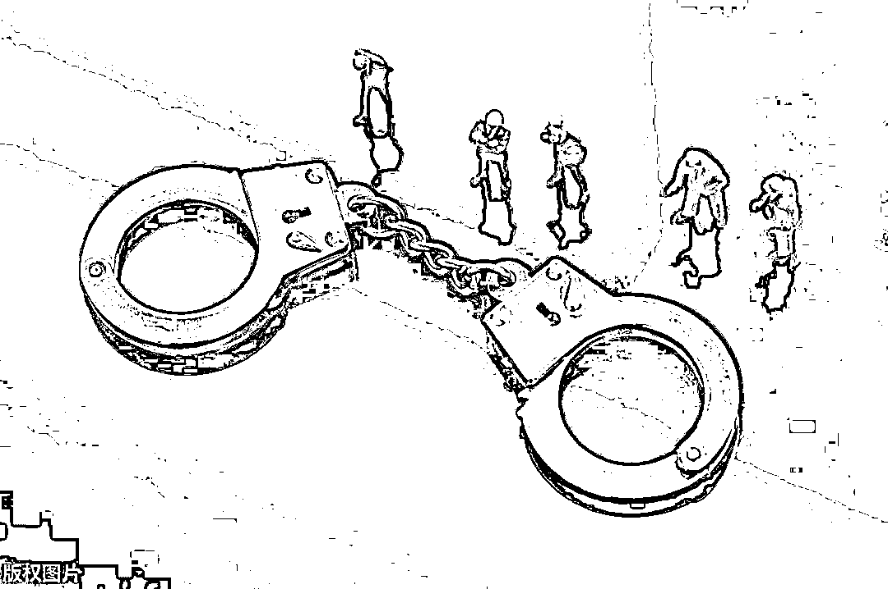

# 缅北上空的每一朵烟花绽放，可能意味着国内有一个人生命凋谢！

> 原文：[`mp.weixin.qq.com/s?__biz=MzIyMDYwMTk0Mw==&mid=2247510288&idx=1&sn=80d35ef1d2f1d5e87219d69d581860c1&chksm=97cb6228a0bceb3ebdc1d845c15e59c21faf29f32b1b62e981ae9b0d659ff5440eccbeb642bd&scene=27#wechat_redirect`](http://mp.weixin.qq.com/s?__biz=MzIyMDYwMTk0Mw==&mid=2247510288&idx=1&sn=80d35ef1d2f1d5e87219d69d581860c1&chksm=97cb6228a0bceb3ebdc1d845c15e59c21faf29f32b1b62e981ae9b0d659ff5440eccbeb642bd&scene=27#wechat_redirect)

随着国内对于电信诈骗的重拳打击，国内的电信诈骗团伙现在大多已经转移到国外，尤其是东南亚地区。最初，转移到国外的电信诈骗会盘踞在菲律宾、马来西亚等东南亚地区，但近五年来，缅甸北部逐渐成为这些诈骗团伙首选的栖身之地。

周军是一名熟悉警方办案的知情人士，据不完全统计，目前该地区大概有十万多人从事电信诈骗。而这些偷渡出国，在缅北地区肆意生长的电信诈骗团伙，所诈骗的对象，则是中国境内的同胞。

缅甸北部主要指中缅边境上的四个自治区，他们分别由独立于中央政府的四个军事武装力量所控制，处于“军阀割据”的状态。这些地方受中国文化影响颇深，和云南省在生活习惯和语言上非常相似。官方语言里包括汉语，可以流通人民币，也可以使用到移动、联通、电信三大运营商的信号。

出于经济发展需求，当地军政府甚至成立了专门的经济开发区，为这些从事电信诈骗的犯罪分子提供专门的营业许可证，来支持电信诈骗的发展。正是因为这种种原因，缅北成为了诈骗犯罪分子的天堂。

以下是周军的口述：

每成功诈骗 50 万，就放一束爆竹庆祝

2021 年春节，我再次前往缅北。

每隔一段时间去往缅北，我最大的感受都是这里的建设太快了。写字楼一栋栋拔地而起，道路修得也快。但是，这些建好的新写字楼，基本上都是租给从事电信诈骗的团伙。

也是在今年过年，我才弄明白一件事。以前每次来这里，晚上总是能听到此起彼伏的烟花、鞭炮的声音，它们在不同的地方响起，有时到了凌晨两三点，还会被鞭炮声吵醒。我们会觉得奇怪：为什么每晚都放鞭炮？

后来我终于知道了，原来，爆竹是电信诈骗团伙放的。这似乎已经成为了一种风俗，每成功诈骗 50 万元的金额，他们就放一束爆竹庆祝。

这一束束燃放在天空的烟花，就是这个魔幻的现实的注脚。那些在国内的受害者们被骗得倾家荡产，而在这里，却是他们值得欢庆的业绩。

在这里，电信诈骗行业被称为“现金网”，这种危害社会的行业，在当地却是合法的。电信诈骗团伙会给军政府交钱，创造就业，带动消费。他们的聚集，也带动了周边各行各业的发展，有为这些诈骗团伙提供网络服务的、送外卖的、开酒店的……对于电信诈骗的到来给经济和社会带来的种种变化，当地政府乐见其成，那里的楼越修越高，坑坑洼洼的泥巴路也变成了水泥路。

历史上，这些地方曾种植鸦片，生产毒品。当地人也会沾染上毒品，这有着较强的社会危害。而电信诈骗不一样，骗子不针对当地人。这些从中国偷渡到缅北的诈骗团伙的诈骗对象，都是在中国境内拿着手机和电脑的中国人。

在 2015 年，缅北零星出现了电信诈骗团伙时，国内警察还挺乐观的，因为当地警察和国内警察配合得较好，抓捕行动也很容易，还和国内警察一起探讨打击的技术层面的问题。

记得有一次，国内警察锁定了一个诈骗团伙，但是因为无法打开他们窝点的铁门，进入团伙内部的抓捕行动受阻。那些诈骗分子得知警察到来，把所有的作案工具从二层丢到了河水中。证据销毁之后，犯罪分子们还很嚣张，站上了天台，比着手势向国内警察挑衅。

面对这种情况，当地警察选择直接开枪，这些人才抱头投降。最后因为证据的销毁，国内警察没有理由抓捕他们，而当地警察则把人都带走，以妨碍警察办案的理由把这些人关了许久。

在 2018 年 10 月之前，国内警察和当地警方的合作都很顺畅。这是一个双赢的局面，国内警察抓到了人，而那些无法带走的团伙的各种生活物资被当地警方收缴。当地的人均工资很低，警察的月工资是 300 元人民币。那些带不走的物资对于他们来讲，就是一笔可观的收入。

但是，自从 2018 年 10 月之后，当地警方的态度发生了变化，变化据说来源于高层被诈骗团伙贿赂。后来，他们还成立经济开发区，给诈骗团伙办理“现金网业务“的营业许可证，诈骗业务开始登堂入室。当然，缴纳每月高额的“保护费”也是每个诈骗团伙想要在当地存活下来的必要条件。

十几万国人在缅北从事电信诈骗

诈骗团伙为当地带来了丰厚的经济回报。而国内的一些年轻人，也被诱人的招聘广告吸引或是诱骗，前赴后继偷渡来到缅北。

诈骗团伙为他们勾勒出了一个发财的美梦，光是聊聊天就能月入过万。而等到这些年轻人到了缅北，才发现广告与现实存在着很大的出入。他们在这里所做的事情，是中国明确的违法犯罪行为，赚钱也不是他们以为的那么容易的事情。

后悔了想要离开，那需要交至少三万元的赎身费，如果交不起，曾经有男性会被要求去贩毒，女性会被要求去卖淫。在当地，赌博和色情行业都是合法的产业。这就是一个深渊，只要踏入了那一步，就很难再脱身了。

在国内，电信诈骗最早是台湾地区的诈骗犯带来的，随后被一些福建人复制，在福建的一些地区，甚至有一整个村都从事电信诈骗的情况。现在，当初的那批福建人在缅北一般都已经成了电信诈骗金字塔尖的老板，而他们手下的人，则来自全国各地。

据估计，整个缅北有十几万人在从事电信诈骗。这些年，我也跟许多这个行业底层的年轻人们打过交道。他们大多是那些学习成绩不好的“问题少年”，家境有好有坏。前段时间国内警察解救了一个十六岁的上海女孩，女孩的家庭条件不错，因为不想再上学，便跟着网友一起来到了缅北。在诈骗团伙，她所需要做的工作很简单，就是每天发发抖音，展示自己的美貌与生活，吸引粉丝加上团伙内的指定微信。而这些被她吸引而来的粉丝，就成为团伙诈骗的对象。

因为女儿失踪，家人报警，最后女孩被国内警察找到，而被解救出来的女孩还责怪其母亲“破坏了她的发财梦“，因为女孩未满十六岁，所以最终没有被追究刑事责任。而其他的已经成年的诈骗分子，如果向国内的警察报警求救，都算是自首，在国内警察把他们解救出来后，依然要面临刑事起诉。

因为缅北军政府不受缅甸中央政府的管理，护照在这里不管用，在这里被认可的合法通行证是边民通行证，办理有一定的条件。中缅边境线长 2000 多公里，没有明显的屏障，有山有水，很多地方一挽裤脚蹚水就过来了。偷渡成为了国人抵达缅北的方式，也成了一个产业。早些年，两百元的价格就能找到门路成功偷渡。去年疫情暴发之后，偷渡的价格也水涨船高，听说前段时间有几个人偷渡入境被边防抓住了，每个人给了蛇头几万元。

在缅北，这些诈骗窝点少则四五个人、多则两三千人。诈骗的种类有冒充公检法机关执法，骗贷，裸聊，刷单返现，投资理财，杀猪盘等。大多数的诈骗单子都是几万元，少数的能达到几百万甚至上千万。大多数诈骗的单子给单个人的提成很少。

这两年，危害最大的就是“杀猪盘”，这种诈骗方式简单来说，就是骗子会伪装成一个完美的恋人，在网上和受害人谈恋爱，最终引导受害人在他们指定的网站上投资或者赌博，等到受害者投入了大量的金钱后，恋人和网站就一起消失了。

从事“杀猪盘”诈骗的团伙有着流水线似的分工，有人负责寻找可供杀的“猪“，有人负责和”猪“聊天，技术人员负责搭建“杀猪”用的网站。

我接触过一位高薪女白领，被“杀猪盘”骗了六百万，她来报案，让我们找到这个骗她的人，不求最后能把她的钱要回来，只想问清楚，他对自己是否真心。

“杀猪盘”正是利用了人们对于情感的需求，取得受害人的信任，再利用人们的贪念，引导受害人投入金钱。

越来越复杂的诈骗套路

电信诈骗案件的侦破是一个技术活，有人报案了国内警察才能去破案。虽然国内警察都知道在缅北哪栋楼的哪一层是电信诈骗的团伙，但是没有案子，国内警察也无法把他们抓起来。只有有人报案了，国内警察才会针对他提供的犯罪分子的各种信息去寻找这个团伙所在地方，因为这样抓住的犯罪团伙，才能确定他们的犯罪证据，形成完整的证据链。

在我记忆里，最成功的一次破案，是 2017 年的一次抓捕行动。犯罪团伙隐藏在一个建材市场的二楼。当时的天气很热，犯罪团伙的门敞开着，办公环境并不算好，大热天的办公室内只安装了风扇。国内警察抵达时他们正在工作，电脑手机等证据都拿到了，算是抓了个现行。证据都很清晰，破案也十分顺利。这个团伙的行骗方式是：通过百度推广找到想要贷款的人，假装可以帮忙贷款，然后以各种名义向受害人收取费用。最终，国内警察抓获了十个犯罪分子。

但是，这样顺利的时候并不多，2017 年的一次大型打击行动，国内警察出动了一千多名警察，但是最终因为一些策略上的失误，只抓回了三百多名犯罪分子。有时国内警察把人抓回去了，但是困于证据不足，只能放人，这些人就又回到缅北继续从事电信诈骗。

现在的新趋势是，各种违法犯罪融合度越来越高。这也让国内警察的破案越来越困难。比如赌和诈呈现出一体化的形态，这不仅体现在诈骗和赌博在形式上相通，也体现在经营和管理上。当地军政府会委托赌场来管理诈骗团伙。因为赌场自己也是要交保护费和纳税。于是这些赌场的管理层会自己成立公司或者是和开发区联合成立管委会来管理诈骗团伙。

在电信诈骗还没有进驻缅北时，当地最好的房子都是赌场所有。以前这边很少有超过六层的高楼。第一层就拿来做实体赌场，二层以上就租给诈骗团伙，这样赌场又收租金又收管理费。收到的管理费就和赌场的部分收益一起交给了当地的军政府。

在这个过程中，赌场的老板发现，电信诈骗很赚钱，于是开始入股电信诈骗。赌场和电信诈骗勾结在一起。而赌博和“杀猪盘”又有许多相似之处，而和线上的赌场一样，杀猪盘也需要购买域名不停更换网站。只不过赌博还会放一些利，而“杀猪盘”直接圈钱跑路。赌场在这方面有较好的技术，能直接提供给“杀猪盘”。除了技术上的勾结，赌场和诈骗团伙还会共享客户。这些复杂的原因，都让赌博和诈骗愈发一体化。

电信诈骗的方式逐渐升级，这也让国内警察不敢懈怠，要加紧提高国内警察破案的技术水平。

因为疫情的影响，警察出国办案不便，这些诈骗团伙在过去一年中基本上处于一种毫无管制、野蛮生长的状态，在全球疫情尚未扑灭的当下，我不太乐观地估计，接下来的这几年，他们还有可能会出现一个爆发式增长。

（注：为保护受访者隐私，周军为化名）

来源:《观象台》终结诈骗 作者 :刘思洁 编辑: 孙杨 

← 向右滑动与灰产圈互动交流 →

