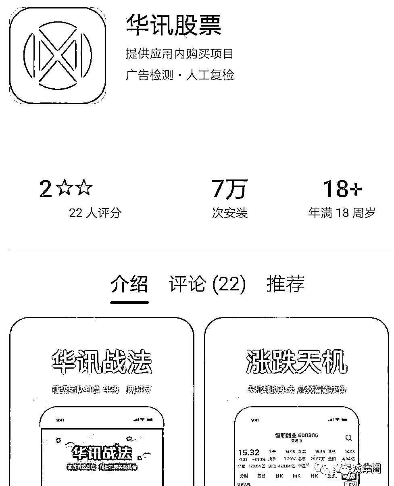
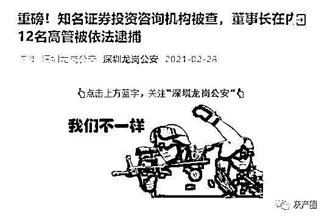
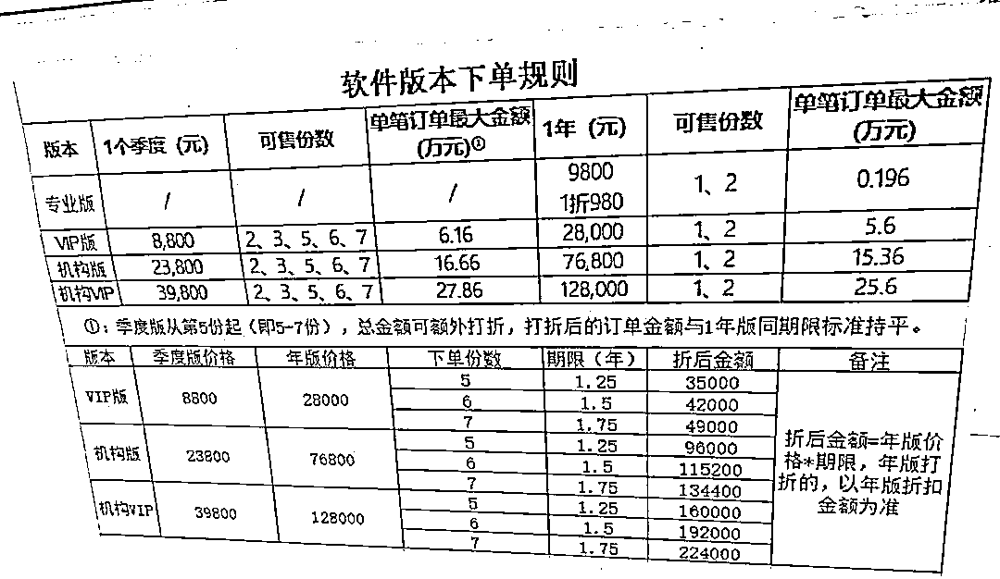
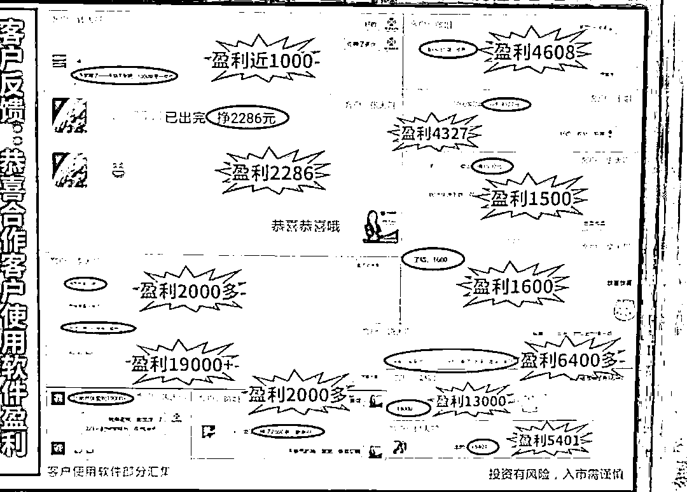
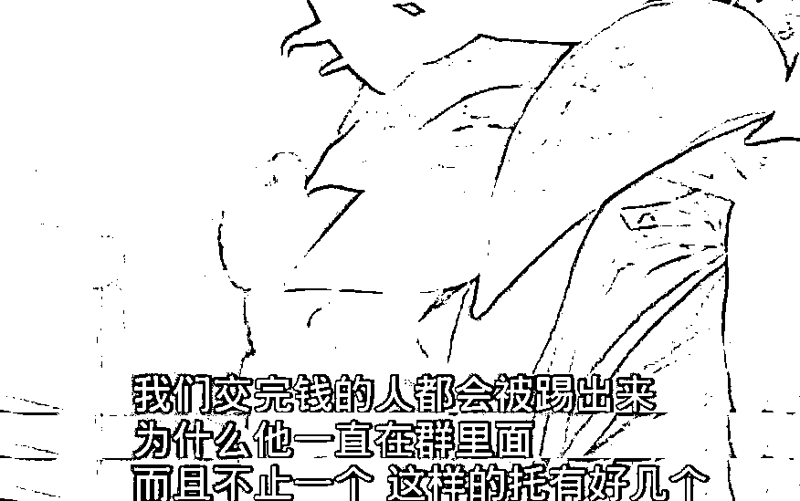
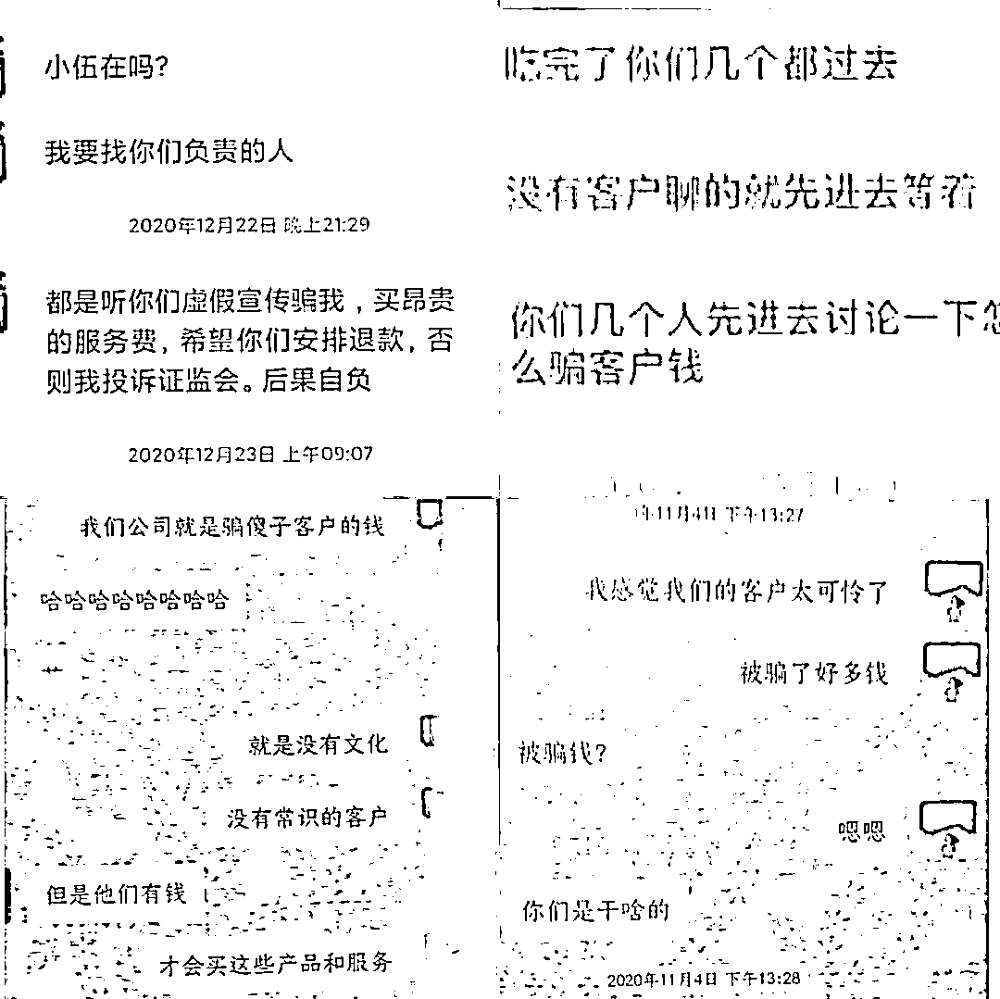

# 让你骗，统统带走！荐股半年敛财 1.7 亿，147 名员工全部被抓！

> 原文：[`mp.weixin.qq.com/s?__biz=MzIyMDYwMTk0Mw==&mid=2247510288&idx=2&sn=1c072f19d546bb12ec2cf50f6d727379&chksm=97cb6228a0bceb3e887ccbe368f80465046ca8142b4a5182938d4172f42e2a01fe4122675f54&scene=27#wechat_redirect`](http://mp.weixin.qq.com/s?__biz=MzIyMDYwMTk0Mw==&mid=2247510288&idx=2&sn=1c072f19d546bb12ec2cf50f6d727379&chksm=97cb6228a0bceb3e887ccbe368f80465046ca8142b4a5182938d4172f42e2a01fe4122675f54&scene=27#wechat_redirect)

“新三板上市公司”、“老牌证券投资咨询机构”，持牌经营背后暗藏诈骗敛财的套路，免费荐股、名师课程、VIP 会员金股推荐……为了收割投资人服务费，全然不顾投资人亏损。

2 月 28 日，深圳龙岗公安微信公众号通报称，近日，龙岗警方对大连华讯投资股份有限公司（下称“大连华讯”）进行了突击查处，对 147 名嫌疑人以涉嫌诈骗和虚假广告罪采取刑事强制措施。

据警方初步统计，**大连华讯公司涉案金额高达 27 亿元，投资受损人遍布各地。**在警方披露的该公司员工群聊天记录中，有业务员直言“我们公司就是骗傻子客户的钱，没有文化没有常识才会购买这些产品。”

**目前，经检察机关依法批准，警方已对大连华讯包括董事长周某富在内的 12 名公司高管实施逮捕。**大连华迅宣布公司于 3 月 1 日起开始停牌。

老牌投资咨询机构涉嫌诈骗被端

大连华讯（833924）成立于 2000 年，是国内较早取得投顾牌照的一家证券投资咨询服务机构，法人代表为周垂富，注册资本为 4605 万元人民币。

2015 年，大连华迅开始在深圳某写字楼运营，同年在新三板基础层挂牌上市。企业财报显示，2020 年上半年，大连华迅投资顾问业务收入高达 1.69 亿元。

据不完全统计，**2017 年以来，大连华讯公司因业务员不具有证券从业资格或违规荐股等行为，被全国多地证监局行政处罚多达 20 余次。**

经大量调查取证工作，警方掌握了大连华讯涉嫌诈骗和虚假广告犯罪的实锤。**1 月 6 日，深圳龙岗警方联合福田警方共 800 余警力突袭福田区某写字楼，对大连华讯涉嫌诈骗和虚假广告案展开收网行动。其中 100 余名嫌疑人被采取刑事强制措施，包括董事长周某富在内的 12 名公司高管被龙岗区检察院依法批准逮捕。**

1 月 13 日，国海证券针对大连华讯发出了风险提示性公告，因为对方董事长在内的一众高管处于失联状态。

国海证券公告称，其作为大连华讯的主办券商，在督导中发现大连华讯董事长、实际控制人、信息披露人员失联，无法通过现场、电话、微信等方式联系。截至公告披露日，仍处于失联状态。上述事项可能对公司产生不良影响。提醒广大投资者注意投资风险。

国海证券提示风险后，2 月 4 日大连华讯公告证实实控人被深圳警方刑事扣留。公告称，公司实际控制人李妮、周垂富于 2021 年 1 月 8 日收到深圳市公安局龙岗分局出具的《拘留通知书》，李妮、周垂富因涉嫌诈骗罪被刑事拘留。

3 月 1 日，第一财经记者了解到，大连华讯经向全国股转公司申请，公司股票自当日停牌，预计将于 2021 年 3 月 15 日前复牌。截至 2 月 26 日收盘，大连华讯总市值为 0.75 亿元，市盈率（TTM）为 1.7 倍。截至 2020 年上半年，股东户数为 9 名，董事长周垂富、李妮夫妇持股 72.08%，前四大股东共持股 97.08%。

“高价购买服务”套路深

深圳龙岗警方介绍，去年 3 月，股民王女士（化名）在浏览网页时看到“大连华讯投资”公司的广告，声称可以免费赠送三支“金股”。王女士关注后，被业务员拉进了该公司的一个荐股群。**群内每天都有“名师”推荐优质股票，还会推送“名师”点评股市行情的视频直播链接。**王女士默默观察了一段时间，发现推荐的股票有一些确实会暴涨，群里的其他客户也经常发出一些赚了钱的图片。

眼见群友盈利，再加上业务员信誓旦旦的承诺，只要缴纳服务费，公司开发的炒股软件“华讯股票 APP”就会帮助其利用大数据选股，1 个月就可以赚到投资本金 1 至 3 倍的利润。于是王女士付款 28000 元购买了“华讯股票 APP”的 VIP 会员。刚交了钱，王女士就被移出了荐股群，理由是将提供“一对一的服务”。

之后几周，王女士跟着“华讯股票”APP 的推荐买入卖出，却并未出现“连续暴涨”的情形，而是一买就亏、阴跌不断、深度套牢。王女士联系公司讨要说法未果，便向龙岗警方报警，并声称要去证监会投诉。随即，公司便有人员联系王女士，为她办理了退款。但按照公司要求，需要王女士删除所有与业务员的聊天记录，并向警方撤案。

这一番蹊跷操作也引起了警方的注意。

警方前期调查显示，**大连华讯的主营业务就是兜售公司研发的炒股软件“华讯股票 APP”的会员，收取服务费。**

公司先在多家网络平台投放“荐股名师”的广告，以免费领取“金股”的噱头吸引股民关注；随后由业务员将股民拉入荐股群反复“洗脑”，诱导其购买 APP 会员。

“华讯股票”APP 最便宜的会员，一年要收取 8800 元服务费，往上还有 28000 元、39800 元、128000 元不同档位。根据销售额不同，业务员能够从中拿到 3%至 10%的业绩提成。

“名师”仅初高中学历，直言骗傻子客户的钱

深圳龙岗警方介绍称，大连华讯对外声称“有 85 位专业研究员，26 位国家顶尖分析师，公司员工 80%以上都具有高级技术职称”。

事实上，**公司近 500 名员工中绝大部分不具备证券投资咨询执业资格，初高中学历的更是不在少数。**以公司客服部为例，50 名客服人员要负责“服务”两万余名会员，其中仅 4 人具有证券投资顾问执业资格，“一对一”专业服务根本无从谈起。

大连华讯销售总监还表示，他们是希望客户赚钱的，因为如果不赚钱，这些客户会天天给他们打电话，天天烦他们。该总监也表示，老师的选股水平就那样，股票总是亏欠，他也很无奈。

“名师”推荐的“金股”往往是集合竞价的高开股票或是近期连续涨停板的股票，这种股票大概率会在开盘后迅速涨停，但投资人几乎没有买入机会，却会给投资人造成“推荐的股票都暴涨”的假象。而业务员往往“只报喜不报忧”，对上涨的股票夸大其词，对下跌的股票闭口不提。至于客户购买了所谓“名师”推荐的股票能否盈利，要看运气。

上述报案人王女士，在亏损后又用微信小号重新进入荐股群，发现经常在群里发图晒盈利的几个“老面孔”，也自称买了会员，但还是活跃在群里没有被踢掉，王女士怀疑这里面有“托儿”的存在。

据调查，荐股群内除了被新拉进的股民，大部分群友都是公司业务员扮演的会员，专门负责在群内发送 PS 过的盈利截图或者转账单，吹嘘公司实力强、推荐的股票收益好。

据警方调查，在 2020 年 4 月推出“华讯股票”APP 之前，该公司基本以人工对接提供咨询，但由于无法提供承诺的服务和受益，导致大量客户投诉。

事实上，**华讯股票 APP 仅仅是公司董事长周某富看到国内有荐股同行因诈骗被判刑的案例后，为了掩盖公司诈骗本质而指令技术部门紧急研发的。**其中根本不存在算法，所谓的优选股票也是人工筛选的。宣称算法只是显得更高端。

负责 APP 研发的技术人员表示：“其实没有什么技术含量，就是把一些信息数据搜集在一起，这些指标我们自己都没有搞明白，反正我自己是不会用的。”

为了规避风险，该公司甚至购买了专业的网络舆情监测服务，并专门设有风控公关部门。当监测到有客户在网上发布针对公司的负面评论后，风控部门会第一时间联系客户，商量退费事宜，而退费的前提就是要删除所有聊天记录、删除网络负面言论、撤销向证监会的投诉、撤销报警等。

警方检查多名业务员聊天记录时发现，**部分员工在公司一个名为“亿万富翁”的内部交流群里毫不掩饰的讨论：“你们几个先讨论一下怎么骗客户钱”。更有业务员向朋友直言：“我们公司就是骗傻子客户的钱，没有文化没有常识才会购买这些产品”。**

对于这类骗局，**警方提醒称，如大连华讯投资公司这样的“行业翘楚”，尚且为了收割咨询费不顾投资人亏损，更何况网络上那些野鸡“荐股砖家”？**

如果低风险高回报的消息是真的，那么人人都能当“股神”，到最后谁又是亏的那个？

不要在赔光身家之后才大彻大悟：“哦，原来是我。”

来源：第一财经

← 向右滑动与灰产圈互动交流 →

