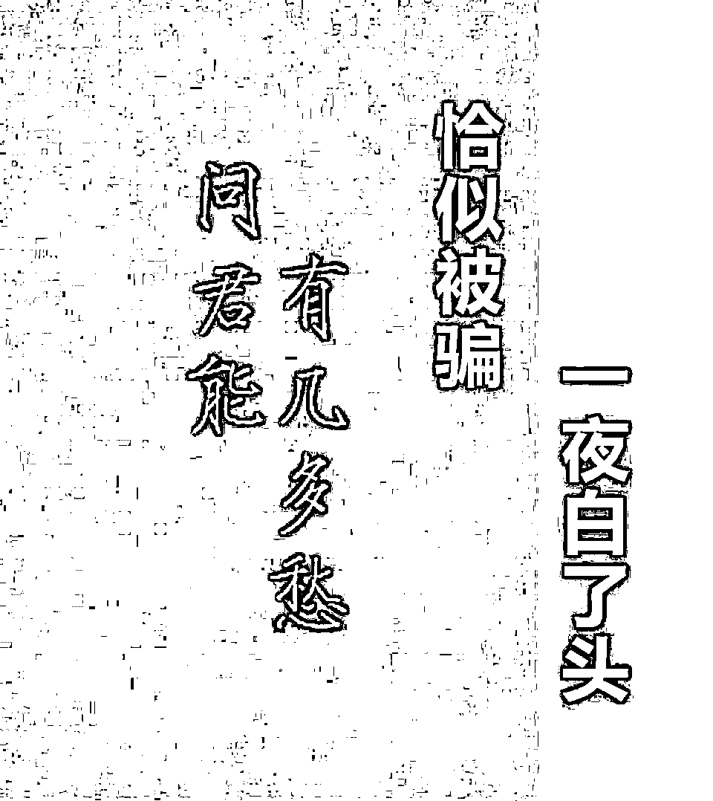

# 一个大学生的自述：如果我了解诈骗，或许能躲过一劫

> 原文：[`mp.weixin.qq.com/s?__biz=MzIyMDYwMTk0Mw==&mid=2247510288&idx=4&sn=6c2b17d7d998f2b6d84a51e2dda5de15&chksm=97cb6228a0bceb3eb4adc970638e820a920ff3025d917120cbfd4ee1b38aecf8451aadf73ad0&scene=27#wechat_redirect`](http://mp.weixin.qq.com/s?__biz=MzIyMDYwMTk0Mw==&mid=2247510288&idx=4&sn=6c2b17d7d998f2b6d84a51e2dda5de15&chksm=97cb6228a0bceb3eb4adc970638e820a920ff3025d917120cbfd4ee1b38aecf8451aadf73ad0&scene=27#wechat_redirect)

**全国公安机关正在公安部的指挥部署下全力开展打击治理电信网络诈骗的专项行动。众所周知，对于电信网络诈骗，“打”与“防”缺一不可，必须并驾齐驱。请务必时刻保持警惕，也许就在不经意间，你只是泄露了一点微不足道的信息，骗子就已经盯上你了，一条短信、一个电话就会让你倾家荡产。所以，必要的防骗识骗知识不可或缺。下面是一个刚大学毕业步入社会就被骗的学生的亲身经历和自述，经当事人同意，转发出来，希望能起到警示作用。**

我是一名初入社会的大学生，同时也是刚刚经历了一场电信网络诈骗的受害者，我现在既生气又无奈，因为骗子骗光了我 4 万多元的积蓄，从头到尾，我连对方人都没看到过，你或许认为我很傻，但我只能告诉你，有些事只有经历了才明白有多么恐怖。

诈骗虽然时有发生，但我一直觉得距离我很遥远，我认为我是一个很聪明的人，我觉得我能免疫各类诈骗，于是便有了这一次让我追悔莫及的经历。 

以下是我的真实经历：

事情发生在 2021 年 1 月 24 日下午三点多，我接到一个电话称我天猫有个订单不小心被工作人员上报做了代销商，一个月扣 500 元，一年 6000 元，如果不取消可以在淘宝购物享受折扣，我平时很少网购，我也不想浪费这么多钱去做什么代销商来搞这种完全用不到的折扣。

（案例解析：骗子伪造骗局，引导受害人入坑）

我告诉电话里的人，让他帮我把这个代销商取消掉，原以为一句话就能搞定的事，结果对方告知要帮我转接银行来处理。

（案例解析：骗子故意让假银行工作人员来解决，目的就是利用银行的公信力来威慑受害人）

我当时并不相信他，正准备提出质疑时，他说，你可以直接去银行柜台处理这个事。我心想，既然人家敢让我去银行柜台，那应该是真的工作人员，我当时在上班也没时间过去，反正就是取消个订单，线上办理也一样，我就让他帮我转接了“银行工作人员”。

（案例解析：不给受害人思考时间，利用下午 3 点打电话，就是卡准了受害人在工作时间没有办法去银行柜台，只能选择线上办理）

“工作人员”是一个声音很甜美的小姐姐，她让我登录支付宝，说支付宝上面有一个服务回执单，她来一步步教我操作取消订单，订单取消后会有回执单在支付宝这里显示。 

（案例解析：甜美女声比较有亲和力，无形中增加了受害人的好感，利用支付宝来操作，就是为了让受害人相信这不是骗局，因为支付宝还是有很高的公信力的）

之后小姐姐就来问我支付宝余额，余额宝余额，花呗使用额度，微信余额，因为她要确认我不做代销商是不是因为没有钱，她还让我按她讲的去操作了一下微信钱包，我操作之后，看到钱还在我就放心了，我心想这应该不是诈骗了吧。

（案例解析：了解受害人的资金数量，用钱最少的微信钱包先操作，打消被害人疑虑）

我操作完后她给了我一串数字，声称这是回执单号，让我输入回执单号，然后她那边会报给我几位数，让我继续输入，全部输完以后，又让我收一下手机验证码。我将验证码发给她，她收到后让我下载银行 APP，将自己卡里的钱全部转到由她提供的一张卡里，声称这是“安全账户”，只是走个流程，十几分钟就会退回来，我觉得既然是银行提供的“安全账户”那肯定是没问题的，于是我选择了转账。她让我在输入一次验证码，输入后，她说可以了，让我稍等一会儿，随后她就挂断了电话，大概过了 3 分钟，手机银行发来消息，卡里钱全部被转走了。

（案例解析：前面输入的回执单号等等只是迷惑受害人的手段，受害人下载手机银行后，利用“安全账户”为借口，诱使受害人转账）

我大概等了 2 个小时，钱还是没有到账，我开始着急了，疯狂的给假工作人员打电话，他们没有接，电话一直是关机，当时我人就傻了，也是这时才反应过来被骗，我立马选择了报警，同时，我还是想让他们把钱还我，虽然机会渺茫，但是我还是想去尝试，因为那是我的血汗钱。最后警方告诉我 46500 元已经被转走，追回的几率很小，但是他们不会放弃的。回想起今天发生的事，我陷入了沉默。

直到现在我仍然心有余悸，回想起当天的情况，对方一环接一环，完全不给我思考时间，每次我想要提出质疑，他们总是先我一秒将我思路打断，全程牵着我的鼻子走。从这件事后，我常常都会去了解一些诈骗知识，每次看到诈骗犯被捕我也会拍手叫好，但是我明白，我也曾是那个缴了 46500 元智商税的人。 

我受骗后给大家总结了几点建议，希望大家引以为戒： 

1、个人信息非常重要，千万千万不要轻易泄露自己的信息。

2、不接陌生电话，但凡提到银行卡、验证码的都挂掉。

3、多关注一些诈骗案例，了解诈骗手段，做到防范未然。

4、时刻保持头脑清醒，遇到不确认的，先报警。

完

来源 :泸州市反诈中心,熊猫反诈,反诈骗先锋

← 向右滑动与灰产圈互动交流 →

