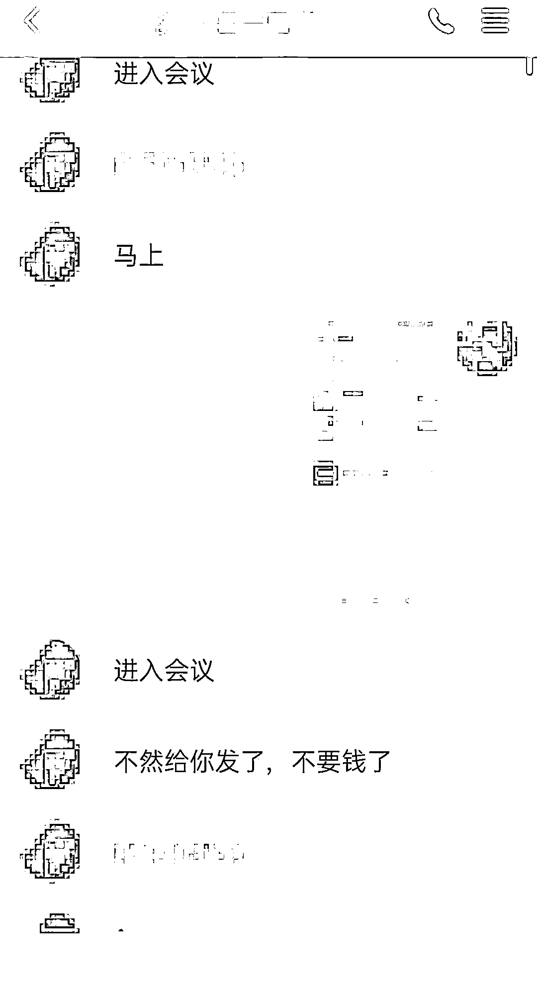

# 长沙俩月受理裸聊敲诈案 76 起：一男子裸聊后被逼转账 28 万

> 原文：[`mp.weixin.qq.com/s?__biz=MzIyMDYwMTk0Mw==&mid=2247510288&idx=5&sn=66dbc7f84844ba304e15eebe91b0329e&chksm=97cb6228a0bceb3e4267becfaaa660ed2200a44573818386b28f77994653e22872790b4a843c&scene=27#wechat_redirect`](http://mp.weixin.qq.com/s?__biz=MzIyMDYwMTk0Mw==&mid=2247510288&idx=5&sn=66dbc7f84844ba304e15eebe91b0329e&chksm=97cb6228a0bceb3e4267becfaaa660ed2200a44573818386b28f77994653e22872790b4a843c&scene=27#wechat_redirect)

记者从长沙市公安局刑侦支队获悉，今年 1-2 月份，长沙警方受理因视频裸聊被敲诈案件 76 起，涉案金额达 416 万元。

2021 年 2 月 21 日凌晨，在长沙工作的张家界男子小李通过某交友软件认识了一个网名为“一枝梅”的女网友，双方通过 QQ 聊得非常开心。“一枝梅”给小李发送了一虚假社交平台的手机 APP 下载链接，提出要在这个 APP 上和小李视频“深度交流”。

小李点击下载 APP 后，对方给了小李一个提取码。小李输入提取码后，和对方成功视频。“一枝梅”在视频中做了很多露骨的动作，小李也“坦诚相见”。

不久，对方挂断视频，然后给小李发来了刚才的视频录像和小李的手机通讯录，声称要小李出钱把视频买下来，否则就群发给他的家人和朋友。小李只好向对方账户转账 26000 元。

但此时又有一名自称是“网管”的人加了小李，语气态度非常凶悍，要求小李再次转账。小李声称自己没钱了，“网管”便要小李进入“腾讯会议”APP，共享小李的手机屏幕，然后要挟小李到京东、支付宝等多个网贷平台借贷。小李无奈，只好按照对方的要求在多家网贷平台贷款共计 28 万元转账给对方。当对方再次威胁小李继续要钱时，小李选择报警求助。

接警后，长沙市反诈中心快速处置，成功止付涉案资金 13 万元。目前案件仍在进一步侦办之中。

#### **长沙警方揭示该类案件的手段：**

**1、广泛撒网寻找猎物。**

犯罪嫌疑人以美女头像为诱饵通过各类社交平台广泛交友，把受害人引流到第三方聊天软件上，然后通过话术，诱导目标去下载所谓的裸聊 APP。

**2、诱导安装木马软件**。

这个所谓的裸聊 APP 实则是个能获取通讯录的木马程序，一旦受害人下载该 APP，手机上的通讯录就被犯罪嫌疑人的后台掌握和记录。

**3、开启裸聊录制视频。**

对面“美女”发来露骨的视频，其实是犯罪嫌疑人事先录制好的一个小视频，目的是引诱受害人“深度交流”。当受害人和这个视频互动的时候，早已经被犯罪嫌疑人录下了整个过程。

**4、威胁群发进行敲诈。**

“美女”露出真实面目，发来受害人通讯录及裸聊的视频，要求受害人向指定账户转账。

**5、无底洞式威胁敲诈。**

对方以“网管”“老板”等多种不同身份要求受害人转账汇款。受害人迫于压力只能照办。犯罪嫌疑人还会要求受害人共享手机屏幕，操控受害人去网贷平台借贷。

来源：澎湃新闻

← 向右滑动与灰产圈互动交流 →

