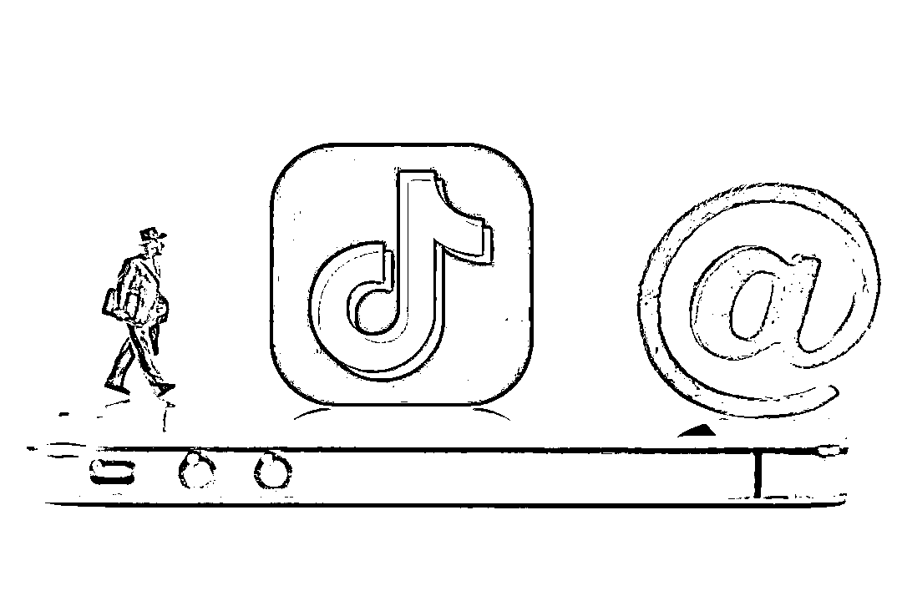
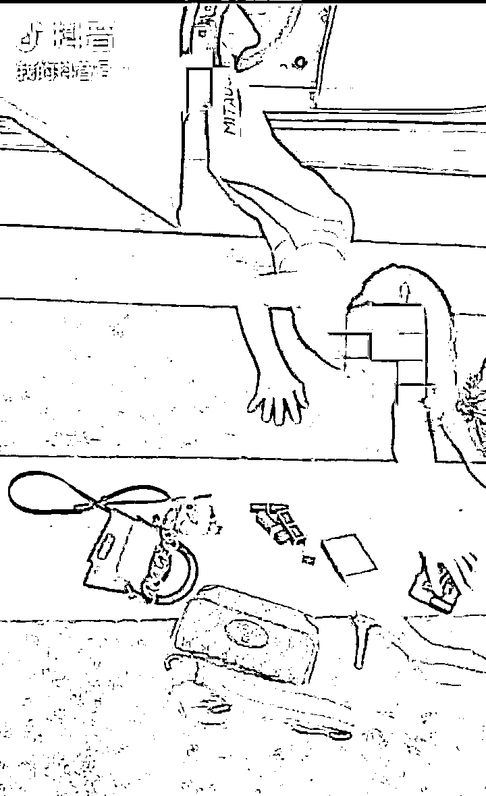
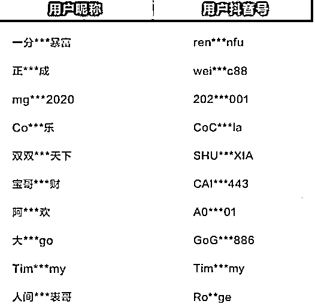

# 别炫富了！你号封了！

> 原文：[`mp.weixin.qq.com/s?__biz=MzIyMDYwMTk0Mw==&mid=2247510337&idx=2&sn=fa562df1c8c866894f8a5a4cfec03765&chksm=97cb6279a0bceb6f343db07c64510ca4fb48302a10c9930f4bcac26d950bece9f5cd550b44d1&scene=27#wechat_redirect`](http://mp.weixin.qq.com/s?__biz=MzIyMDYwMTk0Mw==&mid=2247510337&idx=2&sn=fa562df1c8c866894f8a5a4cfec03765&chksm=97cb6279a0bceb6f343db07c64510ca4fb48302a10c9930f4bcac26d950bece9f5cd550b44d1&scene=27#wechat_redirect)

近日，抖音安全中心发布治理处罚公告，对一批涉嫌刻意炫富、恶意炒作、有违社会公序良俗的账号进行禁言、封禁等处理。1 月以来，抖音安全中心已清理此类**视频 2862 条**、**音频 324 条**、**话题 47 个**，封禁**违规账号 3973 个**。

公告表示，抖音倡导理性消费、科学文明的生活方式，本次治理重点打击六类涉及不良价值观、不健康生活方式的内容。包含↓**宣扬拜金主义、攀比享乐；****对非富群体进行歧视、嘲讽或攻击；****涉未成年人发布大量奢侈品信息；****打造“白手起家逆袭成精英”人设营销或诈骗；****故意展示大量现金、撒钱；****制作销售视频、图片、文案等炫富素材。**

抖音安全中心相关负责人表示，刻意炫富内容污染社区风气，尤其危害青少年的身心健康，抖音对此高度重视，也将进入常态化治理，欢迎广大用户积极举报相关违规内容。**以下为公告原文：**********为倡导理性消费、科学文明的生活方式，建设健康向上、有价值的社区氛围，一直以来，抖音持续通过产品手段、运营手段对多类不良价值观、不健康生活方式内容进行全面清理，对相关账号进行处罚。********2021 年 1 月 1 日至 2 月 25 日，抖音安全中心在平台巡检中，对发布传播相关不良信息的账号、内容进行处置、清理，累计清理 2862 条视频、324 条音频、47 个话题，封禁处罚相关账号 3973 个。********抖音将长期打击平台上涉及下列违规行为的内容，将严格按照平台管理规则处罚相关账号。****

****1、宣扬拜金主义、攀比享乐、幻想暴富内容等生活方式和不良价值观的内容；****

****2、不正当展示自身优越条件、社会地位，存在对非富群体进行歧视、嘲讽或攻击等行为的内容；****

****3、涉未成年人发布大量奢侈品信息，以及其他非理性炫富行为、语言的内容；****

****4、以“白富美”“高富帅”“白手起家逆袭成精英”“回国留学生”等人设进行营销、社交或诈骗的内容；****

****5、不正当使用人民币等货币，故意展示大量现金、撒钱等方式的内容；****

****6、制作、销售炫富类视频、图片、文案等内容。****

************现将本次治理中部分案例、账号公示如下：****

****案例一：****

****故意展示大量现金、撒钱****

************1 月 3 日，抖音安全中心接到用户举报，用户“mit***bao”(抖音号：mit***bao)发布一条短视频，视频中有大幅画面展示抛撒人民币现金行为。********在对相关账号、视频内容进行审核评估后，抖音安全中心判定该视频涉嫌不正当使用人民币等货币，故意展示大量现金、撒钱等行为，不符合平台价值观。随后，抖音安全中心对用户“mit***bao”(抖音号：mit***bao)的视频进行下架处理，并对账号执行禁言处罚。****

****案例二：****

****不正当使用人民币发布广告****

************2 月 2 日，抖音安全中心在日常巡检中发现，用户“K***”(抖音号：S43***358)发布了一条广告短视频，视频中桌上放置了大量人民币、iPhone、车钥匙以及手表等贵重物品，涉嫌违法在广告内容中不当使用人民币，使用明显炫富素材。****

****在对相关账号、视频进行审核评估后，抖音安全中心对用户“K***”(抖音号：S43***358)的视频进行下架处理，并对账号执行禁言处罚。****

****案例三：****

****制作、销售炫富类视频、图片****

************2 月 22 日，抖音安全中心在日常巡检中发现，用户“我***朕”(抖音号：dy***v9)发布一条视频，视频内容中展示了一组微信对话和一段短视频，根据对话内容分析，为该用户收费帮助网友制作炫富视频和图片。********在对相关账号、视频内容进行审核评估后，抖音安全中心判定该视频涉嫌制作、销售炫富类视频、图片、文案类内容。随后，抖音安全中心对用户“我***朕”(抖音号：dy***v9)的视频进行下架处理，并对账号执行禁言处罚。****

********

****部分被处罚账号公示****

******如发现平台上的作弊、违规账号及内容，可以在站内举报或发送详情至举报邮箱：jubao@douyin.com ，**但请不要轻信其他平台搜索出来的客服电话，以免上当受骗。****

****来源：抖音安全中心、中国新闻网**** 

****************

****← 向右滑动与灰产圈互动交流 →****

********