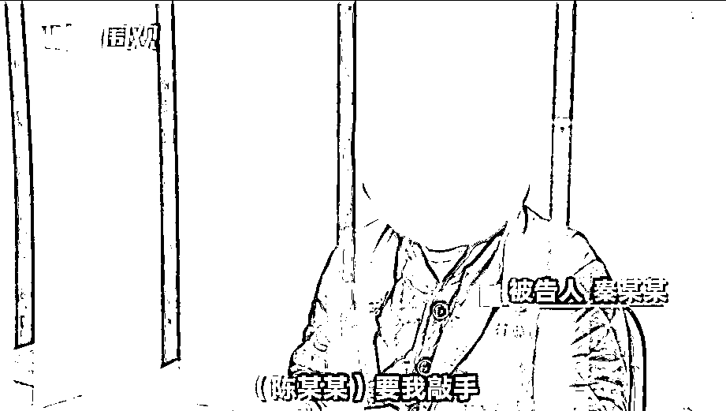

# 00 后小伙，为拿提成，自断手臂？！

> 原文：[`mp.weixin.qq.com/s?__biz=MzIyMDYwMTk0Mw==&mid=2247510337&idx=4&sn=de99a2dcf848927171f2ff40e6325ad2&chksm=97cb6279a0bceb6f892efbf940b85c1aa8eb30817948455e220b5bb09bf5f9f244adbf6c125f&scene=27#wechat_redirect`](http://mp.weixin.qq.com/s?__biz=MzIyMDYwMTk0Mw==&mid=2247510337&idx=4&sn=de99a2dcf848927171f2ff40e6325ad2&chksm=97cb6279a0bceb6f892efbf940b85c1aa8eb30817948455e220b5bb09bf5f9f244adbf6c125f&scene=27#wechat_redirect)

[`mp.weixin.qq.com/mp/readtemplate?t=pages/video_player_tmpl&action=mpvideo&auto=0&vid=wxv_1763134669606174724`](https://mp.weixin.qq.com/mp/readtemplate?t=pages/video_player_tmpl&action=mpvideo&auto=0&vid=wxv_1763134669606174724)

澎湃新闻编辑 王思琪 视频来源 正义酷 责任编辑：张新燕

近日在上海青浦

男子陈某某、秦某某等人

通过自伤自残伪装成工伤

诈骗多名施工工地老板

共骗取金额 16 余万元

@青浦检察以诈骗罪

对陈某某、秦某某等 5 人

提起公诉 

2001 年出生的秦某某

去年 3 月份来到上海打工

并经人介绍认识了

从事诈骗活动的陈某某

为了“拿提成”

秦某某竟同意

将自己的手臂敲断进行诈骗

网友：

一个诈骗犯为了工作都能自残

你还有什么理由不努力？

来源：澎湃新闻

← 向右滑动与灰产圈互动交流 →

