# 网约车真有「苹果税」？复旦教授打车 800 次，发现这些秘密…

> 原文：[`mp.weixin.qq.com/s?__biz=MzIyMDYwMTk0Mw==&mid=2247510426&idx=1&sn=31c28c41ed73e13c7ab732616ec2ea35&chksm=97cb62a2a0bcebb46e17f659271bb380c22bd4c829570d8115c3b8a0f05ba076c4b6a3e3a851&scene=27#wechat_redirect`](http://mp.weixin.qq.com/s?__biz=MzIyMDYwMTk0Mw==&mid=2247510426&idx=1&sn=31c28c41ed73e13c7ab732616ec2ea35&chksm=97cb62a2a0bcebb46e17f659271bb380c22bd4c829570d8115c3b8a0f05ba076c4b6a3e3a851&scene=27#wechat_redirect)

**1.****手机越贵，打车越花钱！**“苹果税”的传言被证实了！最近，复旦大学一名副教授正式公布**《2020 打车报告》，**他在过去一年带领团队在全国多个城市实地调研，收集了 800 多份有效打车样本，最终得到了一组令人瞠目结舌的结论。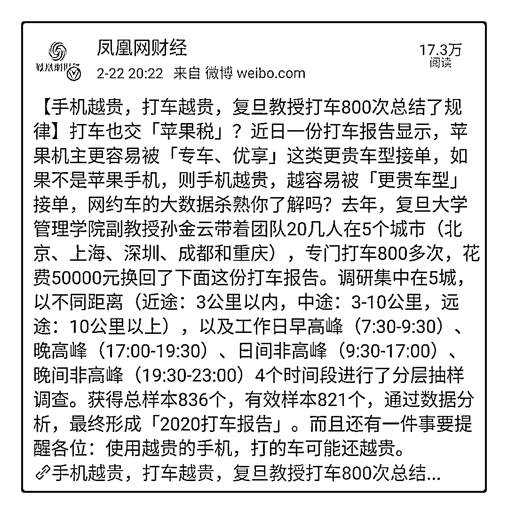**结论一：苹果手机打车最贵**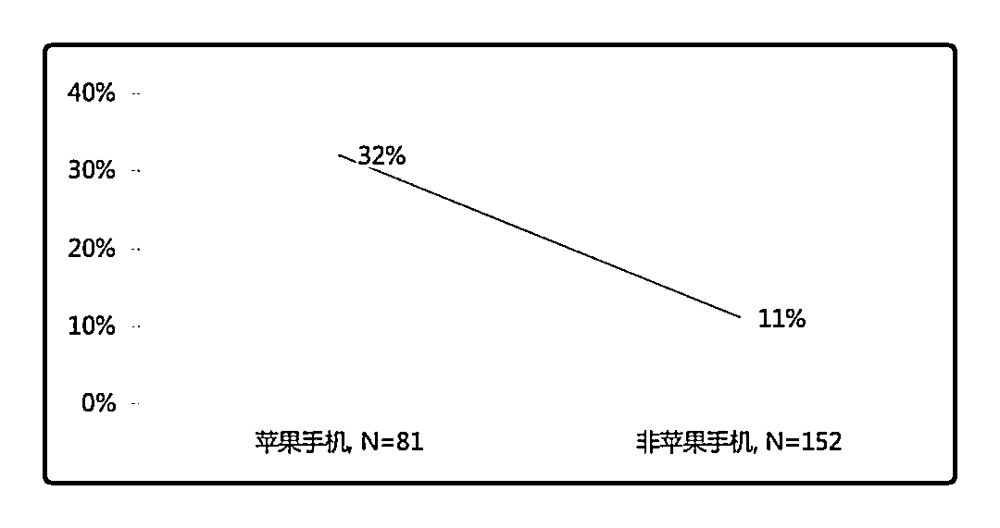一般来说，我们打车的时候都会使用“一键呼叫”功能。统计数据显示，用苹果手机打车，更容易叫来价格贵的舒适型车辆，这个比例是安卓手机的 3 倍。**结论二：手机越贵，打车越花钱**让人意想不到的是，安卓手机被进一步细分为三六九等，手机价格越贵，叫来舒适型车辆的可能性就越大。事实证明，用旗舰机打车明显比低端手机贵不少。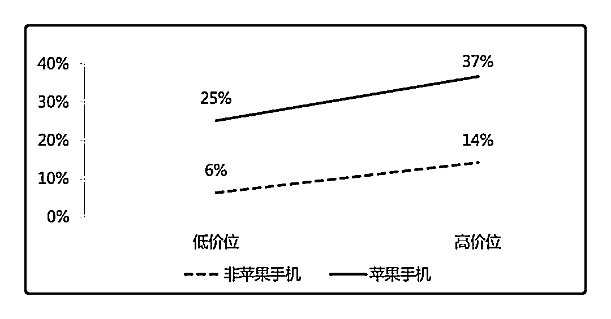**结论三：苹果手机打车优惠少**一般来说，我们打车时不时会收到补贴和优惠券，但对苹果手机而言，这项优惠略等于无。800 多份样本表明，苹果手机平均只能获得两块钱优惠，还不到安卓机的一半。当系统识别你是苹果用户时，平台就自动将更多补贴给到了更容易受补贴转化的安卓用户。为什么不同手机品牌、型号之间差距这么大？大家想一下，我们买手机时，大数据早已对我们做过人物画像，什么样对人群买什么样的手机，用什么样的手机有什么样的打车偏好。平台根据用户的手机类型匹配他的大数据，计算出哪部分用户付款爽快、对价格不敏感，那么这部分用户的价格就更高。这，就是大数据杀熟！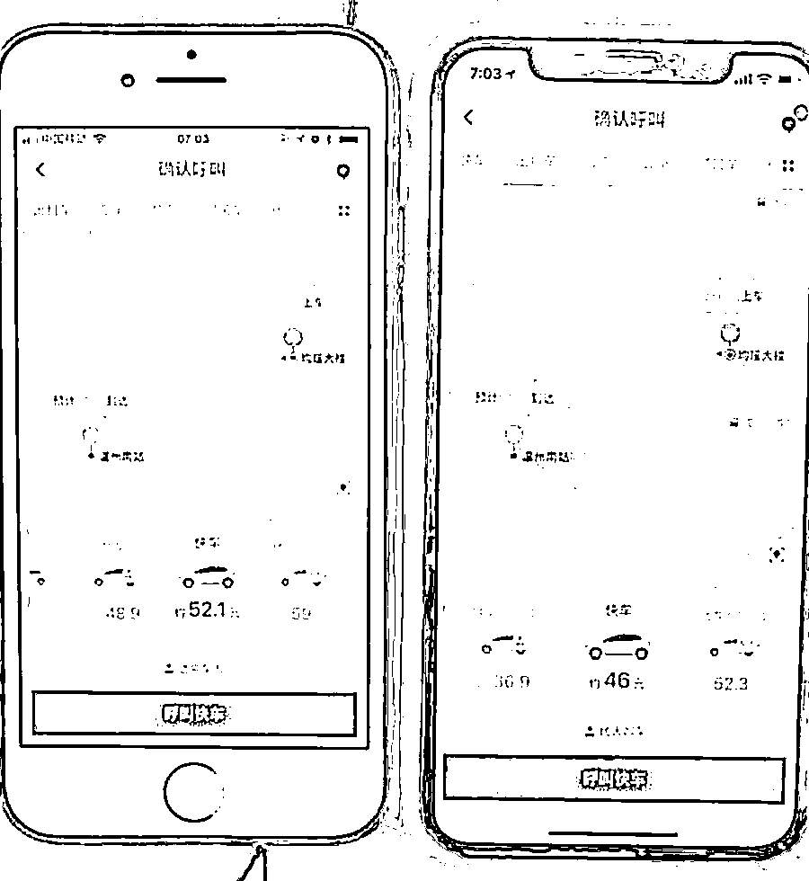** 2.**** 打车平台背后秘密 **

怎样才能最快打到车？

这应该是每个早高峰争分夺秒的你都想知道的。

调研将点击确认呼叫后司机确认接单的时间定为「响应时长」，司机接单后到乘客最终上车的时长定为「等待时长」。

结果显示，北上深三城的响应时长峰值均发生在「早高峰阶段」。

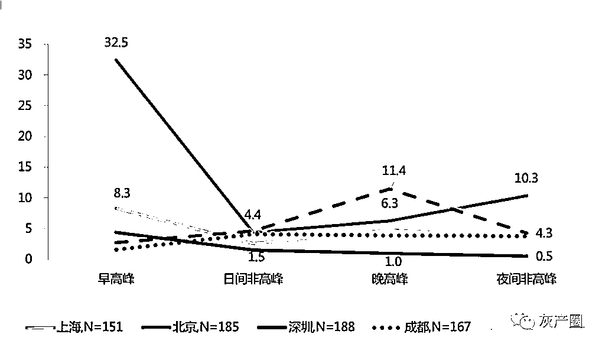

各城市不同时段响应时长对比（分钟） N=819 图源：（微信公众号「老孙漫话」）

早高峰时段响应时长，北京以 32.5 分钟高居第一，甩其他 4 城几条街。

这 32 分钟，耽误了多少人的全勤奖......

最难的是找司机，一旦有司机接单，等的时间相对就少了很多，等待时长的极值出现在上海晚高峰的 13.7 分钟，相比北京的早高峰，这点时间简直不算什么。

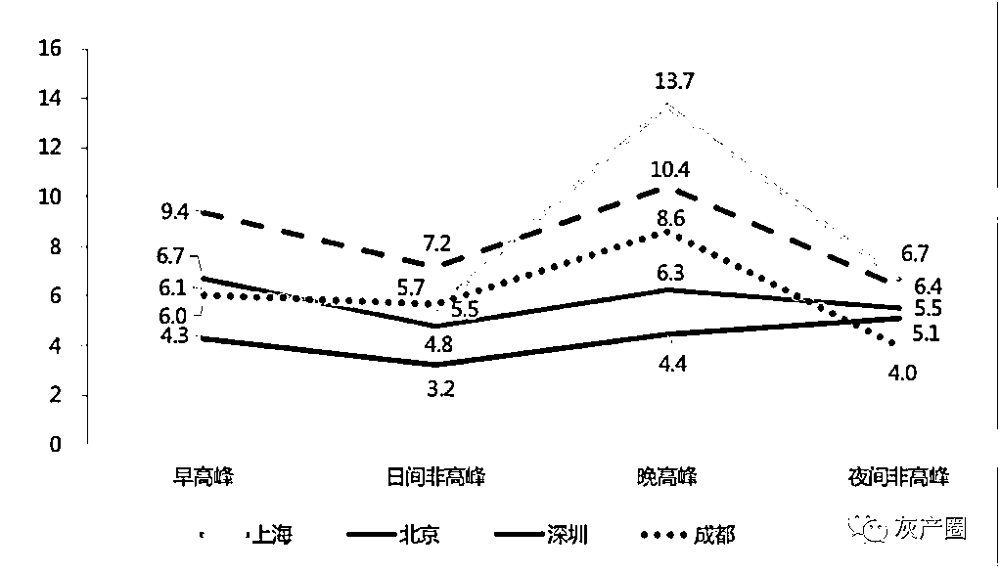

各城市不同时段等待时长对比（分钟） N=819 （微信公众号「老孙漫话」）

特区深圳以 5.6 分钟的综合上车时长以及各时段都十分迅捷而领先几大城市，真是个「说走就走」的城市啊！

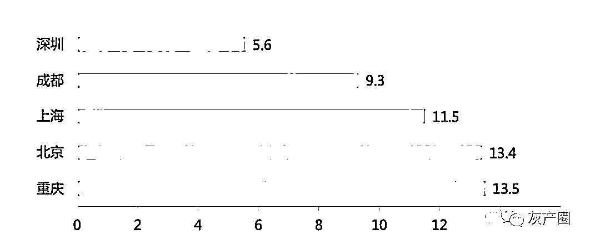

各城市综合上车时长对比（分钟） N=819 （微信公众号「老孙漫话」）

那么，平台打车和街头扬招出租车两种方式，哪种能更快上车？

调研结果显示，除北京外，扬招是各城市打车最快的首选。（团队在上海调研了美团、首汽、滴滴平台和扬招 4 种打车方式）

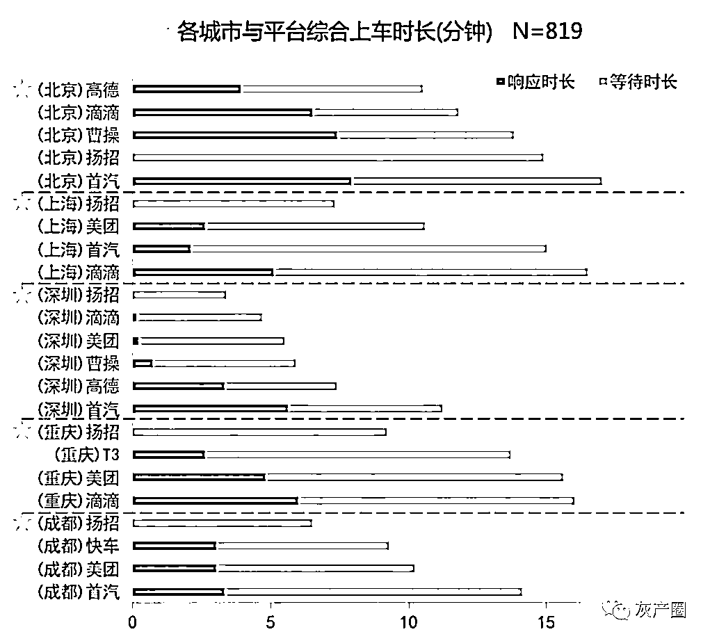

（微信公众号「老孙漫话」）

但是平台给出的时间可以相信吗？

这是个好问题，因为这份报告确实发现，平台往往会向乘客呈现比实际更短的等待时间，以此提高乘客等待时的耐心。

5 个城市打车预估等待时间全部显著低于实际等待时间（P<0.05）。

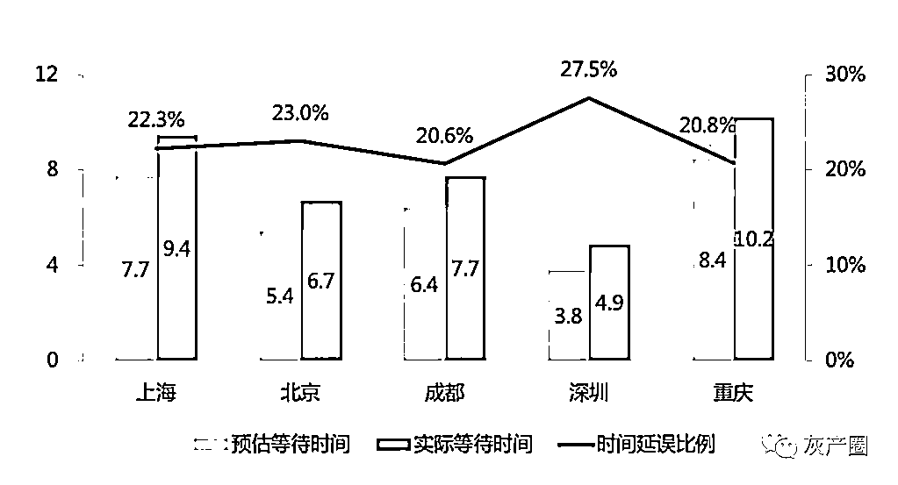

5 个城市预估等待、实际等待时间和时间延误比例（N=646）（微信公众号「老孙漫话」）

从平台角度看，以上结论依然成立。

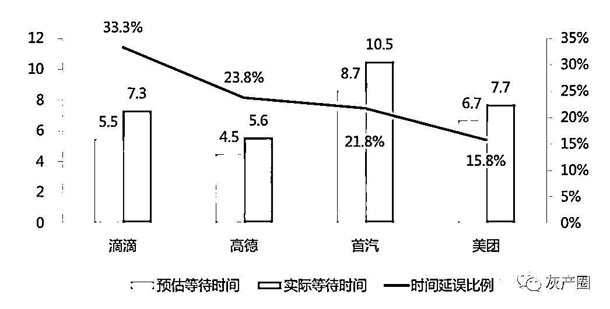

各平台预估等待、实际等待时间和时间延误比例（分钟） N=645 （微信公众号「老孙漫话」）

在易堵城市和易堵时段，我们会觉得，市场不一致没什么问题，而这也是平台给出的常见解释「交通拥堵」。

然而调查显示，不管是否在出行高峰时间段，低估等待时间的现象总是普遍存在（P<0.05）。

按理说，平台掌握了那么多的数据，怎么会全部低估了等候的时间呢？这么巧吗？

滴滴作为时间延误比例最大的平台，在四个不同时段的值均高于平均值，除深夜外，其余三项均呈现显著差异。

在早高峰的时间延误比例更是达到 47.4%，作为行业龙头，拥有最丰富的数据和技术团队，对如此系统性时间延误打了个大大的问号，对是否涉及「误导用户」甚至「用户欺诈」深表担忧。

怎样打车最便宜？

该调查以城市为单位，以完全「相同」的出发地和目的地线路作为基准，对比不同打车软件中「经济型」和「传统扬招」的平均价格差异。

各平台每公里的打车价格（以乘客实际支付金额计算）的结果显示，首汽单价最贵，T3 单价最便宜。

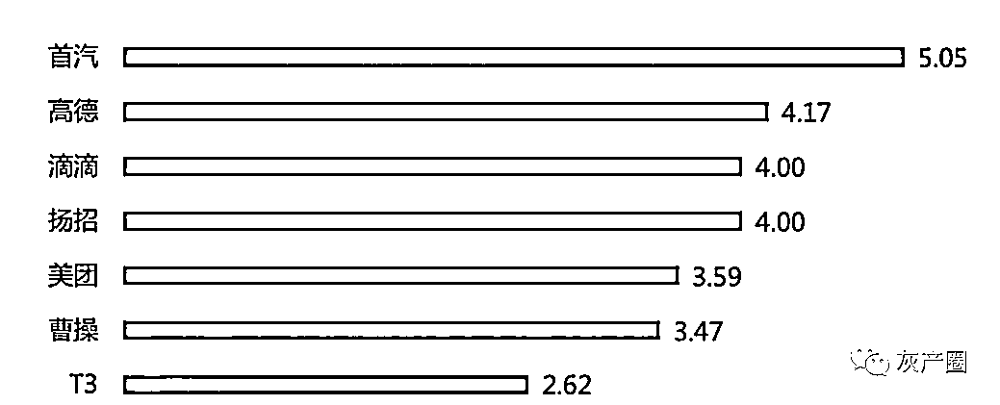

不同打车软件每公里价格对比（元/公里） N=819 （微信公众号「老孙漫话」）

值得注意的是，滴滴快车的价格与扬招出租车金额相同，均为 4 元/公里。（稍微补充一句，我们的研究没有考虑滴滴优享和滴滴上的高端选项“礼橙专车”，那两个选项的价格都比快车要高，自然也就比扬招更高。）

该报告还给出了每个城市打车最优惠的选择，大家可以一试！

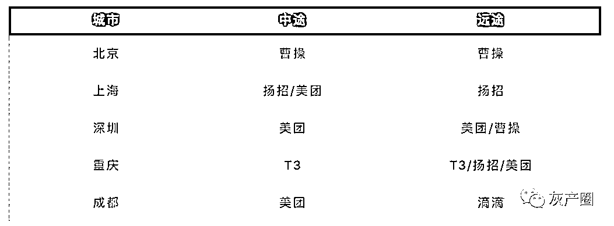

各城市实测打车优惠策略建议 （微信公众号「老孙漫话」）

有了时间游戏，平台会玩价格游戏吗？

报告按不同城市来观察，除重庆外，打车软件在上海、成都、北京和深圳 4 个城市中预估价格和实际支付价格之间都存在显著差异（P<0.05）。

其中上海是打车软件价格被「低估」最厉害的城市，实付与预估差异的比值为 11.8%，深圳相对另类，实付比预估价格还低了 6.5%。特区深圳，也太实诚了吧？

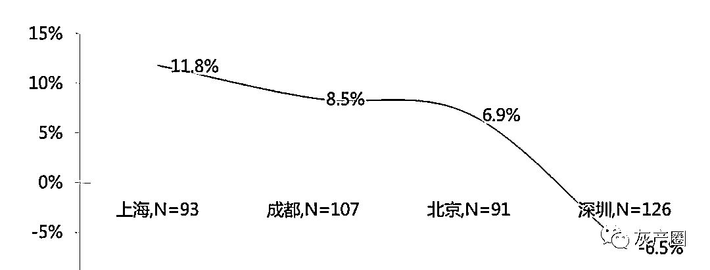

各城市打车软件低估价格水平对比 N=417 （微信公众号「老孙漫话」）

上海整体低估车费的背后，是各平台价格的严重低估，其中，滴滴的实付预估差异比最高，达 18.5%，其次是美团，高出了 9.7%，首汽排名第三，为 7.6%（P<0.05）。

5 大城市中，滴滴和首汽都存在明显的价格低估现象（P<0.01）。

其中滴滴平台的实付价格比预估价格平均高了 6.7%，首汽平均低估 10.9%；但 T3、美团和高德并没有检验出明显的差异；曹操平台的实付价格却明显低于预估价格达 21.1%，推测可能是平台大额优惠补贴所致。

最后，整合调研结果，报告给出了乘客的满意度模型，模型包含打车价格、等待时长、车辆状况和拥堵程度四个主要因素。分别反映了乘客的经济成本、时间成本、乘坐感受和心理体验。

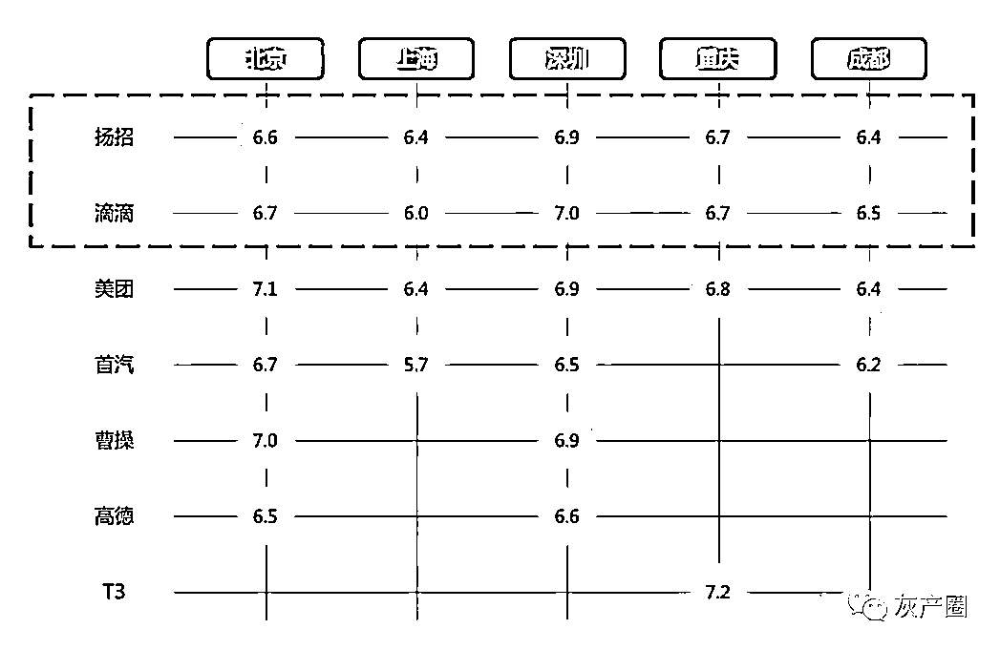

乘客-平台城市满意度模型（N=819） （微信公众号「老孙漫话」）

** 3.**** 大数据杀熟难防？但也可以见招拆招 **

不久前，在一篇名为《我被美团会员割了韭菜》的文章中，一个例子引起了很多消费者的共鸣：

「自己开通会员后，发现常点的一家店铺，配送费由平时的 2 元变为了 6 元。颇感意外的是，作者用另一部没有开通会员的手机点了同一家店铺，同一时间配送费依然是 2 元。」

不仅国内如此，国外的消费平台也存在类似问题。

早在 2000 年，亚马逊「差别价格实验」就是「大数据杀熟」起源。

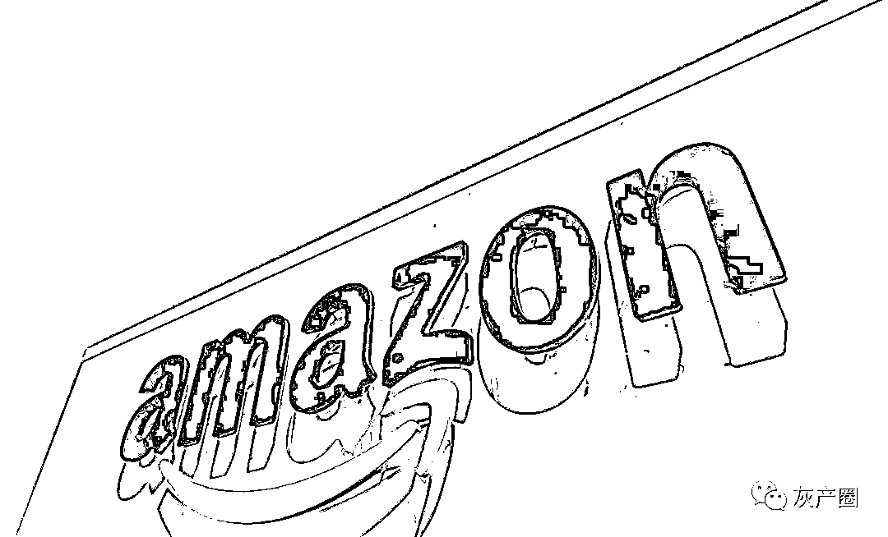

毕竟，当一家公司能够获得像亚马逊一样多的数据时，它可以在几乎不需要额外努力的情况下进行一些有趣的实验。

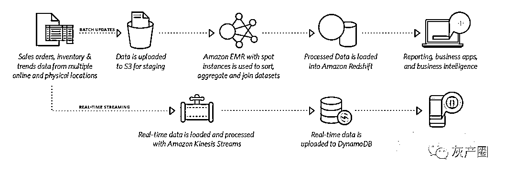

当时，亚马逊根据潜在用户的画像，终合购物历史、上网行为等大数据轨迹，对 68 种 DVD 光盘进行差别定价，不同的人群不一样的价格。

结果是，老用户「被坑钱了」。

在线差旅、交通出行、在线票务、视频网站、网络购物……

有越来越多的消费者有这样的感知——怎么越买越贵了？

大数据「杀熟」，已成为诸多网络平台企业「难以启齿」的问题。

但深入思考，这与算法问题密不可分。因为平台线上交易，其技术基础是大数据，也就是海量的用户数据。借用大数据平台，依据算法形成用户画像，「个性定制」式杀你，用户一般情况下不深究，无法发现被平台坑了。

那么，我们应该如何对抗「大数据杀熟」呢？

俗话说，解铃还须系铃人。

「反用户画像」。

这是目前我总结的网络上招式，大家可以见招拆招。

卸载 app 重装，在某打车软件中，经上述操作，车费相比卸载前便宜了 5 到 6 元，而这就发生在几分钟前。这背后的原理是一种「伪装术」，卸载重装后，系统会判别你为新用户，从而进行优惠对待。

只在有优惠券的情况下下单。当系统判别为你是价格敏感用户时，平台会选择将补贴下发给最容易受补贴诱导而转化消费的用户。

当然，还可以多找几个家人、朋友一起试试看，代下单。

其次，还有一个实用的反手操纵。

切断大数据的去路——取消定位许可、不连接 Wi-Fi（特别是某些公共 Wi-Fi）等等。

因为网络会获取你的信息，如位置相册等，然后加以分析，对你进行用户画像，进行「精准」广告推送。

我们也能看出，当我们越来越多地享受数据带给我们的便利服务时，「暗中标好的价格」也如期而至了。

数据安全，是这个社会永远都不能避开的话题。

**你平时都习惯用哪个打车软件呢？** 

**感受如何？**

**欢迎留言分享**

来源：潍坊教育，凤凰网财经、老孙漫画、一网传真

← 向右滑动与灰产圈互动交流 →

