# 月收入超 20 万！这些“美女主播”被抓获！

> 原文：[`mp.weixin.qq.com/s?__biz=MzIyMDYwMTk0Mw==&mid=2247510426&idx=2&sn=cdff8bcb2ac31770f1c0caf26781b964&chksm=97cb62a2a0bcebb4c4f7724a1b5db455dcf719fabf54c54474335724d8653d6721bde40dea97&scene=27#wechat_redirect`](http://mp.weixin.qq.com/s?__biz=MzIyMDYwMTk0Mw==&mid=2247510426&idx=2&sn=cdff8bcb2ac31770f1c0caf26781b964&chksm=97cb62a2a0bcebb4c4f7724a1b5db455dcf719fabf54c54474335724d8653d6721bde40dea97&scene=27#wechat_redirect)

你是不是以为你看到的美女主播

都像网上这样的？

↓↓↓

但其实“她们”可能是一群抠脚大汉

你看到的外卖小哥

都是这样的吗？

↓↓↓

其实他们可能是化装的民警

这两者似乎并没有什么关联

但这却和今天的案件密不可分

化装成外卖小哥的民警抓获了一批

扮成“美女主播”的诈骗嫌疑人

1 月 17 日 15 时许

某地一广场公寓写字楼

一个外卖小哥

敲开了 21 楼的办公室大门

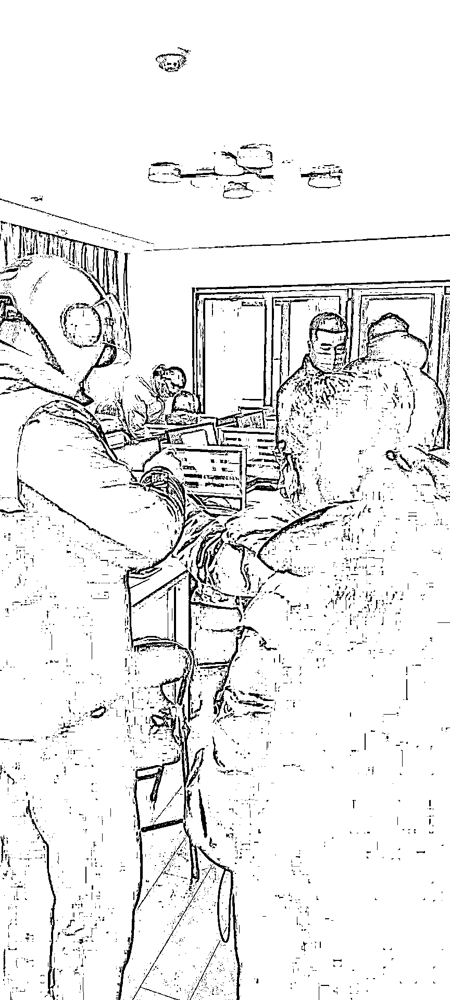

**“不许动，我们是警察！”**

随着一声怒吼

“外卖小哥”带着一群警察鱼贯而入

现场将一群青年男女控制

共 13 人（9 男 4 女）

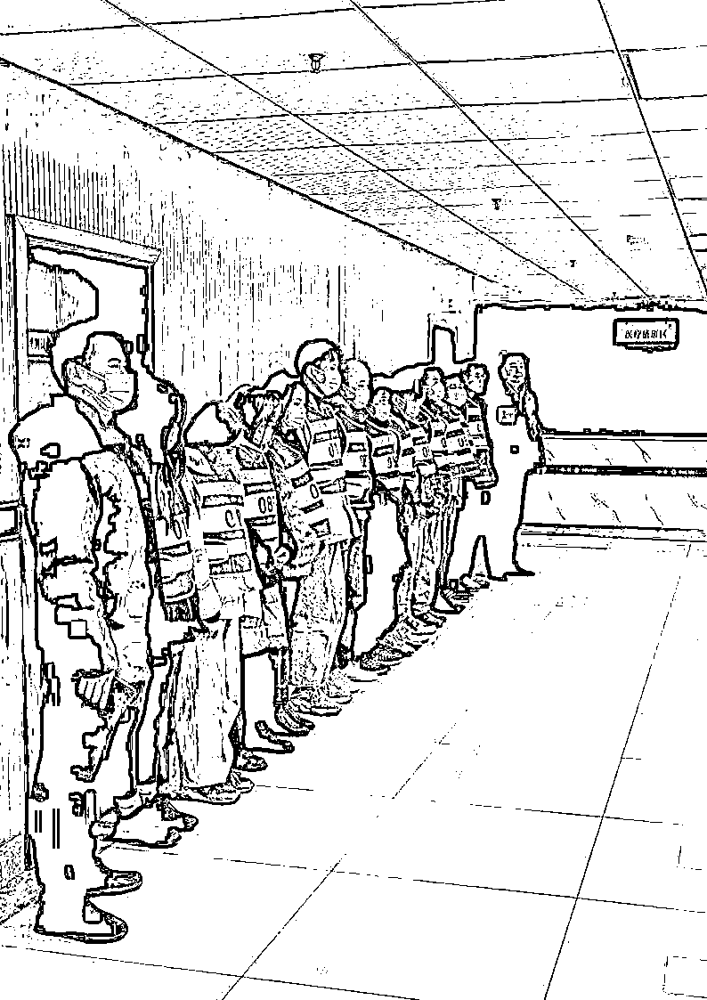

当场查获笔记本电脑、手机

话术本等可疑作案工具

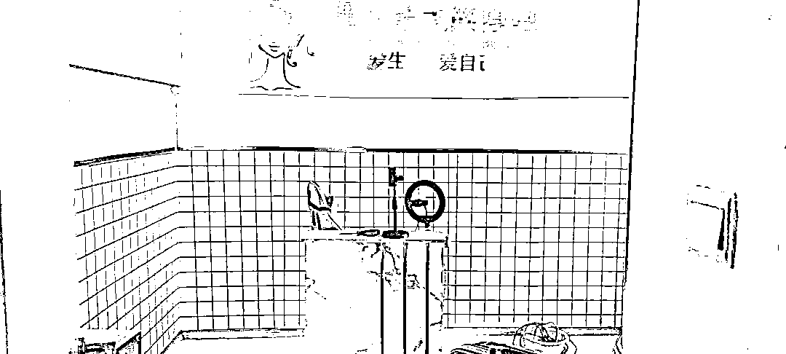

民警调查发现，这群人打着恋爱的幌子，以暧昧的语言聊天挑逗“吸粉”，待感情升温后，骗取他人下载交友软件充值购买礼物打赏，半年时间诈骗全国数百人，非法获利百余万元。

** 看看他们是怎么操作的 **

业务员多为男性

在网络上伪装成“女主播”

专门物色年轻男性

以暧昧的语言聊天

又在陌陌、探探等交友软件上

互相添加为好友

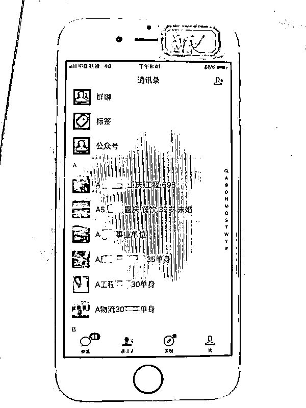

随着聊天的深入

“她们”会慢慢将感情升温

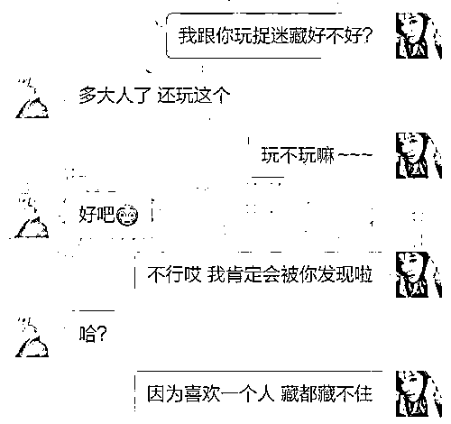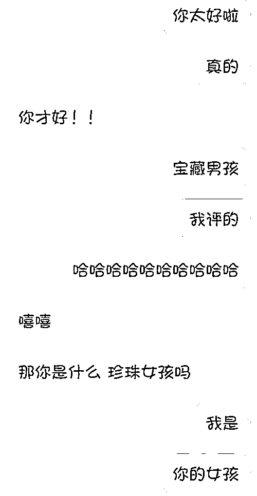

**感情升温后的第 1 波操作**

“女主播”以自己过生日为由

暗示对方给自己送礼物

并发来一个微店的链接

为博取“女主播”好感

网恋男子进入网店后

会挑选鲜花、糖果等礼物

遇到有男子要视频的

为不让对方起疑

就让公司的女业务员临时客串蒙混过关

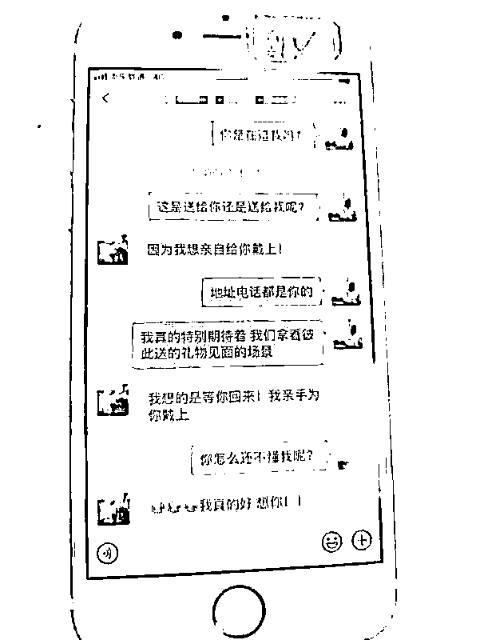

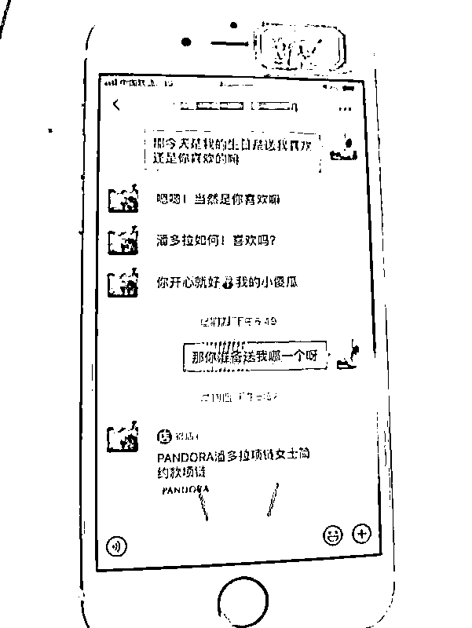

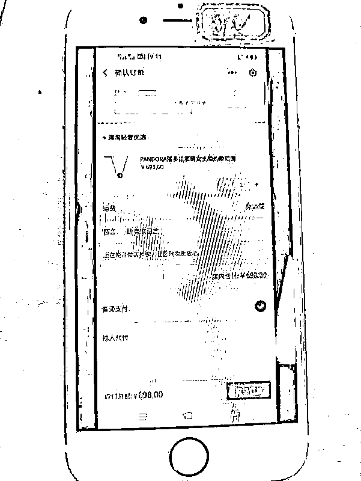

**感情升温后的第 2 波操作**

“她们”会告诉对方

自己现在广州某地当女主播

想离开广州回到恋人身边

但解除合同需要支付违约金

**除非 pk 打赏赢三次**

老板才会放行

为进一步博取对方的信任

业务员发送事先 P 好的广州某地的定位图

利用当事人见面心切的心理

按照事先设计的程序

让对方下载交友软件 APP 进行充值打赏

选购**68 元、1314 元、3888 元**的

**火箭跑车**等礼物

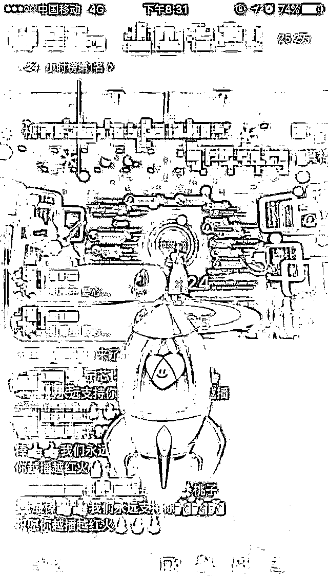

通常第一次、第二次让对方打赏取胜

渐渐勾起对方的好胜心

**不知不觉中花重金购买礼物**

**参加****第三次 PK**

**最后通常以失败而告终**

此时这些冒充女主播的业务员

会渐渐冷落对方

从开始网上认识到感情结束

通常在半个多月时间

很多陷入温柔乡的男子不知是坑

只好抱怨手气不佳，自认倒霉

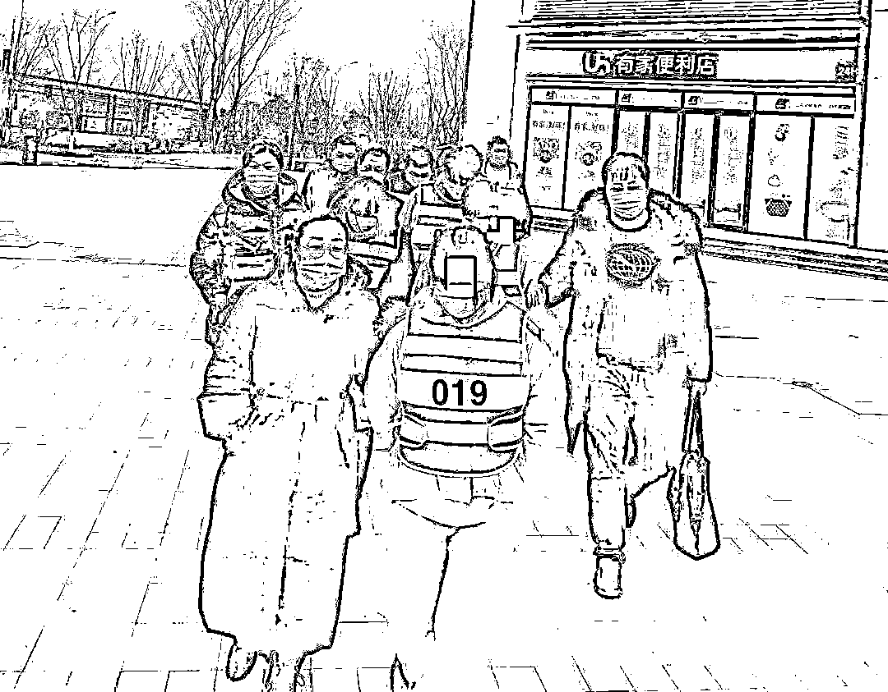

经查，嫌疑人孟某，24 岁，石首人，为了想要一夜暴富，于 2020 年 7 月邀约同学、朋友、老乡注册了一家文化传媒有限公司，从事诈骗活动。民警从查获笔记本流水账目上看到，去年 7 月份收入 21 万、8 月份 30 万……团伙成员最小的 21 岁，最大的 33 岁。

小心“杀猪盘”

不要轻易相信网恋

更不要轻易打赏和汇款

一定要守护好自己的钱财

因为每一分钱都来之不易

完

来源：平安武汉,省反电信网络诈骗中心,熊猫反诈,利箭在出击

← 向右滑动与灰产圈互动交流 →

