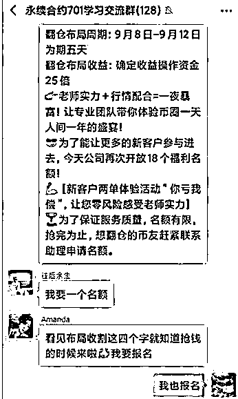
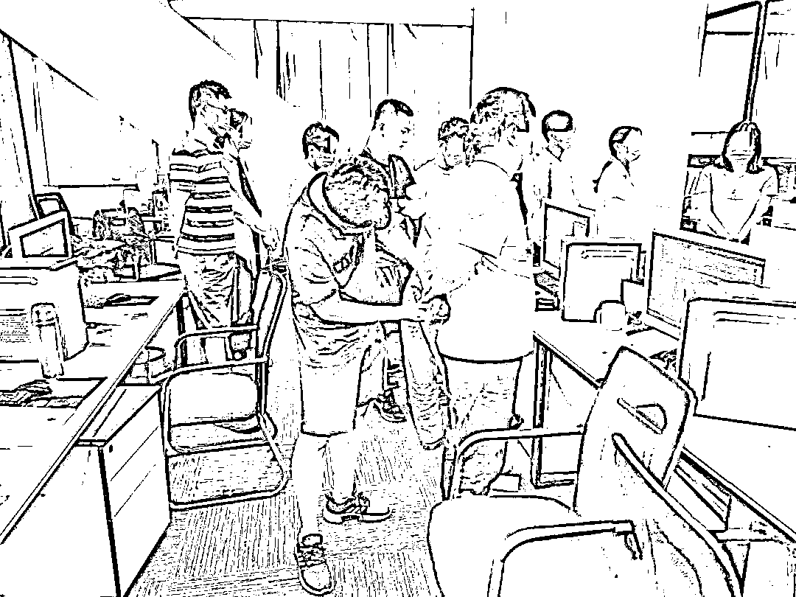
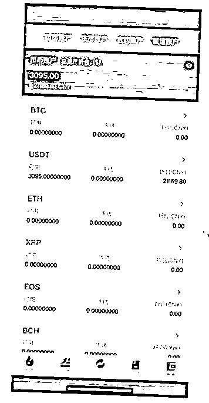

# 网络诈骗团伙：“技术组”开发、“中间商”服务、“气氛组”诱导

> 原文：[`mp.weixin.qq.com/s?__biz=MzIyMDYwMTk0Mw==&mid=2247510426&idx=4&sn=2438adfee96bbc2769cc909bcfa1dc9a&chksm=97cb62a2a0bcebb46b4be9dbd43f37f548bad4c88ee72d558adfa010bdf1ff6697c5ca7f08b8&scene=27#wechat_redirect`](http://mp.weixin.qq.com/s?__biz=MzIyMDYwMTk0Mw==&mid=2247510426&idx=4&sn=2438adfee96bbc2769cc909bcfa1dc9a&chksm=97cb62a2a0bcebb46b4be9dbd43f37f548bad4c88ee72d558adfa010bdf1ff6697c5ca7f08b8&scene=27#wechat_redirect)

有钱投资就是“小甜甜”

没钱了就被冻结账户

网友怀着一颗**真心想学网上投资**

不料却似“羊入虎口”

近期，苏州警方全链条打掉一个**“技术组”开发诈骗平台、“中间商”提供运营服务、“气氛组”诱导投资**实施诈骗的通讯网络诈骗团伙。一举查获犯罪窝点**5 个**，抓获嫌疑人**118 名**，其中**93 名**嫌疑人被采取刑事强制措施，扣押涉案电脑**125 台**、手机**159 部**。

**案件回顾**

****

****群友盈利你亏损**** 

****“分析师”带单包藏祸心****

**今年 47 岁的刘先生，是相城区某服装厂员工，热衷各类理财投资，不仅颇有心得，还能小有盈余。去年 8 月，一名自称某投资平台客服的女子电话联系刘先生，邀请他加入交流群，**可**接受免费教学。本着试试看的心理，刘先生便进了群。**

**群里，热心的“投资老师崔凯”不间断推送投资建议，时不时给群友指点迷津，很受欢迎。在“崔凯”的指导下，一些群友在名叫“rxex”的平台下单，盈利后纷纷晒出收益图，夸赞“老师”预判精准，并发红包表示感谢，近 200 人的微信群每天都很热闹。**

**不久后，“rxex”平台助理“王浩”联系了刘先生，得知新客户充值 2 万元，便可享受“崔凯老师”免费带单、前两单包亏损等福利时，刘先生心动了，立马充了 2 万元。**

****

**不到两分钟，刘先生连续盈利 2 单，平台账户显示收益 2000 元。得知追加足够本金，能有 3 至 10 倍的收益后，他又充了 4 万。两天内，刘先生的本金已翻了近 4 倍，达到 24 万。“崔凯”建议刘先生继续充值，获得更大收益，当得知刘先生再无闲置资金可追加后，“崔凯老师”便没有了之前的神奇。几次操作后，刘先生的账户跌倒了 6000 元，当他想从平台提现，挽回仅剩的本金时，发现账户已被冻结。越想越不对劲的刘先生赶忙报了警。**

**与此同时，全国各地警方陆续接报多起类似警情，套路十分相似，均是运用各种手段，诱导受害人下载“rxex”投资平台进行投资，通过限制提现、冻结账号等方式，骗取受害人资金。**

****

****奔赴四省五地追击**** 

****全链条打击黑灰链条****

**接到报警后，苏州警方抽调精干警力成立专案组，开展专案侦查。**

**围绕“rxex”投资平台，专案组循线排摸，发现这个平台并不简单。“案件资金均为虚拟币交易，平台软件又经过层层伪装，侦办过程一度陷入僵局。”苏州市公安局相城分局网络安全保卫大队副中队长尤韬介绍，通过大数据研判，专案组查到了该平台的制作团队，并通过进一步的数据碰撞，分析出该平台的代理商，“我们围绕代理商以及制作团队进行深度调查。”**

**随着调查的深入，平台背后的犯罪团伙一一浮出水面，形成一条完整的网络犯罪黑灰产业链。**

****

**在这个链条上，“技术组”、“中间商”、“气氛组”……各色人员分工合作，让一心想赚大钱的受害人成为了“待宰羔羊”。****初步查明，嫌疑人陈某伙同他人在引进软件源代码的基础上，开发具备后台控制功能的虚拟币交易所软件（简称诈骗软件），并将诈骗软件出售给葛某晨等软件中间商，葛某晨等人再将诈骗软件出售给以贾某、黄某等人为首的多个诈骗团伙用于实施诈骗。****2020 年 8 月，专案组成员分赴派武汉、郑州、杭州等地开展工作，通过半个月的排摸，基本厘清了团伙组织架构和窝点位置。9 月 11 日，百余名警力奔赴湖北、河南、浙江三省四地集中收网，在当地警方的配合下，一举抓获葛某晨、陈某、贾某、黄某等涉案嫌疑人 93 人，捣毁涉案窝点 5 个，扣押涉案电脑 125 台、手机 159 部，实现对平台搭建方、平台开发商、平台推广方和诈骗实施团伙的全链条打击。******

****“技术组”“中间商”“气氛组”分工明确****

****巧设局只为“请君入瓮”******主要嫌疑人落网后，专案组马不停蹄地开展后续审查。****经查，2018 年 6 月，陈某等人在河南郑州成立了一家软件公司，承接直播平台、电商网页等软件制作。去年夏季，为了扩大经营，陈某在明知相关功能可被用来诈骗的情况下，接受不法人员的“私人订制”，安排公司技术人员制作名为“RXEX”“ROXBIT”“BITXPRO”等诈骗软件。他们如同犯罪链条上的“技术组”，通过兜售、维护、升级这些诈骗软件获利。****2019 年 12 月至 2020 年 8 月底期间，葛某晨欲通过推广诈骗软件牟利，伙同姚某朋，将从陈某处购得“RXEX”诈骗软件向贾某、黄某宁等诈骗人员推销。他们就如同技术组和诈骗团伙之间的“中间商”，不仅负责将诈骗团伙对诈骗软件的升级、维护需求及时反馈给“技术组”，还充当诈骗软件的后方管理员，协助实施诈骗，然后按一定比例从诈骗所得中分成。**

****

**2019 年 11 月底至 2020 年 8 月期间，贾某伙同他人，运用“RXEX”等诈骗软件实施诈骗活动。他们通过各种方式，引诱受害人进入“投资理财群组”，然后充当诈骗“气氛组”，利用事先准备的“诈骗话本”，虚构的各种人设，营造让受害人极易上当受骗的浓厚氛围。比如，前文中刘先生在学习群里遇到的“平台助理王浩”“投资老师崔凯”，以及那些晒单的群友，都是“气氛组”的托，在这个学习群里，2/3 的成员都是托。****在另一个诈骗团伙里，黄某组织人员冒充中年成功男性，通过微信添加好友，以谈恋爱为名降低受害人的防备心理，诱导其下载诈骗软件进行充值投资。此外，还有的诈骗人员打着“高收益”、“低风险”的旗号，通过网络和电话广撒网，诱导受害人上当受骗。******

****网络投资套路深****

****擦亮眼甄别诈骗陷阱******不管“气氛组”营造出什么样的氛围，目的只有一个，就是诱骗受害人使用软件、充值“投资”。**

**“受害人充值后，资金根本没有进入投资市场，而是直接打到了葛某晨控制的账户。”苏州市公安局相城分局阳澄湖派出所民警陈永爱说，葛某晨等人根据诈骗团伙的需求，或操控行情涨跌，诱导受害者追加投资；或暗箱操作，让投资钱款“跌停蒸发”；总之，只要受害人的钱款进入诈骗软件，不管是“获利提现”、还是“保本止损”，都是不可能的，他们通过限制提现、冻结账户等方式，牢牢地将钱款掌握在手中，一旦受害人有所怀疑，或者“无油水可榨”时，便被“拉黑”，最终“血本无归”。**

****

**截至目前，专案组已核实案件 40 余起，受害人遍及全国多省市。因涉嫌诈骗罪，贾某、葛某晨、姚某朋、黄某等人被依法批准逮捕；陈某等人明知他人实施诈骗，仍提供诈骗专用工具，其行为涉嫌帮助信息网络犯罪活动罪，也已被依法批准逮捕，这条由“技术组”“中间商”“气氛组”等人员组成的诈骗链条，被彻底斩断。**

******近年来，各类互联网金融投资种类繁多发展迅速，一些不法分子也利用**虚拟币、原油、期货、贵金属**等投资形式实施违法犯罪活动，让“中招”群众损失惨重。**

**苏州市公安局相城分局刑警大队副大队长张松介绍，这些“投资类”诈骗的形式多样、看似防不胜防，但万变不离其宗，无论听上去多么高大上的新概念，还是多么火爆的投资方式，他们最终的目的，就是**将有投资意向的潜在被害人“引流”进来，通过伪造平台真实交易、“做托”炒作盈利赚钱气氛、让受害人小有盈余各种方式**，将钱不断投资到他们虚假的投资平台上，观察客户没有持续的资金进入后，便收割受害人本金。**

****

********重要提醒**：**

**市民进行理财投资前，建议**提前了解投资对象的市场行情及基础金融知识，在模拟平台上先操作练习**。该案中的犯罪嫌疑人正是利用受害人刘先生是投资“小白”、盲目跟风想赚快钱的心理，诱导其投资并诈骗得逞。**

**其次，投资务必**选择正规金融机构**，这些金融机构为客户销售金融产品时，都会为客户**做风险评估**，管理相对严格。非正规渠道的投资平台切不可信。**

**最后，遇到相关投资、集资宣传一定要保持清醒，做决定前先征求家人和朋友的意见，并适当分散投资风险。同时，**正确面对止盈止损，切莫跟风投资，更不能借钱投资**。一旦发现上当受骗，要立刻报警。**

**来源：安全圈**

********

**← 向右滑动与灰产圈互动交流 →**

****