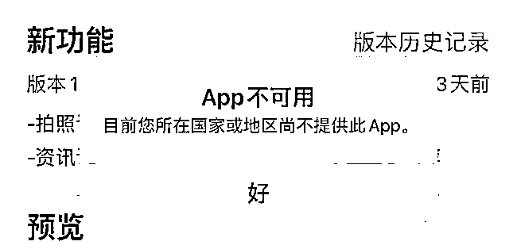

# 火爆全网的 APP 突遭下架！播放量超 29 亿次，一些知名基金经理也上过...

> 原文：[`mp.weixin.qq.com/s?__biz=MzIyMDYwMTk0Mw==&mid=2247510499&idx=1&sn=c325e593131b1b7467c60adb5462d557&chksm=97cb62dba0bcebcdabf11f8865655e79971ca6e9bfc68f5ede54560dd757a24215f8d11729a1&scene=27#wechat_redirect`](http://mp.weixin.qq.com/s?__biz=MzIyMDYwMTk0Mw==&mid=2247510499&idx=1&sn=c325e593131b1b7467c60adb5462d557&chksm=97cb62dba0bcebcdabf11f8865655e79971ca6e9bfc68f5ede54560dd757a24215f8d11729a1&scene=27#wechat_redirect)

此前报道：[一夜之间，朋友圈都在“蚂蚁牙黑”！小心背后的风险！](http://mp.weixin.qq.com/s?__biz=MzIyMDYwMTk0Mw==&mid=2247510186&idx=1&sn=b0ed24d0dede5f1a223719f5814acbdc&chksm=97cb6392a0bcea84ecb0570f1fd9dc8e5d08bf0c7208bfd75eff32f5314c560029874709a9c5&scene=21#wechat_redirect)

从火爆全网，到黯然下架，这款换脸软件只用了不到一周的时间。 

上周，我的朋友圈、微信群里都被张坤、萧楠、刘彦春等一众顶级基金经理的魔性视频刷爆了…… 

据了解，制作这段视频的软件名为 Avatarify。这款曾火爆全网的 AI 换脸软件，不仅在 2 月底冲上苹果 App Store 免费榜第一，而且截至发稿，“蚂蚁呀嘿”的相关短视频在抖音平台上的**播放次数超过 29 亿次，累计发布了近 6 万个短视频，特效被 785 万人使用。**

但是，3 月 2 日凌晨，这款 App 悄然从中国区苹果应用商店（App Store）下架。下架原因官方始终未明确说明。

有网友表示，Avatarify 只从中国区 App Store 下架，其余地区仍可正常下载，下架原因或与此前火爆一时的“Zao”下架原因类似，涉及隐私安全等问题。

**播放量超 29 亿次** 

**一夜爆火的换脸软件突遭“封杀”**

据此前界面报道，2 月底，一个叫作“蚂蚁呀嘿”的特效火了。在抖音等短视频平台上，配合着歌曲《蚂蚁呀嘿》，照片上原本静态的人物眉毛、嘴巴和眼睛都随着旋律“摇”起来，画面十分“魔性”。无论是科技大佬，还是演艺明星，都开口唱起“蚂蚁呀嘿，蚂蚁呀呼”。

移动应用数据分析平台七脉数据显示，2 月 25 日零点 Avatarify 在中国区 App Store 的免费 App 榜单仅排名第 65，而到了当日下午五点，Avatarify 蹿升至免费榜第一名，并一直持续到 3 月 1 日。

据了解，Avatarify 应用名称源自电影阿凡达（Avatar）。2020 年疫情期间，俄罗斯程序员 Ali Aliev 觉得在 ZOOM 上进行视频会议时太无聊，于是开发了一个能够把别人的照片套在自己脸上的 “变脸”软件 Avatarify，并将其开源。随后，Avatarify 被打包成 App，上传至 App Store 后，爆火全球。

简单易操作，恶搞有趣，也让中国大量短视频用户纷纷开始使用它。截至发稿，“蚂蚁呀嘿”的相关短视频在抖音平台上的**播放次数超过 29 亿次，累计发布了近 6 万个短视频，特效被 785 万人使用。**

实际上，AI 换脸技术早已不是新鲜产物。早在 2019 年，一款名为“ZAO”的换脸社交软件在朋友圈刷屏，这款 App 由陌生人社交巨头陌陌开发，用户只需要一张正脸照，就可以替换影视作品或者小视频中的人物，生成以自己为主角的视频片段。

但是比 Avatarify 更惨的是，ZAO 仅上架三天就惨遭下架，因为存在被滥用甚至侵害他人权益等额外风险。

**清华人工智能团队：存在安全漏洞** 

据央视报道，不久前，由清华大学孵化的一个从事人工智能安全研究的团队，**向记者演示了这项技术所存在的安全漏洞。**

研究员表示：“我们可以生成系统指定的这些张嘴、点头、摇头之类的指定动作，然后最终我们就可以冒充这个人，完成人脸认证的环节。”

也就是说，我们只需要这个人的一张照片，就可以冒充他攻破这个系统。**技术人员用这样一种方式将市面上共 19 款运用人脸识别技术解锁屏幕的手机逐一击破！**不仅如此，一些常用的人脸识别门禁系统、考勤打卡系统也存在相似的安全漏洞。

此前，新华社也发布风险提示，“换脸”APP 存在个人信息泄漏、不法分子利用金融机构刷脸支付系统支付导致丢钱、被贷款、被侵权等五大风险。

来源：中国基金报  安曼

← 向右滑动与灰产圈互动交流 →

